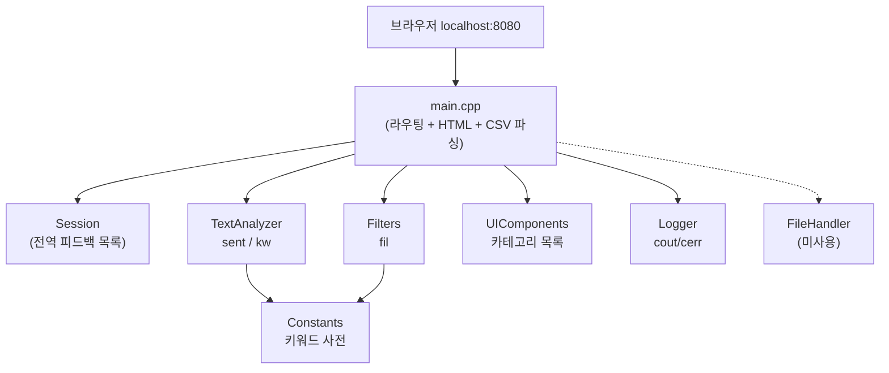

# FeedbackAnalyzer11 structure and mission analysis
_Exported on 5/22/2026 at 08:29:24 GMT+9 from Cursor (3.4.20)_

---

**User**

feedbackAnalyzer11 의 전체 구조, 미션 안내 분석하고 싶어
프롬프트를 추천해줘 

---

**Cursor**

프로젝트 구조와 미션 안내 방식을 파악한 뒤, 분석에 쓸 프롬프트를 추천하겠습니다.


**FeedbackAnalyzer_11**은 C++ 리팩토링 챌린지용 프로젝트입니다. 구조 요약과 `project_purpose.md`의 **미션(학습 단계)** 해석, 그리고 Cursor/Agent에 넣기 좋은 **프롬프트 템플릿**을 정리했습니다.

---

## 1. 전체 구조 (한눈에)



| 레이어 | 파일 | 역할 |
|--------|------|------|
| 진입점 | `main.cpp` | HTTP 서버, 4개 라우트, HTML 생성, 폼/CSV 파싱 |
| HTTP | `httplib.h` | cpp-httplib (서드파티 헤더만) |
| 모델 | `Feedback.h` | `text`만 보유 |
| 분석 | `TextAnalyzer` | 감정·키워드 집계 (`sent`, `kw`) |
| 필터 | `Filters` | 감정/키워드 필터 (`fil`) |
| 설정 | `Constants` | 감정·카테고리 키워드 (하드코딩) |
| UI 메타 | `UIComponents` | 드롭다운 카테고리 5개 |
| 상태 | `Session` | `currentFeedbacks` 정적 벡터 |
| 로그 | `Logger` | 콘솔만 (페이지 미연동) |
| 죽은 코드 | `FileHandler.h` | include만, 실제 저장 없음 |

**HTTP 라우트**

| 메서드 | 경로 | 동작 |
|--------|------|------|
| GET | `/` | 대시보드 초기화 |
| POST | `/analyze` | 텍스트 입력 → 분석 |
| POST | `/upload` | CSV 업로드 (첫 줄 헤더 스킵, `fields[0]`만 사용) |
| POST | `/filter` | 감정/키워드 필터 → 통계 |
| GET | `/download` | `fil_data` 기준 CSV 다운로드 |

**의도된 코드 스멜** (`project_purpose.md` §4): God Function(`main.cpp`), `containsAny` 중복, `fil`/`sent`/`kw` 같은 축약 네이밍, `fil_data`·`globalSent`·`globalKw` 전역 상태, `FileHandler` Lava Flow.

---

## 2. 미션 안내 분석 (`project_purpose.md` §6)

학습은 **8단계**, 총 약 **13.5시간** 가이드입니다.

| 단계 | 시간 | 목표 | 코드와의 연결 |
|------|------|------|----------------|
| 1 | 1h | 개요·미션 안내 | `README.md`, `project_purpose.md`, 실행 흐름 파악 |
| 2 | 2h | 테스트 90%+ | **현재 테스트 없음** — GoogleTest 등 신규 필요 |
| 3 | 1.5h | 버그·UX | 로그→페이지, 멀티라인, **「중립」필터 버그** |
| 4 | 1h | 네이밍·매직넘버·전역 | `Constants`, `Session`, `main` 정적 변수 |
| 5 | 1.5h | 긴 함수·중복 | `renderPage`, `containsAny` 2곳 |
| 6 | 1h | 리팩토링 1건 추가 | 팀 자유 (예: Router/HtmlRenderer 분리) |
| 7 | 3h | Trend·File DB | `test_feedback_trend.csv` — **저장소에 아직 없음** |
| 8 | 2h | 팀 리뷰·발표 | 상호 코드 리뷰 |

**단계 3에서 특히 볼 버그 후보**

1. **「중립」필터 불일치**  
   - `TextAnalyzer::sent`: 긍정/부정 키워드만 보고 나머지는 무조건 `중립`.  
   - `Filters::fil`: 별도 `S_KEYWORDS["중립"]`으로만 중립 판별.  
   → 분석 통계의 「중립」과 필터의 「중립」 집합이 다릅니다.

2. **키워드 필터** (`Filters.cpp` 56–57행): `main` 서브키는 건너뛰고 `time`, `physical` 등만 검사 → `main`에만 있는 키워드는 필터에서 누락될 수 있음.

3. **로그가 페이지에 안 나옴**: `Logger`는 `cout`/`cerr`만 — 미션의 “level별 페이지 출력” 미구현.

4. **멀티라인**: UI에 `textarea`는 있으나, 요구는 “제대로 된 멀티라인 UX/처리”일 수 있음(줄바꿈 보존·표시 등).

---

## 3. 분석용 추천 프롬프트

Ask 모드에서는 제가 코드를 수정하지 않습니다. 아래 프롬프트를 **Agent 모드**에 붙여 넣으면 단계별 분석·구현에 적합합니다.

### A. 전체 구조·아키텍처 (1단계용)

```
FeedbackAnalyzer_11(C++/cpp-httplib) 전체 구조를 분석해줘.

1) 디렉터리/파일별 책임 표
2) HTTP 라우트 → 호출 체인(어떤 클래스/함수가 이어지는지)
3) 데이터 흐름: Feedback 입력 → Session 저장 → TextAnalyzer/Filters → HTML/CSV 출력
4) project_purpose.md에 적힌 코드 스멜·안티패턴이 실제 코드의 어디에 있는지 파일:라인 근거
5) Mermaid 의존성 다이어그램

한국어로, 초급 C++ 개발자도 이해할 수 있게 설명해줘.
```

### B. 미션 로드맵·우선순위 (1단계 + 계획)

```
project_purpose.md §6(학습 가이드 8단계)를 기준으로:

- 각 단계별로 수정/추가해야 할 파일 목록
- 선행 의존성(예: 테스트 프레임워크 도입 순서)
- 예상 난이도(상/중/하)와 리스크
- 단계 3 버그(중립 필터, 로그 페이지 표시, 멀티라인)의 재현 시나리오와 수정 방향(코드는 아직 수정하지 말고 설계만)

체크리스트 형태로 정리해줘.
```

### C. 코드 스멜·리팩토링 맵 (4~6단계용)

```
src/cpp 전체에서 리팩토링 후보를 찾아줘.

분류: 긴 함수 / 중복 / 전역 상태 / 매직 스트링 / 죽은 코드 / God Object
각 항목마다:
- 위치(파일:함수)
- project_purpose.md의 어떤 스멜/기법과 매칭되는지
- Extract Function/Class 등 적용 가능한 리팩토링 기법 제안
- 변경 시 깨질 수 있는 동작(필터, 다운로드, CSV)

우선순위 Top 10만. 구현은 하지 말고 계획만.
```

### D. 「중립」필터 버그 전용 (3단계)

```
Filters::fil과 TextAnalyzer::sent의 감정 분류 로직을 비교 분석해줘.

- Constants::SENTIMENT_KEYWORDS vs Filters::S_KEYWORDS 차이
- 같은 문장이 sent에서는 중립, fil에서는 긍정/부정으로 나올 수 있는 예시 3개(한국어 샘플 문장)
- 키워드 필터에서 CATEGORY_KEYWORDS["main"]을 skip하는 영향
- 수정 시 단일 진실 공급원(Single Source of Truth) 설계안

테스트 케이스 이름과 Given/When/Then도 제안해줘.
```

### E. 테스트 90% (2단계)

```
이 프로젝트에 GoogleTest(또는 Catch2)를 붙이는 최소 설계를 제안해줘.

- CMakeLists.txt 변경 개요
- 단위 테스트 대상 우선순위: TextAnalyzer, Filters, parseCsvLine, urlDecode
- 커버리지 90%를 위한 테스트 케이스 목록(감정/키워드/필터/CSV 엣지)
- httplib 라우트는 통합 테스트로 분리할지 여부

코드 스켈레톤만 보여주고, 전체 구현은 단계적으로 나눠줘.
```

### F. 추가 요구사항 Trend + File DB (7단계)

```
project_purpose.md 7단계(Trend 시각화, 감정 필터 File DB)를 구현 설계해줘.

- test_feedback_trend.csv 예상 스키마(날짜 컬럼 등)
- 기존 main.cpp/renderPage에 trend 차트를 넣는 방법(서버사이드 HTML vs 정적 JS)
- 감정 키워드를 파일 DB(JSON/SQLite 등)로 옮길 때 Constants/Filters/TextAnalyzer 영향 범위
- 하위 호환(기존 Constants 하드코딩 fallback 여부)

파일/클래스 추가안과 API 설계만. Agent 모드에서 구현할 때 쓸 작업 순서도 포함.
```

### G. 팀 리뷰·발표용 (8단계)

```
FeedbackAnalyzer_11을 외부 리뷰어 관점에서 평가해줘.

장점 5, 단점 5, 개선 제안 3(각각 근거 코드 위치)
리팩토링 전/후 비교 슬라이드용 1페이지 요약(한국어)
다른 팀 프로젝트와 비교할 때 물어볼 질문 5개

발표 5분 기준 스크립트 아웃라인도 만들어줘.
```

### H. 한 번에 “올인원” (처음 탐색할 때)

```
@README.md @project_purpose.md @src/cpp 를 읽고:

1) 시스템 구조 요약
2) 미션 8단계 ↔ 코드 매핑
3) 지금 당장 고칠 버그 Top 3 (재현법 포함)
4) 리팩토링 로드맵 2주치(주당 5시간 가정)
5) 다음에 Agent 모드로 시킬 작업 1개만 추천

표와 다이어그램 사용. 한국어.
```

---

## 4. 프롬프트 사용 팁

1. **파일 참조**: `@project_purpose.md`, `@src/cpp/main.cpp`처럼 붙이면 맥락이 정확해집니다.  
2. **단계 쪼개기**: 8단계를 한 프롬프트에 넣기보다 A→D→E 순이 안전합니다.  
3. **Ask vs Agent**: “분석·설계만” → Ask 모드, “테스트 추가·버그 수정” → Agent 모드 + 위 D/E 프롬프트.  
4. **검증 문장**: 단계 3 후에는 `「중립」만 선택했을 때 sent 집계와 fil 결과 건수가 일치하는지`를 acceptance criteria로 넣으세요.

---

원하시면 **특정 단계(예: 3단계 버그만, 또는 7단계 Trend 설계만)** 에 맞춰 프롬프트를 더 짧고 실행 가능한 한 개 버전으로 줄여 드리겠습니다. Agent 모드로 전환하시면 그 프롬프트 기준으로 실제 코드 추적·패치 계획까지 이어갈 수 있습니다.

---

**User**

미션을 알려줘

---

**Cursor**

`project_purpose.md` **§6 기대 학습 방향**에 정의된 미션은 아래 **8단계**입니다.

---

## 미션 전체 (8단계)

| 단계 | 예상 시간 | 미션 내용 |
|------|-----------|-----------|
| **1** | 1시간 | **프로젝트 개요·실습 준비** — 전체 단계 미션 안내, 구조·목표 파악 |
| **2** | 2시간 | **테스트 구조 개선** — 테스트 케이스 추가, **커버리지 90% 이상** (단계 세분화 필요) |
| **3** | 1.5시간 | **동작·UX 오류 수정** — ① 로그를 페이지에 level별로 표시 (warning, error 등) ② 텍스트 입력을 **멀티라인**으로 ③ **필터 버그 수정** (특히 **「중립」**) |
| **4** | 1시간 | **네이밍·매직넘버·전역 변수** 개선 — `fil`, `sent`, `kw`, 하드코딩 키워드, 전역 상태 정리 |
| **5** | 1.5시간 | **긴 함수·중복 코드** 개선 — `main.cpp`의 `renderPage`, `containsAny` 중복 등 |
| **6** | 1시간 | **리팩토링 1건 추가** — 팀이 정한 추가 리팩토링 (예: Router/HtmlRenderer 분리 등) |
| **7** | 3시간 | **추가 기능** — ① **Trend 시각화** (`test_feedback_trend.csv` 사용) ② 감정 분석 필터 관리를 **File DB**로 |
| **8** | 2시간 | **팀 리뷰·발표** — 다른 팀 프로젝트 리뷰, 장단점 정리, 랜덤 발표 |

**총 예상 시간: 약 13.5시간**

---

## 프로젝트 배경 (미션 전제)

이 저장소는 **「리팩토링 챌린지: 고객 피드백 분석 시스템」** 입니다.

- **목적**: 의도적으로 넣은 코드 스멜·안티패턴을 찾아 **클린 아키텍처**로 개선하는 실습  
- **기능**: 피드백 입력/CSV 업로드 → 키워드·감정 분석 → 필터 → 시각화 → CSV 다운로드  
- **대상**: 중급 이상 C++ 개발자, TDD·Clean Code·Refactoring 학습자  

---

## 단계별로 실제로 손대는 영역 (참고)

| 단계 | 주로 관련되는 코드 |
|------|-------------------|
| 2 | 테스트 프레임워크 신규, `TextAnalyzer`, `Filters` 등 |
| 3 | `Logger`, `main.cpp`(HTML/textarea), `Filters.cpp` |
| 4~5 | `main.cpp`, `Session`, `Constants`, `TextAnalyzer`, `Filters` |
| 6 | 자유 (구조 분리 등) |
| 7 | `main.cpp`/UI, CSV·DB, Trend 차트 |
| 8 | 문서·발표 (코드 변경 없을 수도 있음) |

---

## 학습 목표 (미션과 별도, §1.3)

미션을 수행하면서 다음을 익히는 것이 목표입니다.

- 코드 스멜·안티패턴 식별  
- 모듈화·비즈니스 로직과 UI(HTML) 분리  
- Extract Function/Class, 전략 패턴 등 리팩토링 기법  
- C++ 웹앱 유지보수성·테스트 가능한 구조  

특정 단계(예: 3단계 버그만)를 더 자세히 풀어서 설명해 드릴까요?

---

**User**

전체 분석한 구조와 내용을 docs/analyzer.md 로 분석 보고서 작성해줘

---

**Cursor**

분석 보고서 작성을 위해 프로젝트 핵심 파일을 다시 확인합니다.


`docs/analyzer.md` 분석 보고서 작성 중입니다.


`docs/analyzer.md`에 분석 보고서를 작성했습니다.

## 문서 구성

| 섹션 | 내용 |
|------|------|
| **1. 요약** | 프로젝트 성격, 기술 스택, 한 줄 특징 |
| **2–3** | 목적·학습 목표, 디렉터리·CMake 구조 |
| **4** | Mermaid 아키텍처·의존성 다이어그램 |
| **5** | 모듈별 상세 (`main`, Session, TextAnalyzer, Filters 등) |
| **6** | 시퀀스 다이어그램·상태 저장 위치 |
| **7** | 기능 명세 vs 실제 구현 |
| **8** | 코드 스멜·안티패턴 ↔ 코드 위치 매핑 |
| **9** | 알려진 이슈 (중립 필터, `main` 스킵, 로그, Lava Flow 등) |
| **10** | 8단계 미션 표 + 권장 진행 순서 |
| **11–12** | 리팩토링 로드맵, 테스트 전략 |
| **13–15** | 빌드·참고 문서·결론 |

경로: [docs/analyzer.md](c:\DEV\FeedbackAnalyzer_11\docs\analyzer.md)

README에 `docs/analyzer.md` 링크를 추가하거나, 미션별 체크리스트를 별도 파일로 나누는 작업도 원하시면 말씀해 주세요.

---

**User**

현재 분석된 내용을 참고해서 .cursorrules를 만들수 있는 프롬프트를 추천해줘

---

**Cursor**

`.cursorrules` 작성 가이드를 확인하고, 분석 보고서에 맞춘 프롬프트를 추천합니다.


`docs/analyzer.md`와 `project_purpose.md`를 바탕으로 Cursor 규칙을 만들 때 쓸 **프롬프트 템플릿**을 정리했습니다.

---

## 먼저 알아둘 점

| 형식 | 위치 | 비고 |
|------|------|------|
| **권장 (최신)** | `.cursor/rules/*.mdc` | YAML frontmatter + `globs` / `alwaysApply` |
| **레거시** | 프로젝트 루트 `.cursorrules` | 단일 파일, 여전히 동작하는 환경 있음 |

프롬프트에 **원하는 출력 형식**을 명시하세요.

- `.cursorrules` 한 파일 → 아래 **프롬프트 A**
- 규칙 분리(50줄 이하 권장) → **프롬프트 B + C**

Agent 모드에서 `@docs/analyzer.md` `@project_purpose.md`를 함께 붙이면 결과가 더 정확합니다.

---

## 프롬프트 A — `.cursorrules` 한 방에 생성 (올인원)

```
@docs/analyzer.md @project_purpose.md @README.md 를 읽고,
FeedbackAnalyzer_11용 프로젝트 루트 `.cursorrules` 파일 내용을 작성해줘.

요구사항:
1) 이 프로젝트는 "리팩토링 챌린지" 교육용이며, 의도적 코드 스멜이 있다. 무작정 전면 재작성하지 말 것.
2) 반드시 포함할 섹션:
   - Project context (C++17, cpp-httplib, localhost:8080)
   - Architecture map (main.cpp God Object, Session, TextAnalyzer, Filters, Constants)
   - Do / Don't (예: httplib.h 수정 금지, build/ 커밋 금지, UTF-8 u8 리터럴 유지)
   - Known bugs (중립 필터 불일치, Filters가 main 서브키 skip, Logger는 페이지 미연동)
   - 8단계 미션 요약 + 현재 단계를 사용자가 지정할 placeholder
   - Refactoring priorities (감정 단일화 → 테스트 → main 분리)
   - Naming conventions (fil/sent/kw 리네이밍 방향, 의미 있는 이름 권장)
   - Testing policy (GoogleTest/Catch2, coverage 90%, 우선 테스트 대상)
3) 120줄 이내, 명령형 문장, 예시 코드 2~3개 (BAD/GOOD)
4) Agent가 미션 3 수정 시 acceptance criteria 3줄 포함
5) 출력은 `.cursorrules`에 그대로 붙여넣을 마크다운만 (설명 문장 없이)
```

---

## 프롬프트 B — `.cursor/rules/` 분리 생성 (권장)

```
@docs/analyzer.md @project_purpose.md 기준으로
`.cursor/rules/` 아래 규칙 파일 4개를 .mdc 형식으로 설계해줘.

파일:
1) feedback-analyzer-core.mdc      (alwaysApply: true)  — 프로젝트 목적, 스택, 미션 로드맵
2) feedback-analyzer-cpp.mdc       (globs: src/cpp/**) — C++17, 네이밍, 중복/전역 금지 패턴
3) feedback-analyzer-refactor.mdc  (globs: src/cpp/**) — 리팩토링 순서, Extract Class 가이드
4) feedback-analyzer-mission3.mdc  (globs: src/cpp/{Filters,TextAnalyzer,Logger,main.cpp}) — 버그 수정 AC

각 파일:
- YAML frontmatter (description, globs, alwaysApply)
- 50줄 이하
- actionable bullet
- BAD/GOOD 예시 1개씩

먼저 각 .mdc 전체 내용을 출력해줘. (파일 생성은 다음 단계)
```

---

## 프롬프트 C — 미션 단계별 규칙만 (실습 중 갱신용)

```
현재 미션: [3] 프로젝트 코드 오류 개선 (1.5h)

@docs/analyzer.md §9, §10 과 @src/cpp/Filters.cpp @src/cpp/TextAnalyzer.h @src/cpp/Logger.h @src/cpp/main.cpp 를 참고해,
`.cursorrules`에 추가할 "Mission 3" 섹션만 작성해줘.

포함:
- 수정 범위 (Logger 페이지 연동, textarea 멀티라인, 중립 필터 단일 진실)
- 수정 금지 (전체 아키텍처 재설계, httplib.h, 미션 7 Trend/DB)
- Acceptance criteria (Given/When/Then 5개)
- 회귀 테스트 이름 제안 5개

80줄 이내, 한국어+영어 키워드 혼용 가능.
```

`[3]`을 `[2]`, `[7]` 등으로 바꿔 반복 사용하면 됩니다.

---

## 프롬프트 D — “과도한 리팩토링 방지” 전용 (교육용 필수)

```
이 저장소는 의도적 레거시다. @docs/analyzer.md §8을 반영해
`.cursorrules`의 "Refactoring guardrails" 섹션만 작성해줘.

규칙 예:
- 한 PR/한 대화에서 하나의 미션 또는 하나의 스멜만 다루기
- FileHandler는 미션 지시 전 제거/구현 선택을 사용자에게 확인
- 감정 키워드는 Constants와 Filters 이중 정의를 새로 만들지 말고 통합 방향만
- main.cpp HTML 전체를 React로 바꾸지 않기
- 새 의존성 추가 시 CMakeLists.txt 반드시 갱신

짧은 체크리스트 형식, 40줄 이내.
```

---

## 프롬프트 E — 기존 `.cursorrules` 품질 검수

```
아래는 내가 작성한 .cursorrules 초안이다:

[여기에 초안 붙여넣기]

@docs/analyzer.md 와 대조해:
1) 누락된 아키텍처/버그/미션 항목
2) 과하거나 모호한 규칙
3) 50줄 초과 시 분리 제안 (.mdc 파일명 포함)

개선된 `.cursorrules` 전체를 다시 출력해줘.
```

---

## 프롬프트 F — `create-rule` 스킬 스타일 (공식 형식)

```
create-rule 스킬 형식에 맞춰 FeedbackAnalyzer_11 규칙을 만들어줘.

alwaysApply 규칙 1개:
- description: Feedback Analyzer 리팩토링 챌린지 코어
- project_purpose.md 미션 8단계, docs/analyzer.md 구조 요약
- 빌드: cmake --build build, 실행 포트 8080

globs: src/cpp/** 규칙 1개:
- C++17, u8 문자열, containsAny 중복 금지(공통 유틸로 통합)
- God Function 완화: HtmlRenderer/Router 분리 우선

출력: .mdc frontmatter + 본문만, 파일명 제안 포함.
```

---

## `.cursorrules`에 넣으면 좋은 핵심 문장 (참고)

프롬프트 없이 직접 쓸 때 복사용:

```markdown
## Context
- C++17 feedback web app (cpp-httplib). Educational refactoring challenge with intentional smells.
- Source of truth: docs/analyzer.md, project_purpose.md

## Do
- Minimize diff scope; one mission/smell per change
- Unify sentiment logic (TextAnalyzer + Filters must agree on "중립")
- Keep UTF-8 u8"" literals for Korean UI strings
- Update CMakeLists.txt when adding .cpp files or tests

## Don't
- Edit httplib.h or commit build/
- Rename everything at once; preserve behavior unless fixing mission bugs
- Add File DB / Trend (mission 7) unless explicitly requested

## Mission 3 AC
- Filter "중립" matches sent() classification
- Logger warning/error visible on page by level
- Textarea accepts multiline input end-to-end
```

---

## 사용 순서 추천

1. **프롬프트 A** → `.cursorrules` 초안  
2. 실습 시작 후 **프롬프트 C**로 미션 섹션만 갱신  
3. 규칙이 길어지면 **프롬프트 B**로 `.cursor/rules/` 분리  
4. **프롬프트 E**로 최종 검수  

Agent 모드에서 “프롬프트 A 실행해서 `.cursorrules` 생성해줘”라고 하면 파일까지 만들 수 있습니다. 원하시면 Agent 모드로 전환 후 바로 생성해 드리겠습니다.

---

**User**

@docs/analyzer.md @project_purpose.md @README.md 를 읽고,
FeedbackAnalyzer_11용 프로젝트 루트 `.cursorrules` 파일 내용을 작성해줘.
요구사항:
1) 이 프로젝트는 "리팩토링 챌린지" 교육용이며, 의도적 코드 스멜이 있다. 무작정 전면 재작성하지 말 것.
2) 반드시 포함할 섹션:
   - Project context (C++17, cpp-httplib, localhost:8080)
   - Architecture map (main.cpp God Object, Session, TextAnalyzer, Filters, Constants)
   - Do / Don't (예: httplib.h 수정 금지, build/ 커밋 금지, UTF-8 u8 리터럴 유지)
   - Known bugs (중립 필터 불일치, Filters가 main 서브키 skip, Logger는 페이지 미연동)
   - 8단계 미션 요약 + 현재 단계를 사용자가 지정할 placeholder
   - Refactoring priorities (감정 단일화 → 테스트 → main 분리)
   - Naming conventions (fil/sent/kw 리네이밍 방향, 의미 있는 이름 권장)
   - Testing policy (GoogleTest/Catch2, coverage 90%, 우선 테스트 대상)
3) 120줄 이내, 명령형 문장, 예시 코드 2~3개 (BAD/GOOD)
4) Agent가 미션 3 수정 시 acceptance criteria 3줄 포함
5) 출력은 `.cursorrules`에 그대로 붙여넣을 마크다운만 (설명 문장 없이)

---

**Cursor**

120줄 제한에 맞게 내용을 압축합니다.


`.cursorrules` 파일을 프로젝트 루트에 생성했습니다 (114줄).

포함 내용:
- Project context, Architecture map
- Do / Don't, Known bugs (4건)
- 8단계 미션 + `Current mission` placeholder (기본값 **3**)
- Refactoring priorities, Naming, Testing policy
- Mission 3 acceptance criteria 3줄
- BAD/GOOD 예시 3개

현재 미션을 바꿀 때는 다음 줄만 수정하면 됩니다.

```markdown
**Current mission:** `<!-- SET: 1-8 -->` → **3**
```

---

**User**

.cursorrules 내용을 한글로 바꿔줘

---

**Cursor**

`.cursorrules` 내용을 한글로 바꿨습니다 (114줄).

- 섹션 제목·설명·Do/Don't·버그·미션·우선순위·테스트·완료 기준: 한글
- 파일 경로, 심볼명(`sent`, `fil`, `u8"..."` 등), 코드 예시 주석: 기술 식별자는 그대로 유지
- **현재 미션** placeholder: `<!-- 설정: 1-8 -->` → **3**

미션 번호만 바꿀 때는 67번째 줄 근처를 수정하면 됩니다.

---

**User**

Report에 01_분석.md로 보고서를 작성해줘 

---

**Cursor**

`Report/01_분석.md` 작성을 위해 기존 분석 문서와 프로젝트 구조를 확인합니다.


`Report/01_분석.md` 분석 보고서를 작성했습니다.

## 문서 구성

| 섹션 | 내용 |
|------|------|
| **1. 개요** | Executive Summary, 핵심 분석 결과 표 |
| **2. 목적·범위** | 학습 목표, 분석 포함/제외 범위 |
| **3. 기술 환경** | C++17, CMake, 빌드·실행 |
| **4. 시스템 구조** | 디렉터리, Mermaid 아키텍처, HTTP API, 모듈 표 |
| **5. 데이터 흐름** | 시퀀스 다이어그램, 상태 저장소 |
| **6. 기능 대비 구현** | 격차(Gap) 표 |
| **7. 스멜·안티패턴** | project_purpose 매핑 |
| **8. 이슈·리스크** | I-01~07, 중립/키워드 상세 |
| **9. 미션 8단계** | 완료 기준, 권장 순서 |
| **10. 개선 로드맵** | P0~P4, 목표 디렉터리 |
| **11. 테스트 전략** | 미션 2 대비 |
| **12. 결론** | 권고사항, 참고 문서 링크 |

경로: [Report/01_분석.md](c:\DEV\FeedbackAnalyzer_11\Report\01_분석.md)

`docs/analyzer.md`보다 **보고서 형식**(문서 번호, Executive Summary, 이슈 ID, 심각도)에 맞춰 정리했고, `docs/analyzer.md`·`.cursorrules`와 상호 참조를 넣었습니다.

