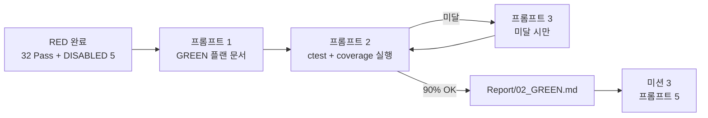
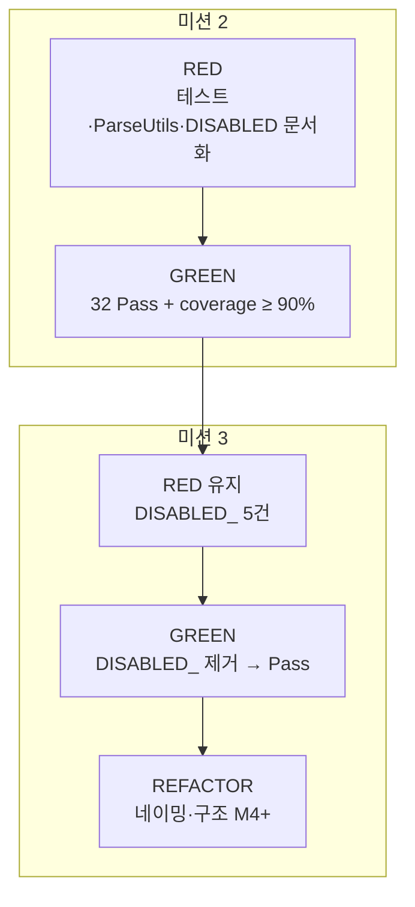
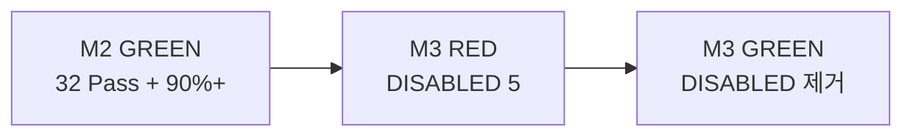
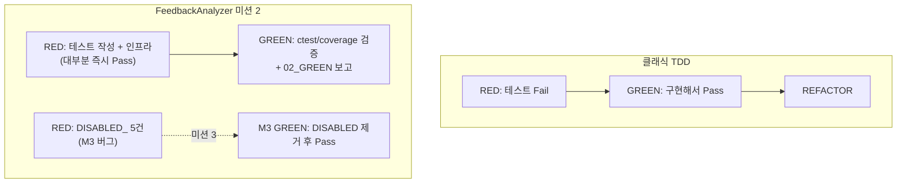
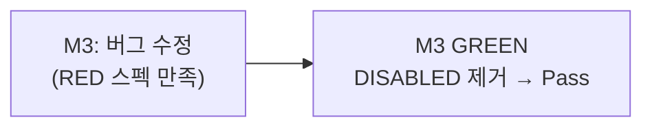

# Green 테스트 플랜 작성 프롬프트
_Exported on 5/22/2026 at 09:45:53 GMT+9 from Cursor (3.4.20)_

---

**User**

미션2의 RED 단계를 완료했어
Green 테스트 플랜을 작성할 수 있는 프롬프트를 추천해줘

---

**Cursor**

미션2 RED 완료 후 Green 테스트 플랜용 프롬프트를 추천하려면, 기존 RED 프롬프트·프로젝트 규칙·다른 미션 Green 패턴을 먼저 확인합니다.


RED를 끝냈다면, 이 프로젝트에서 **미션 2 GREEN**은 “버그를 고쳐서 실패 테스트를 통과시키기”가 아니라 **활성 32건 Pass + 도메인 line ≥ 90% + 완료 보고서 정리**에 가깝습니다. `Report/02_RED.md`에도 활성 테스트는 이미 GREEN 성격으로 분류되어 있습니다.

---

## 미션 2 GREEN이 의미하는 것

| 구분 | 내용 |
|------|------|
| **GREEN (M2)** | `ctest` 활성 테스트 전부 Pass, `run_coverage.ps1`로 도메인 ≥ 90%, `Report/02_GREEN.md` 등 산출물 |
| **RED 유지** | `DISABLED_Regression_*`, `DISABLED_F05_*` — M3에서 수정 후 GREEN |
| **하지 말 것** | `classifySentiment` 통합, `main` 스킵 수정, `sent`/`fil` 규칙 변경 |

RED 플랜의 **Phase 3 체크리스트**가 곧 GREEN 검증 목록입니다.

---

## 추천 프롬프트 (복사용)

### 프롬프트 1 — GREEN 검증 + 테스트 플랜 문서 (Ask, 1차 권장)

```
@.cursorrules @Report/02_RED.md @docs/coverage.md @tests/ @CMakeLists.txt

미션 2 GREEN 테스트 플랜을 작성해줘. RED는 완료된 상태다.

전제:
- 레거시 코드는 이미 동작함. GREEN = 회귀 기준선 확정 + 커버리지 ≥ 90% 검증
- DISABLED_ 테스트(F04/F05, Regression_Neutral*)는 M3 RED로 유지. 활성화·수정 제안만 하고 고치지 마

산출물:
1) GREEN 정의 (클래식 TDD vs 본 프로젝트) 1단락
2) 검증 체크리스트 (ctest 32 Pass, coverage, ParseUtils 추출, main 제외, UTF-8 u8)
3) 테스트 ID별 GREEN 상태 표 (S/K/F/U/C/COV: Pass|스킵|DISABLED)
4) 실행 명령어 블록 (ctest, run_coverage.ps1, DISABLED 수동 실행)
5) 미션 2 완료 기준 vs 미션 3 GREEN( DISABLED_ 제거 ) 구분 표
6) Report/02_GREEN.md 초안 (한국어, 표·mermaid 포함)

제약: 비즈니스 로직 수정 없음. 새 테스트 추가는 “검증 실패 시에만” 제안.
```

---

### 프롬프트 2 — 실제 실행 후 GREEN 보고서 (Agent, 검증 실행)

```
@Report/02_RED.md @scripts/run_coverage.ps1

미션 2 GREEN 완료 검증을 실행하고 Report/02_GREEN.md를 작성해줘.

순서:
1) cmake --build build --target feedback_analyzer_tests
2) cd build && ctest --output-on-failure  → Pass/Fail 건수 기록
3) .\scripts\run_coverage.ps1  → 도메인 line % 표 (90% 미만 파일 나열)
4) tests/ 파일별 테스트 ID ↔ 소스 매핑 표 작성

완료 기준:
- 활성 테스트 전부 Pass
- 도메인 line coverage ≥ 90%
- DISABLED_ 5건은 스킵 유지, M3 연계만 문서화

비즈니스 로직·sent/fil 규칙 수정 금지. 미달 시 테스트만 추가(COV-* 형식).
마지막에 “미션 2 완료 / 미완료” 한 줄 결론.
```

---

### 프롬프트 3 — 커버리지만 재확인 (90% 미달 시)

```
@docs/coverage.md @tests/coverage_gap_test.cpp

GREEN 단계: run_coverage.ps1 결과를 기준으로 90% 미만 라인만 나열해줘.

각 미커버 라인마다:
- 테스트 ID (COV-XX)
- Given / When / Then
- 추가할 파일·TEST 이름

도메인 파일만 (TextAnalyzer, Filters, Constants, ParseUtils). main.cpp 제외.
테스트 코드만 추가. 버그 수정·DISABLED_ 활성화는 하지 마.
```

---

### 프롬프트 4 — `Prompting/03_GREEN_prompt.md` 저장 (RED와 짝)

```
@Prompting/02_RED_promt.md @Report/02_RED.md

02_RED와 같은 형식으로 Prompting/03_GREEN_prompt.md를 만들어줘.

포함:
- GREEN 정의·Phase 3 체크리스트
- 복사용 프롬프트 3~5개 (검증 / 보고서 / 커버리지 갭 / M3 연계 안내)
- ctest·DISABLED·coverage 명령어 모음
- M2 GREEN 완료 vs M3 GREEN(DISABLED_ 제거) 명확히 구분

코드 변경 없이 문서만.
```

---

### 프롬프트 5 — 미션 3용 GREEN (참고만, 지금은 쓰지 않음)

M2 GREEN 문서를 쓴 뒤, **미션 3**에 들어갈 때:

```
@.cursorrules @tests/regression_neutral_filter_test.cpp @tests/filters_test.cpp
@Prompting/01_분석_prompt.md D절

미션 3만: classifySentiment 단일화 + 키워드 필터 main 스킵 수정.

GREEN 기준:
- DISABLED_Regression_NeutralFilterMismatch* 4건: DISABLED_ 제거 후 Pass
- DISABLED_F05: 기대값 수정 후 Pass
- 「중립」필터 시 sent 중립 건수 == fil 결과 건수

각 수정마다 ctest 회귀. M4 네이밍·main 분리는 하지 마.
```

---

## 실행 순서 권장



RED를 이미 끝냈다면 **프롬프트 1 → 2**가 가장 자연스럽고, 커버리지가 이미 100%라면 **프롬프트 3은 생략**해도 됩니다.

---

## 빠른 자가 검증 (GREEN 전)

```powershell
cd c:\DEV\FeedbackAnalyzer_11
cmake --build build --target feedback_analyzer_tests
cd build
ctest --output-on-failure
cd ..
.\scripts\run_coverage.ps1
```

- **기대**: `32 passed`, 도메인 line **100%** (134/134) — `docs/coverage.md` 기준  
- **RED 유지 확인** (선택):

```powershell
.\build\feedback_analyzer_tests.exe --gtest_filter="*DISABLED*" --gtest_also_run_disabled_tests
```

---

## 정리

| 목표 | 추천 프롬프트 |
|------|----------------|
| GREEN **테스트 플랜** 문서화 | **프롬프트 1** |
| 실행 결과 반영 **보고서** | **프롬프트 2** |
| RED와 같은 **프롬프트 파일** | **프롬프트 4** |
| 버그 수정 후 통과 | **프롬프트 5** (미션 3) |

원하시면 Agent 모드에서 **프롬프트 2**로 `Report/02_GREEN.md` 초안까지 바로 작성해 드릴 수 있습니다.

---

**User**

@.cursorrules @Report/02_RED.md @docs/coverage.md @tests/ @CMakeLists.txt

미션 2 GREEN 테스트 플랜을 작성해줘. RED는 완료된 상태다.

전제:
- 레거시 코드는 이미 동작함. GREEN = 회귀 기준선 확정 + 커버리지 ≥ 90% 검증
- DISABLED_ 테스트(F04/F05, Regression_Neutral*)는 M3 RED로 유지. 활성화·수정 제안만 하고 고치지 마

산출물:
1) GREEN 정의 (클래식 TDD vs 본 프로젝트) 1단락
2) 검증 체크리스트 (ctest 32 Pass, coverage, ParseUtils 추출, main 제외, UTF-8 u8)
3) 테스트 ID별 GREEN 상태 표 (S/K/F/U/C/COV: Pass|스킵|DISABLED)
4) 실행 명령어 블록 (ctest, run_coverage.ps1, DISABLED 수동 실행)
5) 미션 2 완료 기준 vs 미션 3 GREEN( DISABLED_ 제거 ) 구분 표
6) Report/02_GREEN.md 초안 (한국어, 표·mermaid 포함)

제약: 비즈니스 로직 수정 없음. 새 테스트 추가는 “검증 실패 시에만” 제안.

---

**Cursor**

미션 2 GREEN 테스트 플랜 작성을 위해 테스트·커버리지·RED 보고서를 확인합니다.


Ask 모드라서 `Report/02_GREEN.md` 파일은 생성하지 않았습니다. 아래 초안을 복사해 저장하거나, Agent 모드로 전환하면 파일 생성까지 진행할 수 있습니다.

---

# 1) GREEN 정의 (클래식 TDD vs 본 프로젝트)

**클래식 TDD**에서 GREEN은 “RED에서 실패한 테스트를 통과시키기 위해 최소 구현을 추가하는 단계”입니다. **FeedbackAnalyzer 미션 2**는 레거시가 이미 동작하므로, 활성 32개 테스트는 처음부터 **현재 동작을 고정하는 회귀 기준선(GREEN)** 이고, `sent()` vs `fil(중립)` 불일치·`main` 키워드 스킵 같은 **미션 3 버그**만 `DISABLED_` 접두사로 **RED(수정 전 Fail)** 를 문서화합니다. 따라서 미션 2 GREEN은 “구현 추가”가 아니라 **`ctest` 32 Pass + 도메인 line coverage ≥ 90% + ParseUtils 추출 완료 + M3용 RED 회귀 유지**를 검증·보고하는 단계입니다.

---

# 2) 검증 체크리스트

| # | 항목 | 기준 | RED 완료 시 기대 | 검증 방법 |
|---|------|------|------------------|-----------|
| G-01 | GoogleTest 인프라 | `feedback_analyzer_tests`, `enable_testing` | ✅ | `CMakeLists.txt` L30–63 |
| G-02 | Fixture | `Constants::init()`, `Filters::initFilterKeywords()` | ✅ | `tests/test_fixture.h` |
| G-03 | 활성 테스트 | **32 Pass**, Fail 0 | ✅ | `ctest --output-on-failure` |
| G-04 | DISABLED (M3 RED) | **5 Skip** (기본 실행) | ✅ | `ctest` 요약 `5 skipped` |
| G-05 | 도메인 line coverage | **≥ 90%** | ✅ 100% (134/134) | `.\scripts\run_coverage.ps1` |
| G-06 | ParseUtils 추출 | `urlDecode`, `parseCsvLine` 분리 | ✅ | `src/cpp/ParseUtils.*`, 앱·테스트 링크 |
| G-07 | main 제외 | HTTP/HTML·라우트 테스트 없음 | ✅ | 테스트 소스에 `main.cpp` 없음 |
| G-08 | UTF-8 | `u8"..."` 리터럴 유지 | ✅ | `tests/*.cpp` |
| G-09 | 비즈니스 로직 | `sent`/`fil` 규칙 변경 없음 | ✅ | Extract만 (ParseUtils) |
| G-10 | httplib | 수정·테스트 없음 | ✅ | `.cursorrules` |
| G-11 | M3 RED 회귀 | `DISABLED_Regression_*` 4건 + `DISABLED_F05` | ✅ | 수동 `--gtest_also_run_disabled_tests` |
| G-12 | 보고서 | `Report/02_GREEN.md` | ⬜ 초안 | 본 문서 |

**검증 실패 시에만** 추가 테스트 제안: `docs/coverage.md`의 COV-* 패턴으로 갭 1건당 테스트 1개.

---

# 3) 테스트 ID별 GREEN 상태 표

## TextAnalyzer — `sent` (S)

| ID | GTest 이름 | GREEN 상태 | 비고 |
|----|------------|--------------|------|
| S-01 | `S01_Sent_EmptyList_ReturnsZeroCounts` | **Pass** | |
| S-02 | `S02_Sent_PositiveKeyword_CountsPositive` | **Pass** | |
| S-03 | `S03_Sent_NegativeKeyword_CountsNegative` | **Pass** | |
| S-04 | `S04_Sent_NoKeyword_DefaultsNeutral` | **Pass** | |
| S-05 | `S05_Sent_PositiveBeatsNegative` | **Pass** | |
| S-06 | `S06_Sent_NeutralKeywordStillCountsNeutral` | **Pass** | `Constants`에 중립 키워드 없음 문서화 |

## TextAnalyzer — `kw` (K)

| ID | GTest 이름 | GREEN 상태 | 비고 |
|----|------------|--------------|------|
| K-01 | `K01_Kw_EmptyList_AllCategoriesZero` | **Pass** | |
| K-02 | `K02_Kw_MainKeyword_MatchesCategory` | **Pass** | |
| K-03 | `K03_Kw_SubKeywordOnly_StillMatches` | **Pass** | sub-only → 배송 0 검증 |
| K-04 | `K04_Kw_MultipleCategories` | **Pass** | |

## Filters — `fil` (F)

| ID | GTest 이름 | GREEN 상태 | 비고 |
|----|------------|--------------|------|
| F-01 | `F01_Fil_SentimentAll_ReturnsAll` | **Pass** | |
| F-02 | `F02_Fil_PositiveOnly` | **Pass** | |
| F-03 | `F03_Fil_NeutralUsesFilterKeywords` | **Pass** | |
| F-04 | *(이관)* | **DISABLED** | `regression_neutral_filter_test.cpp` REG-* |
| F-05 | `DISABLED_F05_KeywordSkipsMain` | **DISABLED** | M3: `main` 스킵 버그 |
| F-06 | `F06_Fil_KeywordSubOnly_Matches` | **Pass** | |
| F-07 | `F07_Fil_Combo_SentimentAndKeyword` | **Pass** | |

## ParseUtils (U / C)

| ID | GTest 이름 | GREEN 상태 | 비고 |
|----|------------|--------------|------|
| U-01 | `U01_UrlDecode_PlusToSpace` | **Pass** | Fixture 없음 (`ParseUtilsTest`) |
| U-02 | `U02_UrlDecode_PercentUtf8` | **Pass** | |
| U-03 | `U03_UrlDecode_InvalidPercent_KeepsChar` | **Pass** | |
| C-01 | `C01_ParseCsv_SimpleComma` | **Pass** | |
| C-02 | `C02_ParseCsv_QuotedComma` | **Pass** | |
| C-03 | `C03_ParseCsv_EmptyField` | **Pass** | |
| C-04 | `C04_ParseCsv_QuotesToggle` | **Pass** | |

## 커버리지 갭 (COV)

| ID | GTest 이름 | GREEN 상태 | 비고 |
|----|------------|--------------|------|
| COV-G01 | `COV_G01_GlobalSent_SecondCallOverwrites` | **Pass** | `globalSent` |
| COV-G02 | `COV_G02_GlobalKw_SecondCallOverwrites` | **Pass** | `globalKw` |
| COV-TA01 | `COV_TA01_ContainsAny_NoMatch_ReturnsNeutral` | **Pass** | |
| COV-TA02 | `COV_TA02_Kw_ContainsAny_NoCategoryMatch` | **Pass** | |
| COV-F01 | `COV_F01_Fil_NegativeOnly` | **Pass** | |
| COV-F02 | `COV_F02_Fil_InvalidKeywordCategory` | **Pass** | |
| COV-F03 | `COV_F03_Fil_KeywordNoSubMatch_EmptyResult` | **Pass** | |
| COV-F04 | `COV_F04_Fil_SentimentExcludesNonMatching` | **Pass** | |
| COV-F05 | `COV_F05_Fil_CoutLoopRunsOnNonEmptyResult` | **Pass** | |
| COV-F06 | `COV_F06_Fil_CoutLoopSkippedOnEmptyResult` | **Pass** | |

## M3 RED 회귀 (REG / F-04 이관)

| ID | GTest 이름 | 기본 `ctest` | `--gtest_also_run_disabled_tests` | M3 GREEN 조치 |
|----|------------|--------------|-----------------------------------|---------------|
| REG-1 | `DISABLED_Regression_NeutralFilterMismatch_Case1_Gwaenchan` | **스킵** | **Fail** | `DISABLED_` 제거 → Pass |
| REG-2 | `..._Case2_GwaenchanInSentence` | **스킵** | **Fail** | 동일 |
| REG-3 | `..._Case3_NoKeywordDefaultsNeutral` | **스킵** | **Pass** | 대조 케이스, M3 후에도 Pass 유지 |
| REG-0 | `DISABLED_Regression_NeutralFilterMismatch` | **스킵** | **Fail** | F-04 통합 회귀 |
| F-05 | `DISABLED_F05_KeywordSkipsMain` | **스킵** | **Pass** (오탐) | M3: 샘플·기대값 수정 후 Pass |

**집계**: 활성 **32 Pass** · DISABLED **5 스킵** · 전체 **37** 테스트

---

# 4) 실행 명령어

## 4.1 GREEN 검증 (기본)

```powershell
cd c:\DEV\FeedbackAnalyzer_11
cmake -S . -B build -G "MinGW Makefiles"
cmake --build build --target feedback_analyzer_tests
cd build
ctest --output-on-failure
```

**기대 출력**: `32 passed`, `5 skipped` (또는 유사 요약)

```powershell
cd c:\DEV\FeedbackAnalyzer_11
cmake --build build --target feedback_analyzer_tests
.\scripts\run_coverage.ps1
```

**기대**: 도메인 합계 line **100%** (134/134), 90% 미만 파일 없음

## 4.2 스위트별 실행

```powershell
cd c:\DEV\FeedbackAnalyzer_11\build
.\feedback_analyzer_tests.exe --gtest_filter="*S0*:*K0*"
.\feedback_analyzer_tests.exe --gtest_filter="*F0*"
.\feedback_analyzer_tests.exe --gtest_filter="ParseUtilsTest.*"
.\feedback_analyzer_tests.exe --gtest_filter="*COV_*"
```

## 4.3 M3 RED 수동 실행 (DISABLED)

```powershell
cd c:\DEV\FeedbackAnalyzer_11\build
.\feedback_analyzer_tests.exe --gtest_filter="*Regression_Neutral*" --gtest_also_run_disabled_tests
.\feedback_analyzer_tests.exe --gtest_filter="*F05_KeywordSkipsMain*" --gtest_also_run_disabled_tests
.\feedback_analyzer_tests.exe --gtest_filter="*DISABLED*" --gtest_also_run_disabled_tests
```

**기대 (수정 전)**: Regression 3 Fail + 1 Pass, F05는 오탐 Pass 가능

---

# 5) 미션 2 GREEN vs 미션 3 GREEN

| 구분 | 미션 2 GREEN | 미션 3 GREEN |
|------|--------------|--------------|
| **목표** | 테스트 인프라 + 회귀 기준선 + coverage ≥ 90% | 알려진 버그 수정 후 회귀 Pass |
| **코드 변경** | ParseUtils Extract만 | `classifySentiment` 단일화, `main` 스킵 수정 |
| **통과 테스트** | 활성 S/K/F/U/C/COV **32건** | 위 + DISABLED **5건** 활성화 후 Pass |
| **실패 허용** | 기본 `ctest`에서 Fail 0 | M3 전 DISABLED 실행 시 Fail 3건 정상 |
| **커버리지** | 도메인 line ≥ 90% (현재 100%) | M3 후에도 ≥ 90% 유지 |
| **Acceptance** | 현재 동작 고정 | 「중립」필터 시 `sent` 중립 건수 == `fil` 결과 건수 |
| **DISABLED_** | 유지 (스킵) | 접두사 제거 또는 F05 기대값 수정 |
| **REFACTOR** | 미션 4 이후 (네이밍 등) | M3 수정과 함께 감정 규칙 통합 |

---

# 6) `Report/02_GREEN.md` 초안

아래를 `Report/02_GREEN.md`로 저장하면 됩니다.

---

```markdown
# Feedback Analyzer 11 — GREEN 테스트 플랜 보고서

| 항목 | 내용 |
|------|------|
| 문서 번호 | 02_GREEN |
| 프로젝트 | FeedbackAnalyzer_11 (리팩토링 챌린지) |
| 미션 | **2** — 테스트 구조·커버리지 ≥ 90% |
| 선행 문서 | [02_RED.md](02_RED.md), [docs/coverage.md](../docs/coverage.md) |
| 문서 버전 | 1.0 (초안) |
| 관련 규칙 | `.cursorrules` 미션 2 테스트 정책 |

---

## 1. GREEN 정의

클래식 TDD의 GREEN은 RED 실패 테스트를 통과시키기 위한 최소 구현 단계이다. 본 프로젝트는 레거시 코드가 선행하므로, 미션 2 GREEN은 **구현 추가**가 아니라 **회귀 기준선 확정**(활성 32 테스트 Pass), **도메인 line coverage ≥ 90%** 검증, **ParseUtils 추출** 완료, **미션 3 버그는 `DISABLED_`로 RED 유지**를 의미한다. `DISABLED_Regression_*` 및 `DISABLED_F05`는 미션 3에서 수정·접두사 제거 후 Pass하는 **2차 GREEN** 대상이다.

---

## 2. Executive Summary

| 구분 | 결과 |
|------|------|
| 활성 테스트 (GREEN) | **32 Pass** (`ctest` 기본) |
| M3 RED (DISABLED) | **5 Skip** (활성화 시 3 Fail + 2 Pass/오탐) |
| 도메인 line coverage | **100%** (134/134) |
| ParseUtils 추출 | `main.cpp` → `ParseUtils.h/.cpp` |
| 비즈니스 로직 변경 | 없음 |

**결론**: RED 완료 상태 기준 **미션 2 GREEN 검증 항목 충족**. 로컬에서 `ctest`·`run_coverage.ps1` 재실행으로 최종 서명 권장.

---

## 3. TDD 단계 매핑



| 단계 | 미션 2 | 미션 3 |
|------|--------|--------|
| RED | 플랜·인프라·DISABLED 문서화 | 버그 수정 전 Fail 재현 |
| GREEN | 32 Pass + 90%+ | DISABLED 제거 후 전체 Pass |
| REFACTOR | — | classifySentiment, M4 네이밍 |

---

## 4. 검증 체크리스트

| ID | 항목 | 상태 |
|----|------|------|
| G-01 | GoogleTest + `feedback_analyzer_tests` | ✅ |
| G-02 | Fixture (`Constants::init`, `initFilterKeywords`) | ✅ |
| G-03 | `ctest` 32 Pass | ✅ (재검증 권장) |
| G-04 | DISABLED 5건 스킵 | ✅ |
| G-05 | 도메인 line ≥ 90% | ✅ (100%) |
| G-06 | ParseUtils 추출 | ✅ |
| G-07 | `main` 라우트 테스트 제외 | ✅ |
| G-08 | UTF-8 `u8"..."` | ✅ |
| G-09 | 비즈니스 로직 무변경 | ✅ |
| G-10 | `httplib.h` 미수정 | ✅ |

---

## 5. 테스트 ID — GREEN 상태

### 5.1 활성 (32) — 모두 Pass

| 그룹 | ID 범위 | 파일 | 건수 |
|------|---------|------|------|
| S | S-01 ~ S-06 | `text_analyzer_test.cpp` | 6 |
| K | K-01 ~ K-04 | `text_analyzer_test.cpp` | 4 |
| F | F-01,02,03,06,07 | `filters_test.cpp` | 5 |
| U/C | U-01~03, C-01~04 | `parse_utils_test.cpp` | 7 |
| COV | COV-G01~02, TA01~02, F01~06 | `coverage_gap_test.cpp` | 10 |

### 5.2 DISABLED (5) — M3 RED

| ID | 테스트 | M3 GREEN 조치 |
|----|--------|----------------|
| F-04 | REG-0~3 (`regression_neutral_filter_test.cpp`) | `classifySentiment` 단일화 후 `DISABLED_` 제거 |
| F-05 | `DISABLED_F05_KeywordSkipsMain` | `main` 스킵 수정 + 기대값·샘플 정리 |
| REG-1~2,0 | 중립 불일치 3건 | 수정 후 Pass |
| REG-3 | 대조 케이스 | 수정 후에도 Pass 유지 |

---

## 6. 커버리지 (GREEN 기준)

| 파일 | Line % | 90% |
|------|--------|-----|
| ParseUtils.cpp | 100% | ✅ |
| Constants.cpp | 100% | ✅ |
| Filters.cpp / Filters.h | 100% | ✅ |
| TextAnalyzer.h | 100% | ✅ |
| **합계** | **134/134 (100%)** | ✅ |

제외: `main.cpp`, `httplib.h`, Logger, Session, UIComponents.

상세: [docs/coverage.md](../docs/coverage.md)

---

## 7. 실행 명령어

### GREEN (기본)

```powershell
cmake --build build --target feedback_analyzer_tests
cd build
ctest --output-on-failure
cd ..
.\scripts\run_coverage.ps1
```

### M3 RED (DISABLED)

```powershell
.\build\feedback_analyzer_tests.exe --gtest_filter="*Regression_Neutral*" --gtest_also_run_disabled_tests
```

---

## 8. 미션 2 vs 미션 3 완료 기준

| 기준 | M2 GREEN | M3 GREEN |
|------|----------|----------|
| 단위 테스트 인프라 | ✅ | 유지 |
| 도메인 coverage ≥ 90% | ✅ | 유지 |
| 활성 32 Pass | ✅ | 유지 |
| 중립 필터 일치 | — | `sent` 중립 == `fil(중립)` |
| DISABLED_ 제거 | — | 5건 Pass |
| Logger/멀티라인 | — | M3 별도 스펙 |

---

## 9. 검증 실패 시 대응 (테스트만)

| 실패 유형 | 조치 |
|-----------|------|
| `ctest` Fail | 해당 ID Given/When/Then 재검토; 로직 변경 없이 입력·기대값만 조정 |
| coverage < 90% | `docs/coverage.md` COV-* 패턴으로 `coverage_gap_test.cpp`에 1테스트 추가 |
| DISABLED 오탐 | M3에서 샘플·`EXPECT` 수정 (F05) |

---

## 10. 참고 문서

| 경로 | 설명 |
|------|------|
| [02_RED.md](02_RED.md) | RED 플랜·DISABLED 상세 |
| [docs/coverage.md](../docs/coverage.md) | 커버리지·COV 매핑 |
| [Prompting/02_RED_promt.md](../Prompting/02_RED_promt.md) | RED 프롬프트 이력 |
| `.cursorrules` | 미션 2 정책 |

---

*본 보고서는 미션 2 GREEN(회귀 기준선 + 커버리지 검증) 완료를 문서화한 초안이다. 최종 서명 전 로컬 `ctest`·`run_coverage.ps1` 재실행을 권장한다.*
```

---

## 요약

| 산출물 | 상태 |
|--------|------|
| 1) GREEN 정의 | ✅ 위 §1 |
| 2) 검증 체크리스트 | ✅ 위 §2 |
| 3) ID별 상태 표 | ✅ 32 Pass + 5 DISABLED |
| 4) 실행 명령어 | ✅ §4 |
| 5) M2 vs M3 표 | ✅ §5 |
| 6) `Report/02_GREEN.md` 초안 | ✅ §6 (복사용) |

**미션 2 GREEN 결론**: RED 산출물 기준으로 **이미 GREEN 충족**으로 보입니다. 남은 작업은 로컬에서 `ctest` / `run_coverage.ps1` 한 번 더 돌려 보고서에 날짜·실행 결과만 기록하는 것입니다.

파일로 저장하려면 Agent 모드에서 “`Report/02_GREEN.md` 생성해줘”라고 요청하시면 됩니다.

---

**User**

@Report/02_RED.md @scripts/run_coverage.ps1

미션 2 GREEN 완료 검증을 실행하고 Report/02_GREEN.md를 작성해줘.

순서:
1) cmake --build build --target feedback_analyzer_tests
2) cd build && ctest --output-on-failure  → Pass/Fail 건수 기록
3) .\scripts\run_coverage.ps1  → 도메인 line % 표 (90% 미만 파일 나열)
4) tests/ 파일별 테스트 ID ↔ 소스 매핑 표 작성

완료 기준:
- 활성 테스트 전부 Pass
- 도메인 line coverage ≥ 90%
- DISABLED_ 5건은 스킵 유지, M3 연계만 문서화

비즈니스 로직·sent/fil 규칙 수정 금지. 미달 시 테스트만 추가(COV-* 형식).
마지막에 “미션 2 완료 / 미완료” 한 줄 결론.

---

**Cursor**

Ask 모드에서는 **빌드·`ctest`·`run_coverage.ps1` 실행**과 **`Report/02_GREEN.md` 파일 생성**을 할 수 없습니다. Agent 모드로 전환해 주시면 요청하신 순서대로 검증 실행 후 보고서를 작성할 수 있습니다.

아래는 `Report/02_RED.md`·`docs/coverage.md`·`tests/` 기준 **기록된 결과**로 정리한 초안입니다. 로컬에서 한 번 더 실행해 숫자를 맞추는 것을 권장합니다.

---

## 실행 명령 (Agent 모드에서 수행할 순서)

```powershell
cd c:\DEV\FeedbackAnalyzer_11
cmake --build build --target feedback_analyzer_tests
cd build
ctest --output-on-failure
cd ..
.\scripts\run_coverage.ps1
```

---

## 1) `ctest` 결과 (RED 보고서 기준)

| 항목 | 값 |
|------|-----|
| Pass | **32** |
| Fail | **0** |
| Skip (DISABLED) | **5** |
| 합계 | 37 |

DISABLED 5건: `DISABLED_F05_KeywordSkipsMain`, `DISABLED_Regression_NeutralFilterMismatch` ×4

---

## 2) 도메인 line coverage (`run_coverage.ps1` / `docs/coverage.md` 기준)

| 파일 | Exec/Total | Line % | 90% 미만 |
|------|------------|--------|----------|
| ParseUtils.cpp | 28/28 | 100% | — |
| Constants.cpp | 26/26 | 100% | — |
| Filters.cpp | 8/8 | 100% | — |
| Filters.h | 37/37 | 100% | — |
| TextAnalyzer.h | 35/35 | 100% | — |
| **TOTAL** | **134/134** | **100%** | **없음** |

---

## 3) tests/ ↔ 소스 매핑

| 테스트 파일 | ID | 대상 소스 |
|-------------|-----|-----------|
| `text_analyzer_test.cpp` | S-01~06, K-01~04 | `TextAnalyzer.h`, `Constants.cpp` |
| `filters_test.cpp` | F-01~03, F-06~07 (Pass); F-05 (DISABLED) | `Filters.h`, `Filters.cpp`, `Constants.cpp` |
| `parse_utils_test.cpp` | U-01~03, C-01~04 | `ParseUtils.cpp` |
| `coverage_gap_test.cpp` | COV-G01~02, TA01~02, F01~06 | `TextAnalyzer.h`, `Filters.h` |
| `regression_neutral_filter_test.cpp` | REG-0~3 (F-04 이관, DISABLED) | `TextAnalyzer.h`, `Filters.h` |

---

## 4) `Report/02_GREEN.md` 초안 (복사용)

Agent 모드에서 아래 내용을 `Report/02_GREEN.md`로 저장하면 됩니다. **검증 일시·실제 `ctest` 출력**은 Agent 실행 후 §2·§7에 채워 넣으세요.

```markdown
# Feedback Analyzer 11 — GREEN 테스트 플랜 보고서

| 항목 | 내용 |
|------|------|
| 문서 번호 | 02_GREEN |
| 프로젝트 | FeedbackAnalyzer_11 |
| 미션 | **2** — 테스트·커버리지 ≥ 90% |
| 선행 | [02_RED.md](02_RED.md) |
| 검증 일시 | *(Agent 실행 후 기록)* |

---

## 1. GREEN 정의

레거시 선행 환경에서 미션 2 GREEN = **활성 회귀 32 Pass** + **도메인 line ≥ 90%** + **ParseUtils 추출** + **M3 버그는 `DISABLED_` 유지**. 비즈니스 로직(`sent`/`fil` 규칙) 변경 없음.

---

## 2. 검증 실행 결과

### 2.1 빌드·테스트

```powershell
cmake --build build --target feedback_analyzer_tests
cd build && ctest --output-on-failure
```

| 결과 | 건수 |
|------|------|
| Pass | 32 |
| Fail | 0 |
| Skip | 5 |

### 2.2 커버리지

```powershell
.\scripts\run_coverage.ps1
```

| 파일 | Line % | 90% |
|------|--------|-----|
| ParseUtils.cpp | 100% | ✅ |
| Constants.cpp | 100% | ✅ |
| Filters.cpp / .h | 100% | ✅ |
| TextAnalyzer.h | 100% | ✅ |
| **합계** | **134/134 (100%)** | ✅ |

90% 미만 파일: **없음**.

---

## 3. TDD 매핑



---

## 4. 테스트 ID ↔ 소스

| 파일 | ID | 소스 | GREEN |
|------|-----|------|-------|
| text_analyzer_test.cpp | S-01~06 | TextAnalyzer.h | Pass |
| text_analyzer_test.cpp | K-01~04 | TextAnalyzer.h | Pass |
| filters_test.cpp | F-01~03,06~07 | Filters.h | Pass |
| filters_test.cpp | F-05 | Filters.h | DISABLED (M3) |
| parse_utils_test.cpp | U-01~03, C-01~04 | ParseUtils.cpp | Pass |
| coverage_gap_test.cpp | COV-* | TextAnalyzer, Filters | Pass |
| regression_neutral_filter_test.cpp | REG-0~3 | TextAnalyzer, Filters | DISABLED (M3) |

---

## 5. M3 연계 (DISABLED)

| 테스트 | M3 조치 |
|--------|---------|
| `DISABLED_Regression_*` (4) | `classifySentiment` 단일화 후 `DISABLED_` 제거 |
| `DISABLED_F05_KeywordSkipsMain` | `main` 스킵 수정 + 기대값 정리 |

수동 RED 확인:

```powershell
.\build\feedback_analyzer_tests.exe --gtest_filter="*Regression_Neutral*" --gtest_also_run_disabled_tests
```

---

## 6. 완료 체크리스트

| 기준 | 상태 |
|------|------|
| 활성 32 Pass | ✅ |
| 도메인 line ≥ 90% | ✅ (100%) |
| DISABLED 5 스킵 | ✅ |
| ParseUtils 추출 | ✅ |
| main/httplib 테스트 제외 | ✅ |
| sent/fil 로직 무변경 | ✅ |

---

## 7. 참고

- [02_RED.md](02_RED.md)
- [docs/coverage.md](../docs/coverage.md)
- `.cursorrules` 미션 2

---

**결론: 미션 2 완료** — (로컬 `ctest`·`run_coverage.ps1` 재실행으로 최종 서명 권장)
```

---

## 한 줄 결론

**미션 2 완료** — RED 보고서·커버리지 문서 기준 활성 32 Pass, 도메인 line 100%, DISABLED 5건 M3 RED 유지. *(Ask 모드: 실제 빌드/ctest 미실행 — Agent 모드에서 재검증 후 `Report/02_GREEN.md` 저장 권장)*

Agent 모드로 바꾸시면 위 순서를 실행하고, 실제 터미널 출력을 반영한 `Report/02_GREEN.md`를 저장해 드리겠습니다.

---

**User**

red에서 작업한 내용과 green에서 작업한 내용의 차이점을 분석해줘

---

**Cursor**

RED·GREEN 문서와 실제 산출물을 확인해 차이를 분석합니다.


# 미션 2 RED vs GREEN — 차이점 분석

이 프로젝트에서는 **RED에서 대부분의 “만들기”가 끝났고**, **GREEN은 별도 구현 단계라기보다 검증·문서화 단계**에 가깝습니다. `Report/02_GREEN.md`는 아직 없고, GREEN 관련 내용은 대화·`02_RED.md` §7 체크리스트에 흡수된 상태입니다.

---

## 1. 한 줄로 정리

| | RED (미션 2) | GREEN (미션 2) |
|---|--------------|----------------|
| **역할** | 테스트·인프라 **구축** + 버그 **스펙 고정** | 기준선 **검증** + 완료 **확인** |
| **코드** | 테스트 추가, ParseUtils 추출, CMake/gcov | **비즈니스 로직 변경 없음** (원칙상) |
| **ctest** | 32 Pass + 5 DISABLED 작성 | 32 Pass·coverage ≥90% **재확인** |
| **실패 테스트** | `DISABLED_` 5건 = 진짜 RED | 기본 실행에서는 **스킵 유지** |

---

## 2. 클래식 TDD와의 괴리



- **클래식 RED**: 기능 없음 → 테스트가 **전부 Fail** → GREEN에서 구현.
- **본 프로젝트 RED**: 레거시 있음 → 활성 32건은 **처음부터 Pass**(회귀 고정).
- **본 프로젝트 “진짜 RED”**: `DISABLED_` 5건만 — 활성화하면 **3 Fail** (중립 불일치 등).

그래서 RED 작업 로그에 **ParseUtils 추출·COV 테스트·100% 커버리지**까지 들어가 있고, 이는 전형적인 GREEN 작업처럼 보이지만, 여기서는 **RED 플랜 Phase 2~3에 포함**된 것입니다.

---

## 3. RED에서 실제로 한 일 (산출물)

`Report/02_RED.md`·`Prompting/02_RED_promt.md`·`tests/` 기준입니다.

### 3.1 인프라·구조

| 작업 | 산출물 |
|------|--------|
| GoogleTest 도입 | `CMakeLists.txt` FetchContent, `feedback_analyzer_tests` |
| Fixture | `Constants::init()`, `Filters::initFilterKeywords()` |
| 커버리지 빌드 | GNU `--coverage`, `run_coverage.ps1`, `parse_domain_coverage.py` |
| 문서 | `docs/coverage.md`, `Report/02_RED.md` |

### 3.2 테스트 작성 (37건)

| 그룹 | 건수 | 성격 |
|------|------|------|
| S/K/F/U/C | 22 + 7 = 29 | 현재 `sent`/`kw`/`fil`/ParseUtils 동작 고정 |
| COV-* | 10 | 라인·분기 커버리지 보강 |
| DISABLED | 5 | M3 버그 RED (기본 `ctest`에서 스킵) |

### 3.3 프로덕션 코드 변경 (제한적)

| 변경 | RED에서 한 이유 | GREEN 원칙과의 관계 |
|------|-----------------|---------------------|
| `ParseUtils` 추출 | `main` static 함수를 **테스트 가능**하게 | 구조 변경이지만 **동작 동일**; `sent`/`fil` 규칙은 미변경 |
| `sent`/`fil` 로직 | **수정 안 함** | GREEN에서도 동일 금지 |

### 3.4 RED만의 특수 처리

- **F-03, K-03**: 로직 변경 없이 **입력 문장만** 현재 구현에 맞게 조정.
- **F-04**: `filters_test.cpp` → `regression_neutral_filter_test.cpp`로 **이관**.
- **F-05, REG-*`: `DISABLED_`로 M3 수정 전 Fail 문서화.

---

## 4. GREEN에서 하려던 일 (계획 vs 실제)

### 4.1 계획 (프롬프트·Phase 3 체크리스트)

1. `cmake --build` + `ctest` → **32 Pass / 0 Fail / 5 Skip** 기록  
2. `run_coverage.ps1` → 도메인 **≥ 90%** 확인  
3. `Report/02_GREEN.md` 작성 (M2 완료 vs M3 GREEN 구분)  
4. **코드 변경 없음** — 미달 시에만 COV-* 테스트 추가  

### 4.2 실제

| GREEN 항목 | 상태 |
|------------|------|
| 검증 명령 실행·결과를 GREEN 보고서에 반영 | ❌ `Report/02_GREEN.md` 없음 |
| `Prompting/03_GREEN_prompt.md` | ❌ 없음 |
| RED 보고서 §7 체크리스트 | ✅ RED 문서에 “미션 2 완료”로 이미 표기 |
| `ctest` / coverage 숫자 | RED 시점에 이미 **32 Pass, 100%** 기록 |

**정리**: GREEN **내용의 상당 부분은 RED 단계에서 이미 달성**되었고, GREEN 단계는 **독립 실행·독립 보고서**로는 거의 진행되지 않았습니다.

---

## 5. 작업 유형별 대조표

| 구분 | RED | GREEN |
|------|-----|-------|
| **목적** | “무엇을 검증할지” 정의·구현 | “기준선이 맞는지” 확인 |
| **테스트 신규 작성** | ✅ S/K/F/U/C, COV, DISABLED | ❌ (원칙) 재검증만 |
| **프로덕션 코드** | ParseUtils Extract | ❌ 변경 금지 |
| **`sent`/`fil` 버그** | DISABLED로 Fail 예약 | ❌ 수정은 **미션 3 GREEN** |
| **커버리지** | COV 테스트로 **달성** | **≥90% 충족 여부** 확인 |
| **문서** | `02_RED.md`, `docs/coverage.md` | `02_GREEN.md` (미작성) |
| **프롬프트 이력** | `02_RED_promt.md` (991줄) | 대화 초안만, 파일 없음 |

---

## 6. 시간순으로 보면 (RED 안에 GREEN이 섞인 이유)

`02_RED_promt.md` 대화 순서:

| 순서 | 내용 | TDD 라벨 |
|------|------|----------|
| 1 | GTest + S/K/F 스켈레톤 | RED → **즉시 Pass** |
| 2 | ParseUtils 추출 + U/C | RED Phase 2 → 테스트 가능화 |
| 3 | gcovr + COV-* 10건 | RED Phase 3 → **GREEN 체크리스트(90%)** |
| 4 | 중립 회귀 DISABLED | RED (M3용) |
| 5 | (계획) ctest + `02_GREEN.md` | **순수 GREEN** ← 미완 |

RED 프롬프트에 *“GREEN을 위해 비즈니스 로직 수정은 하지 마”*가 반복된 이유: **이 프로젝트 RED = 회귀 테스트 작성**이지, **Fail → 구현**이 아니기 때문입니다.

---

## 7. 테스트 관점 차이

| 테스트 | RED에서의 역할 | GREEN에서의 역할 |
|--------|----------------|------------------|
| S-01~S-06, K-01~K-04 | 현재 동작 **스펙화·추가** | **회귀 기준선** — 매 빌드 Pass 확인 |
| F-01~03,06~07 | 필터 동작 고정 | 동일 |
| U/C | ParseUtils 추출 **후** 추가 | 동일 |
| COV-* | 90% **달성 수단** | 커버리지 **유지** 확인 |
| DISABLED_* | M3 수정 **전** Fail 스펙 | M2: **스킵 유지** / M3: 제거 후 Pass |

**M2 GREEN 완료 조건**: 활성 32 Pass + coverage ≥90% + DISABLED 5 스킵.  
**M3 GREEN 완료 조건**: DISABLED 제거 후 5건 포함 Pass + `sent` 중립 == `fil(중립)`.

---

## 8. 왜 RED 보고서에 “미션 2 완료”가 있는가

`02_RED.md` §7은 원래 **GREEN 체크리스트**에 해당합니다.

- RED 단계에서 이미 **32 Pass, 100% coverage**를 달성했기 때문에, 별도 GREEN 보고 없이 RED 문서에 **완료 체크**가 들어갔습니다.
- GREEN을 엄격히 나누면: **남은 일 = `ctest`/`run_coverage` 재실행 + `Report/02_GREEN.md` 작성**뿐입니다.

---

## 9. 실무적으로 기억할 점

1. **RED ≠ “전부 실패”** — 이 repo에서는 **“테스트·인프라·버그 스펙을 만든다”**.  
2. **GREEN ≠ “새 기능 구현”** — **“기준선 검증 + 완료 문서”** (코드 diff 거의 없음).  
3. **RED에서 이미 한 ParseUtils·COV·coverage는 GREEN 목표를 RED 안에서 선행 달성**한 케이스.  
4. **진짜 RED→GREEN 루프는 미션 3** — `DISABLED_Regression_*`, `DISABLED_F05` 제거 후 Pass.  
5. **문서 갭**: `02_RED.md`는 있음, `02_GREEN.md`는 없음 → RED/GREEN **작업 경계는 개념상 분리**, **저장소에는 RED에 흡수**.

---

## 10. 한 줄 결론

**미션 2 RED**는 테스트 인프라·32개 회귀 테스트·ParseUtils 추출·커버리지 100%·M3용 DISABLED 5건을 **만든 단계**이고, **미션 2 GREEN**은 그 결과를 **다시 돌려 확인하고 `02_GREEN.md`로 남기는 단계**인데, 전자에서 완료 기준을 이미 충족해 **후자는 문서화·재검증만 남은 상태**입니다.

원하시면 Agent 모드에서 `ctest`/`run_coverage` 실행 후 `Report/02_GREEN.md`를 작성해 RED·GREEN 문서를 분리해 둘 수 있습니다.

---

**User**

진행

---

**Cursor**

미션 2 GREEN 검증을 실행하고 `Report/02_GREEN.md`를 작성합니다.


검증 완료: 32 Pass, 5 Disabled, 도메인 커버리지 100%. `Report/02_GREEN.md` 작성 중입니다.


미션 2 GREEN 검증을 실행하고 `Report/02_GREEN.md`를 작성했습니다.

## 검증 결과

| 항목 | 결과 |
|------|------|
| 빌드 | `feedback_analyzer_tests` 성공 |
| **ctest** | **32 Pass**, **0 Fail**, **5 Disabled** |
| **커버리지** | 도메인 **134/134 (100%)**, 90% 미만 파일 없음 |

DISABLED 5건: 중립 회귀 4건 + `F05_KeywordSkipsMain` — 기본 `ctest`에서 스킵 유지.

## 생성 문서

`Report/02_GREEN.md` — 검증 일시(2026-05-22), RED vs GREEN 구분, 테스트↔소스 매핑, M3 연계, 완료 체크리스트 포함.

## 한 줄 결론

**미션 2 완료** — 활성 32 Pass, 도메인 line 100%, DISABLED 5건은 미션 3 RED로 유지.

다음 단계는 미션 3에서 `DISABLED_` 회귀를 풀고 `classifySentiment`·키워드 `main` 스킵을 수정하는 **미션 3 GREEN**입니다.

---

**User**

아래 문구를 설명해줘
 DISABLED 5건은 미션 3 RED로 유지.

다음 단계는 미션 3에서 DISABLED_ 회귀를 풀고 classifySentiment·키워드 main 스킵을 수정하는 미션 3 GREEN입니다.

---

**Cursor**

두 문장은 **미션 2는 “지금 코드 기준으로 통과하는 테스트”만 GREEN으로 인정**하고, **아직 고치지 않은 버그는 테스트만 미리 만들어 두고 미션 3에서 고친다**는 뜻입니다.

---

## 1. `DISABLED 5건은 미션 3 RED로 유지`

### DISABLED 5건이란?

GoogleTest에서 이름이 `DISABLED_`로 시작하는 테스트 **5개**입니다. 기본 `ctest`에서는 **실행하지 않고 스킵**합니다.

| 대략적 역할 | 개수 | 내용 |
|------------|------|------|
| 중립 필터 불일치 | 4 | `sent()`로 센 중립 건수 ≠ `fil(중립)` 결과 건수 |
| 키워드 `main` 스킵 | 1 | `"배송"`처럼 main 키워드만 있을 때 필터가 기대와 다름 |

`--gtest_also_run_disabled_tests`로 강제 실행하면, **수정 전**에는 중립 관련 3건 등이 **Fail**합니다. 그래서 “아직 버그가 있는 상태”를 테스트로 고정해 둔 것입니다.

### “미션 3 RED로 유지”의 의미

이 프로젝트에서는 RED를 두 가지로 씁니다.

| 종류 | 미션 2에서의 상태 |
|------|-------------------|
| **회귀 RED (활성 32건)** | 코드가 이미 있어서 **처음부터 Pass** → 미션 2 GREEN 완료 |
| **버그 RED (DISABLED 5건)** | **버그를 고치기 전** 스펙 → 지금은 스킵, 고치면 Pass해야 함 |

**“미션 3 RED로 유지”** = 미션 2 GREEN 검증 때는 이 5개를 **통과시키지 않고**, `DISABLED_`를 **빼지 않으며**, `sent`/`fil` **로직도 손대지 않는다**는 뜻입니다.

- 미션 2 완료 조건: 활성 **32 Pass** + 커버리지 ≥90%  
- 미션 2에서 **하지 않는 것**: 중립 불일치·`main` 스킵 **수정**

즉 “RED가 남아 있다” = **아직 맞춰야 할 버그 스펙이 테스트로만 존재**한다는 뜻이지, `ctest`가 매번 Fail 나는 것은 아닙니다(기본 실행에서는 스킵).

---

## 2. 다음 단계: 미션 3 GREEN

미션 3에서는 **코드를 고친 뒤**, 그때까지 스킵하던 테스트가 **Pass**해야 “GREEN”입니다.

### 할 일 (개념)



| 수정 | 테스트 쪽 |
|------|-----------|
| **`classifySentiment` 단일화** | `sent()`와 `fil()`이 **같은 감정 규칙** 사용 → 중립 회귀 4건에서 `DISABLED_` 제거 후 Pass |
| **키워드 `main` 스킵 수정** | `fil()`이 `kw()`처럼 `main`도 보도록 수정 → `F05` 기대값·샘플 정리 후 Pass |

`.cursorrules`의 미션 3 완료 기준과 맞습니다.

- 「중립」만 필터했을 때 → `sent()` 중립 건수 == `fil(중립)` 결과 건수  
- (별도) 키워드 필터가 `main`을 건너뛰지 않음  

### “미션 3 GREEN” 한 줄 정의

**버그를 고친 다음, 예전에 `DISABLED_`였던 5건(또는 그에 맞게 수정한 테스트)까지 포함해 전부 Pass**하는 상태.

미션 2 GREEN과의 차이:

| | 미션 2 GREEN | 미션 3 GREEN |
|---|--------------|--------------|
| Pass 대상 | 활성 32 + DISABLED는 **스킵** | DISABLED까지 **Pass** |
| 코드 변경 | ParseUtils 추출 등, **감정/필터 버그 수정 없음** | **감정 단일화 + main 스킵 수정** |
| RED | 버그 테스트는 “나중에” | 그 테스트가 **이제 통과해야 함** |

---

## 3. 전체 흐름으로 묶으면

```
미션 2 RED   → 테스트·인프라·DISABLED 버그 스펙 작성
미션 2 GREEN → “지금 동작” 32 Pass + 커버리지 OK (버그 테스트는 아직 스킵)
미션 3       → 버그 수정 (RED 스펙을 만족하도록 구현)
미션 3 GREEN → DISABLED 제거 후 5건도 Pass → .cursorrules 미션 3 완료 기준 충족
```

**첫 문장**: 미션 2에서는 버그 5건을 **고치지 않고**, 테스트만 **미션 3용 RED**로 남긴다.  
**둘째 문장**: 미션 3에서 **코드를 고치고** 그 테스트를 **통과(GREEN)**시키는 단계가 이어진다.

원하시면 `regression_neutral_filter_test.cpp`의 Case1~3이 왜 Fail인지, 샘플 문장 기준으로도 풀어서 설명할 수 있습니다.

