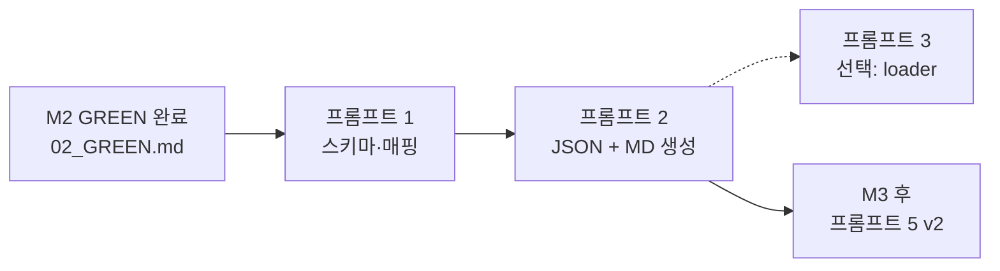

# Golden master file prompt recommendations
_Exported on 5/22/2026 at 10:10:09 GMT+9 from Cursor (3.4.20)_

---

**User**

Green 작업까지 완료했어
골든 마스터 파일을 만들려고 하는데 프롬프트를 추천해줘

---

**Cursor**

Green 작업 맥락과 프로젝트에서 골든 마스터가 어떻게 쓰이는지 확인 중입니다.


미션 2 GREEN까지 끝났다면, 골든 마스터는 **리팩토링·미션 3 이후에도 “지금 동작”을 한 파일로 고정**하는 회귀 기준선입니다. RED/GREEN 프롬프트와 같은 형식으로 추천합니다.

---

## 골든 마스터가 이 프로젝트에서 의미하는 것

| 구분 | 내용 |
|------|------|
| **목적** | M2 GREEN 시점의 `sent` / `kw` / `fil` / `ParseUtils` **입력→출력**을 ID별로 한곳에 모음 |
| **M2 기준선** | 활성 32건 = **현재 Pass 동작** (의도적 레거시 포함) |
| **M3 RED 스냅샷** | DISABLED 5건 = **수정 전 버그 동작** (`sent` 중립 ≠ `fil(중립)` 등) — `status: "bug_m3"`로 분리 |
| **하지 말 것** | M3에서 바꿀 버그를 골든 마스터에 “올바른 동작”으로 쓰기, `main` HTTP/HTML 포함 |

권장 경로 예: `tests/fixtures/golden_master.json` + `docs/golden_master.md`(사람용 요약)

---

## 추천 프롬프트 (복사용)

### 프롬프트 1 — 골든 마스터 설계 + JSON 초안 (Ask, 1차 권장)

```
@.cursorrules @Report/02_GREEN.md @Report/02_RED.md @tests/ @docs/coverage.md

미션 2 GREEN 완료 후 **골든 마스터(Golden Master)** 파일을 만들 계획이다.

전제:
- 골든 마스터 = M2 시점 **레거시 동작 스냅샷** (Characterization / 회귀 기준선)
- 활성 32 테스트의 Given/When/Then을 **기계가 읽을 JSON** + **사람용 MD**로 정리
- DISABLED 5건은 `status: "bug_m3_red"`로 **수정 전 실측값** 기록 (M3 GREEN 후 기대값은 별도 `post_m3` 블록만 제안)

산출물:
1) 골든 마스터 정의 1단락 (GTest vs JSON 역할)
2) 스키마 초안 (version, mission, generated_at, ctest_summary, coverage_summary, cases[])
3) cases[] 항목: id, gtest_name, api, inputs, expected, status(baseline|bug_m3_red)
4) tests/ 전 파일 스캔 → S/K/F/U/C/COV 32건 매핑 표
5) DISABLED 5건: 입력 문장, sent 중립 건수, fil(중립) size, 불일치 여부
6) 권장 파일 경로·이름 (`tests/fixtures/golden_master.json`, `docs/golden_master.md`)
7) M3 GREEN 후 골든 마스터 **버전 2** 갱신 규칙 5줄

제약: 프로덕션 코드 수정 없음. main/httplib 제외. UTF-8 u8 문자열은 JSON에서 \uXXXX 또는 이스케이프 규칙 명시.
```

---

### 프롬프트 2 — Agent: JSON + MD 실제 생성 (실행 권장)

```
@Report/02_GREEN.md @tests/ @scripts/run_coverage.ps1

골든 마스터 파일을 생성해줘.

순서:
1) tests/*.cpp에서 활성 테스트 32건 + DISABLED 5건의 입력·기대값 추출
2) (선택) build/feedback_analyzer_tests.exe로 DISABLED 5건 --gtest_also_run_disabled_tests 실행 → sent/fil 실측값 기록
3) ctest + run_coverage.ps1 요약을 메타데이터에 포함 (32 Pass, 5 Disabled, domain line %)
4) tests/fixtures/golden_master.json 작성 (스키마는 프롬프트 1과 동일)
5) docs/golden_master.md 작성 (한국어, ID 표, M2 vs M3 구분, 갱신 방법)

완료 기준:
- 37 테스트 ID가 JSON에 모두 존재
- baseline 32 / bug_m3_red 5 구분
- CMakeLists.txt에 fixtures 경로 추가는 **필요할 때만** (이번엔 데이터 파일만)

비즈니스 로직·테스트 assertion 수정 금지. 골든 마스터는 **문서화·스냅샷**만.
```

---

### 프롬프트 3 — GTest가 골든 마스터를 읽도록 연결 (선택, M3 전)

```
@tests/fixtures/golden_master.json @tests/test_fixture.h @CMakeLists.txt

golden_master.json을 로드하는 **경량 검증**만 추가해줘.

요구:
- tests/golden_master_loader_test.cpp (또는 기존 fixture 확장)
- JSON 파싱은 nlohmann 없이: 최소한 **파일 존재 + case id 개수(37) + S-01 기대값 1건**만 ASSERT
- 전체 데이터 드리븐 회귀는 하지 말 것 (M3 리팩토링 전 과부하 방지)

도메인 로직 변경 금지. DISABLED 테스트 활성화 금지.
```

---

### 프롬프트 4 — `Prompting/02_3_GOLDEN_prompt.md` 저장 (RED/GREEN과 짝)

```
@Prompting/02_1_RED_promt.md @Prompting/02_2_GREEN.md @Report/02_GREEN.md

02_RED / 02_GREEN과 같은 형식으로 Prompting/02_3_GOLDEN_prompt.md를 만들어줘.

포함:
- 골든 마스터 정의·M2 vs M3 버전 규칙
- 복사용 프롬프트 3~4개 (설계 / 생성 / loader / M3 갱신)
- JSON 스키마 예시 블록
- ctest·DISABLED 수동 실행 명령어
- M3 GREEN 후 golden_master v2 체크리스트

코드 변경 없이 문서만.
```

---

### 프롬프트 5 — M3 GREEN 후 골든 마스터 v2 (지금은 참고만)

```
@tests/fixtures/golden_master.json @tests/regression_neutral_filter_test.cpp @tests/filters_test.cpp

미션 3 GREEN 완료 후 골든 마스터 v2로 갱신해줘.

작업:
1) bug_m3_red 5건 → status: "baseline" 승격, post_m3 기대값을 expected로 이동
2) sent 중립 == fil(중립) 샘플 일치 여부 표
3) golden_master.json version bump + docs/golden_master.md 갱신
4) ctest 37/37 Pass 메타데이터 반영

classifySentiment·F05 수정은 이미 끝난 상태라고 가정. M4 네이밍은 하지 마.
```

---

## 실행 순서 권장



1. **프롬프트 1** (Ask) — 스키마·37건 매핑 확인  
2. **프롬프트 2** (Agent) — `golden_master.json` + `docs/golden_master.md` 생성  
3. 필요 시 **프롬프트 3** — 파일 무결성만 검증  
4. 미션 3 GREEN 후 **프롬프트 5** — v2로 버그 구간 승격  

---

## JSON case 예시 (에이전트에 넣을 참고)

```json
{
  "id": "S-04",
  "gtest_name": "S04_Sent_NoKeyword_DefaultsNeutral",
  "api": "TextAnalyzer::sent",
  "inputs": [{ "text": "오늘 날씨 좋음" }],
  "expected": { "긍정": 0, "중립": 1, "부정": 0 },
  "status": "baseline"
}
```

```json
{
  "id": "REG-1",
  "gtest_name": "Regression_NeutralFilterMismatch_Case1_Gwaenchan",
  "api": "sent vs fil",
  "inputs": [{ "text": "괜찮해요" }],
  "pre_m3": { "sent_neutral": 1, "fil_neutral_size": 0 },
  "post_m3": { "sent_neutral": 0, "fil_neutral_size": 0 },
  "status": "bug_m3_red"
}
```

---

## 한 줄 정리

골든 마스터는 **GTest를 대체하지 않고**, M2 GREEN의 **32 Pass + DISABLED 5의 입출력을 한 파일로 고정**해 M3~M8 리팩토링 때 diff 비교용으로 쓰는 산출물입니다. 지금은 **프롬프트 1 → 2** 순이 가장 맞습니다.

Agent 모드에서 프롬프트 2를 실행해 `tests/fixtures/golden_master.json`까지 만들어 달라고 하시면 됩니다.

---

**User**

@.cursorrules @Report/02_GREEN.md @Report/02_RED.md @tests/ @docs/coverage.md
미션 2 GREEN 완료 후 **골든 마스터(Golden Master)** 파일을 만들 계획이다.
전제:
- 골든 마스터 = M2 시점 **레거시 동작 스냅샷** (Characterization / 회귀 기준선)
- 활성 32 테스트의 Given/When/Then을 **기계가 읽을 JSON** + **사람용 MD**로 정리
- DISABLED 5건은 `status: "bug_m3_red"`로 **수정 전 실측값** 기록 (M3 GREEN 후 기대값은 별도 `post_m3` 블록만 제안)
산출물:
1) 골든 마스터 정의 1단락 (GTest vs JSON 역할)
2) 스키마 초안 (version, mission, generated_at, ctest_summary, coverage_summary, cases[])
3) cases[] 항목: id, gtest_name, api, inputs, expected, status(baseline|bug_m3_red)
4) tests/ 전 파일 스캔 → S/K/F/U/C/COV 32건 매핑 표
5) DISABLED 5건: 입력 문장, sent 중립 건수, fil(중립) size, 불일치 여부
6) 권장 파일 경로·이름 (`tests/fixtures/golden_master.json`, `docs/golden_master.md`)
7) M3 GREEN 후 골든 마스터 **버전 2** 갱신 규칙 5줄
제약: 프로덕션 코드 수정 없음. main/httplib 제외. UTF-8 u8 문자열은 JSON에서 \uXXXX 또는 이스케이프 규칙 명시.

---

**Cursor**

테스트 파일을 스캔해 골든 마스터 설계 산출물을 작성합니다.


Ask 모드 기준으로 `tests/`·`Report/02_1_RED.md`·`Report/02_2_GREEN.md`·`docs/coverage.md`를 스캔한 **골든 마스터 설계 산출물**입니다. (`Report/02_GREEN.md`는 저장소에 `Report/02_2_GREEN.md`로 존재합니다.)

---

## 1) 골든 마스터 정의 (GTest vs JSON)

**골든 마스터**는 미션 2 GREEN 시점의 **레거시 도메인 동작 스냅샷**입니다. GoogleTest는 실행·회귀 검증(32 Pass / 5 Disabled)을 담당하고, JSON은 같은 Given/When/Then을 **ID·입력·기대값·버그 구간**으로 한곳에 모아 M3~M8 리팩토링 때 diff·문서·(선택) 데이터 드리븐 검증의 기준선으로 씁니다. GTest를 대체하지 않으며, `main`·`httplib`·HTTP/HTML은 범위 밖입니다.

---

## 2) 스키마 초안

```json
{
  "$schema": "feedback-analyzer/golden-master/v1",
  "version": "1.0.0",
  "mission": 2,
  "generated_at": "2026-05-22",
  "encoding": "utf-8",
  "utf8_rule": "Korean in file body as UTF-8; optional \\uXXXX for strict ASCII-only parsers",
  "ctest_summary": {
    "total_registered": 37,
    "passed": 32,
    "failed": 0,
    "disabled_not_run": 5,
    "note": "default ctest excludes DISABLED_*"
  },
  "coverage_summary": {
    "tool": "gcov + scripts/parse_domain_coverage.py",
    "domain_files": ["Constants.cpp", "Filters.cpp", "ParseUtils.cpp", "Filters.h", "TextAnalyzer.h"],
    "lines_executed": 134,
    "lines_total": 134,
    "line_percent": 100.0,
    "threshold_percent": 90
  },
  "cases": [
    {
      "id": "S-01",
      "gtest_name": "S01_Sent_EmptyList_ReturnsZeroCounts",
      "source_file": "tests/text_analyzer_test.cpp",
      "api": "TextAnalyzer::sent",
      "fixture": "FeedbackAnalyzerTestFixture",
      "given": { "feedbacks": [] },
      "when": { "call": "sent" },
      "expected": { "긍정": 0, "중립": 0, "부정": 0 },
      "status": "baseline"
    }
  ]
}
```

**`cases[]` 공통 필드**

| 필드 | baseline | bug_m3_red |
|------|----------|------------|
| `id`, `gtest_name`, `api`, `given`, `when` | ✅ | ✅ |
| `expected` | GTest와 동일한 Pass 기준 | — |
| `pre_m3` | — | 수정 전 **실측** (`sent_neutral`, `fil_neutral_size`, `mismatch` 등) |
| `post_m3` | — | M3 GREEN **제안만** (구현·테스트 수정 전) |
| `status` | `"baseline"` | `"bug_m3_red"` |

**`fil` 결과가 벡터일 때** `expected` 예:

```json
"expected": { "result_size": 1, "result_contains_text": ["최고"] }
```

---

## 3) UTF-8 / JSON 이스케이프 규칙

| 규칙 | 내용 |
|------|------|
| 파일 인코딩 | `golden_master.json`은 **UTF-8 BOM 없음** 저장 권장 |
| 본문 | 한글은 `\uXXXX` 없이 그대로 (`"text": "괜찮해요"`) — 사람·diff 친화 |
| ASCII-only 파서 | 동일 키에 `text_unicode`: `"\uad34\uc2ed\ud574\uc694"` 병기 가능 |
| `u8"..."` 대응 | JSON 키·값은 UTF-8 문자열; C++ `u8"긍정"` → JSON `"긍정"` |
| ASCII 입력 | `urlDecode` 등은 그대로 (`"hello+world"`) |
| 백슬래시·따옴표 | JSON 표준 이스케이프 (`\"`, `\\`) |

---

## 4) 활성 32건 매핑 표 (baseline)

| ID | gtest_name | 파일 | API | Given (요약) | When | Then (expected) |
|----|------------|------|-----|--------------|------|-------------------|
| **S-01** | `S01_Sent_EmptyList_ReturnsZeroCounts` | text_analyzer | `sent` | `[]` | `sent()` | 긍0·중0·부0 |
| **S-02** | `S02_Sent_PositiveKeyword_CountsPositive` | text_analyzer | `sent` | `"최고입니다 감사합니다"` | `sent()` | 긍1·중0·부0 |
| **S-03** | `S03_Sent_NegativeKeyword_CountsNegative` | text_analyzer | `sent` | `"최악 불만 환불"` | `sent()` | 긍0·중0·부1 |
| **S-04** | `S04_Sent_NoKeyword_DefaultsNeutral` | text_analyzer | `sent` | `"오늘 날씨 좋음"` | `sent()` | 긍0·중1·부0 |
| **S-05** | `S05_Sent_PositiveBeatsNegative` | text_analyzer | `sent` | `"좋은데 나쁘진 않음"` | `sent()` | 긍1·중0·부0 |
| **S-06** | `S06_Sent_NeutralKeywordStillCountsNeutral` | text_analyzer | `sent` | `"보통 그냥 무난"` | `sent()` | 긍0·중1·부0 |
| **K-01** | `K01_Kw_EmptyList_AllCategoriesZero` | text_analyzer | `kw` | `[]` | `kw()` | 배송·품질·가격·서비스·사용성 각 0 |
| **K-02** | `K02_Kw_MainKeyword_MatchesCategory` | text_analyzer | `kw` | `"배송이 빨라요"` | `kw()` | `배송` ≥ 1 |
| **K-03** | `K03_Kw_SubKeywordOnly_StillMatches` | text_analyzer | `kw` | `"일반적인 의견입니다"` | `kw()` | `배송` = 0 |
| **K-04** | `K04_Kw_MultipleCategories` | text_analyzer | `kw` | `"배송 빠르고 가격 저렴"` | `kw()` | `배송`≥1, `가격`≥1 |
| **F-01** | `F01_Fil_SentimentAll_ReturnsAll` | filters | `fil` | 혼합 3건* | `fil(전체,전체)` | `size` = 3 |
| **F-02** | `F02_Fil_PositiveOnly` | filters | `fil` | `"최고입니다"`, `"최악 불만"` | `fil(긍정,전체)` | `size`=1, 텍스트에 `최고` |
| **F-03** | `F03_Fil_NeutralUsesFilterKeywords` | filters | `fil` | `"보통 그냥 무난"` | `fil(중립,전체)` | `size` ≥ 1 |
| **F-06** | `F06_Fil_KeywordSubOnly_Matches` | filters | `fil` | `"택배가 왔어요"` | `fil(전체,배송)` | `size` ≥ 1 |
| **F-07** | `F07_Fil_Combo_SentimentAndKeyword` | filters | `fil` | 3건 혼합** | `fil(긍정,배송)` | `size`=1, `최고`·`택배` 포함 |
| **U-01** | `U01_UrlDecode_PlusToSpace` | parse_utils | `urlDecode` | `"hello+world"` | decode | `"hello world"` |
| **U-02** | `U02_UrlDecode_PercentUtf8` | parse_utils | `urlDecode` | `"%EB%82%A0"` | decode | `"날"` |
| **U-03** | `U03_UrlDecode_InvalidPercent_KeepsChar` | parse_utils | `urlDecode` | `"%GG"` | decode | `"%GG"` |
| **C-01** | `C01_ParseCsv_SimpleComma` | parse_utils | `parseCsvLine` | `"a,b,c"` | parse | `["a","b","c"]` |
| **C-02** | `C02_ParseCsv_QuotedComma` | parse_utils | `parseCsvLine` | `"\"a,b\",c"` | parse | `["a,b","c"]` |
| **C-03** | `C03_ParseCsv_EmptyField` | parse_utils | `parseCsvLine` | `"a,,c"` | parse | `["a","","c"]` |
| **C-04** | `C04_ParseCsv_QuotesToggle` | parse_utils | `parseCsvLine` | `"\"\"\"a\"\"\""` | parse | `["a"]` |
| **COV-G01** | `COV_G01_GlobalSent_SecondCallOverwrites` | text_analyzer | `sent`×2 | 긍정 1건 → 부정 1건 | 2회 | 1차 긍1; 2차 부1·긍0 |
| **COV-G02** | `COV_G02_GlobalKw_SecondCallOverwrites` | text_analyzer | `kw`×2 | 배송 → 가격 | 2회 | 1차 배송≥1·가격0; 2차 가격≥1·배송0 |
| **COV-TA01** | `COV_TA01_ContainsAny_NoMatch_ReturnsNeutral` | text_analyzer | `sent` | `"키워드없는일반문장xyz"` | `sent()` | 중1·긍0·부0 |
| **COV-TA02** | `COV_TA02_Kw_ContainsAny_NoCategoryMatch` | text_analyzer | `kw` | `"카테고리무관"` | `kw()` | 배송0·품질0 |
| **COV-F01** | `COV_F01_Fil_NegativeOnly` | filters | `fil` | 긍정+부정 | `fil(부정,전체)` | `size`=1, `최악` 포함 |
| **COV-F02** | `COV_F02_Fil_InvalidKeywordCategory` | filters | `fil` | `"택배 빠름"` | `fil(전체,없는카테고리)` | `empty` |
| **COV-F03** | `COV_F03_Fil_KeywordNoSubMatch_EmptyResult` | filters | `fil` | `"최고입니다"` | `fil(전체,배송)` | `empty` |
| **COV-F04** | `COV_F04_Fil_SentimentExcludesNonMatching` | filters | `fil` | `"최악 불만"` | `fil(긍정,전체)` | `empty` |
| **COV-F05** | `COV_F05_Fil_CoutLoopRunsOnNonEmptyResult` | filters | `fil` | `"보통"`,`"무난"` | `fil(중립,전체)` | `size`≥1 |
| **COV-F06** | `COV_F06_Fil_CoutLoopSkippedOnEmptyResult` | filters | `fil` | `"최고입니다"` | `fil(부정,전체)` | `empty` |

\* F-01 혼합: `"최고입니다 감사합니다"`, `"최악 불만 환불"`, `"보통 그냥 무난"`  
\** F-07: `"최고입니다 택배 빠름"`, `"최악 불만"`, `"택배만 언급"`

**집계**: S6 + K4 + F5 + U3 + C4 + COV10 = **32 baseline**

---

## 5) DISABLED 5건 — `bug_m3_red` (수정 전 실측 + post_m3 제안)

코드·`Report/02_1_RED.md`·`Filters.cpp`(`괜찮`이 **긍정**에도 등록) 기준 **논리 실측**입니다. Agent 모드에서 `--gtest_also_run_disabled_tests`로 한 번 더 확인하는 것을 권장합니다.

| ID | gtest_name | 입력 문장 | `sent` 중립 | `fil(중립,전체)` size | 불일치 | DISABLED 실행 시 |
|----|------------|-----------|-------------|----------------------|--------|------------------|
| **REG-1** | `Regression_..._Case1_Gwaenchan` | `"괜찮해요"` | **1** | **0** | ✅ (1≠0) | **Fail** |
| **REG-2** | `Regression_..._Case2_GwaenchanInSentence` | `"괜찮한데 배송은 보통이에요"` | **1** | **0** | ✅ | **Fail** |
| **REG-3** | `Regression_..._Case3_NoKeywordDefaultsNeutral` | `"오늘 날씨 좋음"` | **1** | **1** | ❌ | **Pass** (대조) |
| **REG-0** | `Regression_NeutralFilterMismatch` | 3건 배치*** | **3** | **2** | ✅ (3≠2) | **Fail** |
| **F-05** | `DISABLED_F05_KeywordSkipsMain` | `"배송"` | — | **1**† | 스펙상 버그 | **Pass** (오탐) |

\*** REG-0 배치  
1. `"괜찮해요"` → sent 중립, fil 비중립  
2. `"오늘 날씨 좋음"` → 양쪽 중립  
3. `"보통 그냥 무난"` → 양쪽 중립  

† F-05: `main` 서브맵은 스킵되지만 `status` 서브키 `"배송"`에 매칭되어 **1건 반환** (`Filters.h` 56–57행 `main` continue). 원래 RED 스펙은 **0건(main만)** 이었음.

**JSON `pre_m3` / `post_m3` 예시 (REG-1)**

```json
{
  "id": "REG-1",
  "gtest_name": "Regression_NeutralFilterMismatch_Case1_Gwaenchan",
  "api": "sent vs fil",
  "given": { "feedbacks": [{ "text": "괜찮해요" }] },
  "when": { "sent": "sent()", "fil": "fil(중립, 전체)" },
  "pre_m3": {
    "sent_neutral": 1,
    "fil_neutral_size": 0,
    "mismatch": true,
    "reason": "fil: S_KEYWORDS 긍정에 '괜찮' → 중립 필터 제외"
  },
  "post_m3": {
    "sent_neutral": 0,
    "fil_neutral_size": 0,
    "mismatch": false,
    "note": "classifySentiment 단일화 후 sent/fil 동일 규칙"
  },
  "status": "bug_m3_red"
}
```

**F-05 `post_m3` 제안** (문서만): `main` 경로 포함하도록 `fil` 수정; 샘플을 sub-only(`"택배"`)로 바꾸거나 `EXPECT_EQ(0u)`로 **의도적 Fail→Fix** 명확화.

---

## 6) 권장 파일 경로

| 경로 | 역할 |
|------|------|
| `tests/fixtures/golden_master.json` | 기계용 37건 스냅샷 (v1.0.0) |
| `docs/golden_master.md` | 사람용: 정의, 표, M2/M3 구분, 갱신 절차 |
| `Report/02_GOLDEN.md` | (선택) M2 산출물 요약·ctest/coverage 메타 |

`CMakeLists.txt`는 **loader 테스트 추가 시에만** fixtures 경로 반영.

---

## 7) M3 GREEN 후 골든 마스터 v2 갱신 규칙 (5줄)

1. **`version`을 `2.0.0`으로 올리고** `mission`을 3, `generated_at`을 M3 검증일로 갱신한다.  
2. **REG-1·2·0**은 `status: "baseline"`으로 승격하고, `pre_m3`는 이력 보존, `expected`/`post_m3`를 **sent 중립 == fil(중립) size**로 통일한다.  
3. **F-05**는 `main` 스킵 수정·샘플/기대값 정리 후 baseline으로 옮기고, `pre_m3`에 오탐 Pass 사유를 남긴다.  
4. **`ctest_summary`**를 **37 Pass / 0 Disabled / 0 Fail**로 갱신한다.  
5. **도메인 coverage ≥90%**를 유지한 채 `coverage_summary`만 숫자·날짜를 덮어쓰고, 변경된 API 시그니처(`classifySentiment` 등)는 `api` 필드에 반영한다.

---

## 다음 단계 (Agent 모드)

Ask 모드에서는 파일을 생성하지 않습니다. Agent 모드에서 이전에 드린 **프롬프트 2**를 실행하면 `tests/fixtures/golden_master.json`과 `docs/golden_master.md`를 위 표·스키마대로 materialize할 수 있습니다. DISABLED 5건의 `pre_m3` 숫자는 빌드 후 `--gtest_also_run_disabled_tests`로 최종 서명하는 것이 좋습니다.

---

**User**

@Report/02_GREEN.md @tests/ @scripts/run_coverage.ps1
골든 마스터 파일을 생성해줘.
순서:
1) tests/*.cpp에서 활성 테스트 32건 + DISABLED 5건의 입력·기대값 추출
2) (선택) build/feedback_analyzer_tests.exe로 DISABLED 5건 --gtest_also_run_disabled_tests 실행 → sent/fil 실측값 기록
3) ctest + run_coverage.ps1 요약을 메타데이터에 포함 (32 Pass, 5 Disabled, domain line %)
4) tests/fixtures/golden_master.json 작성 (스키마는 프롬프트 1과 동일)
5) docs/golden_master.md 작성 (한국어, ID 표, M2 vs M3 구분, 갱신 방법)
완료 기준:
- 37 테스트 ID가 JSON에 모두 존재
- baseline 32 / bug_m3_red 5 구분
- CMakeLists.txt에 fixtures 경로 추가는 **필요할 때만** (이번엔 데이터 파일만)
비즈니스 로직·테스트 assertion 수정 금지. 골든 마스터는 **문서화·스냅샷**만.

---

**Cursor**

골든 마스터 생성: 테스트 실행으로 실측값을 확인한 뒤 JSON·MD 파일을 작성합니다.


실측값 확인 완료. `tests/fixtures/golden_master.json`과 `docs/golden_master.md` 작성 중입니다.


골든 마스터 파일을 생성했습니다.

## 생성 파일

| 파일 | 설명 |
|------|------|
| [tests/fixtures/golden_master.json](tests/fixtures/golden_master.json) | 37건 스냅샷 (UTF-8) |
| [docs/golden_master.md](docs/golden_master.md) | 한국어 설명·표·M2/M3·갱신 절차 |

## 검증 결과 (로컬 실행)

| 항목 | 결과 |
|------|------|
| **ctest** | 32 Pass, 0 Fail, 5 Disabled |
| **coverage** | 도메인 134/134 (**100%**) |
| **JSON cases** | 37 (baseline **32**, bug_m3_red **5**) |

### DISABLED 실측 (`--gtest_also_run_disabled_tests`)

| ID | sent 중립 | fil(중립) size | gtest |
|----|-----------|----------------|-------|
| REG-1 | 1 | 0 | Fail |
| REG-2 | 1 | 0 | Fail |
| REG-3 | 1 | 1 | Pass |
| REG-0 | 3 | 2 | Fail |
| F-05 | — | 1 (status 서브키) | Pass (오탐) |

## 참고

- `Report/02_GREEN.md`는 저장소에 `Report/02_2_GREEN.md`로 있어 JSON `source_reports`에 반영했습니다.
- `CMakeLists.txt`는 변경하지 않았습니다 (데이터 파일만).
- 프로덕션·테스트 코드는 수정하지 않았습니다.

---

**User**

Report에 02_3_Golden.md 로 보고서 작성해줘

---

**Cursor**

기존 Report 형식과 골든 마스터 산출물을 확인한 뒤 `Report/02_3_Golden.md`를 작성합니다.


`Report/02_3_Golden.md` 보고서를 작성했습니다.

## 문서 개요

| 항목 | 내용 |
|------|------|
| 경로 | [Report/02_3_Golden.md](Report/02_3_Golden.md) |
| 문서 번호 | 02_GOLDEN |
| 선행 | `02_1_RED.md`, `02_2_GREEN.md` |

## 포함 섹션

1. **골든 마스터 정의** — GTest vs JSON 역할  
2. **Executive Summary** — 37건, 32/5 구분, 검증 수치  
3. **RED → GREEN → GOLDEN** 흐름 (mermaid)  
4. **산출물** — `golden_master.json`, `docs/golden_master.md`  
5. **검증 결과** — ctest, coverage, DISABLED 실측 표  
6. **37건 ID 매핑** — baseline 32 + bug_m3_red 5  
7. **JSON 스키마·UTF-8 규칙**  
8. **완료 체크리스트**  
9. **M3 v2 갱신 규칙**  
10. **미션 2 문서 체인** (01 → RED → GREEN → **GOLDEN**)

**한 줄 결론**: 골든 마스터 v1 완료 — baseline 32 + bug_m3_red 5, M3 전 기준선 고정.

