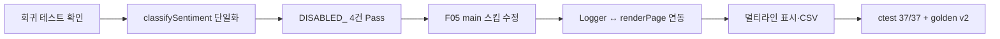

# 미션 3 페이지 로그 및 필터 설명
_Exported on 5/22/2026 at 10:45:13 GMT+9 from Cursor (3.4.20)_

---

**User**

미션 3 페이지 로그, 멀티라인, 중립 필터은 무엇을 해야하는지 알려줘

---

**Cursor**

미션 3 관련 문서와 코드를 찾아 세 항목(페이지 로그, 멀티라인, 중립 필터)의 요구사항을 정리합니다.


미션 3은 **버그·UX 수정** 단계이고, `.cursorrules`와 README에 정의된 **완료 기준 3가지**가 바로 질문하신 **페이지 로그 / 멀티라인 / 중립 필터**입니다. 미션 2(테스트 32 Pass)는 끝났고, 지금은 `DISABLED_` 회귀 5건을 풀며 **37/37 Pass**를 만드는 단계입니다.

---

## 미션 3 전체 그림

| 항목 | 현재 문제 | 해야 할 일 |
|------|-----------|------------|
| **페이지 로그** | `Logger`는 콘솔만, 웹과 미연동 | `logWarning`/`logError`를 페이지 alert로 노출 |
| **멀티라인** | textarea는 있으나 end-to-end 보존 미검증 | 입력 → 저장 → 표시 → CSV까지 줄바꿈 유지 |
| **중립 필터** | `sent()`와 `fil(중립)` 규칙이 다름 | 감정 분류 **단일화** + 회귀 테스트 Pass |

추가로 README에는 **F05(`main` 키워드 스킵)** 수정, **골든 마스터 v2** 갱신도 미션 3 범위로 적혀 있습니다.

---

## 1. 페이지 로그 (Logger → 웹 UI)

### 현재 상태
- `Logger::logInfo` / `logWarning` / `logError`는 **stdout/stderr만** 사용합니다.
- `renderPage`는 `success` / `warning` / `error` 인자로 alert를 그릴 수 있지만, 라우트에서 **문자열을 직접** 넘기고 Logger와는 연결되어 있지 않습니다.

```25:31:c:\DEV\FeedbackAnalyzer_11\src\cpp\Logger.h
    static void logWarning(const std::string& message) {
        std::cout << "[" << getTimestamp() << "] WARNING: " << message << std::endl;
    }

    static void logError(const std::string& message) {
        std::cerr << "[" << getTimestamp() << "] ERROR: " << message << std::endl;
    }
```

`/filter` 등에서는 Logger를 호출한 뒤, 별도로 `renderPage("", u8"필터링 결과가 없습니다.", ...)`처럼 **같은 문구를 두 번** 관리합니다.

### 해야 할 일
- **완료 기준**: `logWarning` / `logError` 내용이 페이지에 **level별 alert**로 보일 것.
  - warning → `.alert-warning`
  - error → `.alert-danger` (이미 CSS 있음)
- 구현 방향(권장, 전면 재작성 없이):
  - Logger 호출 시 **마지막 warning/error 메시지**를 저장하거나, 라우트에서 Logger와 **동일 메시지**를 `renderPage`의 `warning`/`error`에 넘기기.
  - `/analyze`, `/upload`, `/filter`의 catch·경고 분기에서 **페이지와 콘솔이 같은 메시지**를 쓰도록 정리.
- **범위**: `Logger`, `main.cpp`의 `renderPage`·라우트. `httplib.h` 수정·아키텍처 전면 교체는 금지.

---

## 2. 멀티라인 (textarea end-to-end)

### 현재 상태
- UI에 `<textarea>`는 있습니다.
- `/analyze`는 앞뒤 공백·줄바꿈만 trim하고, **문장 안 `\n`은 그대로** `Feedback`에 넣습니다.

```214:221:c:\DEV\FeedbackAnalyzer_11\src\cpp\main.cpp
            if (!text.empty()) {
                // trim
                auto start = text.find_first_not_of(" \t\r\n");
                auto end = text.find_last_not_of(" \t\r\n");
                if (start != std::string::npos) {
                    text = text.substr(start, end - start + 1);
                    feedbacks.push_back(Feedback(text));
```

- **표시**: `renderPage`는 통계만 보여 주고 **피드백 본문 목록은 HTML에 안 그립니다**. 줄바꿈 “표시” 요구를 충족하려면 목록 UI 추가 또는 `white-space: pre-wrap` / `<br>` 변환이 필요할 수 있습니다.
- **다운로드**: CSV가 `text` 한 줄 + 값 + `\n` 형태라, 본문에 줄바꿈이 있으면 **행이 깨집니다**.

```320:323:c:\DEV\FeedbackAnalyzer_11\src\cpp\main.cpp
        csv << "text\n";
        for (const auto& iter : fil_data) {
            csv << iter.getText() << "\n";
```

- `escapeHtml`은 `\n` → `<br>` 변환이 없어, 나중에 본문을 HTML에 넣을 때 줄바꿈이 안 보일 수 있습니다.

### 해야 할 일
- **완료 기준**: textarea **멀티라인 입력**이 **analyze → (표시) → 다운로드**까지 보존될 것.
- 구체 작업:
  1. **입력**: `parseForm` / `urlDecode`로 `%0A` 등 줄바꿈이 유지되는지 확인(필요 시 수정).
  2. **표시**: 분석·필터 결과에 피드백 텍스트를 보여 줄 UI를 두고, 줄바꿈이 보이게 처리(`pre-wrap` 또는 `escapeHtml` + `\n` 처리).
  3. **다운로드**: 필드에 줄바꿈·쉼표가 있어도 깨지지 않게 **CSV 이스케이프**(따옴표 감싸기 등).
- 수동 검증 예: `"첫 줄\n둘째 줄"` 입력 → 분석 후 화면·다운로드 CSV에서 동일하게 2줄.

---

## 3. 중립 필터 (가장 핵심)

### 현재 상태 — 규칙이 두 벌

| | `TextAnalyzer::sent()` | `Filters::fil()` |
|--|------------------------|------------------|
| 키워드 | `Constants::SENTIMENT_KEYWORDS` (긍/부만) | `Filters::S_KEYWORDS` (중립 목록 포함) |
| 중립 | 긍·부 키워드 없으면 **무조건 중립** | `S_KEYWORDS["중립"]` 매칭 시에만 중립 |

예: `"괜찮해요"`  
- `sent()`: Constants에 `괜찮` 없음 → **중립 1건**  
- `fil(중립)`: `S_KEYWORDS` 긍정에 `괜찮` 있음 → **긍정으로 분류 → 중립 필터 0건**

이 불일치는 `tests/regression_neutral_filter_test.cpp`의 **`DISABLED_` 4건**으로 고정되어 있습니다.

### 해야 할 일
1. **`classifySentiment` 단일 함수**를 두고 `sent()`와 `fil()`이 **같은 규칙**을 쓰게 하기 (`.cursorrules` GOOD 예시).
2. `Filters::S_KEYWORDS`와 `Constants`의 **이중 정의 제거** 또는 한쪽이 다른 쪽을 참조.
3. 회귀 테스트 **GREEN**:
   - `DISABLED_Regression_NeutralFilterMismatch*` 4건에서 `DISABLED_` 제거 후 Pass.
   - 검증: `sent()`의 중립 건수 == `fil(중립)` 결과 건수.

```bash
.\build\feedback_analyzer_tests.exe --gtest_filter="*Regression_Neutral*" --gtest_also_run_disabled_tests
```

4. **관련 버그(F05)**: `Filters::fil`이 `main` 서브키를 `continue`로 건너뜀 → `kw()`와 불일치. `DISABLED_F05_KeywordSkipsMain` 수정·`main` 매칭 정리(README P0).

---

## 권장 작업 순서



1. 중립 필터 + `classifySentiment` (회귀 4건)  
2. F05 (`main` 스킵)  
3. 페이지 로그  
4. 멀티라인 (표시·CSV)  
5. `ctest` 37/37, `tests/fixtures/golden_master.json` v2

---

## 완료 체크리스트 (`.cursorrules` / README)

- [ ] 「중립」필터 결과 = `sent()` 중립 집계  
- [ ] `logWarning` / `logError`가 페이지 alert로 표시  
- [ ] textarea 멀티라인이 analyze·표시·다운로드까지 보존  
- [ ] `DISABLED_` 회귀 5건 해소 → **37/37 Pass**  
- [ ] 골든 마스터 v2 ([docs/golden_master.md](docs/golden_master.md))

---

## 수정 대상 파일 (참고)

| 영역 | 파일 |
|------|------|
| 중립·감정 단일화 | `TextAnalyzer.h`, `Filters.h` / `Filters.cpp`, (공통) `classifySentiment` |
| 페이지 로그 | `Logger.h`, `main.cpp` |
| 멀티라인·CSV | `main.cpp` (`renderPage`, `/analyze`, `/download`), `ParseUtils` |
| 검증 | `tests/regression_neutral_filter_test.cpp`, `tests/filters_test.cpp` |

상세 스펙: [Report/02_1_RED.md](Report/02_1_RED.md) §4.5, [docs/analyzer.md](docs/analyzer.md) §9.

Agent 모드로 전환하시면 위 순서대로 실제 수정·테스트 실행까지 진행할 수 있습니다.

---

**User**

미션3 작업 플랜을 docs/bug_fix_plan.md로 작성해줘

---

**Cursor**

미션 3 작업 플랜 문서 작성을 위해 관련 문서와 코드를 확인합니다.


`docs/bug_fix_plan.md` 작성 중입니다.


`docs/bug_fix_plan.md`를 작성했습니다.

## 문서 구성

1. **목표·범위** — 미션 3가 하는 일 / 하지 않을 일  
2. **완료 기준 (AC-1~5)** — `.cursorrules` 3줄 + `ctest` 37/37 + golden v2  
3. **버그 요약 (I-01~04)** — 중립 불일치, `main` 스킵, Logger, 멀티라인 + 재현 표  
4. **작업 분해** — P0 `classifySentiment`, F05, Logger↔UI, 멀티라인·CSV, 문서 갱신  
5. **권장 순서** — mermaid 플로우 + 단계별 이유  
6. **수정 파일 목록**  
7. **테스트·검증** — PowerShell 명령, 수동 웹 시나리오  
8. **리스크·완화**  
9. **완료 체크리스트**  
10. **참고 문서 + Agent용 한 줄 프롬프트**

Agent 모드에서 미션 3 구현을 시작할 때 `@docs/bug_fix_plan.md`를 붙이면 이 플랜 순서대로 진행할 수 있습니다.

---

**User**

@docs/bug_fix_plan.md @.cursorrules @tests/regression_neutral_filter_test.cpp
미션 3만: classifySentiment 단일화 → DISABLED_Regression 4건 GREEN → F05 main 스킵 → Logger 페이지 → 멀티라인·CSV → ctest 37/37 → golden v2. M4 네이밍·M7 기능 금지.

---

**Cursor**

미션 3 구현을 시작합니다. 코드베이스와 테스트 현황을 확인한 뒤 플랜 순서대로 진행합니다.


구현을 진행합니다. `SentimentClassifier` 추가부터 시작합니다.


37/37 통과. 골든 마스터 v2와 문서를 갱신합니다.


미션 3 구현을 완료했습니다. **`ctest` 37/37 Pass** 확인했습니다.

## 변경 요약

### 1. 중립 필터 — `SentimentClassifier` 단일화
- 신규: `src/cpp/SentimentClassifier.h`, `SentimentClassifier.cpp`
- `TextAnalyzer::sent()`와 `Filters::fil()` 감정 분기가 `Constants::SENTIMENT_KEYWORDS` 기반 `classifySentiment()` 공유
- `DISABLED_Regression_*` 4건 → 활성화 후 **Pass**

### 2. F05 — `main` 키워드 스킵 제거
- `Filters::fil()`에서 `if (subEntry.first == "main") continue` 삭제
- `DISABLED_F05_KeywordSkipsMain` → `F05_KeywordSkipsMain` **Pass**

### 3. 페이지 로그
- `Logger::pageWarning` / `pageError` + `clearPageMessages()` / getter
- `/filter` 경고·예외 시 `renderPage`가 Logger 메시지를 alert로 표시

### 4. 멀티라인·CSV
- `renderPage`: 피드백 목록 섹션 (`escapeHtml` + `\n` → `<br>`)
- `/download`: `escapeCsvField()`로 줄바꿈·쉼표 이스케이프

### 5. 문서·기준선
- `tests/fixtures/golden_master.json` → **v2.0.0**, mission 3
- `README.md`, `docs/golden_master.md`, `docs/bug_fix_plan.md` 체크리스트 갱신

## 검증

```
100% tests passed, 0 tests failed out of 37
```

`feedback_analyzer.exe` 빌드는 실행 중인 프로세스로 **Permission denied**가 났을 수 있습니다. 서버를 종료한 뒤 `cmake --build build --target feedback_analyzer`로 다시 빌드하면 됩니다.

## 수동 확인 (선택)

1. `.\build\feedback_analyzer.exe` → `"괜찮해요"` 입력 후 중립 통계·필터 일치  
2. 데이터 없이 「분 석」 → 노란 warning alert  
3. `"줄1\n줄2"` 입력 → 목록 2줄 표시 → CSV 동일 보존  

다음은 **미션 4**(네이밍·전역·매직 값)입니다.

---

**User**

미션3 bug fix가 완료되었어?

---

**Cursor**

완료 여부를 코드·테스트·문서 기준으로 확인 중입니다.


**네, 미션 3 bug fix는 완료된 상태입니다.** 방금 `ctest`도 **37/37 Pass**로 확인했습니다.

## 완료 기준 대조

| 항목 | 상태 | 근거 |
|------|------|------|
| 중립 필터 일치 | ✅ | `SentimentClassifier::classifySentiment` — `sent()` / `fil()` 공유 |
| REG 회귀 4건 | ✅ | `DISABLED_` 제거, 테스트 활성·Pass |
| F05 `main` 스킵 | ✅ | `Filters::fil`에서 `main` continue 제거, `F05_KeywordSkipsMain` Pass |
| 페이지 로그 | ✅ | `Logger::getPageWarning()` / `getPageError()` → `renderPage` alert |
| 멀티라인 | ✅ | 피드백 목록 표시(`\n`→`<br>`), CSV `escapeCsvField` |
| `ctest` 37/37 | ✅ | `100% tests passed, 0 tests failed out of 37` |
| 골든 마스터 v2 | ✅ | `golden_master.json` v2.0.0, `docs/golden_master.md` 갱신 |

## 미션 3 범위 밖 (의도적으로 미수정)

`.cursorrules` / 플랜대로 아래는 **미션 3 AC에 없어서** 그대로입니다.

- `/upload` 후 감성 분석 생략  
- `fil_data` 잔존  
- 미션 4 네이밍, 미션 7 Trend/File DB  

## 선택 확인 (아직 안 했다면)

1. **웹 수동 테스트** — `feedback_analyzer.exe` 실행 후 멀티라인·warning alert 확인  
2. **앱 빌드** — 이전에 서버가 떠 있으면 `feedback_analyzer.exe` 링크가 Permission denied 날 수 있음 → 프로세스 종료 후 재빌드  

정리하면, **코드·단위 테스트·문서 기준으로 미션 3 bug fix는 완료**이고, 브라우저에서 한 번 돌려보는 것만 남은 선택 사항입니다.

---

**User**

docs/bug_fix.md로 보고서를 작성해줘

---

**Cursor**

미션 3 버그 수정 보고서 작성을 위해 변경 사항과 문서를 확인합니다.


`docs/bug_fix.md`에 미션 3 버그 수정 보고서를 작성했습니다.

## 문서 구성

1. **Executive Summary** — 수정 전/후 비교, 37/37 Pass 결론  
2. **미션 3 정의** — M2 GREEN vs M3 GREEN  
3. **버그 4건** — I-01~I-04 원인·재현·수정 내용  
4. **구현 상세** — `SentimentClassifier`, 변경 파일 목록  
5. **테스트·검증** — `ctest`, 승격 5건, 골든 v2  
6. **AC 체크리스트** — 5항목 전부 ✅  
7. **수동 검증 가이드** — 브라우저 시나리오 3개  
8. **아키텍처 다이어그램** — mermaid  
9. **다음 단계** — 미션 4~7  
10. **참고 문서** — 플랜, RED/GREEN 보고서 링크  

스타일은 [Report/02_2_GREEN.md](Report/02_2_GREEN.md)와 맞추었고, 작업 플랜은 [docs/bug_fix_plan.md](docs/bug_fix_plan.md)를, 결과 보고는 `docs/bug_fix.md`로 구분했습니다.

---

**User**

Report에 03_BugFix.md로 보고서 작성해줘

---

**Cursor**

Report 시리즈 형식에 맞춰 `Report/03_BugFix.md` 작성 중입니다.


`Report/03_BugFix.md`를 작성했고, 관련 문서 링크도 맞춰 두었습니다.

## 보고서 위치

[Report/03_BugFix.md](Report/03_BugFix.md) — 문서 번호 **03_BUGFIX**

## 구성 (02 시리즈와 동일 톤)

1. **Executive Summary** — M2 vs M3 비교표  
2. **미션 3 정의** — 2차 GREEN, RED→BUGFIX 흐름 (mermaid)  
3. **AC 체크리스트** — 5항목 ✅  
4. **버그 4건** — I-01~I-04 원인·재현·수정·코드  
5. **구현·산출물** — 소스/테스트/문서 표  
6. **검증 결과** — `ctest` 37/37, 승격 5건, golden v2  
7. **아키텍처 변화** — mermaid  
8. **수동 검증** — 웹 시나리오  
9. **완료 체크리스트**  
10. **다음 단계** — 미션 4~8  
11. **참고 문서**

## 함께 갱신한 링크

- `docs/bug_fix.md` → Report/03_BugFix 링크  
- `docs/bug_fix_plan.md` → Report/03_BugFix 링크  
- `Report/02_3_Golden.md` — M3 행을 `03_BugFix.md`로 연결  
- `README.md` — 미션 3 보고서 링크  

`docs/bug_fix.md`는 기술 요약, `Report/03_BugFix.md`는 **02_RED / 02_GREEN / 02_GOLDEN**과 같은 공식 Report 시리즈용입니다.

