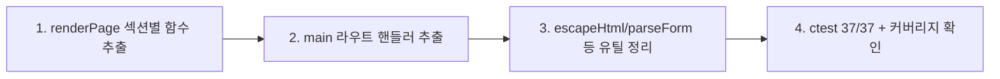

# 미션5 설명
_Exported on 5/22/2026 at 11:30:03 GMT+9 from Cursor (3.4.20)_

---

**User**

미션5에 대해서 설명해줘

---

**Cursor**

미션5 관련 문서와 코드를 찾아 설명하겠습니다.


# 미션 5 설명

**미션 5: 긴 함수 & 중복 코드 개선** (예상 **1.5시간**)은 8단계 리팩토링 챌린지의 다섯 번째 단계입니다. `.cursorrules`에도 **현재 미션: 5**로 설정되어 있고, README To Do에는 아직 **미완료**로 남아 있습니다.

---

## 미션 5가 다루는 것

| 항목 | 의도된 코드 스멜 | 현재 코드 위치 |
|------|------------------|----------------|
| **긴 함수** | `renderPage()`, `main()`에 HTML·라우트·처리가 한곳에 몰림 | `src/cpp/main.cpp` (~371줄) |
| **중복 코드** | `containsAny()`가 `TextAnalyzer`와 `Filters`에 각각 존재 | 원래 스멜 — **미션 3에서 상당 부분 해소됨** |

미션 4 보고서(`Report/04_Refactoring_네이밍,전역,매직.md`)에서 **의도적으로 미수행**하고 미션 5로 넘긴 작업이 바로 이 두 가지입니다.

---

## 미션 4와의 경계

- **미션 4 (완료)**: `fil`→`filterFeedbacks`, 전역(`fil_data`, `globalSent` 등) 정리, `AppConfig` 상수화 — **이름·상태·매직 값만**, 동작 동일
- **미션 5**: `renderPage` / `main()` **분해**, 구조 단순화
- **미션 6**: 팀이 정한 **추가 리팩토링 1건** (예: 라우트·HTML 대규모 분리, `handlers/` 등)
- **미션 7**: Trend 시각화, File DB (기능 추가)

미션 5는 “아키텍처 전면 교체”가 아니라 **Extract Function / Extract Class** 수준의 점진적 분리가 목표입니다.

---

## 1. `renderPage` — 긴 함수 (핵심 작업)

`renderPage`는 약 **86~226행**, 한 함수 안에 다음이 모두 들어 있습니다.

- HTML/CSS 전체
- 입력 폼, CSV 업로드, 필터 UI
- success / warning / error 알림
- 감정·키워드 통계 블록
- 피드백 목록

```86:91:c:\DEV\FeedbackAnalyzer_11\src\cpp\main.cpp
static std::string renderPage(const std::string& success,
                               const std::string& warning,
                               const std::string& error,
                               const std::map<std::string, int>& sentimentResults,
                               const std::map<std::string, int>& keywordResults,
                               const std::vector<Feedback>& feedbacks) {
```

**권장 방향** (`docs/analyzer.md`, `Report/01_분석.md`):

- **함수 추출**: `renderAlerts()`, `renderInputSection()`, `renderStats()`, `renderFeedbackList()` 등
- 또는 **클래스 추출**: `HtmlRenderer` (별도 `.h`/`.cpp`)

미션 6에서 `handlers/`, `web/` 디렉터리로 나누는 **큰 구조 변경**은 보통 미션 5보다 한 단계 뒤입니다.

---

## 2. `main()` — God Function 완화

`main()`도 약 **228~370행**이며, 다음이 한 파일에 있습니다.

- `httplib` 서버 기동
- `/`, `/analyze`, `/upload`, `/filter`, `/download` 라우트 (람다 핸들러)
- 폼 파싱, trim, CSV 업로드 루프, 분석·필터 호출

**권장 방향**:

- 라우트별 **핸들러 함수**로 추출 (예: `handleAnalyze`, `handleUpload`)
- `parseForm`, `escapeHtml`, `escapeCsvField`는 `ParseUtils` 등 **공통 유틸**로 이동 검토

`main.cpp`는 **서버 부트스트랩 + 라우트 등록**만 남기는 것이 로드맵상 목표입니다.

---

## 3. `containsAny` 중복 — 현재 상태

교육용 스펙(`project_purpose.md`)에는 `TextAnalyzer`와 `Filters`에 **동일 구현이 두 번** 있다고 되어 있지만, **미션 3**에서 이미 통합되었습니다.

- `SentimentClassifier::containsAny` — 단일 구현
- `TextAnalyzer.cpp`, `Filters.cpp`는 모두 `SentimentClassifier::containsAny` 호출

따라서 미션 5에서 `containsAny`는 **“새로 통합”**보다는:

- 통합 상태 **유지·정리** (예: 더 일반적인 `StringUtils`로 옮길지는 선택)
- 리팩토링 후에도 **37/37 테스트·도메인 커버리지 ≥ 90%** 유지

가 실질 목표에 가깝습니다. `docs/analyzer.md` §8.1의 “중복” 설명은 **미션 3 이전 스냅샷**이라, 작업 시 최신 코드 기준으로 보면 됩니다.

---

## 완료 기준 (검증)

미션 2~4와 동일한 회귀 기준을 유지합니다.

```powershell
cmake --build build --target feedback_analyzer_tests
cd build
ctest --output-on-failure
```

- **37/37 Pass**, Disabled 0
- (권장) `.\scripts\run_coverage.ps1` — 도메인 line coverage **≥ 90%** (현재 100% 수준 유지)

**하지 말 것** (`.cursorrules` / 미션 4 프롬프트와 동일):

- `httplib.h` 수정, `build/` 커밋
- `classifySentiment` 규칙 변경 (미션 3 버그 재수정)
- Trend / File DB (미션 7)
- 사용자 선택 없이 `FileHandler` 제거·연동
- React 등 프론트 재작성

---

## 우선순위 (로드맵)

`.cursorrules` 리팩토링 우선순위에서 미션 5는 **P2**입니다.

1. P0: 감정 분류 단일화, 키워드 `main` 스킵 — **미션 3에서 완료**
2. P1: 테스트 + 미션 3 버그 — **완료**
3. **P2 (미션 5)**: `containsAny` 공통화(대부분 완료) + `renderPage`/라우트 축소
4. P3~P4: Session 캡슐화 심화, `handlers/`/`services/` — 미션 6~7

---

## 권장 작업 순서 (약 1.5시간)



1. `renderPage`를 역할별로 쪼개기 (가장 체감 큼)
2. `main()`의 POST/GET 람다를 named handler로 분리
3. 필요 시 `HtmlRenderer` 클래스 또는 `web/` 파일 추가 + `CMakeLists.txt` 반영
4. 회귀 테스트 실행

---

## 요약

| 질문 | 답 |
|------|-----|
| **무엇을 하나?** | `main.cpp`의 **긴 함수**(`renderPage`, `main`)를 작은 함수/클래스로 나누고 God Object를 완화 |
| **왜 지금?** | 미션 4에서 이름·전역만 손댔고, 구조 분리는 **의도적으로 보류** |
| **`containsAny`는?** | 미션 3에서 `SentimentClassifier`로 이미 통합 — 미션 5의 주력은 **`renderPage`/`main` 분해** |
| **얼마나 나누나?** | 미션 5 = Extract 수준 / 미션 6 = 팀 자율 1건(더 큰 분리) / 미션 7 = 기능 추가 |

미션 5 전용 `Prompting/05_*.md`는 아직 없고, 스펙은 `project_purpose.md` §6.1, `docs/analyzer.md` §10·§11, `.cursorrules` P2, README To Do가 기준입니다.

Agent 모드로 실제 리팩토링을 진행하려면 그 모드로 전환해 주시면 됩니다.

---

**User**

미션5를 수행할 수 있는 프롬프트를 추천해줘

---

**Cursor**

미션 4 프롬프트 형식과 미션 5 스펙을 확인해, 바로 붙여 넣을 수 있는 프롬프트 초안을 만들겠습니다.


미션 4 프롬프트 형식에 맞춰, **Agent 모드**에서 `@`로 파일을 붙인 뒤 그대로 붙여 넣을 수 있는 프롬프트를 정리했습니다.

---

## 가장 추천하는 흐름

| 순서 | 용도 | 프롬프트 |
|------|------|----------|
| 1 (선택) | 분해 계획만 | **프롬프트 1** — `docs/mission5_long_function_plan.md` |
| 2 (필수) | 실제 작업 | **프롬프트 2** — `renderPage` + `main` 분해 (★ 메인) |
| 3 (마무리) | 검증·보고 | **프롬프트 5** — `ctest` + `Report/05_*.md` |

시간이 짧으면 **프롬프트 6(한 줄)** 만으로도 됩니다.

---

## 미션 3·4 프롬프트와의 차이

| | 미션 3 | 미션 4 | **미션 5** |
|---|--------|--------|------------|
| 목적 | 버그·UX | 이름·전역·매직 | **긴 함수·God Object 완화** |
| RED/GREEN | 2차 GREEN | REFACTOR만 | **REFACTOR만** (RED 불필요) |
| 골든 | v2 권장 | v3 필수 아님 | **v3 필수 아님** |
| 완료 | 37 Pass + 기능 AC | 37 Pass | **37 Pass + 동작 동일** |
| `containsAny` | `SentimentClassifier` 신규 | 건드리지 않음 | **이미 통합됨 — 규칙 변경 금지** |

---

## 프롬프트 1 — 계획만 (선택, Ask/Agent)

```
@.cursorrules @docs/analyzer.md @project_purpose.md @README.md
@src/cpp/main.cpp @Report/04_Refactoring_네이밍,전역,매직.md

미션 5 작업 계획만 작성해줘 (코드 수정 금지).
docs/mission5_long_function_plan.md 에 다음을 정리:

1) renderPage(~140줄) 분해안: 추출 함수/HtmlRenderer 후보와 책임
2) main() 라우트 5개 분해안: handleGetRoot, handlePostAnalyze 등
3) parseForm, escapeHtml, escapeCsvField 이동 후보 (ParseUtils vs HtmlRenderer)
4) containsAny는 SentimentClassifier에 이미 있음 — M5에서 할 일/하지 말 일
5) M6(대규모 handlers/ 디렉터리)와 M5 경계
6) 단계별 ctest 체크포인트, 완료 AC
```

---

## 프롬프트 2 — 본 구현 (★ 메인)

Agent 모드에서 아래를 붙여넣기:

```
@.cursorrules @docs/analyzer.md @README.md @project_purpose.md
@src/cpp/main.cpp @src/cpp/ParseUtils.h @src/cpp/ParseUtils.cpp
@src/cpp/SentimentClassifier.h @src/cpp/SentimentClassifier.cpp
@src/cpp/Session.h @src/cpp/AppConfig.h
@src/cpp/TextAnalyzer.h @src/cpp/Filters.h @src/cpp/Logger.h @src/cpp/UIComponents.h
@tests/regression_neutral_filter_test.cpp @tests/filters_test.cpp @tests/text_analyzer_test.cpp
@tests/coverage_gap_test.cpp @CMakeLists.txt
@Report/04_Refactoring_네이밍,전역,매직.md

미션 5만 수행: main.cpp의 긴 함수·God Object 완화. 미션 3·4 동작·API는 유지한다.

배경:
- containsAny는 이미 SentimentClassifier에 통합됨(M3). 중복 제거는 "유지 확인"만, classifySentiment/필터 규칙 변경 금지.
- M4에서 renderPage/main 분해는 의도적으로 보류됨.

작업 순서:
1) renderPage 분해 (Extract Function 우선)
   - 예: renderPageHead/style, renderAlerts, renderInputSection, renderUploadSection,
     renderFilterSection, renderStatsSection, renderFeedbackList, renderPage(조합만)
   - 또는 HtmlRenderer 클래스(.h/.cpp) — CMakeLists.txt 반영
2) main() 라우트 람다를 named static 함수로 추출
   - handleGetRoot, handlePostAnalyze, handlePostUpload, handlePostFilter, handleGetDownload
   - main()은 Constants::init, 라우트 등록, listen만 남기기
3) (선택) parseForm, escapeHtml, escapeCsvField를 ParseUtils 또는 web 유틸로 이동 — 동작 동일
4) cmake --build build --target feedback_analyzer_tests
5) cd build && ctest --output-on-failure
6) (권장) .\scripts\run_coverage.ps1 — 도메인 ≥ 90%

완료 기준:
- ctest 37/37 Pass, Disabled 0
- HTTP 라우트·HTML 출력·필터·다운로드·Logger alert·멀티라인 동작이 M4와 동일
- main.cpp 가독성 향상 (renderPage 단일 거대 함수 제거)
- httplib.h 수정 금지, build/ 미커밋

금지:
- classifySentiment / filterFeedbacks / countSentiments 규칙 변경
- M6 수준 전면 아키텍처(handlers/, services/ 전체 이전) — 가벼운 HtmlRenderer 1파일은 OK
- M7 Trend·File DB, FileHandler 제거/연동
- React·프론트 재작성
- 새 축약 API 이름

한 단계마다 ctest로 회귀 확인. 끝나면 Report/05_긴반수_중복.md 요약(선택).
```

---

## 프롬프트 3 — renderPage만 (1단계)

```
@.cursorrules @src/cpp/main.cpp @src/cpp/AppConfig.h @src/cpp/UIComponents.h @CMakeLists.txt

미션 5 — 1단계만: renderPage 분해. main() 라우트·로직은 아직 건드리지 마.

- renderPage를 섹션별 static 함수 또는 HtmlRenderer로 분리
- u8"..." 한국어·alert CSS·stats·feedback-list 동작 동일
- 완료 후 ctest 37/37

금지: 라우트 핸들러 추출, SentimentClassifier 변경, M7/M6 대규모 디렉터리.
```

---

## 프롬프트 4 — main 라우트만 (2단계)

```
@.cursorrules @src/cpp/main.cpp @src/cpp/Session.h @src/cpp/TextAnalyzer.h @src/cpp/Filters.h
@src/cpp/Logger.h @src/cpp/ParseUtils.h @CMakeLists.txt @tests/

미션 5 — 2단계만: main()의 GET/POST 핸들러를 named 함수로 추출.
(renderPage는 이미 분해된 상태라고 가정)

- /, /analyze, /upload, /filter, /download 각각 handle* 함수
- main()은 서버 기동·라우트 등록만
- ctest 37/37, 동작 동일

금지: classifySentiment 변경, M7, FileHandler, httplib.h.
```

---

## 프롬프트 5 — 검증·문서 (마무리)

```
@README.md @.cursorrules @Report/04_Refactoring_네이밍,전역,매직.md

미션 5 완료 검증만 수행 (필요 시 최소 문서만).

1) cmake --build build --target feedback_analyzer_tests && cd build && ctest --output-on-failure
2) .\scripts\run_coverage.ps1 결과 요약 (도메인 ≥ 90%)
3) Report/05_긴반수_중복.md: 변경 파일, renderPage/main 분해 요약, AC 체크리스트
4) README To Do 「미션 5」 체크 (코드 변경 없으면 문서만)

완료 AC:
- renderPage 단일 거대 함수 해소
- main() 라우트 핸들러 분리
- containsAny 중복 없음(SentimentClassifier 단일)
- 37/37 Pass
```

---

## 프롬프트 6 — 한 줄 (빠른 실행)

```
@.cursorrules @src/cpp/main.cpp @src/cpp/ @tests/ @CMakeLists.txt

미션 5만: renderPage 섹션 분해 → main 라우트 handle* 추출 → ctest 37/37·커버리지≥90%.
동작·classifySentiment·filter API 변경 금지. containsAny는 이미 SentimentClassifier. M6/M7·httplib·FileHandler 금지.
```

---

## @ 첨부 파일 가이드

| 필수 | 선택 |
|------|------|
| `.cursorrules`, `main.cpp`, `CMakeLists.txt` | `ParseUtils.*` (유틸 이동 시) |
| `docs/analyzer.md`, `README.md` | `Report/04_*` (M4 범위 밖 확인) |
| `tests/*_test.cpp`, `regression_neutral_filter_test.cpp` | `HtmlRenderer.*` (생성 후) |

---

## 완료 자가 점검 (프롬프트에 넣어도 됨)

```
- [ ] renderPage가 2개 이상의 작은 함수/클래스로 분리됨
- [ ] main()의 5개 라우트가 named handler로 분리됨
- [ ] containsAny 구현이 SentimentClassifier 한 곳뿐
- [ ] ctest 37/37, Disabled 0
- [ ] 도메인 coverage ≥ 90%
- [ ] 중립 필터·Logger alert·멀티라인·CSV 다운로드 회귀 없음
```

---

## 팁

1. **Agent 모드**에서 실행 (Ask 모드는 코드 수정 불가).
2. `.cursorrules` **현재 미션: 5** 확인.
3. `containsAny`를 다시 옮기려 하면 **규칙 변경 없이** 구조만 정리 — M3 회귀 테스트가 깨지기 쉽습니다.
4. M6(팀 자율 1건)은 `handlers/`·`web/` **전체 분리** — M5에서는 **main.cpp 안 분해** 또는 `HtmlRenderer` 1파일 정도가 적당합니다.

원하시면 위 내용을 `Prompting/05_Mission5_prompt.md`로 저장하는 문장도 Agent 모드에서 만들어 드릴 수 있습니다.

---

**User**

@.cursorrules @docs/analyzer.md @README.md @project_purpose.md
@src/cpp/main.cpp @src/cpp/ParseUtils.h @src/cpp/ParseUtils.cpp
@src/cpp/SentimentClassifier.h @src/cpp/SentimentClassifier.cpp
@src/cpp/Session.h @src/cpp/AppConfig.h
@src/cpp/TextAnalyzer.h @src/cpp/Filters.h @src/cpp/Logger.h @src/cpp/UIComponents.h
@tests/regression_neutral_filter_test.cpp @tests/filters_test.cpp @tests/text_analyzer_test.cpp
@tests/coverage_gap_test.cpp @CMakeLists.txt
@Report/04_Refactoring_네이밍,전역,매직.md

미션 5만 수행: main.cpp의 긴 함수·God Object 완화. 미션 3·4 동작·API는 유지한다.

배경:
- containsAny는 이미 SentimentClassifier에 통합됨(M3). 중복 제거는 "유지 확인"만, classifySentiment/필터 규칙 변경 금지.
- M4에서 renderPage/main 분해는 의도적으로 보류됨.

작업 순서:
1) renderPage 분해 (Extract Function 우선)
   - 예: renderPageHead/style, renderAlerts, renderInputSection, renderUploadSection,
     renderFilterSection, renderStatsSection, renderFeedbackList, renderPage(조합만)
   - 또는 HtmlRenderer 클래스(.h/.cpp) — CMakeLists.txt 반영
2) main() 라우트 람다를 named static 함수로 추출
   - handleGetRoot, handlePostAnalyze, handlePostUpload, handlePostFilter, handleGetDownload
   - main()은 Constants::init, 라우트 등록, listen만 남기기
3) (선택) parseForm, escapeHtml, escapeCsvField를 ParseUtils 또는 web 유틸로 이동 — 동작 동일
4) cmake --build build --target feedback_analyzer_tests
5) cd build && ctest --output-on-failure
6) (권장) .\scripts\run_coverage.ps1 — 도메인 ≥ 90%

완료 기준:
- ctest 37/37 Pass, Disabled 0
- HTTP 라우트·HTML 출력·필터·다운로드·Logger alert·멀티라인 동작이 M4와 동일
- main.cpp 가독성 향상 (renderPage 단일 거대 함수 제거)
- httplib.h 수정 금지, build/ 미커밋

금지:
- classifySentiment / filterFeedbacks / countSentiments 규칙 변경
- M6 수준 전면 아키텍처(handlers/, services/ 전체 이전) — 가벼운 HtmlRenderer 1파일은 OK
- M7 Trend·File DB, FileHandler 제거/연동
- React·프론트 재작성
- 새 축약 API 이름

한 단계마다 ctest로 회귀 확인. 끝나면 Report/05_긴반수_중복.md 요약(선택).

---

**Cursor**

미션 5 리팩토링을 진행합니다. `main.cpp`와 관련 파일을 확인한 뒤 단계별로 분해합니다.


`HtmlRenderer`와 `ParseUtils` 확장을 추가하고 `main.cpp`를 정리합니다.


미션 5 리팩토링을 완료했습니다.

## 변경 사항

### 1. `HtmlRenderer` (신규)
- `renderPage`를 `HtmlRenderer.cpp`로 이동
- `appendPageHead`, `appendSuccessAlert`, `appendInputSection`, `appendUploadSection`, `appendFilterSection`, `appendStatsSection`, `appendFeedbackList` 등으로 분해

### 2. `ParseUtils` 확장
- `parseForm`, `escapeHtml`, `escapeCsvField`를 `main.cpp`에서 이동

### 3. `main.cpp` 축소 (~371줄 → ~165줄)
- `handleGetRoot`, `handlePostAnalyze`, `handlePostUpload`, `handlePostFilter`, `handleGetDownload`
- `main()`은 라우트 등록과 `listen`만 담당
- `handlePostFilter`는 early return으로만 정리 (동작은 M4와 동일)

### 4. `containsAny`
- `SentimentClassifier` 단일 구현 유지 (M3 규칙 변경 없음)

## 검증

| 항목 | 결과 |
|------|------|
| `ctest` | **37/37 Pass**, Disabled 0 |
| `feedback_analyzer` 빌드 | 성공 |
| 도메인 coverage | **100%** (175/175 lines) |

## 문서

- [Report/05_긴반수_중복.md](Report/05_긴반수_중복.md)
- [README.md](README.md) 미션 5 완료 반영

다음은 **미션 6**(팀 자율 리팩토링 1건, 예: `handlers/` 분리)입니다.

---

**User**

미션5는 RED, GREEN 안해도 되?

---

**Cursor**

문서 기준으로 미션 5와 RED/GREEN 관계를 확인합니다.


**미션 5도 RED → GREEN 사이클을 다시 돌릴 필요는 없습니다.** 미션 4와 같은 **REFACTOR** 단계입니다.

---

## 미션별 TDD 역할

| 미션 | 성격 | RED | GREEN |
|------|------|-----|-------|
| **2** | 테스트·커버리지 구축 | `02_1_RED.md`, 실패/Disabled 설계 | `02_2_GREEN.md`, **32 Pass** |
| **3** | 버그·UX 수정 | M2의 **`DISABLED_` 5건**이 RED 스펙 | 수정 후 **37 Pass** (= 2차 GREEN) |
| **4** | 네이밍·전역·매직 | **없음** | **37 Pass 유지** = 회귀 GREEN |
| **5** | 긴 함수·God Object | **없음** | **37 Pass 유지** = 회귀 GREEN |

`Report/04_Refactoring_네이밍,전역,매직.md`에도 M4는 **「신규 실패 테스트 없음 → GREEN = 기존 37건 Pass 재확인」**이라고 적혀 있습니다. 미션 5도 동일합니다.

---

## 미션 5에서 하면 되는 것

1. **구조만** 바꾸기 (`HtmlRenderer`, 핸들러 추출, `ParseUtils` 이동)
2. **`ctest --output-on-failure`** → **37/37 Pass** (이게 공식 GREEN)
3. (권장) `.\scripts\run_coverage.ps1` → 도메인 **≥ 90%**

---

## 안 해도 되는 것

- `05_RED.md` / `05_GREEN.md` 같은 **미션 5 전용 RED/GREEN 보고서**
- 수정 전 코드로 RED 재현
- 골든 마스터 **v3** (M3·M4와 같이 **필수 아님** — API·동작이 같으면 v2 유지 가능)

---

## 한 줄 요약

미션 5의 GREEN은 **「새 테스트를 Pass로 만드는 것」**이 아니라 **「이미 있는 37개 테스트가 리팩토링 후에도 전부 Pass인지 확인하는 것」**입니다. 방금 완료한 **37/37**이면 GREEN 검증은 끝난 상태입니다.

---

**User**

Report에 04_Refactoring_긴함수,중복.md 보고서를 작성해줘

---

**Cursor**

미션 4 보고서 형식을 참고해 `05_Refactoring_긴함수,중복.md` 보고서를 작성합니다. (시리즈 번호는 미션 5에 맞춥니다.)


미션 4 보고서와 동일한 형식으로 `05_Refactoring_긴함수,중복.md`를 작성합니다. (Report 시리즈 번호는 미션 5 → `05_`)


`Report/05_Refactoring_긴함수,중복.md` 보고서를 작성했습니다.

미션 4 보고서(`04_Refactoring_네이밍,전역,매직.md`)와 같은 형식으로, 아래 섹션을 포함합니다.

| 섹션 | 내용 |
|------|------|
| 1 | Executive Summary (M4→M5 비교표) |
| 2 | REFACTOR 정의, RED/GREEN 없음, M2~5 흐름도 |
| 3 | AC-1~6 완료 기준 |
| 4 | `HtmlRenderer` / `append*` 분해 |
| 5 | 라우트 핸들러 5개, `main()` 축소 |
| 6 | `containsAny`(M3 유지) + `ParseUtils` 이동 |
| 7 | 수정 파일 목록 |
| 8 | ctest 37/37, coverage 100%, RED/Golden 설명 |
| 9 | 아키텍처 mermaid |
| 10 | BAD/GOOD 예시 |
| 11~13 | 체크리스트, 다음 미션, 참고 문서 |

**파일명 안내:** 요청하신 `04_Refactoring_긴함수,중복.md`는 이미 미션 4 보고서(`04_Refactoring_네이밍,전역,매직.md`) 번호와 겹칩니다. 미션 5에 맞춰 **`05_Refactoring_긴함수,중복.md`** 로 저장했습니다 (`04_`와 동일한 `NN_Refactoring_<주제>` 패턴).

**갱신한 링크**
- [README.md](README.md) — 보고서 링크
- [Report/04_Refactoring_네이밍,전역,매직.md](Report/04_Refactoring_네이밍,전역,매직.md) §12 — 미션 5 보고서 링크

경로: [Report/05_Refactoring_긴함수,중복.md](Report/05_Refactoring_긴함수,중복.md)

