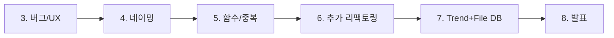
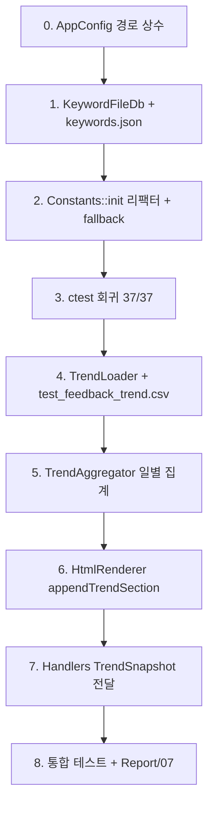

# 미션 7 설명
_Exported on 5/22/2026 at 13:58:35 GMT+9 from Cursor (3.4.20)_

---

**User**

미션 7을 설명해줘

---

**Cursor**

미션 7 관련 문서와 코드를 찾는 중입니다.


# 미션 7 설명

**미션 7**은 리팩토링 챌린지 8단계 중 **“기능 추가”** 단계입니다. 약 **3시간**을 배정하며, 미션 1~6(테스트·버그·네이밍·함수 분리·추가 리팩토링) 이후, **미션 8(팀 리뷰·발표)** 직전에 진행하는 것이 권장됩니다.

`.cursorrules`에도 현재 단계가 **7**로 표시되어 있고, **Trend / File DB는 사용자가 명시적으로 요청하기 전에는 구현하지 말 것**으로 제한되어 있습니다.

---

## 무엇을 하는 미션인가

`project_purpose.md` §6.1 7단계 기준으로 **두 가지 추가 요구사항**을 구현합니다.

| 항목 | 내용 |
|------|------|
| **① Trend 시각화** | 시간에 따른 피드백·감성 추이를 **볼 수 있게** 시각화 |
| **② File DB** | **감정 분석 필터(키워드)** 관리를 코드 하드코딩이 아닌 **파일 기반 DB**로 전환 |

README 체크리스트 표현:

- Trend 시각화 + File DB 연동
- 데이터 소스: **`test_feedback_trend.csv`** (아직 저장소에 **없음**, 추가 예정)

---

## 왜 이 단계에 두는가

- **미션 2~6**은 버그 수정·테스트·네이밍·긴 함수·핸들러 분리 등 **구조·품질** 중심입니다.
- **미션 7**은 그 위에 **새 기능(트렌드 차트, 키워드 외부화)** 을 얹는 단계입니다.
- 프로젝트 초기 명세(§2.1)에도 “분류 결과 **시각화**”가 있었지만, 현재 코드에는 Trend·DB가 **아직 없음**(`docs/analyzer.md` §9.5).

문서상 권장 순서:



---

## ① Trend 시각화 — 구체적으로

**목표:** CSV에 쌓인(또는 업로드된) 피드백 데이터를 **시간 축**으로 보여 주는 차트·그래프.

**데이터:** `test_feedback_trend.csv`  
- 저장소에는 **아직 파일이 없음** → 실습 시 추가하거나 직접 정의하는 전제입니다.
- 프롬프트 가이드(`Prompting/01_분석_prompt.md` §F)에서는 **날짜 컬럼 등 스키마**를 먼저 설계하라고 안내합니다 (예: `date`, `text`, 감성 등).

**UI 방식:**  
- React 등 프론트 재작성은 **금지** (`.cursorrules`).
- 기존 **서버 사이드 HTML**(`HtmlRenderer` 등)에 차트 섹션을 넣는 방식이 맞습니다 (인라인 SVG, `<canvas>`, 간단한 JS 등).

**연관 이슈:**  
- README: “대량 데이터·Trend는 미션 7” — 지금은 단건 분석·필터 위주이고, **시계열·대량 집계 UI는 M7 범위**입니다.

---

## ② File DB — 구체적으로

**목표:** 감정·카테고리 **키워드 사전**을 `Constants`의 하드코딩에서 벗겨 **파일에서 읽고 관리**할 수 있게 합니다.

**현재 코드 상태:**

- 키워드는 `Constants::SENTIMENT_KEYWORDS`, `Constants::CATEGORY_KEYWORDS`에 **맵으로 하드코딩** (`Constants.h`).
- 미션 4에서 `Filters` 쪽 중복 `S_KEYWORDS`는 제거했고, 감정 분류는 `SentimentClassifier` **단일 경로**입니다.
- **File DB = “키워드 단일 소스를 파일로”** 하는 것이 P3 로드맵과 맞습니다 (`docs/analyzer.md` §11).

**구현 형태(팀·문서에서 자주 언급):**

- Report 06: **`keywords.json`** 같은 File DB
- 목표 구조 예: `src/cpp/infra/FileDb` (`docs/analyzer.md` §11.1)

**영향 범위:**

- `Constants::init()`, `SentimentClassifier`, `TextAnalyzer`, `Filters`, (필요 시) UI의 필터 옵션
- **하위 호환:** 파일이 없을 때 기존 `Constants` fallback 여부는 설계 선택

**`FileHandler`와의 관계:**

- `FileHandler.h`는 **죽은 코드(Lava Flow)** — `main.cpp`에만 선언, 실제 저장 없음:

```7:17:c:\DEV\FeedbackAnalyzer_11\src\cpp\FileHandler.h
class FileHandler {
public:
    void saveResult(const std::vector<Feedback>& data) {
        std::cout << "saveResult" << data.size() << std::endl;
        // ...
    }
    void save(const std::vector<Feedback>& data) {
        saveResult(data);
    }
};
```

- 미션 7에서 **제거할지, CSV/키워드 저장에 연동할지**는 **사용자에게 확인 후** 진행 (`.cursorrules`, 여러 프롬프트 문서).

---

## 미션 7에서 하지 않는 것

- `httplib.h` 수정, `build/` 커밋
- 전체 아키텍처 재설계
- React 등 프론트 재작성
- 미션 7 없이 Trend/DB를 “미리” 넣는 것 (규칙상 금지)

미션 6 범위(핸들러 `handlers/` 분리 등)와 **겹치지 않게** M7은 **기능 추가**에만 집중하는 것이 문서상 경계입니다.

---

## 완료를 어떻게 보면 좋은가 (실무적 AC)

문서에 세부 AC 파일은 없지만, 다음을 기준으로 삼을 수 있습니다.

1. **Trend:** `test_feedback_trend.csv`(또는 동등 데이터)를 읽어 대시보드에 **기간별 추이**가 보인다.
2. **File DB:** 감정(·카테고리) 키워드를 **파일에서 로드**하고, 분석·필터가 그 규칙을 쓴다 (`classifySentiment` 등 **기존 동작 계약** 유지).
3. **회귀:** 기존 `ctest` **37/37** 및 미션 3 완료 기준(중립 필터 일치, 페이지 로그, 멀티라인)이 깨지지 않는다.
4. **CMake:** 새 `.cpp`/테스트 추가 시 `CMakeLists.txt` 반영.

---

## 현재 프로젝트 진행 상황과의 관계

README 기준:

| 미션 | 상태 |
|------|------|
| 2~5 | **완료** (테스트 37 Pass, `HtmlRenderer`, 핸들러 분리 등) |
| 6 | 예정(팀 자율 리팩토링 1건) — Report 06은 `handlers/` 분리 **완료** 보고 |
| **7** | **예정** — Trend + File DB |
| 8 | 팀 리뷰·발표 |

즉, **미션 7은 아직 구현 전**이며, 구조(M5·M6)는 Trend/DB 넣기 좋게 나뉜 상태(`handlers/`, `HtmlRenderer`)입니다.

---

## 작업 시 참고할 문서·프롬프트

| 자료 | 용도 |
|------|------|
| `project_purpose.md` §6.1 (7단계) | 공식 스펙 |
| `docs/analyzer.md` §9.5, §10, §11 | 이슈·로드맵·`FileDb` 구조 예 |
| `Prompting/01_분석_prompt.md` §F | Trend+DB **설계 전용** 프롬프트 |
| `README.md` 미션 체크리스트 | 완료 항목 |

---

**한 줄 요약:** 미션 7은 **3시간짜리 기능 확장**으로, **`test_feedback_trend.csv` 기반 Trend 차트**와 **감정·필터 키워드의 File DB화**를 구현하는 단계이며, 리팩토링·테스트가 끝난 뒤에 하고, 명시적 요청 없이는 Agent가 먼저 손대지 않도록 규칙이 잡혀 있습니다.

구현 설계(스키마, 클래스/API, 작업 순서)까지 필요하면 Agent 모드에서 §F 프롬프트 형태로 이어갈 수 있습니다.

---

**User**

미션 7을 수행할 수 있는 프롬프트를 추천해줘

---

**Cursor**

미션 7용 프롬프트를 정확히 추천하기 위해 기존 프롬프트 템플릿과 현재 코드 구조를 확인합니다.


저장소에는 **미션 7 전용 `Prompting/07_*.md`는 아직 없고**, `Prompting/01_분석_prompt.md` §F만 있습니다. 아래는 **현재 코드베이스**(M5 `HtmlRenderer`, M6 `handlers/`, `ctest` 37건, `SentimentClassifier` 단일화)에 맞춘 **실행용 프롬프트**입니다.

---

## 사용 팁

| 모드 | 용도 |
|------|------|
| **Ask** | 설계·스키마·영향 범위만 (코드 수정 없음) |
| **Agent** | 실제 구현·테스트·빌드 |

**파일 참조** (맥락 정확도 ↑):

```
@.cursorrules @project_purpose.md @docs/analyzer.md
@src/cpp/Constants.cpp @src/cpp/SentimentClassifier.h
@src/cpp/HtmlRenderer.h @src/cpp/handlers/Handlers.cpp
@CMakeLists.txt @tests/
```

**권장 순서:** File DB → Trend (키워드 로드가 안정된 뒤 차트가 의미 있음). 한 번에 하려면 **프롬프트 D** 사용.

**FileHandler:** 연동 vs 유지 — 프롬프트에 **명시**하세요 (규칙상 Agent가 임의로 제거하지 않음).

---

## A. 설계만 (Ask 모드) — 먼저 15분

`01_분석_prompt.md` §F 확장판입니다.

```
@project_purpose.md @docs/analyzer.md @.cursorrules
@src/cpp/Constants.cpp @src/cpp/HtmlRenderer.h @src/cpp/handlers/Handlers.cpp

미션 7(Trend 시각화 + 감정 필터 File DB) 구현 설계만 해줘. 코드 수정 금지.

[1] test_feedback_trend.csv
- 권장 컬럼( date, text, sentiment 등 ), 샘플 5행
- 기존 업로드 CSV(text만)와의 관계

[2] Trend UI
- HtmlRenderer::renderPage에 섹션 추가 vs 별도 appendTrendSection
- 서버사이드 HTML만 (React 금지). 차트 방식 1안 추천(SVG/table/canvas+인라인 JS)

[3] File DB
- keywords.json 스키마 (SENTIMENT_KEYWORDS + CATEGORY_KEYWORDS 매핑)
- 로드 시점(main vs Constants::init), 파일 없을 때 fallback(기존 Constants 하드코딩)
- SentimentClassifier / TextAnalyzer / Filters / Handlers 영향 파일 목록

[4] FileHandler
- 연동(저장) vs Lava Flow 유지 — 각각 장단점 3줄

[5] Agent 구현 순서: 단계별(테스트 포함), 예상 신규 파일 경로(infra/FileDb 등)

표 + mermaid 1개. 한국어.
```

---

## B. File DB만 (Agent) — 1차 구현 (~1.5h)

```
@.cursorrules @project_purpose.md @docs/analyzer.md
@src/cpp/Constants.cpp @src/cpp/Constants.h @src/cpp/SentimentClassifier.cpp
@CMakeLists.txt @tests/text_analyzer_test.cpp @tests/regression_neutral_filter_test.cpp

미션 7 — 1단계: 감정·카테고리 키워드 File DB만 구현해줘. Trend는 이번에 하지 마.

## 목표
- data/keywords.json (또는 동등 경로)에 현재 Constants와 동일한 키워드 이전
- 시작 시 JSON 로드 → Constants 맵 채움
- 파일 없거나 파싱 실패 시 기존 Constants.cpp 하드코딩 fallback

## 제약
- SentimentClassifier::classifySentiment 규칙·시그니처 변경 금지
- filterFeedbacks / countSentiments / countKeywords 동작 계약 유지
- httplib.h, build/ 커밋 금지
- React/프론트 재작성 금지
- FileHandler: [선택: 유지 | saveResult로 keywords 백업 연동] ← 여기 채우기
- Trend, test_feedback_trend.csv, HtmlRenderer 차트 금지

## 작업
1. FileDb(또는 KeywordRepository) 클래스 추가, CMake 반영
2. Constants::init()에서 FileDb 로드 후 맵 설정
3. 단위 테스트: JSON 로드 성공, fallback, 기존 REG 중립 4건·F/S/K 테스트 Pass

## 완료 기준
- ctest 37/37 Pass (신규 테스트 추가 가능)
- keywords.json 수정 시 재시작 후 분류 결과가 JSON과 일치(간단 검증 방법 문서화)

구현 후 변경 파일 목록과 keywords.json 예시를 요약해줘.
```

---

## C. Trend만 (Agent) — 2차 구현 (~1.5h)

File DB가 끝난 뒤 사용하세요.

```
@.cursorrules @project_purpose.md
@src/cpp/HtmlRenderer.cpp @src/cpp/HtmlRenderer.h
@src/cpp/handlers/Handlers.cpp @src/cpp/ParseUtils.h
@tests/parse_utils_test.cpp

미션 7 — 2단계: Trend 시각화만 구현해줘. File DB/Constants 로직은 건드리지 마.

## 목표
- test_feedback_trend.csv 추가(프로젝트 루트 또는 data/)
- CSV: date(또는 timestamp), text 필수; 필요 시 sentiment 컬럼
- 대시보드에 기간별 피드백 건수 또는 긍정/부정/중립 추이 표시
- GET / 또는 analyze/upload 후 세션 피드백 + trend CSV 병합 집계 중 1안 — 설계에 맞게 최소 구현

## UI
- HtmlRenderer에 Trend 섹션 추가(appendTrendChart 등 Extract Function)
- 서버사이드 HTML, u8"..." UTF-8 유지
- 인라인 JS/SVG 허용, React 금지

## 제약
- classifySentiment·filter API 변경 금지
- httplib.h 수정 금지
- /upload 분석 생략·fil_data 잔존 등 M3 밖 버그 일괄 수정 금지

## 테스트
- Trend CSV 파싱 단위 테스트 2건 이상
- ctest 전체 Pass

## 완료 기준
- localhost:8080에서 trend 차트(또는 표)가 보임
- test_feedback_trend.csv 샘플로 재현 가능

스크린샷 대신 수동 검증 체크리스트 5줄 작성해줘.
```

---

## D. 올인원 (Agent) — 3시간 한 세션

```
@.cursorrules @project_purpose.md @docs/analyzer.md @README.md
@src/cpp/Constants.cpp @src/cpp/SentimentClassifier.h
@src/cpp/HtmlRenderer.h @src/cpp/handlers/Handlers.cpp @CMakeLists.txt @tests/

미션 7 전체를 구현해줘: (1) Trend 시각화 test_feedback_trend.csv (2) 감정·카테고리 키워드 File DB.

## 범위
- data/keywords.json + FileDb 로드, Constants fallback
- test_feedback_trend.csv + TrendAggregator + HtmlRenderer Trend 섹션
- FileHandler: [유지 | keywords/trend CSV 저장 연동] — 명시한 쪽만

## 절대 금지
- httplib.h, build/ 커밋, React, SentimentClassifier 규칙 변경
- M3 외 버그(/upload 분석, fil_data) 일괄 수정
- handlers/ 대규모 재구조(파일 5개 분할 등)

## 완료 기준 (AC)
1. keywords.json 수정 → 재시작 후 감성 분류 반영
2. trend CSV로 기간별 추이 UI 표시
3. 「중립」필터 = countSentiments 중립 집계 (기존 REG Pass)
4. Logger 페이지·멀티라인·CSV escape 유지
5. ctest 37/37+ Pass

## 산출물
- Report/07_Feature_Trend_FileDB.md (변경 요약, AC 표, 검증 방법)
- README 미션 7 체크 [x]

단계: 설계 5줄 → File DB → Trend → 테스트 → 보고서. 각 단계 후 ctest.
```

---

## E. 테스트·회귀 전용 (Agent, 마무리)

```
@tests/ @tests/fixtures/golden_master.json @docs/golden_master.md

미션 7 구현 후 회귀만 점검해줘. 기능 추가는 하지 마.

- ctest --output-on-failure 전체 Pass
- regression_neutral_filter 4건, filters/text_analyzer/parse_utils
- FileDb: JSON 정상/깨진 파일/fallback 3케이스
- Trend: 날짜 파싱 엣지(빈 줄, 잘못된 date) 2케이스

실패 시 최소 수정만. classifySentiment 로직 변경 금지.
```

---

## F. Ask — Trend만 / File DB만 쪼개기

**Trend 설계만:**
```
미션 7 Trend만 설계. test_feedback_trend.csv 스키마, HtmlRenderer 연동점, 핸들러에서 언제 집계할지. 코드 수정 없음. @HtmlRenderer.h @handlers/Handlers.cpp
```

**File DB 설계만:**
```
미션 7 File DB만 설계. keywords.json vs SQLite 비교 후 1안. Constants::init 영향. fallback 전략. 코드 수정 없음. @Constants.cpp @SentimentClassifier.h
```

---

## G. 보고서·발표 준비 (Ask/Agent)

```
미션 7 완료 보고서 Report/07_Feature_Trend_FileDB.md 초안을 작성해줘.

포함: 목표, AC 표(5항), 변경 파일, keywords.json/trend CSV 예시, ctest 결과, M3 회귀 확인, Known limitations, M8 발표용 Before/After 1페이지 요약.

@Report/06_Refactoring_handlers.md 형식을 따를 것.
```

---

## 프롬프트 선택 가이드

| 상황 | 추천 |
|------|------|
| 처음 미션 7 | **A → B → C → E** |
| 설계 이미 있음 | **B → C** 또는 **D** |
| 시간 부족 | **B**(File DB)만 먼저 — README P3와 직결 |
| 리뷰·문서만 | **G** |

---

## 프롬프트에 꼭 넣을 한 줄 (실수 방지)

```
현재 미션: 7. 미션 7만 수행. M6 handlers 구조는 유지. ctest 37/37 Pass가 완료 기준.
```

Agent 모드에서 **B 또는 D**를 붙여넣으면 바로 구현을 시작할 수 있습니다. `FileHandler`를 **연동할지 유지할지**만 프롬프트의 `[선택]` 부분을 미리 정해 두세요.

---

**User**

@project_purpose.md @docs/analyzer.md @.cursorrules
@src/cpp/Constants.cpp @src/cpp/HtmlRenderer.h @src/cpp/handlers/Handlers.cpp

미션 7(Trend 시각화 + 감정 필터 File DB) 구현 설계만 해줘. 코드 수정 금지.

[1] test_feedback_trend.csv
- 권장 컬럼( date, text, sentiment 등 ), 샘플 5행
- 기존 업로드 CSV(text만)와의 관계

[2] Trend UI
- HtmlRenderer::renderPage에 섹션 추가 vs 별도 appendTrendSection
- 서버사이드 HTML만 (React 금지). 차트 방식 1안 추천(SVG/table/canvas+인라인 JS)

[3] File DB
- keywords.json 스키마 (SENTIMENT_KEYWORDS + CATEGORY_KEYWORDS 매핑)
- 로드 시점(main vs Constants::init), 파일 없을 때 fallback(기존 Constants 하드코딩)
- SentimentClassifier / TextAnalyzer / Filters / Handlers 영향 파일 목록

[4] FileHandler
- 연동(저장) vs Lava Flow 유지 — 각각 장단점 3줄

[5] Agent 구현 순서: 단계별(테스트 포함), 예상 신규 파일 경로(infra/FileDb 등)

표 + mermaid 1개. 한국어.

---

**Cursor**

요청하신 파일들을 읽고 현재 구조에 맞춘 미션 7 설계안을 작성합니다.


# 미션 7 구현 설계 (Trend + File DB)

코드 수정 없이, 현재 구조(`main` → `Constants::init()` → `handlers/` → `HtmlRenderer::renderPage`, `SentimentClassifier` → `Constants`)를 기준으로 한 설계안입니다.

---

## 설계 원칙 (`.cursorrules` / `docs/analyzer.md`)

| 원칙 | 설계 반영 |
|------|-----------|
| `classifySentiment` 규칙 유지 | 키워드만 `Constants` 맵 소스 변경, 분기 로직은 그대로 |
| 서버 사이드 HTML | `HtmlRenderer`에 Trend 섹션 추가, React 금지 |
| 최소 침습 | `renderPage` 시그니처 확장 + `appendTrendSection` Extract |
| `ctest` 37/37+ | File DB·Trend 파싱 단위 테스트 추가 |
| `FileHandler` | 사용자 선택 전제 — 본 설계는 **Phase 2 선택**으로 분리 |

---

## [1] `test_feedback_trend.csv`

### 권장 컬럼

| 컬럼 | 필수 | 형식 | 용도 |
|------|------|------|------|
| `date` | ✅ | `YYYY-MM-DD` | 일별 집계 키 |
| `text` | ✅ | UTF-8 문자열 | `classifySentiment` 입력 |
| `sentiment` | ❌ | `긍정` / `부정` / `중립` / 빈값 | 있으면 검증·오버레이용; **없으면 런타임 분류** |

- 헤더 1행 필수. 본문은 `ParseUtils::parseCsvLine` 재사용.
- `sentiment`가 비어 있거나 잘못되면 → `SentimentClassifier::classifySentiment(text)` 결과 사용 (M3 계약 유지).

### 샘플 5행

```csv
date,text,sentiment
2025-05-01,배송이 빨라서 만족합니다,긍정
2025-05-01,품질이 별로예요 실망,
2025-05-02,가격이 비싸요 불만,부정
2025-05-02,사용법이 어렵지만 괜찮아요,
2025-05-03,고객서비스 응대가 친절했습니다,긍정
```

### 기존 업로드 CSV(`text`만)와의 관계

| 구분 | 업로드 CSV (`/upload`) | Trend CSV (`test_feedback_trend.csv`) |
|------|------------------------|----------------------------------------|
| 목적 | 세션 피드백 **입력** | **시계열 추이** 표시용 기준 데이터 |
| 파싱 | 1행 스킵 후 **첫 컬럼만** `Feedback` | 헤더 인식, `date`+`text` (+선택 `sentiment`) |
| 시점 | 사용자 업로드 시 | 서버 기동 시 1회 로드 (권장) |
| 분석 | `/upload`는 통계 없음 (현행 유지) | Trend 집계 전용 |
| 병합 | **1단계(필수): 분리** — 차트는 trend 파일만 | **2단계(선택):** `/analyze` 후 오늘 날짜로 세션 건을 trend에 합산 |

**권장:** 미션 7 MVP는 **Trend CSV 단독 차트**. 세션 병합은 시간 여유 시 추가.

**파일 위치:** `data/test_feedback_trend.csv` (실행 파일은 `build/`에서 뜨므로 `AppConfig`에 상대 경로 2후보: `data/...`, `../data/...`).

---

## [2] Trend UI

### `renderPage` 확장 vs `appendTrendSection`

| 방식 | 장점 | 단점 |
|------|------|------|
| `renderPage` 본문에 인라인 | 변경 파일 1개 | M5 `append*` 패턴 훼손, 파라미터 비대 |
| **`appendTrendSection` + `renderPage`에서 호출** ✅ | M5와 동일 SRP, 테스트·스타일 분리 | 시그니처 1개 추가 |

**추천:** `HtmlRenderer`에 private `appendTrendSection(html, const TrendSnapshot&)` 추가.  
`renderPage`는 선택 인자 또는 오버로드로 Trend 데이터를 받음.

```cpp
// 설계안 (시그니처 예시 — 구현 시)
struct TrendDayRow {
    std::string date;           // "2025-05-01"
    int positive{0}, neutral{0}, negative{0}, total{0};
};
struct TrendSnapshot {
    std::vector<TrendDayRow> byDay;
};

static std::string renderPage(..., const TrendSnapshot* trend = nullptr);
// trend != nullptr && !byDay.empty() 일 때만 appendTrendSection
```

`Handlers`: `handleGetRoot`, `handlePostAnalyze`(통계 있을 때)에서 동일 `TrendSnapshot` 전달.

### 차트 방식 1안 추천

| 방식 | 채택 | 이유 |
|------|------|------|
| **HTML `<table>` + CSS 막대** ✅ | **1안** | 의존성 없음, UTF-8·접근성, `escapeHtml` 재사용, 단위 테스트는 `TrendAggregator`만 |
| 인라인 SVG 막대 | 2안 | 시각적으로 낫지만 문자열 생성 복잡 |
| canvas + 인라인 JS | 비추천 | CSP·인코딩·테스트 어려움 |

**UI 배치:** `appendStatsSection` **위**에 `<div class="section"><h3>감성 추이 (Trend)</h3>…`  
각 `date` 행: 날짜 | 총건수 | 긍정/중립/부정 막대(`.trend-bar-*`).

---

## [3] File DB (`keywords.json`)

### 스키마 (현 `Constants` 맵과 1:1)

```json
{
  "version": 1,
  "sentiment": {
    "긍정": ["좋아요", "만족", "감사"],
    "부정": ["나쁘", "불만", "실망"]
  },
  "category": {
    "배송": {
      "main": ["배송", "택배"],
      "time": ["배송지연", "배송시간"]
    },
    "품질": { "main": ["품질", "재질"] }
  }
}
```

- `sentiment` → `Constants::SENTIMENT_KEYWORDS`
- `category` → `Constants::CATEGORY_KEYWORDS` (2단계 map)
- `version`: 향후 스키마 변경용

### 로드 시점

| 시점 | 권장 |
|------|------|
| **`Constants::init()` 내부** ✅ | `main()` 변경 최소, 테스트 타깃도 `Constants::init()` 호출로 동일 |
| `main()` 직접 | 가능하나 init 분산 |

**흐름:**

```
Constants::init()
  → KeywordFileDb::load("data/keywords.json")
  → 성공: 맵 채움
  → 실패: initDefaultFromCpp()  // 현 Constants.cpp 내용을 함수로 추출
```

- 파서: **의존성 없이** 최소 JSON 파서 또는 nlohmann/json 1헤더 (팀 정책). 교육용은 **단순 키·배열 파서**도 가능.
- **런타임 reload API는 M7 범위 밖** (필요 시 M7+).

### 영향 파일 목록

| 파일 | 변경 수준 | 내용 |
|------|-----------|------|
| `Constants.cpp` / `Constants.h` | **핵심** | `init()` → FileDb + fallback |
| `infra/KeywordFileDb.cpp` (신규) | **핵심** | JSON 읽기 → 맵 반환 |
| `AppConfig.h` | 소 | `kKeywordsPath`, `kTrendCsvPath` |
| `SentimentClassifier.cpp` | **없음~최소** | 계속 `Constants::SENTIMENT_KEYWORDS` 참조 |
| `TextAnalyzer.cpp` | **없음** | `Constants` / `classifySentiment` 경유 |
| `Filters.cpp` | **없음** | `Constants::CATEGORY_KEYWORDS` 경유 |
| `handlers/Handlers.cpp` | 소 | Trend 스냅샷 전달만 |
| `HtmlRenderer.cpp` / `.h` | **핵심** | Trend 섹션 |
| `UIComponents.cpp` | 소(선택) | 카테고리 `<select>`를 `CATEGORY_KEYWORDS` 키와 동기화 |
| `main.cpp` | 소(선택) | `TrendLoader::loadAtStartup()` 1줄 |
| `CMakeLists.txt` | 필수 | 신규 `.cpp` + 테스트 |
| `tests/*_test.cpp` | 필수 | FileDb fallback, Trend 집계 |

**필터 UI와 DB:** 감정 옵션(긍정/중립/부정)은 고정 enum; **키워드 필터 옵션**은 `category` 최상위 키에서 생성하면 File DB 수정이 UI에 반영됨.

---

## [4] `FileHandler` — 연동 vs Lava Flow 유지

| 선택 | 장점 (3줄) | 단점 (3줄) |
|------|------------|------------|
| **연동** | `keywords.json` 백업·보내기로 “File DB” 스토리 일관 | 스텁→실저장 구현·경로·에러 처리 추가, M7 범위 확대 |
| | Trend 결과 CSV 덤프 등 데모 시연에 유리 | `main.cpp`의 `static FileHandler`가 실제 I/O 책임 가짐 |
| | Lava Flow 스멜 제거 가능 | 단위 테스트에 파일시스템 mock 필요 |
| **Lava Flow 유지** ✅ MVP | M7을 Trend+읽기 전용 DB에 집중, 3h 내 완료 용이 | `main.cpp` 미사용 include 잔존 |
| | 키워드는 **읽기 JSON**만으로 File DB 요구 충족 가능 | 교육 스펙 “FileHandler 구현” 기대와 어긋날 수 있음 |
| | 회귀·테스트 단순 | 저장 기능은 이후 미션/선택 과제로 남음 |

**설계 권장:** M7 MVP = **Lava Flow 유지** + `KeywordFileDb`가 JSON **읽기**.  
저장은 “미션 7+” 또는 사용자가 Agent 프롬프트에서 **연동 명시**할 때 `FileHandler::saveKeywords(const map&)` 정도만 추가.

---

## [5] Agent 구현 순서 (테스트 포함)



| 단계 | 작업 | 신규/수정 파일 | 테스트 |
|------|------|----------------|--------|
| 0 | `data/` 경로, UTF-8 BOM 정책 | `AppConfig.h` | — |
| 1 | `keywords.json` 생성(현 `Constants.cpp`와 동치) | `data/keywords.json` | `keyword_file_db_test.cpp` |
| 2 | `KeywordFileDb::load` → 맵 | `infra/KeywordFileDb.{h,cpp}` | JSON 정상/깨짐/없음 → fallback |
| 3 | `initDefaultFromCpp()` 추출, `init()` 분기 | `Constants.cpp` | 기존 REG·F·S·K Pass |
| 4 | — | — | `ctest` 전체 |
| 5 | Trend CSV 파싱·헤더 매핑 | `services/TrendLoader.{h,cpp}` | 날짜/빈행/잘못된 date |
| 6 | 일별 긍/중/부 집계 | `services/TrendAggregator.{h,cpp}` | 샘플 5행 기대값 |
| 7 | UI 섹션 | `HtmlRenderer.*` | 스냅샷 문자열에 날짜·건수 포함 (선택) |
| 8 | 기동 로드 + 렌더 전달 | `main.cpp`, `Handlers.cpp` | 수동: localhost 차트 표시 |
| 9 | 문서 | `Report/07_*.md`, `README` 체크 | — |

### 예상 신규 파일 경로

```
data/
├── keywords.json
└── test_feedback_trend.csv

src/cpp/
├── AppConfig.h                    (경로 상수 추가)
├── infra/
│   └── KeywordFileDb.h / .cpp
├── services/
│   ├── TrendLoader.h / .cpp
│   └── TrendAggregator.h / .cpp
└── (기존) Constants.cpp, HtmlRenderer.*, handlers/Handlers.cpp

tests/
├── keyword_file_db_test.cpp
└── trend_aggregator_test.cpp
```

`docs/analyzer.md` §11.1의 `infra/FileDb`는 **`KeywordFileDb`** 이름으로 구현해도 됨 (SQLite는 M7 필수 아님).

---

## 통합 데이터 흐름 (요약 표)

| 데이터 | 소스 | 소비자 | 갱신 |
|--------|------|--------|------|
| 키워드 | `keywords.json` → `Constants` | `SentimentClassifier`, `TextAnalyzer`, `Filters` | 서버 재시작 |
| 세션 피드백 | 폼/`/upload` | `Session`, analyze/filter | 요청마다 |
| Trend 시계열 | `test_feedback_trend.csv` | `TrendAggregator` → `HtmlRenderer` | 기동 시 1회 |

---

## 완료 기준 (AC) — Agent용

| # | 기준 |
|---|------|
| AC-1 | `keywords.json` 수정·재시작 후 분류 결과 변경 (fallback은 파일 삭제 시 기존과 동일) |
| AC-2 | 대시보드에 일별 긍/중/부 Trend 표시 (`test_feedback_trend.csv`) |
| AC-3 | `regression_neutral_filter` 등 M3 REG **Pass** |
| AC-4 | `ctest` **37/37 이상** Pass |
| AC-5 | `httplib.h` 미수정, React 미사용 |

---

## Agent 모드 1차 프롬프트 (설계 확정 후)

설계 **[1]~[5]** 그대로, **FileHandler = Lava Flow 유지**, **Trend = CSV 단독(MVP)**, **차트 = HTML table+CSS** 로 구현하라고 Agent에 지시하면 됩니다.

원하시면 다음 단계로 **B( File DB만 )** / **C( Trend만 )** 프롬프트를 이 설계에 맞춰 문장 단위로 다시 적어 드리겠습니다.

---

**User**


@.cursorrules @project_purpose.md @docs/analyzer.md
@src/cpp/Constants.cpp @src/cpp/Constants.h @src/cpp/SentimentClassifier.cpp
@CMakeLists.txt @tests/text_analyzer_test.cpp @tests/regression_neutral_filter_test.cpp

미션 7 — 1단계: 감정·카테고리 키워드 File DB만 구현해줘. Trend는 이번에 하지 마.

## 목표
- data/keywords.json (또는 동등 경로)에 현재 Constants와 동일한 키워드 이전
- 시작 시 JSON 로드 → Constants 맵 채움
- 파일 없거나 파싱 실패 시 기존 Constants.cpp 하드코딩 fallback

## 제약
- SentimentClassifier::classifySentiment 규칙·시그니처 변경 금지
- filterFeedbacks / countSentiments / countKeywords 동작 계약 유지
- httplib.h, build/ 커밋 금지
- React/프론트 재작성 금지
- FileHandler: [선택: 유지 | saveResult로 keywords 백업 연동] ← 여기 채우기
- Trend, test_feedback_trend.csv, HtmlRenderer 차트 금지

## 작업
1. FileDb(또는 KeywordRepository) 클래스 추가, CMake 반영
2. Constants::init()에서 FileDb 로드 후 맵 설정
3. 단위 테스트: JSON 로드 성공, fallback, 기존 REG 중립 4건·F/S/K 테스트 Pass

## 완료 기준
- ctest 37/37 Pass (신규 테스트 추가 가능)
- keywords.json 수정 시 재시작 후 분류 결과가 JSON과 일치(간단 검증 방법 문서화)

구현 후 변경 파일 목록과 keywords.json 예시를 요약해줘.

---

**Cursor**

미션 7 1단계(File DB) 구현을 시작합니다. 현재 코드와 테스트 구조를 확인합니다.


KeywordFileDb와 `keywords.json`을 추가하고 `Constants::init()`을 리팩터링합니다.


Windows에서 `PROJECT_ROOT` 경로의 백슬래시 이스케이프 문제를 수정 중입니다.


Windows에서 절대 경로·UTF-8 파일 처리 문제를 수정하고, 픽스처 파일을 UTF-8로 다시 작성합니다.


JSON 파서 버그를 피하기 위해 `nlohmann/json`으로 전환합니다.


미션 7 **1단계(File DB)** 구현을 마쳤습니다. **ctest 45/45 Pass** (기존 37 + 신규 8).

## 구현 요약

| 항목 | 내용 |
|------|------|
| **File DB** | `data/keywords.json` → `KeywordFileDb` → `Constants::init()` |
| **Fallback** | 파일 없음/JSON 오류 시 `Constants.cpp` 하드코딩(`initDefaults`) |
| **FileHandler** | **Lava Flow 유지** (연동 없음) |
| **Trend** | 미구현 (요청대로 제외) |
| **JSON 파서** | `nlohmann/json` (FetchContent 3.11.3) |

### 동작 흐름

1. `main()` → `Constants::init()`
2. 검색 경로 순서: `PROJECT_ROOT/data/keywords.json` → `data/keywords.json` → `../data/keywords.json`
3. 로드·검증 성공 시 맵 채움, 실패 시 `initDefaults()`

`SentimentClassifier`, `filterFeedbacks`, `countSentiments`, `countKeywords`는 계속 `Constants` 맵만 참조합니다.

---

## 변경 파일

| 파일 | 변경 |
|------|------|
| `data/keywords.json` | **신규** — 기존 키워드 전체 |
| `src/cpp/infra/KeywordFileDb.h` | **신규** |
| `src/cpp/infra/KeywordFileDb.cpp` | **신규** |
| `src/cpp/Constants.cpp` | File DB 로드 + fallback |
| `src/cpp/AppConfig.h` | 상대 경로 상수 |
| `CMakeLists.txt` | `KeywordFileDb.cpp`, `nlohmann_json`, `PROJECT_ROOT` |
| `tests/keyword_file_db_test.cpp` | **신규** (8 테스트) |
| `tests/fixtures/keywords_minimal.json` | **신규** |
| `tests/fixtures/keywords_invalid.json` | **신규** |
| `README.md` | M7-1 완료·검증 방법 |

---

## `keywords.json` 예시 (일부)

```json
{
  "version": 1,
  "sentiment": {
    "긍정": ["좋아요", "만족", "감사", "최고", "..."],
    "부정": ["나쁘", "불만", "실망", "환불", "..."]
  },
  "category": {
    "배송": {
      "main": ["배송", "택배", "배달", "물류"],
      "time": ["배송지연", "배송시간", "퀵"]
    },
    "품질": { "main": ["품질", "재질", "..."], "...": "..." }
  }
}
```

전체 내용은 `data/keywords.json`에 있습니다.

---

## keywords.json 검증 방법 (README 동일)

1. `data/keywords.json`의 `sentiment.긍정` 맨 앞에 `"MISSION7_TEST"` 추가
2. 서버 재시작: `build\feedback_analyzer.exe`
3. textarea에 `MISSION7_TEST` 입력 → 분석 → **긍정** 집계 확인
4. 원복 후 재시작

파일을 삭제하거나 JSON을 깨뜨리면 fallback(하드코딩)으로 동작합니다.

---

## 테스트

- `KeywordFileDbTest` 6건: 로드·fallback·validate
- `ConstantsKeywordInitTest` 2건: init·classify 연동
- 기존 REG/F/S/K **37건 유지 Pass**

다음 단계는 **미션 7-2(Trend)** 프롬프트 C로 진행하면 됩니다.

---

**User**


@.cursorrules @project_purpose.md
@src/cpp/HtmlRenderer.cpp @src/cpp/HtmlRenderer.h
@src/cpp/handlers/Handlers.cpp @src/cpp/ParseUtils.h
@tests/parse_utils_test.cpp

미션 7 — 2단계: Trend 시각화만 구현해줘. File DB/Constants 로직은 건드리지 마.

## 목표
- test_feedback_trend.csv 추가(프로젝트 루트 또는 data/)
- CSV: date(또는 timestamp), text 필수; 필요 시 sentiment 컬럼
- 대시보드에 기간별 피드백 건수 또는 긍정/부정/중립 추이 표시
- GET / 또는 analyze/upload 후 세션 피드백 + trend CSV 병합 집계 중 1안 — 설계에 맞게 최소 구현

## UI
- HtmlRenderer에 Trend 섹션 추가(appendTrendChart 등 Extract Function)
- 서버사이드 HTML, u8"..." UTF-8 유지
- 인라인 JS/SVG 허용, React 금지

## 제약
- classifySentiment·filter API 변경 금지
- httplib.h 수정 금지
- /upload 분석 생략·fil_data 잔존 등 M3 밖 버그 일괄 수정 금지

## 테스트
- Trend CSV 파싱 단위 테스트 2건 이상
- ctest 전체 Pass

## 완료 기준
- localhost:8080에서 trend 차트(또는 표)가 보임
- test_feedback_trend.csv 샘플로 재현 가능

스크린샷 대신 수동 검증 체크리스트 5줄 작성해줘.

---

**Cursor**

미션 7 2단계(Trend 시각화) 구현을 위해 현재 코드 구조를 확인합니다.


Trend 로더·집계·UI를 구현합니다.


미션 7 **2단계(Trend 시각화)** 구현을 완료했습니다. **ctest 49/49 Pass**. File DB / `Constants` 는 변경하지 않았습니다.

## 구현 요약

| 항목 | 내용 |
|------|------|
| **데이터** | `data/test_feedback_trend.csv` (date, text, sentiment) |
| **로드** | 서버 기동 시 `TrendStore::loadAtStartup()` (MVP: CSV 단독, 세션 병합 없음) |
| **집계** | `TrendAggregator` → 일별 긍정/중립/부정 (`classifySentiment` 사용) |
| **UI** | `HtmlRenderer::appendTrendSection` — HTML 표 + CSS 막대 |

### 페이지 배치

필터 섹션 아래, **분석 결과** 위에 **「감성 추이 (Trend)」** 표시.

---

## 변경 파일

| 파일 | 역할 |
|------|------|
| `data/test_feedback_trend.csv` | 샘플 시계열 (9건, 5일) |
| `src/cpp/services/TrendTypes.h` | `TrendRecord`, `TrendDayRow`, `TrendSnapshot` |
| `src/cpp/services/TrendLoader.*` | CSV 파싱 (헤더 `date`/`timestamp`, `text`, `sentiment`) |
| `src/cpp/services/TrendAggregator.*` | 일별 집계 |
| `src/cpp/services/TrendStore.*` | 기동 시 로드·전역 스냅샷 |
| `src/cpp/HtmlRenderer.*` | Trend 표·막대 UI |
| `src/cpp/handlers/Handlers.cpp` | 모든 `renderPage`에 `TrendStore::getSnapshot()` 전달 |
| `src/cpp/main.cpp` | `TrendStore::loadAtStartup()` |
| `src/cpp/AppConfig.h` | Trend CSV 경로 상수 |
| `tests/trend_loader_test.cpp` | 단위 테스트 4건 |
| `tests/fixtures/trend_sample.csv` | 테스트용 CSV |
| `CMakeLists.txt`, `README.md` | 빌드·검증 문서 |

---

## 수동 검증 체크리스트 (5줄)

1. `cmake --build build` 후 `build\feedback_analyzer.exe` 실행 → `http://localhost:8080` 접속한다.
2. **「감성 추이 (Trend)」** 섹션과 일별 표(날짜·총 건수·긍/중/부·색 막대)가 보이는지 확인한다.
3. `2025-05-01` 행이 **총 2건**(긍정 1 + 중립/부정 1)으로 `data/test_feedback_trend.csv`와 맞는지 확인한다.
4. `2025-05-05` 행(부정 1건)까지 **5일치** 날짜가 표에 나오는지 확인한다.
5. `data/test_feedback_trend.csv`를 잠시 다른 이름으로 바꾸고 서버를 재시작하면 Trend 섹션이 사라지는지 확인한 뒤, 파일명을 되돌린다.

---

## `test_feedback_trend.csv` 예시

```csv
date,text,sentiment
2025-05-01,배송이 빨라서 만족합니다,긍정
2025-05-01,품질이 별로예요 실망,
2025-05-02,가격이 비싸요 불만,부정
...
```

`sentiment`가 비어 있으면 `SentimentClassifier::classifySentiment(text)`로 분류합니다.

---

**User**

Report에 07_Feature.md로 보고서 작성해줘

---

**Cursor**

기존 Report 형식과 미션 7 구현 내용을 확인한 뒤 보고서를 작성합니다.


`Report/07_Feature.md` 보고서를 작성했습니다. 기존 `05`·`06` Report와 같은 형식입니다.

## 문서 위치

[Report/07_Feature.md](Report/07_Feature.md)

## 포함 내용

| 섹션 | 내용 |
|------|------|
| **§1 개요** | M7-1 File DB + M7-2 Trend, `ctest` 49/49 |
| **§2~3** | 미션 정의, M6 경계, AC 10항목 |
| **§4** | `keywords.json` 스키마·로드 흐름·검증 |
| **§5** | Trend CSV·모듈·UI·수동 체크리스트 5줄 |
| **§6~7** | 디렉터리·신규/수정 파일 목록 |
| **§8** | 빌드·ctest 결과·회귀 |
| **§9~10** | mermaid 아키텍처, BAD/GOOD 예시 |
| **§11~13** | 완료 체크리스트, M8 다음 단계, 참고 문서 |

**의도적 미수행**도 명시했습니다: `FileHandler` Lava Flow 유지, Trend 세션 병합 없음(MVP CSV 단독).

README 보고서 목록에 링크를 추가하려면 말씀해 주세요.

