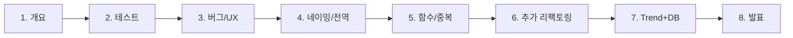

# 미션 8 설명
_Exported on 5/22/2026 at 14:06:50 GMT+9 from Cursor (3.4.20)_

---

**User**

미션 8을 설명해줘

---

**Cursor**

미션 8 관련 문서를 찾아 내용을 정리합니다.


**미션 8**은 Feedback Analyzer 11 **8단계 리팩토링 챌린지의 마지막 단계**로, 코드를 더 고치기보다 **팀 리뷰·발표**에 쓰는 **2시간**짜리 활동입니다.

## 위치와 목적

전체 흐름은 다음과 같습니다.



- **미션 1~7**: 분석·테스트·버그 수정·리팩토링·기능 추가(Trend, File DB)
- **미션 8**: 그 결과를 **정리·공유·리뷰**하는 단계

`project_purpose.md` 기준 핵심은 두 가지입니다.

1. **상대방(또는 다른 팀) 프로젝트 리뷰** — 장단점 정리  
2. **랜덤 발표** — 팀이 개선 내용을 발표

## 무엇을 하면 되는지

| 항목 | 내용 |
|------|------|
| **시간** | 약 **2시간** |
| **성격** | 코딩 미션이 아니라 **문서·발표 준비** |
| **주요 산출물** | 리뷰 문서, 발표 자료(슬라이드 요약 등) |

`Prompting/01_분석_prompt.md`의 **「팀 리뷰·발표용」** 프롬프트가 구체적인 가이드입니다. 예를 들면:

- **장점 5 / 단점 5** (각각 근거가 되는 코드 위치)
- **개선 제안 3** (코드 위치 포함)
- **리팩토링 전/후 비교** 1페이지 요약(한국어, 슬라이드용)
- **다른 팀과 비교할 때 물어볼 질문 5개**
- **발표 5분** 기준 스크립트 아웃라인

외부 리뷰어 관점에서 프로젝트를 평가하고, 미션 2~7에서 한 변경(테스트, 중립 필터, `HtmlRenderer`, Trend, `keywords.json` 등)을 **왜·어떻게** 바꿨는지 설명하는 흐름입니다.

## 현재 프로젝트 상태

- `.cursorrules` **현재 미션: 8** — 사용자가 다른 미션을 지정하지 않으면 미션 8 작업만 하는 설정입니다.
- `README.md`에는 미션 8이 **아직 미완료**(`[ ]`)로 표시됩니다.
- 미션 2~5, 7은 완료로 보이고, **미션 6**(팀 합의 추가 리팩토링 1건)은 README 기준 **아직 예정**입니다. 발표 전에 미션 6을 할지, 발표에 “남은 과제”로 넣을지는 팀 판단입니다.

## 미션 8에서 하지 않는 것

- 새 기능 구현, 대규모 리팩토링, 테스트 추가 같은 **개발 작업**은 미션 8의 본질이 아닙니다.
- 그런 작업은 미션 1~7 범위이고, 미션 8은 그 **결과를 리뷰·발표**하는 단계입니다.

---

**한 줄 요약:** 미션 8은 **약 2시간** 동안 **다른 팀/프로젝트를 리뷰하고**, **자신들의 리팩토링·기능 추가 결과를 발표 자료로 정리해 공유**하는 **마무리 미션**입니다.

미션 8용 발표 슬라이드 초안이나 5분 스크립트를 이 저장소 기준으로 만들어 달라면 말해 주세요.

---

**User**

발표 자료는 작성 금지, 리뷰 자료만 작성하고 싶어 
프롬프트를 추천해줘

---

**Cursor**

프로젝트의 기존 프롬프트·보고서 형식을 확인한 뒤, 발표 제외·리뷰 전용 프롬프트를 추천합니다.


**발표·슬라이드·스크립트는 제외**하고, 기존 `Report/03~07` 형식에 맞춘 **리뷰 문서만** 쓰려면 아래 프롬프트를 쓰면 됩니다. **Ask 모드**면 초안만, **Agent 모드**면 `Report/08_CodeReview.md` 저장까지 가능합니다.

---

## 1. 자기 프로젝트 종합 리뷰 (추천 — 미션 8 기본)

`Report/03~07`과 같은 톤으로 **한 파일**을 만듭니다.

```
@README.md @project_purpose.md @.cursorrules
@Report/03_BugFix.md @Report/04_Refactoring_네이밍,전역,매직.md
@Report/05_Refactoring_긴함수,중복.md @Report/06_Refactoring_handlers.md
@Report/07_Feature.md
@src/cpp @tests

미션 8용 **코드 리뷰 문서**만 작성해줘.

【금지】발표 슬라이드, 5분 스크립트, 발표 아웃라인, 슬라이드용 1페이지 요약, PPT 목차는 작성하지 마.

【산출물】`Report/08_CodeReview.md` 초안 (한국어, 마크다운)

【문서 상단】Report/03~07과 동일한 메타 표(문서 번호, 미션 8, 선행 문서, 검증 일시, 버전)

【필수 섹션】
1. Executive Summary (3~5문장 + 미션 2~7 완료 요약 표)
2. 아키텍처·모듈 경계 평가 (main / handlers / HtmlRenderer / services / infra)
3. 장점 5 — 각 항목마다 근거: `파일:줄` 또는 함수명 + 한 줄 근거
4. 단점·잔여 리스크 5 — README「알려진 이슈」·.cursorrules P0~P4와 연결
5. 개선 제안 3 — 우선순위(P0~P2), 예상 공수, 범위 밖 명시
6. 미션별 회고 (2~7) — 목표 / 달성 / 미달 / 테스트 근거(ctest 등)
7. 테스트·품질 — 커버리지·회귀·golden v2 관점
8. 다른 팀과 비교·질문할 때 쓸 **리뷰 포인트** 5개 (질문 형태, 발표용 아님)

코드 인용은 실제 경로·줄 번호를 확인한 것만. 추측은 「확인 필요」로 표기.
```

---

## 2. 상대 팀 프로젝트 리뷰 (미션 8 「상대방 리뷰」)

다른 팀 저장소를 붙일 때:

```
@<상대팀_프로젝트>/README.md @<상대팀_프로젝트>/src

FeedbackAnalyzer_11 **외부 리뷰어** 관점으로 리뷰 문서만 작성해줘.

【금지】발표 자료, 슬라이드, 스크립트, 우리 팀 발표용 문장

【산출물】`Report/08_PeerReview_<팀명>.md`

【구조】
- 리뷰 대상·범위·리뷰 일시
- 구조 이해 (5문장 + 간단 디렉터리 표)
- 잘한 점 5 (코드 위치 필수)
- 아쉬운 점 5 (버그·스멜·테스트 공백 구분)
- 우리 프로젝트와의 차이 3 (우리 Report/03~07 기준, @Report/07_Feature.md 참고)
- 우리가 배울 점 2 / 피할 점 2
- 후속 확인 질문 5 (코드 리뷰 미팅용)

비교 시 우리 미션 3(중립 필터), M7(Trend/File DB) 완료 여부를 기준축으로만 쓰고, 우열 평가는 하지 마.
```

---

## 3. 짧은 버전 (1시간 안에 끝낼 때)

```
@Report/03_BugFix.md @Report/05_Refactoring_긴함수,중복.md @Report/07_Feature.md @src/cpp

미션 8 **리뷰 메모**만 (A4 2페이지 분량).
발표·슬라이드·스크립트 금지.

표 3개만:
(1) 장점 5 + 코드 위치
(2) 단점·잔여 이슈 5 + README 이슈 ID 연결
(3) 개선 제안 3 + 우선순위

맨 아래: 다른 팀에게 물어볼 리뷰 질문 5개.
```

---

## 4. 미션 성과만 회고 (리팩토링 챌린지 증빙용)

발표 없이 **「무엇을 바꿨는지」**만 문서화할 때:

```
@Report/02_1_RED.md @Report/02_3_Golden.md @Report/03_BugFix.md
@Report/04_Refactoring_네이밍,전역,매직.md @Report/05_Refactoring_긴함수,중복.md
@Report/06_Refactoring_handlers.md @Report/07_Feature.md

미션 2~7 **변경 이력 리뷰** 문서만 작성 (발표 자료 금지).

미션별 표: Before / After / 검증(ctest·수동) / 범위 밖
P0~P4 로드맵 대비 「해결됨 / 부분 / 미해결」 표 1개
잔여 기술부채 Top 5 (다음 스프린트 후보)

파일명: `Report/08_MissionRetrospective.md`
```

---

## 사용 팁

| 목적 | 프롬프트 | 모드 |
|------|----------|------|
| 최종 제출용 리뷰 1본 | **1번** | Agent → `Report/08_CodeReview.md` 저장 |
| 다른 팀 과제 검토 | **2번** | Ask 또는 Agent |
| 시간 부족 | **3번** | Ask |
| 미션 증빙·회고만 | **4번** | Ask |

- `Prompting/01_분석_prompt.md` **G절**은 슬라이드·스크립트가 포함되어 있어, **1번처럼 【금지】를 맨 위에 두는 것**이 안전합니다.
- 파일 저장까지 원하면 Agent 모드 + `Report/08_CodeReview.md 로 저장해줘` 한 줄을 붙이면 됩니다.

원하면 1번 프롬프트를 `.cursorrules` 미션 8 주석용으로 짧게 줄인 버전도 만들어 드리겠습니다.

---

**User**

@README.md @project_purpose.md @.cursorrules
@Report/03_BugFix.md @Report/04_Refactoring_네이밍,전역,매직.md
@Report/05_Refactoring_긴함수,중복.md @Report/06_Refactoring_handlers.md
@Report/07_Feature.md
@src/cpp @tests

미션 8용 **코드 리뷰 문서**만 작성해줘.

【금지】발표 슬라이드, 5분 스크립트, 발표 아웃라인, 슬라이드용 1페이지 요약, PPT 목차는 작성하지 마.

【산출물】`Report/08_CodeReview.md` 초안 (한국어, 마크다운)

【문서 상단】Report/03~07과 동일한 메타 표(문서 번호, 미션 8, 선행 문서, 검증 일시, 버전)

【필수 섹션】
1. Executive Summary (3~5문장 + 미션 2~7 완료 요약 표)
2. 아키텍처·모듈 경계 평가 (main / handlers / HtmlRenderer / services / infra)
3. 장점 5 — 각 항목마다 근거: `파일:줄` 또는 함수명 + 한 줄 근거
4. 단점·잔여 리스크 5 — README「알려진 이슈」·.cursorrules P0~P4와 연결
5. 개선 제안 3 — 우선순위(P0~P2), 예상 공수, 범위 밖 명시
6. 미션별 회고 (2~7) — 목표 / 달성 / 미달 / 테스트 근거(ctest 등)
7. 테스트·품질 — 커버리지·회귀·golden v2 관점
8. 다른 팀과 비교·질문할 때 쓸 **리뷰 포인트** 5개 (질문 형태, 발표용 아님)

코드 인용은 실제 경로·줄 번호를 확인한 것만. 추측은 「확인 필요」로 표기.

---

**Cursor**

미션 8 코드 리뷰 문서 작성을 위해 참조 문서와 코드베이스를 확인합니다.


수집한 코드·테스트 결과를 바탕으로 `Report/08_CodeReview.md`를 작성합니다.


`Report/08_CodeReview.md` 초안을 작성했습니다. 로컬에서 `ctest` **49/49 Pass**(2026-05-22)를 확인했고, 코드 인용은 실제 줄 번호만 사용했습니다.

## 문서 요약

**Executive Summary**  
미션 2~7로 테스트·버그 수정·구조 분리·File DB·Trend까지 완료. `main.cpp`는 부트스트랩(~28줄) 수준. 남은 이슈는 `Session` 전역, `/upload` 분석 생략, Trend·세션 분리, `FileHandler` Lava Flow, **README·`.cursorrules` 문서 미갱신**입니다.

**장점 5** (예)  
- `SentimentClassifier` 단일화 (`SentimentClassifier.cpp:14-21`)  
- `main.cpp` 부트스트랩 (`main.cpp:15-25`)  
- `handlers/` 분리  
- `KeywordFileDb` + fallback (`Constants.cpp:73-95`)  
- 회귀·M7 테스트 49건

**단점 5**  
- README 알려진 이슈: `/upload` 분석 생략, `filteredFeedbacks` 잔존  
- Trend CSV만 사용 (세션 미병합)  
- `Session` 정적·미사용 멤버 (P3)  
- `FileHandler` 미연동  
- `.cursorrules` P0 버그·아키텍처 맵이 코드와 불일치

**개선 제안 3**  
- P1: `/upload` 후 분석 통일 (2~3h)  
- P2: `Session` 캡슐화 (2~4h)  
- P2: 문서 동기화 (1~2h)

**미션 회고**  
M6는 코드·`Report/06` 기준 **완료**, README To Do는 아직 `[ ]`로 남아 있음을 명시했습니다.

**리뷰 질문 5개**  
타 팀과 비교할 때 쓸 코드 리뷰용 질문만 포함했습니다 (발표 자료 없음).

전문: [Report/08_CodeReview.md](Report/08_CodeReview.md)

