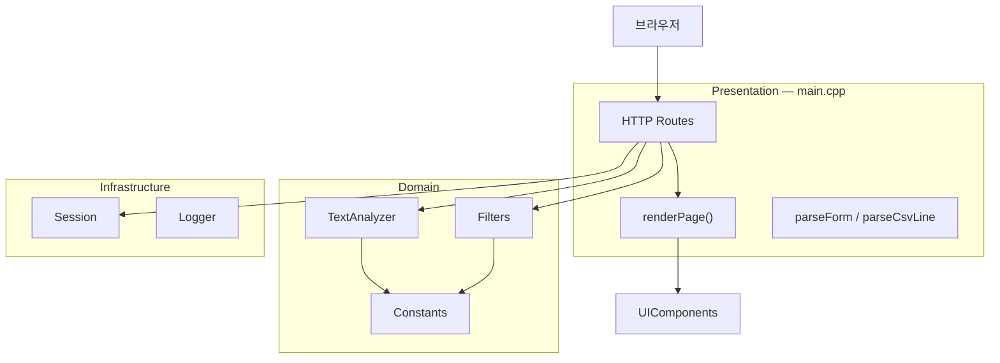
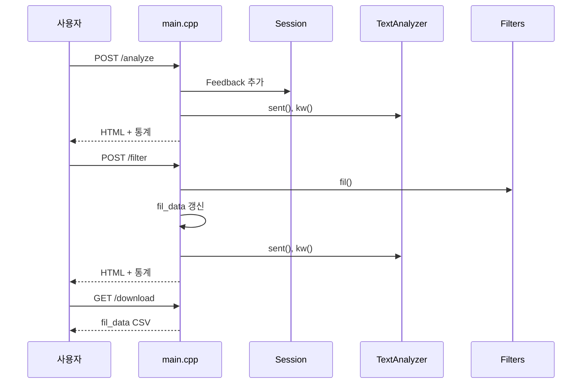

# Feedback Analyzer 11 — 분석 보고서

| 항목 | 내용 |
|------|------|
| 문서 번호 | 01_분석 |
| 프로젝트 | FeedbackAnalyzer_11 (리팩토링 챌린지) |
| 작성 기준 | 저장소 소스 정적 분석, `project_purpose.md`, `README.md` |
| 문서 버전 | 1.0 |
| 관련 문서 | `docs/analyzer.md`, `.cursorrules`, `project_purpose.md` |

---

## 1. 개요 (Executive Summary)

**Feedback Analyzer 11**은 C++17과 cpp-httplib 기반의 고객 피드백 분석 웹 애플리케이션이다. 단일 실행 파일(`feedback_analyzer`)이 `http://localhost:8080`에서 동작하며, 피드백 입력·CSV 업로드·감정/키워드 분석·필터링·결과 다운로드를 제공한다.

본 프로젝트는 **교육용 리팩토링 챌린지**로, God Object, 중복 코드, 전역 상태, 이중 키워드 사전 등 **의도적 기술 부채**가 포함되어 있다. 학습자는 `project_purpose.md`에 정의된 **8단계 미션**(약 13.5시간)을 수행하며 코드를 개선한다.

**핵심 분석 결과**

| 구분 | 요약 |
|------|------|
| 구조 | `main.cpp`에 HTTP·HTML·CSV·상태가 집중 (God Object) |
| 품질 | 단위 테스트 없음; `FileHandler` 미사용 |
| 버그 | 「중립」필터·키워드 필터·Logger 페이지 연동 불일치 |
| 권장 순서 | P0 버그/감정 단일화 → 테스트 → 구조 분리 → Trend/DB |

---

## 2. 프로젝트 목적 및 범위

### 2.1 목적

자연어 고객 피드백을 수집·분류·시각화하는 웹 앱의 **레거시 초기 버전**을 제공하고, 코드 스멜 식별 및 클린 아키텍처 지향 리팩토링 실습을 수행한다.

### 2.2 학습 목표

- 코드 스멜·안티패턴 식별
- 비즈니스 로직과 UI(HTML) 분리
- Extract Function/Class, 전략 패턴 등 리팩토링 기법
- 테스트 가능한 C++ 웹 앱 구조 설계

### 2.3 대상 사용자

- 중급 이상 C++ 개발자
- TDD·Clean Code·Refactoring 실습 수요자

### 2.4 분석 범위

| 포함 | 제외 |
|------|------|
| `src/cpp/` 애플리케이션 코드 | `build/` 산출물 |
| CMake 빌드 설정 | `httplib.h` 내부 구현 |
| 교육 스펙·미션 정의 | 미구현 Trend/File DB 상세 설계 |

---

## 3. 기술 환경

| 항목 | 내용 |
|------|------|
| 언어 | C++17 |
| 빌드 | CMake 3.14+ |
| HTTP | cpp-httplib (`src/cpp/httplib.h`) |
| 실행 | `build\feedback_analyzer.exe` |
| 포트 | 8080 (`0.0.0.0`) |
| OS 참고 | Windows MinGW 시 `ws2_32`, `WINVER` 정의 |

**빌드·실행** (README 기준)

```bash
cmake -S . -B build -G "MinGW Makefiles"
cmake --build build
build\feedback_analyzer.exe
```

---

## 4. 시스템 구조

### 4.1 디렉터리 구성

```
FeedbackAnalyzer_11/
├── CMakeLists.txt
├── README.md
├── project_purpose.md
├── .cursorrules
├── docs/analyzer.md
├── Report/
│   └── 01_분석.md          ← 본 보고서
└── src/cpp/
    ├── main.cpp            # HTTP, HTML, CSV, fil_data
    ├── TextAnalyzer.*      # sent(), kw()
    ├── Filters.*           # fil()
    ├── Constants.*         # 키워드 사전
    ├── Session.*           # currentFeedbacks
    ├── UIComponents.*      # 카테고리 목록
    ├── Logger.*            # 콘솔 로그
    ├── Feedback.h
    ├── FileHandler.h       # 미사용
    └── httplib.h
```

### 4.2 아키텍처 다이어그램



**평가**: 계층이 디렉터리로 분리되지 않았으며, `main.cpp`가 프레젠테이션·애플리케이션·일부 인프라를 동시에 담당한다.

### 4.3 HTTP API

| 메서드 | 경로 | 기능 |
|--------|------|------|
| GET | `/` | 대시보드 초기 화면 |
| POST | `/analyze` | 텍스트 입력 → 세션 추가 → 감정/키워드 집계 |
| POST | `/upload` | CSV 업로드 → 세션 추가 (분석 생략) |
| POST | `/filter` | 감정·키워드 필터 → `fil_data` 갱신 → 집계 |
| GET | `/download` | `fil_data` 기준 CSV 다운로드 |

### 4.4 모듈 책임 요약

| 모듈 | 책임 | 비고 |
|------|------|------|
| `main.cpp` | 라우팅, HTML, 파싱, `fil_data` | God Object (~370줄) |
| `Session` | `currentFeedbacks` 정적 보관 | `internalData` 등 미사용 |
| `TextAnalyzer` | `sent()`, `kw()` | `globalSent`/`globalKw` 미참조 |
| `Filters` | `fil()` | `S_KEYWORDS` 별도 유지 |
| `Constants` | 감정·카테고리 키워드 | 배열 중복 기입 |
| `UIComponents` | 드롭다운 카테고리 5종 | Constants와 이중 관리 |
| `Logger` | stdout/stderr | 페이지 미연동 |
| `FileHandler` | — | include만, 호출 없음 |

---

## 5. 데이터 흐름 분석



### 5.1 상태 저장소

| 상태 | 위치 | 용도 |
|------|------|------|
| 입력 피드백 | `Session::currentFeedbacks` | analyze/upload 누적 |
| 다운로드 대상 | `main.cpp` `fil_data` | filter 후에만 갱신 |
| 집계 캐시 | `TextAnalyzer::globalSent/Kw` | 설정만, 미사용 |

---

## 6. 기능 명세 대비 구현 현황

| 기능 | 요구 (project_purpose) | 구현 | 격차 |
|------|------------------------|------|------|
| 텍스트 입력 | 수동 입력 | POST `/analyze`, textarea | 멀티라인 보존 미검증 |
| CSV 업로드 | text 컬럼 | 첫 필드만, 헤더 스킵 | 컬럼명 `text` 미검증 |
| 감정 분석 | 긍정/중립/부정 | `sent()` | 필터와 기준 불일치 |
| 키워드 분류 | 카테고리 | `kw()` | 필터는 main 스킵 |
| 필터링 | 감정·키워드 | `fil()` | 중립·키워드 버그 |
| 시각화 | 통계 | HTML stat 박스 | 차트 없음 |
| CSV 다운로드 | 결과 저장 | GET `/download` | 이스케이프 없음 |

---

## 7. 코드 스멜 및 안티패턴

### 7.1 코드 스멜 (`project_purpose.md` §4.1)

| 유형 | 위치 | 설명 |
|------|------|------|
| 긴 함수 | `renderPage()`, `main()` | HTML·라우트·처리 혼재 |
| 중복 코드 | `TextAnalyzer`, `Filters` | `containsAny()` 동일 구현 |
| 부적절한 네이밍 | `fil`, `sent`, `kw` | 의도적 축약 |
| 전역 변수 | `fil_data`, static maps | 상태 분산 |
| 하드코딩 | `Constants.cpp`, `Filters.cpp` | 키워드·u8 문자열 |
| 테스트 미비 | — | tests/ 없음 |

### 7.2 안티패턴 (`project_purpose.md` §4.2)

| 안티패턴 | 반영 |
|----------|------|
| God Function | `main.cpp` |
| Spaghetti Code | 모듈 경계 모호 |
| Feature Envy | `Filters` → `Constants` 내부 구조 의존 |
| Shotgun Surgery | 카테고리 변경 시 다파일 수정 |
| Lava Flow | `FileHandler` |

---

## 8. 이슈 및 리스크

### 8.1 심각도 분류

| ID | 이슈 | 심각도 | 미션 |
|----|------|--------|------|
| I-01 | 「중립」: `sent()` vs `fil()` 감정 기준 불일치 | 높음 | 3 |
| I-02 | 키워드 필터가 `main` 서브키 스킵 | 높음 | 3 |
| I-03 | Logger 미연동 (페이지 level 표시 없음) | 중간 | 3 |
| I-04 | `/upload` 후 분석 미실행 | 중간 | — |
| I-05 | `fil_data` GET `/` 시 미초기화 | 중간 | — |
| I-06 | CSV 다운로드 이스케이프 없음 | 낮음 | — |
| I-07 | 테스트·Trend·File DB 미구현 | 계획 | 2, 7 |

### 8.2 「중립」필터 상세 (I-01)

| 구분 | 판별 방식 |
|------|-----------|
| `TextAnalyzer::sent` | `Constants` 긍정/부정만 → 나머지 **무조건 중립** |
| `Filters::fil` | `Filters::S_KEYWORDS`에 **중립 전용 키워드** 존재 |

**영향**: 대시보드 「중립」 건수와 필터 「중립」 결과 목록이 일치하지 않을 수 있음.

### 8.3 키워드 필터 상세 (I-02)

`Filters::fil` 내 `if (subEntry.first == "main") continue;` 로 인해, `TextAnalyzer::kw`가 사용하는 `main` 키워드와 필터 조건이 어긋난다.

---

## 9. 학습 미션 (8단계)

`project_purpose.md` §6.1 기준.

| 단계 | 시간 | 내용 | 주요 산출물 |
|------|------|------|-------------|
| 1 | 1h | 개요·미션 안내 | 이해·계획 |
| 2 | 2h | 테스트, 커버리지 ≥ 90% | `tests/`, CMake 테스트 |
| 3 | 1.5h | 로그 페이지화, 멀티라인, 중립 필터 | I-01~03 해소 |
| 4 | 1h | 네이밍·전역·매직 값 | 가독성 개선 |
| 5 | 1.5h | 긴 함수·중복 | `HtmlRenderer`, 공통 유틸 |
| 6 | 1h | 추가 리팩토링 1건 | 팀 자율 |
| 7 | 3h | Trend 시각화, File DB | CSV·DB·UI |
| 8 | 2h | 팀 리뷰·발표 | 리뷰 문서 |

**권장 진행**: 2(테스트) ↔ 3(버그) 병행 가능. **중립 필터 수정 전 회귀 테스트** 권장.

### 9.1 미션 3 완료 기준

1. 「중립」 필터 결과 = `sent()` 중립 집계와 동일 규칙.
2. `logWarning` / `logError`가 페이지 alert로 표시.
3. textarea 멀티라인이 입력·표시·다운로드까지 보존.

---

## 10. 개선 로드맵

| 우선순위 | 작업 | 기대 효과 |
|----------|------|-----------|
| P0 | 감정 분류 단일화, 키워드 `main` 스킵 수정 | I-01, I-02 해소 |
| P1 | GoogleTest/Catch2, 커버리지 90% | 회귀 방지 |
| P2 | `containsAny` 공통화, `renderPage` 분리 | God Object 완화 |
| P3 | Session/`fil_data` 캡슐화, 키워드 단일 소스 | 전역·Shotgun 완화 |
| P4 | `handlers/`, `services/`, `models/` | 미션 7 대비 구조 |

### 10.1 목표 구조 (참고)

```
src/cpp/
├── models/       Feedback, AnalysisResult
├── services/     TextAnalyzer, Filters, CsvParser
├── handlers/     라우트 핸들러
├── web/          HtmlRenderer
├── infra/        Logger, SessionStore, FileDb
└── main.cpp      서버 기동만
```

---

## 11. 테스트 전략 (미션 2)

| 우선 테스트 대상 | 케이스 예 |
|------------------|-----------|
| 감정 분류 | 긍정/부정/중립, sent vs fil 일치 |
| `fil` | 전체, 감정만, 키워드만, 복합 |
| `kw` | main 매칭 |
| `containsAny` | 부분 문자열, 빈 목록 |
| `parseCsvLine` | 따옴표, 쉼표 |
| `urlDecode` | `%`, `+` |

---

## 12. 결론 및 권고사항

Feedback Analyzer 11은 **기능적으로 동작하는 단일 프로세스 웹앱**이나, 교육 목적의 **의도적 레거시**가 명확하다.

**즉시 권고**

1. 미션 3: 감정 판별 **단일 모듈** 도입 후 `TextAnalyzer`·`Filters` 공유.
2. 미션 2: 감정·필터 회귀 테스트를 버그 수정보다 먼저 또는 동시에 작성.
3. `main.cpp` 분리는 P2 이후 단계적으로 진행 (한 번에 전면 재작성 지양).

**참고 문서**

| 경로 | 설명 |
|------|------|
| [README.md](../README.md) | 빌드·실행 |
| [project_purpose.md](../project_purpose.md) | 교육 스펙·미션 원문 |
| [docs/analyzer.md](../docs/analyzer.md) | 기술 상세 분석 (동일 주제 확장판) |
| [.cursorrules](../.cursorrules) | AI·개발 규칙 |

---

*본 보고서는 저장소 정적 분석을 기준으로 작성되었으며, 실행 환경·브라우저별 동작은 별도 검증이 필요하다.*
