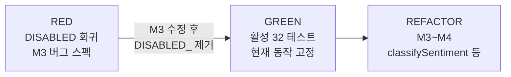

# Feedback Analyzer 11 — RED 테스트 플랜 보고서

| 항목 | 내용 |
|------|------|
| 문서 번호 | 02_RED |
| 프로젝트 | FeedbackAnalyzer_11 (리팩토링 챌린지) |
| 미션 | **2** — 테스트 구조·커버리지 ≥ 90% |
| 작성 기준 | `tests/`, `CMakeLists.txt`, `docs/coverage.md`, 실행 결과 |
| 문서 버전 | 1.0 |
| 관련 문서 | [01_분석.md](01_분석.md), [docs/coverage.md](../docs/coverage.md), `.cursorrules` |

---

## 1. 개요 (Executive Summary)

미션 2에서는 **GoogleTest 기반 단위 테스트**를 도입하고, 도메인 로직(`TextAnalyzer`, `Filters`, `ParseUtils`, `Constants`)에 대해 **line coverage 90% 이상**을 달성했다.

본 프로젝트의 RED 단계는 **클래식 TDD(구현 전 전부 Fail)** 와 다르다. 레거시 코드가 이미 존재하므로, 활성 32개 테스트는 **현재 동작을 고정하는 회귀 테스트(GREEN 성격)** 이고, **미션 3 버그**는 `DISABLED_` 접두사 회귀 테스트로 **RED(수정 전 Fail)** 를 문서화한다.

| 구분 | 결과 |
|------|------|
| 테스트 인프라 | GoogleTest FetchContent, `feedback_analyzer_tests`, `ctest` |
| 활성 테스트 | **32 Pass** (기본 `ctest`) |
| RED 문서화 (DISABLED) | **5건** (실행 시 3 Fail, 1 Pass, 1 오탐 Pass) |
| 도메인 line coverage | **100%** (134/134, `docs/coverage.md` 참고) |
| 비즈니스 로직 변경 | 없음 (Extract `ParseUtils`만 수행) |

---

## 2. RED 단계 정의 (본 프로젝트)

### 2.1 클래식 TDD vs 미션 2 RED

| | 클래식 RED | FeedbackAnalyzer 미션 2 |
|---|-----------|-------------------------|
| 코드 상태 | 기능 미구현 | 레거시 **이미 동작** |
| 첫 `ctest` | 대부분 Fail | 활성 32건 **Pass** |
| 의도 | 구현 유도 | 회귀 방지 + 버그 스펙 고정 |
| Fail 테스트 | 전체 | **`DISABLED_`만** (선택 실행) |

### 2.2 RED → GREEN → REFACTOR 매핑



| 단계 | 산출물 | 상태 |
|------|--------|------|
| RED | `DISABLED_Regression_*`, `DISABLED_F05_*` | 스킵(기본 실행), 활성화 시 Fail |
| GREEN | S/K/F/U/C, COV-* 테스트 32건 | **완료** |
| REFACTOR | 감정 단일화, 네이밍(M4) | 미션 3 이후 |

---

## 3. 테스트 인프라

### 3.1 빌드·실행

| 항목 | 내용 |
|------|------|
| 프레임워크 | GoogleTest 1.14 (CMake `FetchContent`) |
| 타깃 | `feedback_analyzer_tests` |
| Fixture | `FeedbackAnalyzerTestFixture::SetUpTestSuite` → `Constants::init()`, `Filters::initFilterKeywords()` |
| 커버리지 플래그 | GNU: `--coverage -fprofile-arcs -ftest-coverage` (테스트 타깃만) |

```powershell
cmake -S . -B build -G "MinGW Makefiles"
cmake --build build --target feedback_analyzer_tests
cd build
ctest --output-on-failure
```

### 3.2 디렉터리 구성

```
tests/
├── test_fixture.h
├── text_analyzer_test.cpp      # S-01~S-06, K-01~K-04
├── filters_test.cpp            # F-01~F-07 (F-05 DISABLED)
├── parse_utils_test.cpp        # U-01~U-03, C-01~C-04
├── coverage_gap_test.cpp       # COV-* (커버리지·분기 보강)
└── regression_neutral_filter_test.cpp  # M3 중립 필터 RED

src/cpp/
└── ParseUtils.h/.cpp           # main에서 Extract (urlDecode, parseCsvLine)

docs/
├── coverage.md                 # 커버리지 요약
└── coverage/                   # gcovr HTML

scripts/
├── run_coverage.ps1
└── parse_domain_coverage.py
```

### 3.3 테스트 범위 (제외)

| 제외 대상 | 사유 |
|-----------|------|
| `main.cpp` HTTP/HTML 라우트 | God Object, 통합 테스트 범위 밖 |
| `httplib.h` | 서드파티, 수정 금지 |
| `Logger`, `Session`, `UIComponents` | 테스트 타깃 미포함 |

---

## 4. 테스트 플랜 및 구현 현황

### 4.1 TextAnalyzer (`sent`, `kw`)

| ID | 테스트명 | Given | When | Then | 실행 |
|----|----------|-------|------|------|------|
| S-01 | `S01_Sent_EmptyList_ReturnsZeroCounts` | 빈 목록 | `sent()` | 긍/중/부 0 | Pass |
| S-02 | `S02_Sent_PositiveKeyword_CountsPositive` | `"최고입니다 감사합니다"` | `sent()` | 긍정=1 | Pass |
| S-03 | `S03_Sent_NegativeKeyword_CountsNegative` | `"최악 불만 환불"` | `sent()` | 부정=1 | Pass |
| S-04 | `S04_Sent_NoKeyword_DefaultsNeutral` | `"오늘 날씨 좋음"` | `sent()` | 중립=1 | Pass |
| S-05 | `S05_Sent_PositiveBeatsNegative` | `"좋은데 나쁘진 않음"` | `sent()` | 긍정=1 | Pass |
| S-06 | `S06_Sent_NeutralKeywordStillCountsNeutral` | `"보통 그냥 무난"` | `sent()` | 중립=1 (`Constants`에 중립 키워드 없음) | Pass |
| K-01 | `K01_Kw_EmptyList_AllCategoriesZero` | 빈 목록 | `kw()` | 5카테고리 0 | Pass |
| K-02 | `K02_Kw_MainKeyword_MatchesCategory` | `"배송이 빨라요"` | `kw()` | 배송≥1 | Pass |
| K-03 | `K03_Kw_SubKeywordOnly_StillMatches` | `"일반적인 의견입니다"` | `kw()` | 배송=0 (main만 검사) | Pass |
| K-04 | `K04_Kw_MultipleCategories` | `"배송 빠르고 가격 저렴"` | `kw()` | 배송·가격≥1 | Pass |

### 4.2 Filters (`fil`)

| ID | 테스트명 | Given | When | Then | 실행 |
|----|----------|-------|------|------|------|
| F-01 | `F01_Fil_SentimentAll_ReturnsAll` | 혼합 3건 | `fil(전체, 전체)` | size=3 | Pass |
| F-02 | `F02_Fil_PositiveOnly` | 긍정+부정 | `fil(긍정, 전체)` | 긍정 1건 | Pass |
| F-03 | `F03_Fil_NeutralUsesFilterKeywords` | `"보통 그냥 무난"` | `fil(중립, 전체)` | ≥1 | Pass |
| F-05 | `DISABLED_F05_KeywordSkipsMain` | `"배송"` | `fil(전체, 배송)` | main 스킵 버그 (sub에 배송 있어 **오탐 Pass**) | **DISABLED** |
| F-06 | `F06_Fil_KeywordSubOnly_Matches` | `"택배가 왔어요"` | `fil(전체, 배송)` | ≥1 | Pass |
| F-07 | `F07_Fil_Combo_SentimentAndKeyword` | 긍정+택배 혼합 | `fil(긍정, 배송)` | 1건 | Pass |

> F-04는 `regression_neutral_filter_test.cpp`로 이관.

### 4.3 ParseUtils (`urlDecode`, `parseCsvLine`)

| ID | 테스트명 | Given | When | Then | 실행 |
|----|----------|-------|------|------|------|
| U-01 | `U01_UrlDecode_PlusToSpace` | `hello+world` | `urlDecode` | `hello world` | Pass |
| U-02 | `U02_UrlDecode_PercentUtf8` | `%EB%82%A0` | `urlDecode` | `날` | Pass |
| U-03 | `U03_UrlDecode_InvalidPercent_KeepsChar` | `%GG` | `urlDecode` | `%GG` | Pass |
| C-01 | `C01_ParseCsv_SimpleComma` | `a,b,c` | `parseCsvLine` | 3필드 | Pass |
| C-02 | `C02_ParseCsv_QuotedComma` | `"a,b",c` | `parseCsvLine` | 2필드 | Pass |
| C-03 | `C03_ParseCsv_EmptyField` | `a,,c` | `parseCsvLine` | 중간 빈 필드 | Pass |
| C-04 | `C04_ParseCsv_QuotesToggle` | `"""a"""` | `parseCsvLine` | 1필드 `a` | Pass |

### 4.4 커버리지 갭 보강 (`coverage_gap_test.cpp`)

| ID | 대상 | 요약 |
|----|------|------|
| COV-G01 | `globalSent` | `sent()` 2회 호출 시 2차 결과 반영 |
| COV-G02 | `globalKw` | `kw()` 2회 호출 시 2차 결과 반영 |
| COV-TA01 | `containsAny` false | `sent()` 경유, 키워드 없음 → 중립 |
| COV-TA02 | `containsAny` false | `kw()` 경유, 카테고리 0 |
| COV-F01~F06 | `fil` 분기 | 부정 필터, 잘못된 카테고리, cout 루프 등 |

### 4.5 미션 3 RED 회귀 (중립 필터)

**스펙**: `sent()`의 중립 집계 건수 == `fil(중립, 전체)` 결과 건수.

| ID | 테스트명 | 샘플 | DISABLED 실행 시 |
|----|----------|------|------------------|
| REG-1 | `..._Case1_Gwaenchan` | `"괜찮해요"` | **Fail** (sent 1 vs fil 0) |
| REG-2 | `..._Case2_GwaenchanInSentence` | `"괜찮한데 배송은 보통이에요"` | **Fail** |
| REG-3 | `..._Case3_NoKeywordDefaultsNeutral` | `"오늘 날씨 좋음"` | Pass (대조 케이스) |
| REG-0 | `DISABLED_Regression_NeutralFilterMismatch` | 혼합 3건 | **Fail** (sent 3 vs fil 2) |

**원인 요약**: `sent()`는 `Constants::SENTIMENT_KEYWORDS`(중립 키워드 없음, 기본 중립), `fil()`은 `Filters::S_KEYWORDS`(`괜찮`이 긍정·중립 중복) 사용.

```powershell
.\feedback_analyzer_tests.exe --gtest_filter="*Regression_Neutral*" --gtest_also_run_disabled_tests
```

---

## 5. 32 Pass vs RED Fail 설명

활성 32테스트가 Pass인 이유:

1. **레거시 코드가 먼저 존재** — 테스트는 “추가할 기능”이 아니라 “지금 동작”을 검증.
2. **프롬프트 제약** — “비즈니스 로직 수정 없이 스켈레톤만” → 의도적 GREEN.
3. **입력 조정** — F-03, K-03 등은 현재 구현과 맞는 데이터 사용.
4. **진짜 RED** — `DISABLED_` 5건은 `ctest` 기본 실행에서 **제외**.

| 실행 모드 | Pass | Fail | Skip |
|-----------|------|------|------|
| `ctest` (기본) | 32 | 0 | 5 |
| `--gtest_also_run_disabled_tests` (회귀+DISABLED) | 33 | 3 | 0 |

---

## 6. 커버리지 결과

| 파일 | Line % | 90% 목표 |
|------|--------|----------|
| ParseUtils.cpp | 100% | ✅ |
| Constants.cpp | 100% | ✅ |
| Filters.cpp | 100% | ✅ |
| Filters.h | 100% | ✅ |
| TextAnalyzer.h | 100% | ✅ |
| **도메인 합계** | **100%** (134/134) | ✅ |

상세: [docs/coverage.md](../docs/coverage.md), HTML: [docs/coverage/coverage.html](../docs/coverage/coverage.html)

```powershell
.\scripts\run_coverage.ps1
```

---

## 7. 미션 2 완료 기준 체크리스트

| 기준 | 상태 |
|------|------|
| GoogleTest + CMake `enable_testing` | ✅ |
| `TextAnalyzer` / `Filters` / `ParseUtils` 단위 테스트 | ✅ |
| 도메인 line coverage ≥ 90% | ✅ (100%) |
| `main` 라우트 테스트 제외 | ✅ |
| UTF-8 `u8"..."` 유지 | ✅ |
| 전면 재작성 없음 | ✅ |
| M3 버그 RED 회귀 (`DISABLED_`) | ✅ |

---

## 8. 미션 3 연계 (다음 GREEN)

| 작업 | 테스트 조치 |
|------|-------------|
| `classifySentiment` 단일화 | `DISABLED_Regression_*` 4건에서 `DISABLED_` 제거 → Pass 목표 |
| `main` 키워드 필터 | `DISABLED_F05` 기대값을 `EXPECT_EQ(0u)` + sub-only 샘플로 수정 |
| Acceptance | 「중립」만 선택 시 `sent` 중립 건수 == `fil` 결과 건수 |

---

## 9. 참고 문서

| 경로 | 설명 |
|------|------|
| [01_분석.md](01_분석.md) | 전체 구조·버그·미션 로드맵 |
| [docs/coverage.md](../docs/coverage.md) | 커버리지 측정·COV 테스트 매핑 |
| [docs/analyzer.md](../docs/analyzer.md) | 기술 상세 |
| [Prompting/01_분석_prompt.md](../Prompting/01_분석_prompt.md) §D, §E | RED/테스트 프롬프트 원문 |
| `.cursorrules` | 미션 2 테스트 정책 |

---

*본 보고서는 미션 2 RED 테스트 플랜 수립·구현·검증 결과를 정리한 문서이다.*
