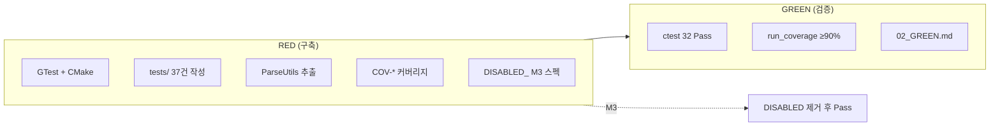

# Feedback Analyzer 11 — GREEN 테스트 플랜 보고서

| 항목 | 내용 |
|------|------|
| 문서 번호 | 02_GREEN |
| 프로젝트 | FeedbackAnalyzer_11 (리팩토링 챌린지) |
| 미션 | **2** — 테스트 구조·커버리지 ≥ 90% |
| 선행 문서 | [02_RED.md](02_RED.md), [docs/coverage.md](../docs/coverage.md) |
| 검증 일시 | 2026-05-22 (로컬 `ctest` + `run_coverage.ps1`) |
| 문서 버전 | 1.0 |

---

## 1. GREEN 정의

클래식 TDD에서 GREEN은 RED 실패 테스트를 통과시키기 위한 최소 구현 단계이다. 본 프로젝트는 레거시 코드가 선행하므로, **미션 2 GREEN**은 구현 추가가 아니라 **회귀 기준선 확정**(활성 테스트 Pass), **도메인 line coverage ≥ 90%** 검증, **ParseUtils 추출** 완료 확인, **미션 3 버그는 `DISABLED_`로 RED 유지**를 의미한다.

| | 클래식 GREEN | FeedbackAnalyzer 미션 2 GREEN |
|---|--------------|-------------------------------|
| 선행 | RED 전부 Fail | RED에서 테스트·인프라·커버리지 **이미 구축** |
| 코드 변경 | 비즈니스 로직 구현 | **없음** (검증·문서화만) |
| Pass 기준 | 새 기능 동작 | **현재 동작 고정** 32건 |
| Fail 허용 | 0 (활성) | 0 (활성); DISABLED 5건은 스킵 |

---

## 2. Executive Summary

| 구분 | 결과 |
|------|------|
| 빌드 | `feedback_analyzer_tests` — 성공 |
| 활성 테스트 | **32 Pass**, **0 Fail** |
| DISABLED (M3 RED) | **5 Not Run** |
| 도메인 line coverage | **100%** (134/134) |
| 90% 미만 파일 | **없음** |
| 비즈니스 로직 변경 | 없음 (GREEN 검증 단계) |

**결론: 미션 2 완료**

---

## 3. RED vs GREEN 작업 구분



| 작업 유형 | RED | GREEN (본 문서) |
|-----------|-----|-----------------|
| 테스트 신규 작성 | ✅ S/K/F/U/C, COV, DISABLED | ❌ |
| ParseUtils 추출 | ✅ | 확인만 |
| `sent`/`fil` 수정 | ❌ | ❌ |
| `ctest` / coverage 실행 | RED 시 1회 | **공식 재검증** |
| 보고서 | `02_RED.md` | `02_GREEN.md` |

---

## 4. 검증 실행 결과

### 4.1 빌드·테스트

```powershell
cmake --build build --target feedback_analyzer_tests
cd build
ctest --output-on-failure
```

| 항목 | 값 |
|------|-----|
| 총 등록 테스트 | 37 |
| **Passed** | **32** |
| **Failed** | **0** |
| **Disabled (Not Run)** | **5** |
| Total Test time | 1.42 sec |
| ctest 요약 | `100% tests passed, 0 tests failed out of 32` |

#### DISABLED 5건 (M3 RED 유지)

| # | ctest 이름 |
|---|------------|
| 1 | `Regression_NeutralFilterMismatch_Case1_Gwaenchan` |
| 2 | `Regression_NeutralFilterMismatch_Case2_GwaenchanInSentence` |
| 3 | `Regression_NeutralFilterMismatch_Case3_NoKeywordDefaultsNeutral` |
| 4 | `Regression_NeutralFilterMismatch` |
| 18 | `F05_KeywordSkipsMain` |

> 소스상 `DISABLED_` 접두사. gtest_discover_tests 등록 시 접두사 제거된 이름으로 표시됨.

#### M3 RED 수동 확인 (선택)

```powershell
.\build\feedback_analyzer_tests.exe --gtest_filter="*Regression_Neutral*" --gtest_also_run_disabled_tests
```

수정 전 기대: Regression 3 Fail, Case3 Pass (대조 케이스).

### 4.2 커버리지

```powershell
.\scripts\run_coverage.ps1
```

| 파일 | Exec/Total | Line % | 90% |
|------|------------|--------|-----|
| Constants.cpp | 26/26 | 100.0% | ✅ |
| Filters.cpp | 8/8 | 100.0% | ✅ |
| ParseUtils.cpp | 28/28 | 100.0% | ✅ |
| Filters.h | 37/37 | 100.0% | ✅ |
| TextAnalyzer.h | 35/35 | 100.0% | ✅ |
| **TOTAL (domain)** | **134/134** | **100.0%** | ✅ |

**90% 미만 파일: 없음**

제외: `main.cpp`, `httplib.h`, Logger, Session, UIComponents.

---

## 5. 테스트 ID ↔ 소스 매핑

| 테스트 파일 | ID | 대상 소스 | GREEN 상태 |
|-------------|-----|-----------|--------------|
| `text_analyzer_test.cpp` | S-01 ~ S-06 | `TextAnalyzer.h`, `Constants.cpp` | Pass |
| `text_analyzer_test.cpp` | K-01 ~ K-04 | `TextAnalyzer.h` | Pass |
| `filters_test.cpp` | F-01, F-02, F-03 | `Filters.h`, `Filters.cpp` | Pass |
| `filters_test.cpp` | F-05 | `Filters.h` | **Disabled** (M3) |
| `filters_test.cpp` | F-06, F-07 | `Filters.h` | Pass |
| `parse_utils_test.cpp` | U-01 ~ U-03, C-01 ~ C-04 | `ParseUtils.cpp` | Pass |
| `coverage_gap_test.cpp` | COV-G01, G02 | `TextAnalyzer.h` (globalSent/Kw) | Pass |
| `coverage_gap_test.cpp` | COV-TA01, TA02 | `TextAnalyzer.h` (containsAny) | Pass |
| `coverage_gap_test.cpp` | COV-F01 ~ F06 | `Filters.h` (fil 분기) | Pass |
| `regression_neutral_filter_test.cpp` | REG-1 ~ 3, REG-0 (F-04 이관) | `TextAnalyzer.h`, `Filters.h` | **Disabled** (M3) |

### 5.1 활성 32건 — GTest 이름

| 그룹 | 테스트명 |
|------|----------|
| COV (10) | `COV_G01_*` … `COV_F06_*` |
| F (5) | `F01_*`, `F02_*`, `F03_*`, `F06_*`, `F07_*` |
| S (6) | `S01_*` … `S06_*` |
| K (4) | `K01_*` … `K04_*` |
| U/C (7) | `U01_*` … `U03_*`, `C01_*` … `C04_*` |

---

## 6. 완료 체크리스트

| 기준 | 상태 |
|------|------|
| GoogleTest + `enable_testing` | ✅ |
| Fixture (`Constants::init`, `initFilterKeywords`) | ✅ |
| 활성 테스트 전부 Pass | ✅ (32/32) |
| DISABLED 5건 스킵 유지 | ✅ |
| 도메인 line coverage ≥ 90% | ✅ (100%) |
| ParseUtils 추출 (`main` 동작 유지) | ✅ |
| `main` HTTP/HTML 테스트 제외 | ✅ |
| UTF-8 `u8"..."` 유지 | ✅ |
| `sent`/`fil` 비즈니스 로직 무변경 | ✅ |
| M3 RED 회귀 문서화 | ✅ ([02_RED.md](02_RED.md) §4.5) |

---

## 7. 미션 2 GREEN vs 미션 3 GREEN

| 기준 | M2 GREEN (본 문서) | M3 GREEN (다음) |
|------|-------------------|-----------------|
| 활성 32 Pass | ✅ | 유지 |
| coverage ≥ 90% | ✅ | 유지 |
| DISABLED_ | **스킵** | 접두사 제거 후 Pass |
| 중립 필터 | — | `sent` 중립 건수 == `fil(중립)` |
| `main` 키워드 스킵 | — | F05 수정 후 Pass |
| REFACTOR | — | `classifySentiment`, M4 네이밍 |

| M3 작업 | 테스트 조치 |
|---------|-------------|
| `classifySentiment` 단일화 | `DISABLED_Regression_*` 4건 → `DISABLED_` 제거 |
| `main` 키워드 필터 | `DISABLED_F05` 샘플·기대값 수정 후 Pass |

---

## 8. 검증 실패 시 대응 (미션 2)

본 검증(2026-05-22)에서는 미달 없음. 재검증 시 실패할 경우:

| 실패 | 조치 |
|------|------|
| 활성 테스트 Fail | 로직 변경 없이 Given/When/Then·입력 재검토 |
| coverage < 90% | `coverage_gap_test.cpp`에 COV-* 1건 추가 |
| DISABLED 오탐 | M3에서만 수정 (M2 GREEN 범위 밖) |

---

## 9. 참고 문서

| 경로 | 설명 |
|------|------|
| [02_RED.md](02_RED.md) | RED 플랜·구축 산출물 |
| [docs/coverage.md](../docs/coverage.md) | 커버리지·COV 매핑 |
| [Prompting/02_RED_promt.md](../Prompting/02_RED_promt.md) | RED 프롬프트 이력 |
| `.cursorrules` | 미션 2 테스트 정책 |

---

*본 보고서는 미션 2 GREEN(회귀 기준선 + 커버리지) 로컬 검증 결과를 기록한 문서이다.*

**한 줄 결론: 미션 2 완료** — 활성 32 Pass, 도메인 line 100%, DISABLED 5건 M3 RED로 유지.
