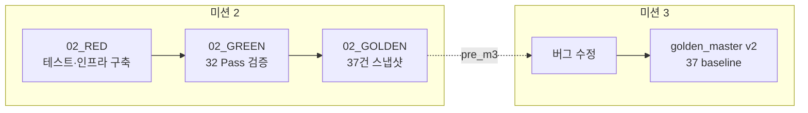

# Feedback Analyzer 11 — 골든 마스터 보고서

| 항목 | 내용 |
|------|------|
| 문서 번호 | 02_GOLDEN |
| 프로젝트 | FeedbackAnalyzer_11 (리팩토링 챌린지) |
| 미션 | **2** — GREEN 이후 회귀 기준선 스냅샷 |
| 선행 문서 | [02_1_RED.md](02_1_RED.md), [02_2_GREEN.md](02_2_GREEN.md), [docs/coverage.md](../docs/coverage.md) |
| 산출물 | [tests/fixtures/golden_master.json](../tests/fixtures/golden_master.json), [docs/golden_master.md](../docs/golden_master.md) |
| 검증 일시 | 2026-05-22 (로컬 `ctest` + `run_coverage.ps1` + DISABLED 수동 실행) |
| 문서 버전 | 1.0 |

---

## 1. 골든 마스터 정의

**골든 마스터(Golden Master)** 는 Characterization Testing 관점에서, 리팩토링 전 **현재 레거시 동작**을 입력·출력 쌍으로 고정한 스냅샷이다. 미션 2 GREEN에서 확정한 **32 Pass 회귀**와 **M3 RED용 DISABLED 5건**의 수정 전 실측을 한 파일에 모아, 이후 미션 3~8에서 동작 drift를 추적한다.

| 역할 | GoogleTest | 골든 마스터 JSON |
|------|------------|------------------|
| 실행 | 매 빌드 `ctest` Pass/Fail | — |
| 스펙 | `EXPECT_*` assertion | `given` / `when` / `expected` |
| 버그 구간 | `DISABLED_` 스킵 | `status: "bug_m3_red"` + `pre_m3` |
| 범위 | 도메인 단위 | 동일 (main/httplib 제외) |

GTest를 **대체하지 않는다**. JSON은 문서·diff·(선택) 데이터 드리븐 검증의 **단일 소스 보조**이다.

---

## 2. Executive Summary

| 구분 | 결과 |
|------|------|
| JSON 버전 | `1.0.0` (mission 2) |
| **cases 총계** | **37** (baseline 32 + bug_m3_red 5) |
| ctest (기본) | **32 Pass**, 0 Fail, **5 Disabled** |
| 도메인 line coverage | **100%** (134/134) |
| DISABLED 수동 실행 | 2 Pass, 3 Fail |
| 프로덕션·테스트 코드 변경 | **없음** (스냅샷·문서만) |

**결론: 미션 2 골든 마스터 v1 작성 완료** — M3 리팩토링 전 기준선 고정.

---

## 3. RED → GREEN → GOLDEN 흐름



| 단계 | 보고서 | 산출물 | 코드 변경 |
|------|--------|--------|-----------|
| RED | `02_1_RED.md` | `tests/*.cpp`, ParseUtils | Extract만 |
| GREEN | `02_2_GREEN.md` | 검증 기록 | 없음 |
| **GOLDEN** | **본 문서** | `golden_master.json`, `docs/golden_master.md` | 없음 |
| M3 BUGFIX | [03_BugFix.md](03_BugFix.md) | JSON v2 | `classifySentiment`, F05 |

---

## 4. 생성 산출물

| 경로 | 형식 | 용도 |
|------|------|------|
| [tests/fixtures/golden_master.json](../tests/fixtures/golden_master.json) | JSON UTF-8 | 기계용 37건 입출력 스냅샷 |
| [docs/golden_master.md](../docs/golden_master.md) | Markdown | 사람용 요약·갱신 절차 |
| [Report/02_3_Golden.md](02_3_Golden.md) | Markdown | 본 보고서 (작업·검증 기록) |

`CMakeLists.txt` 변경 없음 — fixtures는 데이터 파일만 추가.

---

## 5. 검증 실행 결과

### 5.1 빌드·ctest

```powershell
cmake --build build --target feedback_analyzer_tests
cd build
ctest --output-on-failure
```

| 항목 | 값 |
|------|-----|
| 등록 테스트 | 37 |
| **Passed** | **32** |
| **Failed** | **0** |
| **Disabled (Not Run)** | **5** |
| Total Test time | 1.31 sec |
| ctest 요약 | `100% tests passed, 0 tests failed out of 32` |

#### 스킵된 5건 (M3 RED)

| # | ctest 이름 |
|---|------------|
| 1 | `Regression_NeutralFilterMismatch_Case1_Gwaenchan` |
| 2 | `Regression_NeutralFilterMismatch_Case2_GwaenchanInSentence` |
| 3 | `Regression_NeutralFilterMismatch_Case3_NoKeywordDefaultsNeutral` |
| 4 | `Regression_NeutralFilterMismatch` |
| 18 | `F05_KeywordSkipsMain` |

### 5.2 커버리지

```powershell
.\scripts\run_coverage.ps1
```

| 파일 | Exec/Total | Line % |
|------|------------|--------|
| Constants.cpp | 26/26 | 100.0% |
| Filters.cpp | 8/8 | 100.0% |
| ParseUtils.cpp | 28/28 | 100.0% |
| Filters.h | 37/37 | 100.0% |
| TextAnalyzer.h | 35/35 | 100.0% |
| **TOTAL (domain)** | **134/134** | **100.0%** |

90% 미만 파일: **없음**

### 5.3 DISABLED 실측 (골든 마스터 `pre_m3` 근거)

```powershell
.\build\feedback_analyzer_tests.exe --gtest_filter="*Regression_Neutral*:*F05_KeywordSkipsMain*" --gtest_also_run_disabled_tests
```

| ID | 입력 | sent 중립 | fil(중립) size | 불일치 | gtest 결과 |
|----|------|-----------|----------------|--------|------------|
| REG-1 | `"괜찮해요"` | 1 | 0 | ✅ | **Fail** |
| REG-2 | `"괜찮한데 배송은 보통이에요"` | 1 | 0 | ✅ | **Fail** |
| REG-3 | `"오늘 날씨 좋음"` | 1 | 1 | ❌ | **Pass** |
| REG-0 | 3건 배치* | 3 | 2 | ✅ | **Fail** |
| F-05 | `"배송"` + `fil(전체,배송)` | — | 1 | 스펙상 버그 | **Pass** (오탐) |

\* REG-0 배치: `"괜찮해요"`, `"오늘 날씨 좋음"`, `"보통 그냥 무난"`

**불일치 원인**: `sent()` → `Constants::SENTIMENT_KEYWORDS`(중립 버킷 없음, 기본 중립). `fil()` → `Filters::S_KEYWORDS`(`괜찮`이 **긍정**·중립 중복, 긍정 우선).

**F-05 오탐**: `fil()`이 `main` 서브맵을 스킵하지만, `status` 서브키 `"배송"`에 매칭되어 1건 반환 (`Filters.h` 56–57행 `continue`).

---

## 6. 테스트 ID ↔ 골든 마스터 매핑 (37건)

### 6.1 baseline — 32건 (`status: "baseline"`)

| 그룹 | ID | 소스 파일 | API | gtest (요약) |
|------|-----|-----------|-----|--------------|
| Sentiment | S-01 ~ S-06 | `text_analyzer_test.cpp` | `TextAnalyzer::sent` | 빈 목록·긍/부/중립·우선순위 |
| Keyword | K-01 ~ K-04 | `text_analyzer_test.cpp` | `TextAnalyzer::kw` | 5카테고리·main만 |
| Filter | F-01, F-02, F-03, F-06, F-07 | `filters_test.cpp` | `Filters::fil` | 전체·긍정·중립·sub·조합 |
| Parse | U-01 ~ U-03 | `parse_utils_test.cpp` | `urlDecode` | +, UTF-8%, 폴백 |
| Parse | C-01 ~ C-04 | `parse_utils_test.cpp` | `parseCsvLine` | 쉼표·따옴표·빈 필드 |
| Coverage | COV-G01, G02 | `coverage_gap_test.cpp` | `globalSent`/`globalKw` | 2회 호출 덮어쓰기 |
| Coverage | COV-TA01, TA02 | `coverage_gap_test.cpp` | `sent`/`kw` | containsAny false |
| Coverage | COV-F01 ~ F06 | `coverage_gap_test.cpp` | `fil` | 부정·무효카테고리·cout 분기 |

### 6.2 bug_m3_red — 5건 (`status: "bug_m3_red"`)

| ID | 소스 파일 | 스펙 | JSON 필드 |
|----|-----------|------|-----------|
| REG-1 | `regression_neutral_filter_test.cpp` | sent 중립 == fil(중립) | `pre_m3`, `post_m3` |
| REG-2 | 동일 | 동일 | 동일 |
| REG-3 | 동일 | 대조 케이스 (수정 후에도 Pass) | 동일 |
| REG-0 | 동일 | 혼합 3건 배치 | `per_item` 포함 |
| F-05 | `filters_test.cpp` | `main` 키워드 스킵 | `match_via`, `intended_bug` |

상세 `given`/`expected`는 [tests/fixtures/golden_master.json](../tests/fixtures/golden_master.json) `cases[]` 참조.

---

## 7. JSON 스키마 (v1.0.0)

```json
{
  "version": "1.0.0",
  "mission": 2,
  "generated_at": "2026-05-22",
  "ctest_summary": { "passed": 32, "disabled_not_run": 5 },
  "coverage_summary": { "line_percent": 100.0 },
  "disabled_run_summary": { "passed": 2, "failed": 3 },
  "cases": [ { "id", "gtest_name", "api", "given", "when", "expected|pre_m3|post_m3", "status" } ]
}
```

| `cases[].status` | 필수 필드 |
|------------------|-----------|
| `baseline` | `expected` |
| `bug_m3_red` | `pre_m3`, `post_m3` (M3 제안) |

### UTF-8 규칙

| 규칙 | 내용 |
|------|------|
| 파일 인코딩 | UTF-8 (BOM 없음) |
| 한글 | 본문에 그대로 (`"긍정"`, `"괜찮해요"`) |
| ASCII-only 파서 | `\uXXXX` 변환 가능 (`utf8_rule` 필드 참고) |
| C++ 대응 | `u8"..."` ↔ JSON 동일 UTF-8 문자열 |

---

## 8. GTest vs 골든 마스터 역할 분담

| 상황 | GTest | 골든 마스터 |
|------|-------|-------------|
| 일상 빌드 회귀 | ✅ `ctest` 32 Pass | 선택 diff |
| M3 버그 수정 전후 | DISABLED 활성화 | `pre_m3` ↔ `post_m3` 비교 |
| 발표·문서 | 테스트 ID 표 | JSON + 본 보고서 |
| HTTP/라우트 | 제외 | 제외 |

---

## 9. 완료 체크리스트

| 기준 | 상태 |
|------|------|
| `tests/*.cpp` 37건 ID 추출 | ✅ |
| baseline 32 / bug_m3_red 5 구분 | ✅ |
| DISABLED 5건 `pre_m3` 실측 기록 | ✅ |
| ctest·coverage 메타데이터 포함 | ✅ |
| `golden_master.json` 작성 | ✅ |
| `docs/golden_master.md` 작성 | ✅ |
| `Report/02_3_Golden.md` (본 문서) | ✅ |
| 프로덕션·assertion 변경 없음 | ✅ |
| CMakeLists fixtures 연동 | ⬜ 불필요 (데이터만) |

---

## 10. M3 GREEN 후 골든 마스터 v2 갱신 규칙

1. `version` → `2.0.0`, `mission` → `3`, `generated_at` 갱신  
2. REG-1·REG-2·REG-0 → `status: "baseline"` 승격, `pre_m3` 이력 보존  
3. F-05 → baseline 승격 (`main` 수정·샘플/기대값 정리 후)  
4. `ctest_summary`: **37 Pass**, **0 Disabled**  
5. `coverage_summary`·`02_3_Golden.md` §5 숫자 동기화 (≥90% 유지)

```powershell
# v2 재검증 템플릿
cmake --build build --target feedback_analyzer_tests
cd build; ctest --output-on-failure
cd ..; .\scripts\run_coverage.ps1
# M3 후: DISABLED 접두사 제거 → 전체 37 Pass 확인
```

---

## 11. 미션 2 문서 체인

| 순서 | 문서 | 역할 |
|------|------|------|
| 1 | [01_분석.md](01_분석.md) | 구조·스멜·미션 안내 |
| 2 | [02_1_RED.md](02_1_RED.md) | 테스트 구축·DISABLED 스펙 |
| 3 | [02_2_GREEN.md](02_2_GREEN.md) | 32 Pass·커버리지 검증 |
| 4 | **본 문서** | **37건 골든 마스터 스냅샷** |
| 5 | (M3) | v2 + 버그 수정 보고 |

---

## 12. 참고 문서

| 경로 | 설명 |
|------|------|
| [tests/fixtures/golden_master.json](../tests/fixtures/golden_master.json) | 기계용 단일 소스 |
| [docs/golden_master.md](../docs/golden_master.md) | 운영·갱신 가이드 |
| [docs/coverage.md](../docs/coverage.md) | 커버리지·COV 매핑 |
| [02_2_GREEN.md](02_2_GREEN.md) | GREEN 검증 |
| [02_1_RED.md](02_1_RED.md) | RED 플랜 |
| `.cursorrules` | 미션 2·3 완료 기준 |

---

*본 보고서는 미션 2 GREEN 완료 후 골든 마스터 v1을 작성·검증한 결과를 기록한다.*

**한 줄 결론: 골든 마스터 v1 완료** — 37건 스냅샷(baseline 32 + bug_m3_red 5), ctest 32 Pass·커버리지 100%, M3 전 기준선 고정.
