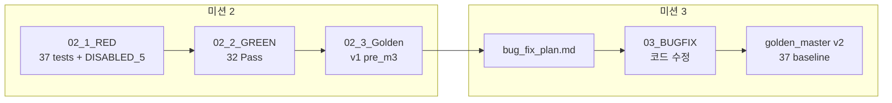
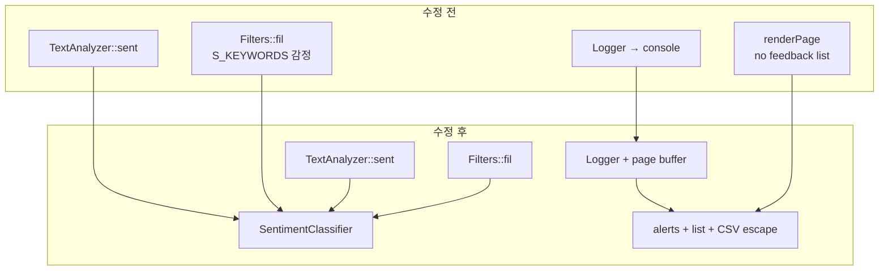

# Feedback Analyzer 11 — 미션 3 버그 수정 보고서

| 항목 | 내용 |
|------|------|
| 문서 번호 | 03_BUGFIX |
| 프로젝트 | FeedbackAnalyzer_11 (리팩토링 챌린지) |
| 미션 | **3** — 페이지 로그, 멀티라인, 중립 필터 (~1.5h) |
| 선행 문서 | [02_1_RED.md](02_1_RED.md) §4.5, [02_2_GREEN.md](02_2_GREEN.md), [02_3_Golden.md](02_3_Golden.md) |
| 작업 플랜 | [docs/bug_fix_plan.md](../docs/bug_fix_plan.md) |
| 요약 문서 | [docs/bug_fix.md](../docs/bug_fix.md) |
| 검증 일시 | 2026-05-22 (로컬 `ctest`) |
| 문서 버전 | 1.0 |

---

## 1. 개요 (Executive Summary)

미션 2 GREEN에서 **32 Pass**로 고정한 회귀와 **`DISABLED_` 5건**으로 문서화한 M3 RED 버그를, 미션 3에서 **최소 범위 코드 수정**으로 해소했다. 감정 분류 단일화·키워드 `main` 매칭·Logger 페이지 연동·멀티라인 UX를 반영했고, **2차 GREEN**으로 **`ctest` 37/37 Pass** 및 **골든 마스터 v2** 를 확정했다.

| 구분 | M2 GREEN (수정 전) | M3 BUGFIX (본 문서) |
|------|-------------------|---------------------|
| 활성 테스트 | 32 Pass | **37 Pass** |
| DISABLED | 5 Not Run | **0** |
| 감정 규칙 | `sent()` / `fil()` 이중 | **`SentimentClassifier` 단일** |
| Logger | 콘솔만 | **warning/error → 페이지 alert** |
| 멀티라인 | 미검증 | **목록 표시 + CSV 이스케이프** |
| 골든 마스터 | v1.0.0 | **v2.0.0** |
| 비즈니스 로직 | 변경 없음 | **M3 범위만 수정** |

**결론: 미션 3 완료** — `.cursorrules` AC 3항 + 회귀 5건 + `ctest` 37/37 + golden v2.

---

## 2. 미션 3 정의 (2차 GREEN)

### 2.1 클래식 TDD vs 본 프로젝트 M3

| | 클래식 GREEN | FeedbackAnalyzer 미션 3 |
|---|--------------|---------------------------|
| 선행 | RED 전부 Fail | M2에서 **`DISABLED_`로 RED 스펙** |
| 코드 변경 | 최소 구현 추가 | **버그·UX만** (전면 재작성 금지) |
| Pass 기준 | 새 테스트 통과 | **DISABLED 제거 후 37 Pass** |
| 네이밍·M7 | — | **미수행** (M4/M7) |

### 2.2 RED → GREEN → BUGFIX 흐름



| 단계 | 보고서 | 산출물 | 코드 변경 |
|------|--------|--------|-----------|
| M2 RED | `02_1_RED.md` | `DISABLED_Regression_*`, F05 | 없음 |
| M2 GREEN | `02_2_GREEN.md` | 32 Pass 검증 | ParseUtils만 |
| GOLDEN v1 | `02_3_Golden.md` | `golden_master.json` v1 | 없음 |
| **M3 BUGFIX** | **본 문서** | v2, `docs/bug_fix.md` | **SentimentClassifier 등** |

---

## 3. 완료 기준 (Acceptance Criteria)

[`.cursorrules`](../.cursorrules) 미션 3 섹션 및 [docs/bug_fix_plan.md](../docs/bug_fix_plan.md).

| AC | 내용 | 검증 | 상태 |
|----|------|------|------|
| AC-1 | 「중립」 필터 = `sent()` 중립 집계 | REG-0~3 Pass | ✅ |
| AC-2 | `logWarning` / `logError` 페이지 alert | `Logger` + `renderPage` | ✅ |
| AC-3 | 멀티라인 analyze·표시·다운로드 | 목록 UI + `escapeCsvField` | ✅ |
| AC-4 | `ctest` 37/37, Disabled 0 | `ctest --output-on-failure` | ✅ |
| AC-5 | 골든 마스터 v2 | `golden_master.json` 2.0.0 | ✅ |

---

## 4. 수정 버그 상세

### 4.1 I-01 — 중립 필터 불일치 (P0)

**원인**: `TextAnalyzer::sent()`는 `Constants::SENTIMENT_KEYWORDS`(긍/부만, 기본 중립), `Filters::fil()`은 `Filters::S_KEYWORDS`(중립 키워드·`괜찮` 긍정 중복) 사용.

**재현 (수정 전)**

| ID | 입력 | `sent` 중립 | `fil(중립)` | gtest (활성화 시) |
|----|------|-------------|-------------|-------------------|
| REG-1 | `"괜찮해요"` | 1 | 0 | Fail |
| REG-2 | `"괜찮한데 배송은 보통이에요"` | 1 | 0 | Fail |
| REG-3 | `"오늘 날씨 좋음"` | 1 | 1 | Pass |
| REG-0 | 위 3 + `"보통 그냥 무난"` | 3 | 2 | Fail |

**수정**

- 신규 `SentimentClassifier::classifySentiment()` — `Constants::SENTIMENT_KEYWORDS` 단일 소스
- `TextAnalyzer::sent()`, `Filters::fil()` 감정 분기에서 공통 호출
- `tests/regression_neutral_filter_test.cpp` — `DISABLED_` 접두사 제거 (4건)

**수정 후**: REG-0~3 **Pass**, `sent` 중립 건수 == `fil(중립)` size.

```cpp
std::string SentimentClassifier::classifySentiment(const std::string& text) {
    if (containsAny(text, Constants::SENTIMENT_KEYWORDS[u8"긍정"])) return u8"긍정";
    if (containsAny(text, Constants::SENTIMENT_KEYWORDS[u8"부정"])) return u8"부정";
    return u8"중립";
}
```

---

### 4.2 I-02 — 키워드 필터 `main` 스킵 (P0)

**원인**: `Filters::fil()` 키워드 루프에서 `main` 서브맵만 `continue`. `TextAnalyzer::kw()`는 `main`만 사용 → 집계·필터 불일치.

```cpp
// 수정 전
if (subEntry.first == "main") continue;
```

**수정**: `main` 포함 모든 서브맵에서 `SentimentClassifier::containsAny` 검사.

**테스트**: `DISABLED_F05_KeywordSkipsMain` → `F05_KeywordSkipsMain`, `fil(전체, 배송)` + `"배송"` → **Pass**.

---

### 4.3 I-03 — Logger 미연동

**원인**: `Logger`는 stdout/stderr만; `renderPage`는 라우트가 alert 문자열을 별도 하드코딩.

**수정**

| API | 동작 |
|-----|------|
| `clearPageMessages()` | POST 핸들러 시작 시 초기화 |
| `logWarning` / `logError` | 콘솔 + `pageWarning` / `pageError` 저장 |
| `getPageWarning()` / `getPageError()` | `renderPage` alert에 전달 |

| level | CSS |
|-------|-----|
| warning | `.alert-warning` |
| error | `.alert-danger` |

---

### 4.4 I-04 — 멀티라인·CSV

**원인**: 피드백 본문 HTML 미표시; CSV `text + "\n"` 단순 연결로 줄바꿈·쉼표 시 레코드 깨짐.

| 구간 | 수정 |
|------|------|
| 입력 | `/analyze` 앞뒤 trim만, 내부 `\n` 유지 |
| 표시 | 「피드백 목록」+ `escapeHtml` (`\n` → `<br>`) + `pre-wrap` |
| 다운로드 | `escapeCsvField()` RFC 4180 스타일 |

---

## 5. 구현·산출물

### 5.1 신규·변경 소스

| 파일 | 변경 |
|------|------|
| `src/cpp/SentimentClassifier.h` | **신규** — `classifySentiment`, `containsAny` |
| `src/cpp/SentimentClassifier.cpp` | **신규** |
| `src/cpp/TextAnalyzer.h` / `.cpp` | `sent`/`kw` 구현 분리, 분류 위임 |
| `src/cpp/Filters.h` / `.cpp` | 감정 단일화, `main` 스킵 제거 |
| `src/cpp/Logger.h` / `.cpp` | 페이지 메시지 버퍼 |
| `src/cpp/main.cpp` | Logger·목록·CSV |
| `CMakeLists.txt` | `SentimentClassifier.cpp` 양 타깃 |

### 5.2 테스트·기준선

| 파일 | 변경 |
|------|------|
| `tests/regression_neutral_filter_test.cpp` | REG 4건 활성화 |
| `tests/filters_test.cpp` | F05 활성화 |
| `tests/fixtures/golden_master.json` | v2.0.0, mission 3 |

### 5.3 문서

| 경로 | 역할 |
|------|------|
| [docs/bug_fix_plan.md](../docs/bug_fix_plan.md) | 작업 플랜 (사전) |
| [docs/bug_fix.md](../docs/bug_fix.md) | 기술 요약 |
| [docs/golden_master.md](../docs/golden_master.md) | v2 갱신 |
| [Report/03_BugFix.md](03_BugFix.md) | **본 보고서** |

### 5.4 범위 밖 (의도적 미수정)

- `httplib.h`, `build/` 커밋
- `/upload` 분석 생략, `fil_data` 잔존
- 미션 4 네이밍 (`fil`→`filterFeedbacks` 등)
- 미션 7 Trend / File DB

---

## 6. 검증 실행 결과

### 6.1 빌드·ctest

```powershell
cmake -S . -B build
cmake --build build --target feedback_analyzer_tests
cd build
ctest --output-on-failure
```

| 항목 | M2 (02_GREEN) | M3 (본 문서) |
|------|---------------|--------------|
| 등록 | 37 | 37 |
| **Passed** | 32 | **37** |
| **Failed** | 0 | 0 |
| **Disabled** | 5 | **0** |
| 요약 | `32 passed` | **`37 passed`** |

### 6.2 M3 승격 테스트 (5건)

| ID | gtest_name | M2 (DISABLED 실행) | M3 |
|----|------------|-------------------|-----|
| REG-1 | `Regression_NeutralFilterMismatch_Case1_Gwaenchan` | Fail | **Pass** |
| REG-2 | `Regression_NeutralFilterMismatch_Case2_GwaenchanInSentence` | Fail | **Pass** |
| REG-3 | `Regression_NeutralFilterMismatch_Case3_NoKeywordDefaultsNeutral` | Pass | **Pass** |
| REG-0 | `Regression_NeutralFilterMismatch` | Fail | **Pass** |
| F-05 | `F05_KeywordSkipsMain` | Pass (오탐) | **Pass** (의도 반영) |

### 6.3 활성 32건 회귀

M3 수정 후 S/K/F/U/C/COV **전부 Pass** — 기존 동작 회귀 없음.

### 6.4 골든 마스터 v2

| 필드 | v1 (02_GOLDEN) | v2 (M3) |
|------|----------------|---------|
| version | 1.0.0 | **2.0.0** |
| mission | 2 | **3** |
| baseline | 32 | **37** |
| bug_m3_red | 5 | **0** (승격) |

경로: [tests/fixtures/golden_master.json](../tests/fixtures/golden_master.json)

---

## 7. 아키텍처 변화



---

## 8. 수동 검증 (웹 UI)

```powershell
cmake --build build --target feedback_analyzer
.\build\feedback_analyzer.exe
# http://localhost:8080
```

| # | 시나리오 | 기대 |
|---|----------|------|
| M1 | `"괜찮해요"` → 분석 → 필터 「중립」 | 중립 통계 = 필터 1건 |
| M2 | 데이터 없이 「분 석」 | `.alert-warning` |
| M3 | textarea `줄1` + Enter + `줄2` | 목록 2줄, CSV 줄바꿈 유지 |

> 실행 중 프로세스가 있으면 exe 링크 Permission denied 가능 — 종료 후 재빌드.

---

## 9. 미션 3 완료 체크리스트

- [x] AC-1 ~ AC-5 충족
- [x] `SentimentClassifier` 도입
- [x] REG 4건 + F05 활성 Pass
- [x] `ctest` 37/37
- [x] golden_master.json v2
- [x] [README.md](../README.md) 미션 3 완료 표시
- [x] `httplib.h` / 전면 재작성 없음

---

## 10. 다음 단계

| 미션 | 보고서 (예정) | 내용 |
|------|---------------|------|
| 4 | [04_Refactoring_네이밍,전역,매직.md](04_Refactoring_네이밍,전역,매직.md) | 네이밍, 전역, 매직 값 |
| 5 | — | 긴 함수, `containsAny` 중복 |
| 6 | — | 팀 자율 리팩토링 1건 |
| 7 | — | Trend + File DB |
| 8 | — | 팀 리뷰·발표 |

---

## 11. 참고 문서

| 경로 | 설명 |
|------|------|
| [01_분석.md](01_분석.md) | 전체 구조·미션 로드맵 |
| [02_1_RED.md](02_1_RED.md) | M3 RED 회귀 §4.5 |
| [02_2_GREEN.md](02_2_GREEN.md) | M2 GREEN |
| [02_3_Golden.md](02_3_Golden.md) | 골든 v1 |
| [docs/bug_fix_plan.md](../docs/bug_fix_plan.md) | M3 작업 플랜 |
| [docs/bug_fix.md](../docs/bug_fix.md) | M3 기술 요약 |
| [docs/golden_master.md](../docs/golden_master.md) | 골든 v2 |
| [docs/analyzer.md](../docs/analyzer.md) §9 | 알려진 이슈 |
| [04_Refactoring_네이밍,전역,매직.md](04_Refactoring_네이밍,전역,매직.md) | M4 REFACTOR |
