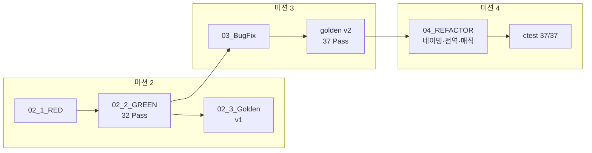
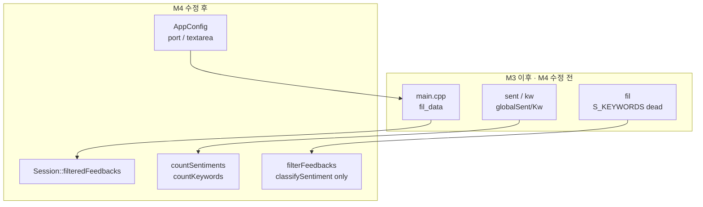

# Feedback Analyzer 11 — 미션 4 리팩토링 보고서 (네이밍·전역·매직 값)

| 항목 | 내용 |
|------|------|
| 문서 번호 | 04_REFACTOR |
| 프로젝트 | FeedbackAnalyzer_11 (리팩토링 챌린지) |
| 미션 | **4** — 네이밍, 전역 변수, 매직 값 (~1h) |
| 선행 문서 | [03_BugFix.md](03_BugFix.md), [02_2_GREEN.md](02_2_GREEN.md), [02_3_Golden.md](02_3_Golden.md) |
| Agent 프롬프트 | [Prompting/04_Mission4_prompt.md](../Prompting/04_Mission4_prompt.md) |
| 검증 일시 | 2026-05-22 (로컬 `ctest` + `run_coverage.ps1`) |
| 문서 버전 | 1.0 |

---

## 1. 개요 (Executive Summary)

미션 3에서 확정한 **37 Pass·golden v2** 동작을 유지한 채, 의도적 코드 스멜 중 **축약 네이밍·전역 상태·매직/하드코딩·죽은 코드**를 정리했다. 비즈니스 로직(`SentimentClassifier`, 중립 필터, Logger·멀티라인)은 변경하지 않았고, **회귀 테스트 37건 전부 Pass** 및 **도메인 line coverage 100%** 로 REFACTOR 완료를 확인했다.

| 구분 | M3 BUGFIX (수정 전) | M4 REFACTOR (본 문서) |
|------|----------------------|------------------------|
| `ctest` | 37 Pass | **37 Pass** (동일) |
| API 이름 | `fil`, `sent`, `kw` | **`filterFeedbacks`, `countSentiments`, `countKeywords`** |
| 다운로드 상태 | `main.cpp` `fil_data` | **`Session::filteredFeedbacks`** |
| 분석 캐시 | `globalSent`, `globalKw` (미참조) | **제거** (반환값만 사용) |
| 필터 키워드 | `S_KEYWORDS` + `initFilterKeywords()` (dead) | **제거** |
| 서버/UI 매직 | `8080`, `100px` 리터럴 | **`AppConfig` 상수** |
| 골든 마스터 | v2.0.0 | **v2 유지** (동작 동일, gtest 이름은 레거시 유지) |

**결론: 미션 4 완료** — [.cursorrules](../.cursorrules) 네이밍 규칙 + `ctest` 37/37 + coverage ≥ 90%.

---

## 2. 미션 4 정의 (REFACTOR)

### 2.1 클래식 TDD vs 본 프로젝트 M4

| | 클래식 RED→GREEN | FeedbackAnalyzer 미션 4 |
|---|------------------|---------------------------|
| 선행 | 실패 테스트 작성 | **M3 GREEN 37 Pass** (기준선 고정) |
| 코드 변경 | 최소 구현 | **이름·상태·상수만** (동작 동일) |
| RED | 신규 Fail | **별도 RED 단계 없음** |
| GREEN | Fail→Pass | **기존 37건 Pass 유지** = 회귀 GREEN |
| Golden v3 | — | **필수 아님** (v2 스냅샷·동작 동일) |

### 2.2 미션 2~4 흐름



| 단계 | 보고서 | 검증 방식 |
|------|--------|-----------|
| M2 RED/GREEN | `02_1_RED`, `02_2_GREEN` | 테스트 구축 + 32 Pass |
| M3 BUGFIX | `03_BugFix` | DISABLED 5건 해소 → 37 Pass |
| **M4 REFACTOR** | **본 문서** | **37 Pass 유지** (신규 Fail 0) |

---

## 3. 완료 기준 (Acceptance Criteria)

[`.cursorrules`](../.cursorrules) 네이밍 규칙 및 [README.md](../README.md) 미션 4 항목.

| AC | 내용 | 검증 | 상태 |
|----|------|------|------|
| AC-1 | `fil`→`filterFeedbacks` 등 API 리네이밍 | 소스·tests 전역 치환 | ✅ |
| AC-2 | `fil_data`·`globalSent`/`globalKw` 정리 | `Session`, `TextAnalyzer` | ✅ |
| AC-3 | 포트·textarea 등 매직 값 상수화 | `AppConfig.h` | ✅ |
| AC-4 | 미사용 `S_KEYWORDS` 제거 | `Filters` 단순화 | ✅ |
| AC-5 | `ctest` 37/37, Disabled 0 | `ctest --output-on-failure` | ✅ |
| AC-6 | 도메인 coverage ≥ 90% | `run_coverage.ps1` | ✅ (100%) |

**범위 밖 (의도적 미수정)**

- `renderPage` / `main()` 분해, `containsAny` 통합 → **미션 5**
- 라우트·HTML 구조 분리 → **미션 6**
- Trend, File DB → **미션 7**
- `classifySentiment` 규칙 변경, `httplib.h` / `build/` 커밋

---

## 4. 리네이밍 (Naming)

### 4.1 공개 API

| 이전 | 이후 | 위치 |
|------|------|------|
| `Filters::fil()` | `Filters::filterFeedbacks()` | `Filters.h`, `Filters.cpp` |
| `TextAnalyzer::sent()` | `TextAnalyzer::countSentiments()` | `TextAnalyzer.h`, `TextAnalyzer.cpp` |
| `TextAnalyzer::kw()` | `TextAnalyzer::countKeywords()` | 동일 |
| `sFilter` | `sentimentFilter` | `filterFeedbacks` 매개변수 |
| `kFilter` | `keywordFilter` | 동일 |

### 4.2 세션·main

| 이전 | 이후 | 위치 |
|------|------|------|
| `static fil_data` | `Session::filteredFeedbacks` | `Session.h`, `main.cpp` `/download`, `/filter` |
| `initSessionStateUgly()` | `initSessionState()` | `Session.h`, `main.cpp` `/` |
| `getOldDataFromSession()` | `getCurrentFeedbacks()` | `main.cpp` `/` (중복 API 제거) |

### 4.3 테스트

`tests/filters_test.cpp`, `tests/text_analyzer_test.cpp`, `tests/regression_neutral_filter_test.cpp`, `tests/coverage_gap_test.cpp` — 호출부를 새 API 이름으로 동기화.

> gtest **케이스 이름**(`F01_Fil_*`, `S01_Sent_*` 등)은 golden v2·문서 ID와의 대응을 위해 **유지**. 동작 검증은 새 구현체를 대상으로 수행.

---

## 5. 전역 변수 정리 (Global State)

### 5.1 `fil_data` → Session 캡슐화

**수정 전**: `main.cpp` 파일 스코프 `static std::vector<Feedback> fil_data` — `/filter` 후 `/download` 전용.

**수정 후**:

```cpp
// Session.h
static void setFilteredFeedbacks(const std::vector<Feedback>& feedbacks);
static const std::vector<Feedback>& getFilteredFeedbacks();
```

- `/filter` 성공 시 `Session::setFilteredFeedbacks(filtered)`
- `/download`는 `Session::getFilteredFeedbacks()` 순회

**동작**: 필터 결과 CSV 다운로드 흐름은 M3와 동일. `/` 접속 시 filtered 목록 초기화는 **미수행** (M3 이후 알려진 이슈, M4 범위 밖).

### 5.2 `globalSent` / `globalKw` 제거

**수정 전**: `TextAnalyzer` static 맵에 결과 복사 후 **다른 모듈에서 미참조**.

**수정 후**: `countSentiments` / `countKeywords`가 `std::map`을 **반환만** 함. COV-G01/G02 테스트는 반환값 비교로 동일 검증 유지.

---

## 6. 매직 값·Dead Code (Magic / Hardcoding)

### 6.1 `AppConfig.h` (신규)

| 상수 | 값 | 용도 |
|------|-----|------|
| `kServerPort` | 8080 | `svr.listen`, 로그 URL |
| `kServerHost` | `"0.0.0.0"` | 바인드 주소 |
| `kTextareaHeightPx` | 100 | `renderPage` CSS `textarea` 높이 |

### 6.2 `Filters::S_KEYWORDS` 제거

M3 이후 `filterFeedbacks` 감정 분기는 `SentimentClassifier::classifySentiment()`만 사용. `S_KEYWORDS`·`initFilterKeywords()`는 **초기화만 되고 필터 로직에서 미사용** → 삭제.

| 제거 항목 | 이유 |
|-----------|------|
| `Filters::S_KEYWORDS` static 맵 | dead data |
| `Filters::initFilterKeywords()` | 호출처 없음 |
| `test_fixture.h`의 `initFilterKeywords()` | 불필요 |

키워드 필터는 계속 `Constants::CATEGORY_KEYWORDS`만 사용 (M3 F05 `main` 매칭 포함).

---

## 7. 수정 파일 목록

| 파일 | 변경 요약 |
|------|-----------|
| `src/cpp/Filters.h`, `Filters.cpp` | API 리네이밍, S_KEYWORDS 제거 |
| `src/cpp/TextAnalyzer.h`, `TextAnalyzer.cpp` | API 리네이밍, global* 제거 |
| `src/cpp/Session.h`, `Session.cpp` | `filteredFeedbacks`, API 정리 |
| `src/cpp/main.cpp` | 새 API·Session·AppConfig |
| `src/cpp/AppConfig.h` | **신규** — 서버/UI 상수 |
| `tests/test_fixture.h` | `initFilterKeywords` 제거 |
| `tests/*.cpp` | API 호출부 동기화 |
| [README.md](../README.md) | 미션 4 완료 표시 |

**미변경**: `SentimentClassifier.*`, `Constants.*`, `Logger.*`, `ParseUtils.*`, `tests/fixtures/golden_master.json` (v2 유지).

---

## 8. 검증 실행 결과 (GREEN 회귀)

### 8.1 빌드·ctest

```powershell
cmake --build build --target feedback_analyzer_tests
cd build
ctest --output-on-failure
```

| 항목 | M3 (03_BugFix) | M4 (본 문서) |
|------|----------------|--------------|
| 등록 | 37 | 37 |
| **Passed** | 37 | **37** |
| **Failed** | 0 | **0** |
| **Disabled** | 0 | **0** |
| 요약 | `37 passed` | **`37 passed`** |

REG-0~3(중립 필터), F05(`main` 키워드), S/K/F/U/C/COV **전부 Pass** — 리네이밍 후 동작 회귀 없음.

### 8.2 커버리지

```powershell
.\scripts\run_coverage.ps1
```

| 항목 | M3 기준 | M4 |
|------|---------|-----|
| 도메인 line | 100% (134/134) | **100% (175/175)** |
| 90% 미만 파일 | 없음 | **없음** |

> `globalSent`/`globalKw` 제거로 `TextAnalyzer` 라인 수 감소. `Filters`에서 dead code 제거 후에도 분기 커버리지 100% 유지.

### 8.3 RED 단계에 대한 설명

본 미션은 **신규 실패 테스트를 작성하지 않았다**. RED는 M2/M3에서 이미 수행되었고, M4는 **동작 불변 REFACTOR**이므로 **GREEN = 기존 37건 Pass 재확인**이 공식 검증이다.

---

## 9. 아키텍처 변화



---

## 10. BAD / GOOD 예시 (교육용)

```cpp
// BAD — 축약 API (M4 이전)
auto r = filters.fil(data, u8"중립", u8"전체");
textAnalyzer.sent(feedbacks);

// GOOD — 의미 있는 이름 (M4)
auto r = filters.filterFeedbacks(data, u8"중립", u8"전체");
textAnalyzer.countSentiments(feedbacks);
```

```cpp
// BAD — main 전역 + 미사용 static
static std::vector<Feedback> fil_data;
TextAnalyzer::globalSent = res;

// GOOD — Session + 반환값
Session::setFilteredFeedbacks(filtered);
return res;  // countSentiments
```

```cpp
// BAD — 매직 리터럴 + dead init
Filters::initFilterKeywords();
svr.listen("0.0.0.0", 8080);

// GOOD
svr.listen(AppConfig::kServerHost, AppConfig::kServerPort);
```

---

## 11. 미션 4 완료 체크리스트

- [x] AC-1 ~ AC-6 충족
- [x] `filterFeedbacks` / `countSentiments` / `countKeywords`
- [x] `Session::filteredFeedbacks`, `globalSent`/`globalKw` 제거
- [x] `AppConfig.h`, `S_KEYWORDS` dead code 제거
- [x] `ctest` 37/37
- [x] 도메인 coverage 100%
- [x] [README.md](../README.md) 미션 4 완료
- [x] M5/M7·`classifySentiment` 변경 없음

---

## 12. 다음 단계

| 미션 | 보고서 (예정) | 내용 |
|------|---------------|------|
| 5 | [05_Refactoring_긴함수,중복.md](05_Refactoring_긴함수,중복.md) | `renderPage`·핸들러·`ParseUtils` |
| 6 | — | 팀 자율 리팩토링 1건 |
| 7 | — | Trend + File DB |
| 8 | — | 팀 리뷰·발표 |

---

## 13. 참고 문서

| 경로 | 용도 |
|------|------|
| [03_BugFix.md](03_BugFix.md) | 선행 M3 버그 수정 |
| [02_2_GREEN.md](02_2_GREEN.md) | M2 GREEN 정의 |
| [02_3_Golden.md](02_3_Golden.md) | 골든 마스터 v1 |
| [docs/golden_master.md](../docs/golden_master.md) | v2 (M3, M4에서 유지) |
| [Prompting/04_Mission4_prompt.md](../Prompting/04_Mission4_prompt.md) | Agent 프롬프트 |
| [docs/analyzer.md](../docs/analyzer.md) §8 | 코드 스멜 매핑 |

---

*본 보고서는 미션 4 REFACTOR(네이밍·전역·매직 값) 완료를 문서화한 공식 Report 시리즈 04번 문서이다.*
