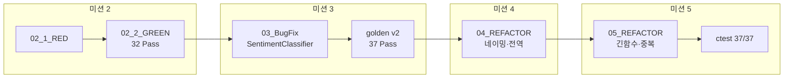
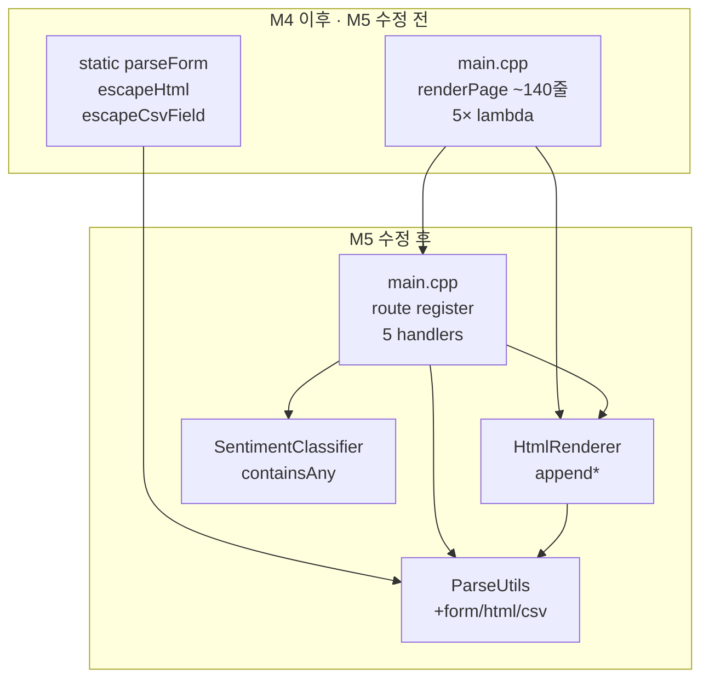

# Feedback Analyzer 11 — 미션 5 리팩토링 보고서 (긴 함수·중복 코드)

| 항목 | 내용 |
|------|------|
| 문서 번호 | 05_REFACTOR |
| 프로젝트 | FeedbackAnalyzer_11 (리팩토링 챌린지) |
| 미션 | **5** — 긴 함수, 중복 코드 (~1.5h) |
| 선행 문서 | [04_Refactoring_네이밍,전역,매직.md](04_Refactoring_네이밍,전역,매직.md), [03_BugFix.md](03_BugFix.md) |
| 검증 일시 | 2026-05-22 (로컬 `ctest` + `run_coverage.ps1`) |
| 문서 버전 | 1.0 |

---

## 1. 개요 (Executive Summary)

미션 4에서 확정한 **37 Pass·golden v2·의미 있는 API 이름**을 유지한 채, `main.cpp`의 **God Object·긴 함수(Long Method)·중복 유틸** 스멜을 완화했다. `renderPage`(~140줄)는 **`HtmlRenderer`**로 분리하고, HTTP 라우트 5개는 **named handler**로 추출했다. `parseForm` / `escapeHtml` / `escapeCsvField`는 **`ParseUtils`**로 이동했다. `containsAny`는 미션 3에서 이미 **`SentimentClassifier` 단일화**되어 있어 규칙 변경 없이 유지했다.

| 구분 | M4 REFACTOR (수정 전) | M5 REFACTOR (본 문서) |
|------|------------------------|------------------------|
| `ctest` | 37 Pass | **37 Pass** (동일) |
| `main.cpp` 규모 | ~371줄, `renderPage` + 인라인 람다 5개 | **~165줄**, 핸들러 5개 + 라우트 등록 |
| HTML 렌더링 | `main.cpp` `static renderPage()` | **`HtmlRenderer::renderPage()`** + `append*` |
| 폼/HTML/CSV 유틸 | `main.cpp` static 3함수 | **`ParseUtils::parseForm` 등** |
| `containsAny` | `SentimentClassifier` 단일 (M3) | **변경 없음** |
| 골든 마스터 | v2.0.0 | **v2 유지** (동작 동일) |

**결론: 미션 5 완료** — `ctest` 37/37 + 도메인 line coverage **100%** + `feedback_analyzer` 빌드 성공.

---

## 2. 미션 5 정의 (REFACTOR)

### 2.1 클래식 TDD vs 본 프로젝트 M5

| | 클래식 RED→GREEN | FeedbackAnalyzer 미션 5 |
|---|------------------|---------------------------|
| 선행 | 실패 테스트 작성 | **M4 GREEN 37 Pass** (기준선 고정) |
| 코드 변경 | 최소 구현 | **구조 분리만** (Extract Function/Class) |
| RED | 신규 Fail | **별도 RED 단계 없음** |
| GREEN | Fail→Pass | **기존 37건 Pass 유지** = 회귀 GREEN |
| Golden v3 | — | **필수 아님** (v2·동작 동일) |

### 2.2 미션 2~5 흐름



| 단계 | 보고서 | 검증 방식 |
|------|--------|-----------|
| M2 RED/GREEN | `02_1_RED`, `02_2_GREEN` | 테스트 구축 + 32 Pass |
| M3 BUGFIX | `03_BugFix` | DISABLED 5건 해소 → 37 Pass |
| M4 REFACTOR | `04_Refactoring_네이밍,전역,매직` | 37 Pass 유지 |
| **M5 REFACTOR** | **본 문서** | **37 Pass 유지** (신규 Fail 0) |

---

## 3. 완료 기준 (Acceptance Criteria)

[`.cursorrules`](../.cursorrules) P2, [README.md](../README.md) 미션 5, [project_purpose.md](../project_purpose.md) §6.1.

| AC | 내용 | 검증 | 상태 |
|----|------|------|------|
| AC-1 | `renderPage` 단일 거대 함수 제거 | `HtmlRenderer` + `append*` | ✅ |
| AC-2 | `main()` 라우트 named handler 분리 | `handleGet*` / `handlePost*` | ✅ |
| AC-3 | `parseForm` / `escapeHtml` / `escapeCsvField` 공통화 | `ParseUtils` | ✅ |
| AC-4 | `containsAny` 단일 구현 유지 | `SentimentClassifier` (M3) | ✅ |
| AC-5 | `ctest` 37/37, Disabled 0 | `ctest --output-on-failure` | ✅ |
| AC-6 | 도메인 coverage ≥ 90% | `run_coverage.ps1` | ✅ (100%) |

**범위 밖 (의도적 미수정)**

- `classifySentiment` / `filterFeedbacks` / `countSentiments` **규칙** 변경
- M6: `handlers/`·`services/` **전체** 디렉터리 분리
- M7: Trend, File DB
- `FileHandler` 제거·연동, `httplib.h` / `build/` 커밋

---

## 4. 긴 함수 분해 — `HtmlRenderer`

### 4.1 문제 (M4 이전)

`main.cpp`의 `static renderPage()` 한 함수에 다음이 혼재:

- HTML `<head>` + CSS (`AppConfig::kTextareaHeightPx` 포함)
- success / warning / error alert
- 입력·업로드·필터 폼 (`UIComponents::getCategories()`)
- 감정·키워드 통계 + 다운로드 링크
- 피드백 목록 (`escapeHtml`, 멀티라인 `<br>`)

→ **Long Method** + **God Function** (`main.cpp` 집중).

### 4.2 적용 기법: Extract Function (+ 파일 분리)

| 함수 (anonymous namespace) | 책임 |
|----------------------------|------|
| `appendPageHead` | DOCTYPE, CSS, 컨테이너 시작 |
| `appendSuccessAlert` | `.alert-success` + 타임스탬프 |
| `appendWarningAlert` | `.alert-warning` |
| `appendErrorAlert` | `.alert-danger` |
| `appendInputSection` | `POST /analyze` 폼 |
| `appendUploadSection` | `POST /upload` multipart |
| `appendFilterSection` | `POST /filter` + 카테고리 `<select>` |
| `appendStatsSection` | 감정·키워드 분포 + `/download` 버튼 |
| `appendFeedbackList` | 피드백 `<ul>` |
| `HtmlRenderer::renderPage` | 위 섹션 **조합만** |

**공개 API** (`HtmlRenderer.h`):

```cpp
static std::string renderPage(const std::string& success,
                              const std::string& warning,
                              const std::string& error,
                              const std::map<std::string, int>& sentimentResults,
                              const std::map<std::string, int>& keywordResults,
                              const std::vector<Feedback>& feedbacks);
```

라우트·핸들러는 `HtmlRenderer::renderPage(...)`만 호출 — M4와 동일한 인자·HTML 출력.

---

## 5. God Object 완화 — 라우트 핸들러

### 5.1 `main()` 축소

**수정 전**: `main()` 내부에 5개 **인라인 람다** (각 20~40줄).

**수정 후**:

| 핸들러 | HTTP | 역할 |
|--------|------|------|
| `handleGetRoot` | `GET /` | `Session::initSessionState`, 시작 메시지 |
| `handlePostAnalyze` | `POST /analyze` | 폼 파싱, trim, `countSentiments`/`countKeywords` |
| `handlePostUpload` | `POST /upload` | CSV 파싱, `parseCsvLine` |
| `handlePostFilter` | `POST /filter` | `filterFeedbacks`, filtered 통계 |
| `handleGetDownload` | `GET /download` | UTF-8 BOM CSV, `escapeCsvField` |

`main()` 본문:

```cpp
svr.Get("/", handleGetRoot);
svr.Post("/analyze", handlePostAnalyze);
svr.Post("/upload", handlePostUpload);
svr.Post("/filter", handlePostFilter);
svr.Get("/download", handleGetDownload);
svr.listen(AppConfig::kServerHost, AppConfig::kServerPort);
```

공통 응답: `respondHtml(res, html)` — `text/html; charset=UTF-8` 한 곳에서 설정.

### 5.2 `handlePostFilter` 가독성

중첩 `if/else`를 **early return**으로 정리. 분기 결과는 M4와 동일:

- 피드백 없음 → `Logger::logWarning` + warning alert
- 필터 결과 없음 → 동일
- 성공 → `setFilteredFeedbacks` + 통계 + filtered 목록 HTML

---

## 6. 중복 코드 — `ParseUtils` 확장

### 6.1 M3에서 이미 해소: `containsAny`

| 시점 | 상태 |
|------|------|
| M2 이전 (의도 스멜) | `TextAnalyzer`, `Filters` 각각 동일 `containsAny` |
| M3 BUGFIX | `SentimentClassifier::containsAny` **단일 구현** |
| **M5** | 호출부·규칙 **미변경** (AC-4) |

미션 5의 「중복 코드」 항목 중 `containsAny`는 **M3 완료분 유지 확인**으로 처리.

### 6.2 M5에서 이동한 유틸

| 함수 | 이전 | 이후 | 사용처 |
|------|------|------|--------|
| `parseForm` | `main.cpp` static | `ParseUtils::parseForm` | `/analyze`, `/filter` |
| `escapeHtml` | `main.cpp` static | `ParseUtils::escapeHtml` | `HtmlRenderer`, alerts |
| `escapeCsvField` | `main.cpp` static | `ParseUtils::escapeCsvField` | `/download` |

`urlDecode` / `parseCsvLine`은 M2부터 `ParseUtils`에 있음 — **파싱·이스케이프가 한 모듈**로 모임.

> `parseForm` / `escapeHtml` / `escapeCsvField`는 **도메인 커버리지 대상 밖** (`main.cpp`·`HtmlRenderer` 경로). 회귀는 **37 gtest**로 보장.

---

## 7. 수정 파일 목록

| 파일 | 변경 요약 |
|------|-----------|
| `src/cpp/HtmlRenderer.h`, `HtmlRenderer.cpp` | **신규** — `renderPage` 및 섹션별 `append*` |
| `src/cpp/main.cpp` | 핸들러 추출, `HtmlRenderer`/`ParseUtils` 사용 (~371→~165줄) |
| `src/cpp/ParseUtils.h`, `ParseUtils.cpp` | `parseForm`, `escapeHtml`, `escapeCsvField` 추가 |
| `CMakeLists.txt` | `feedback_analyzer`에 `HtmlRenderer.cpp` 링크 |
| [README.md](../README.md) | 미션 5 완료 표시 |

**미변경**: `SentimentClassifier.*`, `TextAnalyzer.*`, `Filters.*`, `Session.*`, `Logger.*`, `tests/*` (호출 API 동일), `golden_master.json` v2.

---

## 8. 검증 실행 결과 (GREEN 회귀)

### 8.1 빌드·ctest

```powershell
cmake --build build --target feedback_analyzer_tests
cd build
ctest --output-on-failure
```

| 항목 | M4 (04_REFACTOR) | M5 (본 문서) |
|------|------------------|--------------|
| 등록 | 37 | 37 |
| **Passed** | 37 | **37** |
| **Failed** | 0 | **0** |
| **Disabled** | 0 | **0** |
| 요약 | `37 passed` | **`37 passed`** |

REG(중립 필터), F05(`main` 키워드), S/K/F/U/C/COV **전부 Pass** — 구조 변경 후 도메인 로직 회귀 없음.

### 8.2 커버리지

```powershell
.\scripts\run_coverage.ps1
```

| 항목 | M4 | M5 |
|------|-----|-----|
| 도메인 line | 100% (175/175) | **100% (175/175)** |
| 90% 미만 파일 | 없음 | **없음** |

도메인 대상: `TextAnalyzer`, `Filters`, `Constants`, `ParseUtils` (`main`·`HtmlRenderer` 제외, [docs/coverage.md](../docs/coverage.md) 동일).

### 8.3 RED / Golden에 대한 설명

| 항목 | M5에서의 처리 |
|------|----------------|
| **RED** | 신규 실패 테스트 없음. M2/M3 RED 스펙은 기존 37건으로 고정. |
| **GREEN** | 리팩토링 후 **37/37 Pass** = 공식 GREEN. |
| **골든 마스터 v3** | 필수 아님. HTTP/HTML은 gtest 미포함; v2·도메인 gtest로 충분. |

---

## 9. 아키텍처 변화



**미션 6 목표 구조 (참고, M5 미수행)**

```
src/cpp/handlers/   ← 라우트 파일 분리 (팀 자율)
src/cpp/web/        ← HtmlRenderer 이동 가능
main.cpp            ← 부트스트랩만
```

---

## 10. BAD / GOOD 예시 (교육용)

```cpp
// BAD — 한 함수에 HTML·폼·통계·목록 (M5 이전)
static std::string renderPage(...) {
    std::ostringstream html;
    html << R"(<!DOCTYPE html>...";  // 100+ lines
    // ...
    return html.str();
}

// GOOD — 섹션 추출 + 조합 (M5)
void appendInputSection(std::ostringstream& html) { /* ... */ }
std::string HtmlRenderer::renderPage(...) {
    std::ostringstream html;
    appendPageHead(html);
    appendInputSection(html);
    // ...
    return html.str();
}
```

```cpp
// BAD — main에 모든 라우트 로직 (M5 이전)
svr.Post("/analyze", [](const httplib::Request& req, httplib::Response& res) {
    // 40 lines ...
});

// GOOD — named handler (M5)
static void handlePostAnalyze(const httplib::Request& req, httplib::Response& res) { /* ... */ }
svr.Post("/analyze", handlePostAnalyze);
```

```cpp
// BAD — containsAny 재구현 (M5 금지)
bool containsAny(...) { /* duplicate in Filters */ }

// GOOD — M3 단일 소스 유지
SentimentClassifier::containsAny(txt, subEntry.second);
```

---

## 11. 미션 5 완료 체크리스트

- [x] AC-1 ~ AC-6 충족
- [x] `HtmlRenderer` 분리, `CMakeLists.txt` 반영
- [x] 라우트 5개 named handler
- [x] `ParseUtils` form/html/csv 유틸
- [x] `containsAny` / `classifySentiment` 규칙 미변경
- [x] `ctest` 37/37
- [x] 도메인 coverage 100%
- [x] `feedback_analyzer` 빌드 성공
- [x] [README.md](../README.md) 미션 5 완료
- [x] M6/M7·`FileHandler` 미수행

---

## 12. 다음 단계

| 미션 | 보고서 (예정) | 내용 |
|------|---------------|------|
| 6 | — | 팀 자율 리팩토링 1건 (`handlers/`, `Router` 등) |
| 7 | — | Trend + File DB |
| 8 | — | 팀 리뷰·발표 |

---

## 13. 참고 문서

| 경로 | 용도 |
|------|------|
| [04_Refactoring_네이밍,전역,매직.md](04_Refactoring_네이밍,전역,매직.md) | 선행 M4 REFACTOR |
| [03_BugFix.md](03_BugFix.md) | `SentimentClassifier`, M3 GREEN |
| [02_2_GREEN.md](02_2_GREEN.md) | M2 GREEN 정의 |
| [docs/analyzer.md](../docs/analyzer.md) §8·§11 | 긴 함수·`containsAny` 스멜 |
| [docs/coverage.md](../docs/coverage.md) | 도메인 커버리지 범위 |
| [docs/golden_master.md](../docs/golden_master.md) | v2 (M5에서 유지) |

---

*본 보고서는 미션 5 REFACTOR(긴 함수·중복 코드) 완료를 문서화한 공식 Report 시리즈 05번 문서이다.*
