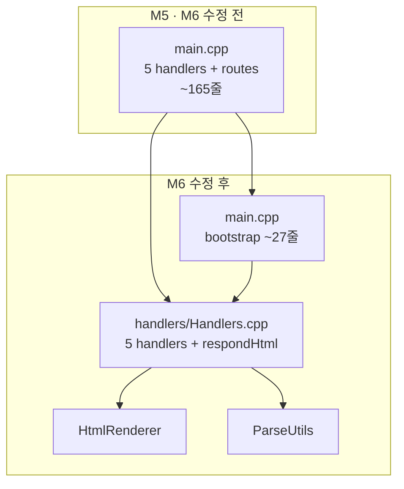

# Feedback Analyzer 11 — 미션 6 리팩토링 보고서 (HTTP 핸들러 분리)

| 항목 | 내용 |
|------|------|
| 문서 번호 | 06_REFACTOR_HANDLERS |
| 프로젝트 | FeedbackAnalyzer_11 (리팩토링 챌린지) |
| 미션 | **6** — 추가 리팩토링 1건 (~1h) |
| 범위 | `main.cpp` HTTP 핸들러 5개 → `src/cpp/handlers/` |
| 선행 문서 | [05_Refactoring_긴함수,중복.md](05_Refactoring_긴함수,중복.md), [03_BugFix.md](03_BugFix.md) |
| 검증 일시 | 2026-05-22 (로컬 `ctest` + `feedback_analyzer` 빌드) |
| 문서 버전 | 1.0 |

> **참고:** [06_Feature_FileHandler.md](06_Feature_FileHandler.md)는 FileHandler CSV 기능 **이력(무효화)** 문서이며, 본 미션 6과 무관하다.

---

## 1. 개요 (Executive Summary)

미션 5에서 `main.cpp`에 남아 있던 **named handler 5개**와 `respondHtml`을 **`handlers/Handlers.*`** 로 이동했다. `main.cpp`는 **앱 부트스트랩**(초기화·라우트 등록·listen·시작 로그)과 **Lava Flow**용 `FileHandler` 선언만 유지한다. HTTP·HTML·필터·다운로드 **동작은 변경하지 않았다**.

| 구분 | M5 (수정 전) | M6 (본 문서) |
|------|--------------|--------------|
| `main.cpp` | ~165줄, 핸들러 5개 + 라우트 등록 | **~27줄**, 라우트 등록만 |
| HTTP 핸들러 | `main.cpp` `static` | **`handlers/Handlers.cpp`** |
| `TextAnalyzer` / `Filters` | `main.cpp` static | **`Handlers.cpp` anonymous namespace** |
| `ctest` | 37 Pass | **37 Pass** |
| `classifySentiment` / `filterFeedbacks` | M3 규칙 | **변경 없음** |

**결론: 미션 6 (handlers 분리) 완료** — `ctest` 37/37 + `feedback_analyzer` 빌드 성공.

---

## 2. 미션 6 정의 (SRP·모듈 경계)

### 2.1 M5와의 경계

| 미션 | 범위 |
|------|------|
| **M5** | 같은 파일 안 Extract — `HtmlRenderer`, named handler, `ParseUtils` |
| **M6** | **폴더·파일 경계** — HTTP 요청 처리 → `handlers/` |
| **M7** | Trend + File DB (기능 추가) |

### 2.2 설계 원칙

- **SRP:** `main.cpp` = 서버 기동·라우팅 등록; `Handlers.cpp` = 요청별 처리
- **1건만:** `handlers/` 분리만 수행 (`web/`, `Router`, `services/` 미수행)

---

## 3. 완료 기준 (Acceptance Criteria)

| AC | 내용 | 검증 | 상태 |
|----|------|------|------|
| AC-1 | 핸들러 5개 `handlers/` 이동 | `Handlers.h` 선언 + `Handlers.cpp` 구현 | ✅ |
| AC-2 | `respondHtml` 핸들러 모듈 내부 정리 | `Handlers.cpp` anonymous namespace | ✅ |
| AC-3 | `main.cpp` 부트스트랩만 | init + 5× 등록 + listen + Logger | ✅ |
| AC-4 | `CMakeLists.txt` 반영 | `handlers/Handlers.cpp` 링크 | ✅ |
| AC-5 | `ctest` 37/37, Disabled 0 | `ctest --output-on-failure` | ✅ |
| AC-6 | M3 동작 유지 | REG·F·S·K·U·C·COV Pass | ✅ |
| AC-7 | Sentiment/filter 규칙 미변경 | 도메인 테스트 Pass | ✅ |
| AC-8 | `httplib.h` 미수정 | diff 없음 | ✅ |

**범위 밖 (의도적 미수정)**

- M7: Trend, File DB, `keywords.json`
- `FileHandler` 제거·연동·CSV 디스크 저장
- `HtmlRenderer` → `web/` 이동, `Router` 전면 도입
- 핸들러 파일 5개로 쪼개기 (본 작업은 **단일 `Handlers.cpp`** 로 1건 유지)

---

## 4. 구조

### 4.1 디렉터리

```
src/cpp/
├── main.cpp                 ← 부트스트랩 (~27줄)
├── handlers/
│   ├── Handlers.h           ← 5개 핸들러 선언
│   └── Handlers.cpp         ← 구현 + respondHtml + textAnalyzer/filters
├── HtmlRenderer.*
├── ParseUtils.*
└── ...
```

### 4.2 라우트 매핑 (M5와 동일)

| 핸들러 | 경로 | 책임 |
|--------|------|------|
| `handleGetRoot` | `GET /` | 세션 초기화, 시작 페이지 |
| `handlePostAnalyze` | `POST /analyze` | 폼 입력, 감성·키워드 통계 |
| `handlePostUpload` | `POST /upload` | CSV 업로드 파싱 |
| `handlePostFilter` | `POST /filter` | `filterFeedbacks`, filtered 통계 |
| `handleGetDownload` | `GET /download` | UTF-8 BOM CSV 다운로드 |

### 4.3 `main.cpp` (부트스트랩)

```cpp
#include "handlers/Handlers.h"

static FileHandler fileHandler;  // Lava Flow — 미호출 유지

int main() {
    Constants::init();
    httplib::Server svr;
    svr.Get("/", handleGetRoot);
    svr.Post("/analyze", handlePostAnalyze);
    // ...
    Logger::logInfo(u8"서버가 http://localhost:...");
    svr.listen(AppConfig::kServerHost, AppConfig::kServerPort);
    return 0;
}
```

---

## 5. 수정 파일 목록

| 파일 | 변경 요약 |
|------|-----------|
| `src/cpp/handlers/Handlers.h` | **신규** — 핸들러 5개 선언 |
| `src/cpp/handlers/Handlers.cpp` | **신규** — 핸들러 구현, `respondHtml`, `textAnalyzer`/`filters` |
| `src/cpp/main.cpp` | 핸들러 제거 → include + 라우트 등록만 (~165→~27줄) |
| `CMakeLists.txt` | `handlers/Handlers.cpp` → `feedback_analyzer` |

**미변경**: `HtmlRenderer.*`, `ParseUtils.*`, `SentimentClassifier.*`, `TextAnalyzer.*`, `Filters.*`, `tests/*`, `golden_master.json` v2.

---

## 6. 검증 실행 결과

### 6.1 빌드·ctest

```powershell
cmake -S . -B build
cmake --build build --target feedback_analyzer feedback_analyzer_tests
cd build
ctest --output-on-failure
```

| 항목 | M5 | M6 (본 문서) |
|------|-----|--------------|
| 등록 | 37 | 37 |
| **Passed** | 37 | **37** |
| **Failed** | 0 | **0** |
| **Disabled** | 0 | **0** |

### 6.2 커버리지

도메인 커버리지 대상은 M5와 동일 (`TextAnalyzer`, `Filters`, `Constants`, `ParseUtils`, `SentimentClassifier`). `handlers/`·`main.cpp`는 gtest 범위 밖이며, **37 gtest 회귀**로 동작 동일성을 확인했다.

---

## 7. 아키텍처 변화



---

## 8. BAD / GOOD (교육용)

```cpp
// BAD — M5: God Object 잔존 (라우트·핸들러·분석 호출이 main 한 파일)
// main.cpp: handlePostAnalyze 40+ lines ...

// GOOD — M6: HTTP 처리 책임을 handlers/로 분리
// main.cpp: svr.Post("/analyze", handlePostAnalyze);
// handlers/Handlers.cpp: void handlePostAnalyze(...) { ... }
```

---

## 9. 완료 체크리스트

- [x] AC-1 ~ AC-8
- [x] `handlers/Handlers.h`, `handlers/Handlers.cpp`
- [x] `main.cpp` 부트스트랩만
- [x] `CMakeLists.txt` 반영
- [x] `ctest` 37/37
- [x] `feedback_analyzer` 빌드
- [ ] M7 Trend / File DB — 미수행
- [ ] `06_Feature_FileHandler` CSV 저장 — 무효화 상태 유지

---

## 10. 다음 단계

| 미션 | 내용 |
|------|------|
| **7** | Trend + `keywords.json` File DB |
| **8** | 팀 리뷰·발표 |

(선택) 핸들러를 파일별로 추가 분할 — `AnalyzeHandler.cpp` 등 — 는 **별도 리팩토링 1건**으로 진행.

---

## 11. 참고 문서

| 경로 | 용도 |
|------|------|
| [05_Refactoring_긴함수,중복.md](05_Refactoring_긴함수,중복.md) | M5 named handler 선행 |
| [06_Feature_FileHandler.md](06_Feature_FileHandler.md) | FileHandler 이력 (무효화, M6 무관) |
| [docs/analyzer.md](../docs/analyzer.md) §5.1 | God Object |
| [.cursorrules](../.cursorrules) | M6·M7 제한 |

---

*본 보고서는 미션 6 REFACTOR(HTTP 핸들러 → `handlers/`) 완료를 문서화한 공식 Report 문서이다.*
