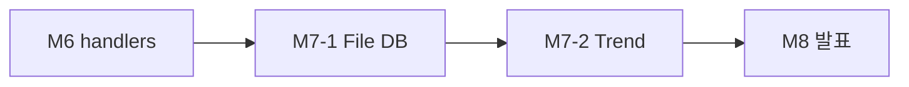
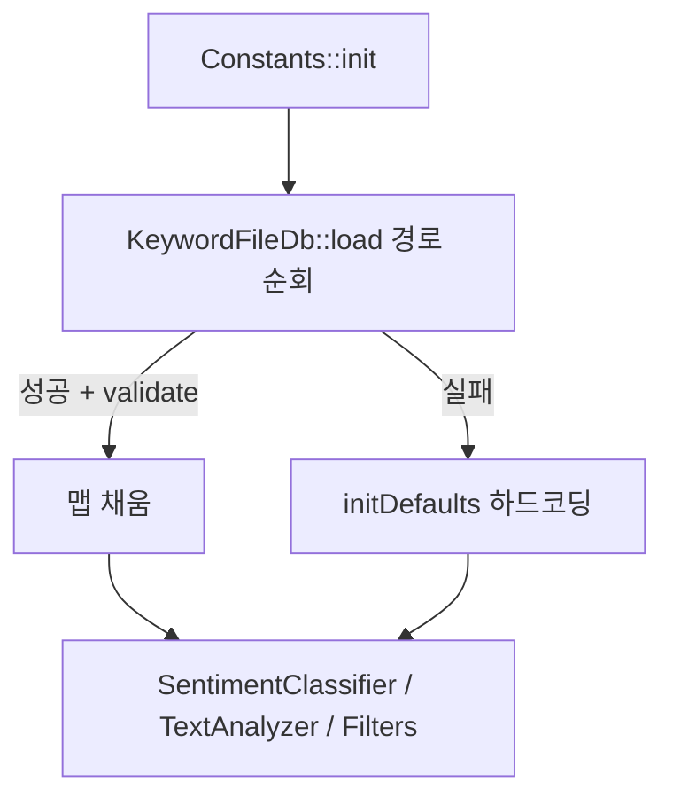
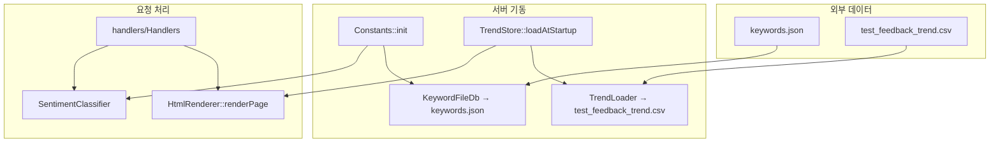

# Feedback Analyzer 11 — 미션 7 기능 추가 보고서 (File DB + Trend)

| 항목 | 내용 |
|------|------|
| 문서 번호 | 07_FEATURE |
| 프로젝트 | FeedbackAnalyzer_11 (리팩토링 챌린지) |
| 미션 | **7** — 추가 요구사항 (~3h) |
| 범위 | ① 감정·카테고리 키워드 **File DB** ② **Trend** 시각화 |
| 선행 문서 | [06_Refactoring_handlers.md](06_Refactoring_handlers.md), [05_Refactoring_긴함수,중복.md](05_Refactoring_긴함수,중복.md), [03_BugFix.md](03_BugFix.md) |
| 검증 일시 | 2026-05-22 (로컬 `ctest` + `feedback_analyzer` 빌드) |
| 문서 버전 | 1.0 |

> **참고:** `FileHandler`는 **Lava Flow 유지**(연동·제거 없음). Trend는 **세션 피드백과 병합하지 않는 MVP**(CSV 단독 집계).

---

## 1. 개요 (Executive Summary)

미션 7은 교육 스펙 `project_purpose.md` §6.1 7단계에 따라 **기능 확장**을 수행했다. **7-1**에서 `Constants` 하드코딩 키워드를 `data/keywords.json` **File DB**로 외부화했고, **7-2**에서 `data/test_feedback_trend.csv` 기반 **일별 감성 추이**를 대시보드에 표시했다. `classifySentiment`·`filterFeedbacks`·`countSentiments`·`countKeywords` **동작 계약은 변경하지 않았다**.

| 구분 | M6 (수정 전) | M7 (본 문서) |
|------|--------------|--------------|
| 키워드 소스 | `Constants.cpp` 하드코딩만 | **`keywords.json` 우선** + fallback |
| Trend UI | 없음 | **`HtmlRenderer` 일별 표 + CSS 막대** |
| `ctest` | 45 (M7-1 이후) | **49 Pass** (Trend 테스트 +4) |
| `SentimentClassifier` 규칙 | M3 단일화 | **변경 없음** |
| `httplib.h` | 미수정 | **미수정** |

**결론: 미션 7 (File DB + Trend) 완료** — `ctest` 49/49 + `feedback_analyzer` 빌드 성공.

---

## 2. 미션 7 정의 (FEATURE)

### 2.1 단계 분리

| 단계 | 시간(가이드) | 내용 | 본 저장소 구현 |
|------|-------------|------|----------------|
| **7-1** | ~1.5h | 감정·카테고리 키워드 File DB | `KeywordFileDb` + `data/keywords.json` |
| **7-2** | ~1.5h | Trend 시각화 | `TrendLoader` / `TrendAggregator` / `TrendStore` + UI |

### 2.2 M6·M7 경계

| 미션 | 범위 |
|------|------|
| **M6** | `handlers/` HTTP 분리 (구조) |
| **M7** | **기능 추가** — 외부 파일 키워드·시계열 UI |
| **M8** | 팀 리뷰·발표 |

### 2.3 설계 원칙

- **최소 침습:** 기존 분류·필터 API 시그니처·규칙 유지
- **서버 사이드 HTML:** React 금지, `u8"..."` UTF-8 유지
- **MVP Trend:** `test_feedback_trend.csv`만 집계(세션 `/analyze`·`/upload` 데이터 **미병합**)
- **FileHandler:** 사용자 미지정 → **미연동 유지**



---

## 3. 완료 기준 (Acceptance Criteria)

[`.cursorrules`](../.cursorrules), [README.md](../README.md), [project_purpose.md](../project_purpose.md) §6.1.

### 3.1 미션 7-1 — File DB

| AC | 내용 | 검증 | 상태 |
|----|------|------|------|
| AC-1 | `data/keywords.json`에 기존 `Constants` 키워드 이전 | 파일 존재·파싱 | ✅ |
| AC-2 | `Constants::init()`에서 JSON 로드 | `KeywordFileDb` | ✅ |
| AC-3 | 파일 없음/파싱 실패 시 fallback | `initDefaults()` | ✅ |
| AC-4 | `classifySentiment` 규칙·시그니처 유지 | REG·S·F·K Pass | ✅ |
| AC-5 | `ctest` 기존 + File DB 테스트 Pass | 45/45 (7-1 시점) | ✅ |

### 3.2 미션 7-2 — Trend

| AC | 내용 | 검증 | 상태 |
|----|------|------|------|
| AC-6 | `data/test_feedback_trend.csv` 추가 | `date,text,sentiment` | ✅ |
| AC-7 | 대시보드 Trend 섹션 표시 | `appendTrendSection` | ✅ |
| AC-8 | 일별 긍/중/부 집계 | `TrendAggregator` + `classifySentiment` | ✅ |
| AC-9 | Trend CSV 파싱 테스트 ≥2 | `trend_loader_test` 4건 | ✅ |
| AC-10 | `ctest` 전체 Pass | 49/49 | ✅ |

**범위 밖 (의도적 미수정)**

- `FileHandler` 제거·`saveResult` 연동
- 세션 피드백 + Trend CSV **병합** 집계
- `/upload` 분석 생략·`fil_data` 잔존 등 M3 밖 버그
- `httplib.h` 수정, `build/` 커밋, React 프론트

---

## 4. 미션 7-1 — File DB (`keywords.json`)

### 4.1 데이터 스키마

```json
{
  "version": 1,
  "sentiment": {
    "긍정": ["좋아요", "만족", "..."],
    "부정": ["나쁘", "불만", "..."]
  },
  "category": {
    "배송": {
      "main": ["배송", "택배", "..."],
      "time": ["배송지연", "..."]
    }
  }
}
```

- `sentiment` → `Constants::SENTIMENT_KEYWORDS`
- `category` → `Constants::CATEGORY_KEYWORDS` (2단계 map)
- `version`: 향후 스키마 확장용

### 4.2 로드 흐름



**검색 경로** (`PROJECT_ROOT` 컴파일 정의 + 상대 경로):

1. `{PROJECT_ROOT}/data/keywords.json`
2. `data/keywords.json` (cwd `build/` 기준)
3. `../data/keywords.json`

### 4.3 구현 요약

| 클래스/파일 | 역할 |
|-------------|------|
| `infra/KeywordFileDb.*` | JSON 읽기·`KeywordData` 파싱 (`nlohmann/json`) |
| `Constants.cpp` | `tryLoadFromFile()` + `initDefaults()` fallback |
| `data/keywords.json` | 운영 키워드 단일 소스 |

**미변경:** `SentimentClassifier.cpp` 분기 로직, `Filters::filterFeedbacks` 시그니처.

### 4.4 keywords.json 수동 검증

1. `data/keywords.json`의 `sentiment.긍정` 맨 앞에 `"MISSION7_TEST"` 추가
2. `build\feedback_analyzer.exe` 재시작 → textarea에 `MISSION7_TEST`만 입력 → 분석 → **긍정** 집계 확인
3. 원복·재시작 → 기존 키워드 동작 확인

---

## 5. 미션 7-2 — Trend 시각화

### 5.1 CSV 스펙 (`test_feedback_trend.csv`)

| 컬럼 | 필수 | 설명 |
|------|------|------|
| `date` (또는 `timestamp`) | ✅ | `YYYY-MM-DD` (타임스탬프는 날짜 부분만 사용) |
| `text` | ✅ | 피드백 본문 |
| `sentiment` | ❌ | `긍정`/`부정`/`중립`; 비우면 `classifySentiment(text)` |

**업로드 CSV(`text`만)와의 관계:** `/upload`용 CSV와 **별도 파일**. Trend는 서버 기동 시 **한 번** 로드.

### 5.2 샘플 데이터 (발췌)

```csv
date,text,sentiment
2025-05-01,배송이 빨라서 만족합니다,긍정
2025-05-01,품질이 별로예요 실망,
2025-05-02,가격이 비싸요 불만,부정
...
2025-05-05,배송 지연 불편,부정
```

- 저장소 기준 **9건 · 5일치** (`2025-05-01` ~ `2025-05-05`)

### 5.3 모듈 구조

```
src/cpp/services/
├── TrendTypes.h          TrendRecord, TrendDayRow, TrendSnapshot
├── TrendLoader.*         CSV 헤더 매핑·행 파싱
├── TrendAggregator.*     일별 긍/중/부 집계
└── TrendStore.*          기동 시 로드·전역 스냅샷
```

| 단계 | 처리 |
|------|------|
| `main()` | `TrendStore::loadAtStartup()` |
| `Handlers` | `HtmlRenderer::renderPage(..., TrendStore::getSnapshot(), ...)` |
| `HtmlRenderer` | `appendTrendSection` — HTML `<table>` + CSS flex 막대 |

### 5.4 UI 배치

`renderPage` 조립 순서 (일부):

1. 입력·업로드·필터 섹션
2. **감성 추이 (Trend)** ← 본 미션
3. 분석 결과(감정·키워드 통계)
4. 피드백 목록

차트 방식: **HTML 표 + 인라인 CSS 막대**(긍정=녹, 중립=회, 부정=적). React·canvas 미사용.

### 5.5 Trend 수동 검증 체크리스트

1. `cmake --build build` 후 `build\feedback_analyzer.exe` → `http://localhost:8080`
2. **「감성 추이 (Trend)」** 섹션·일별 표·색 막대 표시 확인
3. `2025-05-01` 행 **총 2건** 등 CSV와 일치 확인
4. `2025-05-05` 행 포함 **5일치** 확인
5. CSV 파일명 변경 후 재시작 → Trend 섹션 **미표시** 확인 → 파일명 복구

---

## 6. 디렉터리 구조 (M7 반영)

```
FeedbackAnalyzer_11/
├── data/
│   ├── keywords.json                 ← M7-1 File DB
│   └── test_feedback_trend.csv       ← M7-2 Trend
├── src/cpp/
│   ├── infra/
│   │   └── KeywordFileDb.*           ← M7-1
│   ├── services/
│   │   ├── TrendLoader.*
│   │   ├── TrendAggregator.*
│   │   └── TrendStore.*
│   ├── Constants.cpp                 ← init() File DB + fallback
│   ├── HtmlRenderer.*                ← appendTrendSection
│   ├── handlers/Handlers.cpp         ← TrendSnapshot 전달
│   └── main.cpp                      ← TrendStore::loadAtStartup()
└── tests/
    ├── keyword_file_db_test.cpp      ← M7-1 (8 tests)
    ├── trend_loader_test.cpp         ← M7-2 (4 tests)
    └── fixtures/
        ├── keywords_minimal.json
        └── trend_sample.csv
```

---

## 7. 수정·신규 파일 목록

### 7.1 미션 7-1

| 파일 | 변경 요약 |
|------|-----------|
| `data/keywords.json` | **신규** — 전체 키워드 |
| `src/cpp/infra/KeywordFileDb.h` | **신규** |
| `src/cpp/infra/KeywordFileDb.cpp` | **신규** — nlohmann/json 파싱 |
| `src/cpp/Constants.cpp` | `init()` File DB + `initDefaults()` |
| `src/cpp/AppConfig.h` | keywords 경로 상수 |
| `CMakeLists.txt` | `KeywordFileDb.cpp`, FetchContent `nlohmann_json` |
| `tests/keyword_file_db_test.cpp` | **신규** |
| `tests/fixtures/keywords_*.json` | **신규** |

### 7.2 미션 7-2

| 파일 | 변경 요약 |
|------|-----------|
| `data/test_feedback_trend.csv` | **신규** — 샘플 9건 |
| `src/cpp/services/TrendTypes.h` | **신규** |
| `src/cpp/services/TrendLoader.*` | **신규** |
| `src/cpp/services/TrendAggregator.*` | **신규** |
| `src/cpp/services/TrendStore.*` | **신규** |
| `src/cpp/HtmlRenderer.h` | `renderPage` + `TrendSnapshot` 인자 |
| `src/cpp/HtmlRenderer.cpp` | `appendTrendSection`, Trend CSS |
| `src/cpp/handlers/Handlers.cpp` | 모든 `renderPage`에 snapshot 전달 |
| `src/cpp/main.cpp` | `TrendStore::loadAtStartup()` |
| `src/cpp/AppConfig.h` | Trend CSV 경로 상수 |
| `CMakeLists.txt` | Trend 서비스 3파일, `trend_loader_test.cpp` |
| `tests/trend_loader_test.cpp` | **신규** |
| `tests/fixtures/trend_sample.csv` | **신규** |
| `README.md` | M7 완료·검증 체크리스트 |

**미변경:** `SentimentClassifier.cpp` 규칙, `httplib.h`, `Filters`/`TextAnalyzer` API, `FileHandler` 구현.

---

## 8. 검증 실행 결과

### 8.1 빌드·ctest

```powershell
cmake -S . -B build
cmake --build build --target feedback_analyzer feedback_analyzer_tests
cd build
ctest --output-on-failure
```

| 항목 | M6 | M7-1 | M7 (본 문서) |
|------|-----|------|----------------|
| 등록 테스트 | 37 | 45 | **49** |
| **Passed** | 37 | 45 | **49** |
| **Failed** | 0 | 0 | **0** |
| **Disabled** | 0 | 0 | **0** |

### 8.2 신규 테스트 요약

| 스위트 | 건수 | 대표 케이스 |
|--------|------|-------------|
| `KeywordFileDbTest` | 6 | JSON 로드, fallback, validate, 프로젝트 keywords |
| `ConstantsKeywordInitTest` | 2 | init·classify 연동 |
| `TrendLoaderTest` | 4 | CSV 파싱, 잘못된 date 스킵, 일별 집계 |

### 8.3 회귀 (M3)

| 스위트 | 상태 |
|--------|------|
| `Regression_NeutralFilterMismatch_*` (4건) | ✅ Pass |
| F / S / K / COV / ParseUtils | ✅ Pass |

---

## 9. 아키텍처 변화



---

## 10. BAD / GOOD (교육용)

```cpp
// BAD — 키워드를 Constants.cpp에만 하드코딩 (Shotgun Surgery, 운영 변경 시 재컴파일)
SENTIMENT_KEYWORDS[u8"긍정"] = { u8"좋아요", ... };

// GOOD — M7-1: JSON File DB + fallback
// Constants::init() → KeywordFileDb::load("data/keywords.json")
```

```cpp
// BAD — Trend 없이 정적 통계만 (project_purpose 시각화 요구 미충족)

// GOOD — M7-2: CSV 시계열 → TrendSnapshot → appendTrendSection (서버 HTML 표)
// TrendStore::getSnapshot() → HtmlRenderer::renderPage(..., trend, ...)
```

---

## 11. 완료 체크리스트

- [x] AC-1 ~ AC-10 (§3)
- [x] `data/keywords.json`, `KeywordFileDb`
- [x] `data/test_feedback_trend.csv`, `TrendLoader` / `TrendAggregator` / `TrendStore`
- [x] `HtmlRenderer` Trend 섹션
- [x] `ctest` **49/49**
- [x] `feedback_analyzer` 빌드
- [x] README 수동 검증 체크리스트
- [ ] `FileHandler` 연동 — **미수행 (Lava Flow 유지)**
- [ ] Trend + 세션 병합 — **미수행 (MVP CSV 단독)**

---

## 12. 다음 단계

| 미션 | 내용 |
|------|------|
| **8** | 팀 코드 리뷰·발표 (장단점·Before/After) |

**선택 개선 (미션 7+):**

- `FileHandler`로 `keywords.json` 백업·보내기
- `/analyze` 후 **오늘 날짜** 세션 건을 Trend에 합산
- Trend 정렬(`byDay` 날짜 오름차순)·빈 CSV 안내 메시지

---

## 13. 참고 문서

| 경로 | 용도 |
|------|------|
| [06_Refactoring_handlers.md](06_Refactoring_handlers.md) | M6 handlers 선행 |
| [05_Refactoring_긴함수,중복.md](05_Refactoring_긴함수,중복.md) | HtmlRenderer 선행 |
| [03_BugFix.md](03_BugFix.md) | SentimentClassifier·중립 REG |
| [docs/analyzer.md](../docs/analyzer.md) | §9 이슈·§10 미션·로드맵 |
| [project_purpose.md](../project_purpose.md) | §6.1 미션 7 원문 |
| [README.md](../README.md) | 빌드·검증 체크리스트 |
| [.cursorrules](../.cursorrules) | M7 제한·우선순위 |

---

*본 보고서는 미션 7 FEATURE(File DB + Trend 시각화) 완료를 문서화한 공식 Report 문서이다.*
