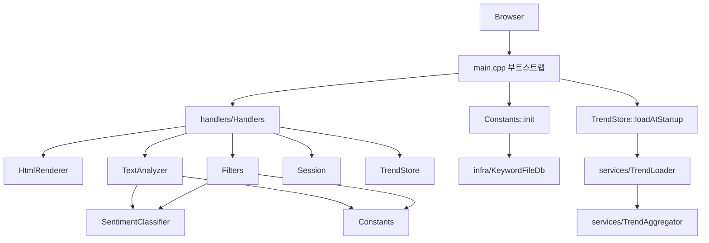

# Feedback Analyzer 11 — 미션 8 코드 리뷰 보고서

| 항목 | 내용 |
|------|------|
| 문서 번호 | 08_CODE_REVIEW |
| 프로젝트 | FeedbackAnalyzer_11 (리팩토링 챌린지) |
| 미션 | **8** — 팀 코드 리뷰 (~2h) |
| 범위 | 미션 2~7 산출물·`src/cpp`·`tests` 종합 평가 (발표 자료 제외) |
| 선행 문서 | [03_BugFix.md](03_BugFix.md), [04_Refactoring_네이밍,전역,매직.md](04_Refactoring_네이밍,전역,매직.md), [05_Refactoring_긴함수,중복.md](05_Refactoring_긴함수,중복.md), [06_Refactoring_handlers.md](06_Refactoring_handlers.md), [07_Feature.md](07_Feature.md) |
| 검증 일시 | 2026-05-22 (로컬 `ctest` 49/49 Pass) |
| 문서 버전 | 1.0 |

> **범위:** 본 문서는 **코드 리뷰·회고**만 다룬다. 발표 슬라이드·스크립트·PPT 목차는 작성하지 않았다.

---

## 1. Executive Summary

Feedback Analyzer 11은 교육용 리팩토링 챌린지로, 미션 2~7을 거치며 **도메인 회귀 테스트(49건)·감정 분류 단일화·HTTP 핸들러 분리·File DB·Trend UI**까지 단계적으로 개선되었다. `main.cpp`는 부트스트랩(~28줄)으로 축소되었고, 비즈니스·표현·인프라 경계가 `handlers/`, `HtmlRenderer`, `services/`, `infra/`로 분리된 상태다.

잔여 리스크는 **프로세스 전역 `Session`**, **`/upload` 분석 생략**, **Trend와 세션 데이터 미병합**, **Lava Flow `FileHandler`**, **문서(.cursorrules·README)와 코드 불일치**에 집중된다. P0 버그(중립 불일치·키워드 `main` 스킵·Logger 미연동)는 미션 3에서 코드상 해소되었으나, `.cursorrules`의 「알려진 버그」절은 아직 갱신되지 않았다.

전체적으로 **리팩토링 챌린지 목표(스멜 식별·Extract·테스트 고정·기능 확장)는 달성**했으며, 다음 스프린트는 P3 세션 캡슐화와 업로드·Trend UX 정합성, 문서 동기화가 합리적 우선순위다.

### 미션 2~7 완료 요약

| 미션 | 목표 (가이드) | 달성 | 테스트·근거 |
|------|---------------|------|-------------|
| **2** | 테스트·커버리지 ≥ 90% | **달성** | `ctest` 32→37→49 확장; 도메인 line **100%** ([docs/coverage.md](../docs/coverage.md)); 골든 v1→v2 ([02_3_Golden.md](02_3_Golden.md), [docs/golden_master.md](../docs/golden_master.md)) |
| **3** | 로그·멀티라인·중립 필터 | **달성** | `SentimentClassifier` 단일화; REG 4건; `DISABLED_` 0; [03_BugFix.md](03_BugFix.md) |
| **4** | 네이밍·전역·매직 | **달성** | `filterFeedbacks` 등; `Session::filteredFeedbacks`; `AppConfig`; 37 Pass 유지 ([04_Refactoring_네이밍,전역,매직.md](04_Refactoring_네이밍,전역,매직.md)) |
| **5** | 긴 함수·중복 | **달성** | `HtmlRenderer`; named handler; `ParseUtils`; 37 Pass·coverage 100% ([05_Refactoring_긴함수,중복.md](05_Refactoring_긴함수,중복.md)) |
| **6** | 추가 리팩토링 1건 | **달성** (코드·Report/06) | `handlers/Handlers.*`; `main.cpp` ~28줄 ([06_Refactoring_handlers.md](06_Refactoring_handlers.md)) — README To Do는 **미갱신** |
| **7** | Trend + File DB | **달성** | `KeywordFileDb`, `TrendStore`; +4 테스트; 49 Pass ([07_Feature.md](07_Feature.md)) |

---

## 2. 아키텍처·모듈 경계 평가

### 2.1 현재 레이어 (실측)

| 모듈 | 역할 | 평가 |
|------|------|------|
| **`main.cpp`** | `Constants::init`, `TrendStore::loadAtStartup`, 라우트 5개 등록, listen | **양호** — God Object에서 부트스트랩으로 축소 (`main.cpp:11-27`) |
| **`handlers/`** | HTTP 요청·폼 파싱·세션·분석·필터·CSV 다운로드 오케스트레이션 | **양호** — M5 handler + M6 파일 경계; 다만 도메인 로직이 핸들러에 남아 있음 |
| **`HtmlRenderer`** | 서버 사이드 HTML 조립(섹션별 `append*`) | **양호** — M5 Extract Class; Trend·escapeHtml 반영 (`HtmlRenderer.cpp:160-243`) |
| **`services/`** | Trend 로드·집계·스냅샷 (`TrendLoader`, `TrendAggregator`, `TrendStore`) | **양호** — M7 기능; 세션과 분리된 MVP |
| **`infra/`** | `KeywordFileDb` JSON 로드·검증 | **양호** — fallback과 경로 탐색 분리 (`Constants.cpp:63-95`) |
| **`Session`** | `currentFeedbacks`, `filteredFeedbacks` 정적 보관 | **개선 필요** — P3: 전역 정적·미사용 멤버 (`Session.h:8-12`) |
| **`SentimentClassifier` + `TextAnalyzer` + `Filters`** | 감정·키워드·필터 도메인 | **양호** — 분류 규칙 단일 (`SentimentClassifier.cpp:14-21`) |
| **`FileHandler`** | `main`에 인스턴스만 존재, 실제 라우트 미연동 | **부족** — Lava Flow (`main.cpp:9`, `FileHandler.h:7-17`) |

### 2.2 경계 강점·약점

**강점**

- HTTP 진입점(`handlers`) ↔ 렌더링(`HtmlRenderer`) ↔ Trend/키워드 인프라가 **폴더 단위로 분리**되어 미션 5~7 추적이 용이하다.
- 도메인 규칙 변경 시 **`SentimentClassifier` 한 곳**을 수정하면 `countSentiments`·`filterFeedbacks`가 같이 따라간다.

**약점**

- `Handlers.cpp`가 **유스케이스 + HTTP**를 동시에 담당(예: `handlePostAnalyze` 33~72행) — `services/AnalyzeService` 등으로 한 단계 더 내릴 여지(P4).
- `.cursorrules` 아키텍처 맵(11~18행)은 여전히 「`main.cpp` God Object」로 기술되어 **문서와 코드가 불일치**한다.

---

## 3. 장점 5

| # | 장점 | 근거 (코드) |
|---|------|-------------|
| 1 | **감정 분류 규칙 단일화** — `sent`/`fil` 이중 정의 제거 | `SentimentClassifier::classifySentiment` (`SentimentClassifier.cpp:14-21`); `Filters::filterFeedbacks`에서 동일 호출 (`Filters.cpp:13-14`); `TextAnalyzer::countSentiments` (`TextAnalyzer.cpp:12-14`) |
| 2 | **`main.cpp` 부트스트랩화** — 서버 기동·라우팅만 담당 | 라우트 5개 등록 + listen (`main.cpp:15-25`); 핸들러 구현 없음 |
| 3 | **HTTP 핸들러 모듈 분리 (M6)** — SRP에 가까운 파일 경계 | `handlers/Handlers.cpp` — `handleGetRoot`~`handleGetDownload`; `main.cpp`는 `Handlers.h`만 include |
| 4 | **키워드 File DB + 안전한 fallback** | `KeywordFileDb::load`·`validate` 후 `Constants` 반영 (`Constants.cpp:73-79`); 실패 시 `initDefaults()` (`Constants.cpp:87-95`) |
| 5 | **회귀·기능 테스트 체계** — 리팩토링 전후 동작 고정 | 로컬 `ctest` **49/49 Pass** (2026-05-22); 중립 REG (`Regression_NeutralFilterMismatch_*`); M7 `KeywordFileDbTest`·`TrendLoaderTest` |

---

## 4. 단점·잔여 리스크 5

| # | 단점·리스크 | 연결 | 근거 (코드) |
|---|-------------|------|-------------|
| 1 | **`/upload` 후 감성·키워드 분석 생략** | README 「알려진 이슈」 | `handlePostUpload`가 빈 `sentimentResults`/`keywordResults`로 렌더 (`Handlers.cpp:105-106`) |
| 2 | **필터 결과·업로드 간 `filteredFeedbacks` 정합성** | README (`fil_data` 잔존) | `/upload`는 `setFilteredFeedbacks` 없음; 이전 `/filter` 결과가 `/download`에 남을 수 있음 (`Handlers.cpp:75-106`, `Handlers.cpp:150-158`) |
| 3 | **Trend가 세션 피드백과 분리 (MVP 한계)** | README; M7 보고서 | `TrendStore`는 CSV만 로드 (`TrendStore.cpp:29-37`); UI 범례도 CSV 단독 (`HtmlRenderer.cpp:193-195`) |
| 4 | **전역 `Session` + 미사용 정적 멤버** | `.cursorrules` **P3** | `currentFeedbacks`/`filteredFeedbacks` 정적 (`Session.h:8-10`); `internalData`·`filterOptions`는 정의만 있고 참조 없음 (`Session.cpp:5-6`) |
| 5 | **`FileHandler` Lava Flow·문서 drift** | `.cursorrules` Don't; README·rules 미갱신 | `main.cpp:9` `static FileHandler` 미사용; `.cursorrules` 47~52행 P0 버그는 **이미 M3에서 수정됨** — 규칙/README To Do(M6·8 미완)와 실제 코드·Report 불일치 |

---

## 5. 개선 제안 3

| 우선순위 | 제안 | 예상 공수 | 범위 밖 (본 문서/미션 8) |
|----------|------|-----------|---------------------------|
| **P1** | **`/upload` 직후 분석 파이프라인 통일** — `handlePostAnalyze`와 동일하게 `countSentiments`/`countKeywords` 호출 또는 공통 함수 추출 | 2~3h | HTTP 라우트 시그니처 변경; E2E 자동화 |
| **P2** | **`Session` 캡슐화 + 미사용 멤버 제거** — 요청 스코프 또는 명시적 reset API; `internalData`/`filterOptions` 삭제 | 2~4h | 다중 사용자·인증 |
| **P2** | **문서·규칙 동기화** — `.cursorrules` 아키텍처 맵·알려진 버그, README To Do/미션 표(49 tests, M6 완료), `docs/golden_master.md` ctest 수 | 1~2h | 타 팀 저장소 |
| *(참고 P3)* | Trend ↔ 세션 병합, `FileHandler` 제거/연동, `handlers`→파일별 분리, `models/` 도입 | 각 3h+ | 미션 8 리뷰 범위 밖 — 별도 스프린트 |

---

## 6. 미션별 회고 (2~7)

| 미션 | 목표 | 달성 | 미달·메모 | 테스트 근거 |
|------|------|------|-----------|-------------|
| **2** | GoogleTest·coverage ≥ 90% | ✅ | 골든 JSON은 GTest 보조; v2는 M3에서 갱신 | 32 Pass → COV·F·S·K; [02_2_GREEN.md](02_2_GREEN.md), [02_3_Golden.md](02_3_Golden.md) |
| **3** | 중립 필터·페이지 로그·멀티라인 | ✅ | — | REG 4 + 5 `DISABLED_` 해소 → 37 Pass; [03_BugFix.md](03_BugFix.md) |
| **4** | 네이밍·전역·매직 | ✅ | `Session` 정적은 잔존(P3) | 37 Pass; F03 등 필터 테스트 |
| **5** | 긴 함수·중복 | ✅ | 핸들러는 당시 `main`에 잔류 → M6에서 이관 | `HtmlRenderer`; 37 Pass; [05_Refactoring_긴함수,중복.md](05_Refactoring_긴함수,중복.md) |
| **6** | 추가 리팩토링 1건 | ✅ (코드) | README 체크박스 미반영 | 37→49 과정에서 핸들러 분리 유지; [06_Refactoring_handlers.md](06_Refactoring_handlers.md) |
| **7** | File DB + Trend | ✅ (MVP) | Trend·세션 미병합; FileHandler 미연동 | +4 테스트; 49 Pass; [07_Feature.md](07_Feature.md) |

---

## 7. 테스트·품질

### 7.1 `ctest` (2026-05-22 로컬)

| 항목 | 값 |
|------|-----|
| 등록 테스트 | **49** |
| Passed | **49** |
| Failed | **0** |
| Disabled | **0** |
| 요약 | `100% tests passed, 0 tests failed out of 49` |

구성: 도메인 회귀·COV·F/S/K·`ParseUtils`·`KeywordFileDb`·`TrendLoader`/`Aggregator`.

### 7.2 커버리지

| 항목 | 값 | 비고 |
|------|-----|------|
| 도메인 line coverage | **100%** (134/134) | [docs/coverage.md](../docs/coverage.md); M2 기준 ≥ 90% **충족** |
| 제외 대상 | `main.cpp`, `httplib`, Logger, Session, UIComponents, handlers | 스크립트 정책 유지 — HTTP·핸들러 경로는 단위 테스트 미포함 |

**리스크:** 커버리지 100%는 **도메인 파일** 기준이며, `Handlers.cpp`·`HtmlRenderer`·`KeywordFileDb` 전 경로는 수동·통합 검증에 의존한다.

### 7.3 골든 마스터 v2

| 항목 | 내용 |
|------|------|
| 버전 | **v2.0.0** (M3 GREEN) |
| 경로 | [tests/fixtures/golden_master.json](../tests/fixtures/golden_master.json) |
| 역할 | GTest 보조 스냅샷; M3 `bug_m3_red` 구간 → v2에서 **해소** ([docs/golden_master.md](../docs/golden_master.md)) |
| drift | JSON 건수(37 기준 문서) vs 현재 **49** GTest — **문서 갱신 권장** |

---

## 8. 다른 팀과 비교·리뷰 포인트 (질문 5)

코드 리뷰·페어 리뷰 미팅에서 타 팀 구현과 대조할 때 사용할 질문이다. (발표용 스크립트 아님.)

1. **감정 분류**를 한 모듈로 통일했는가, 아니면 집계(`sent`)와 필터(`fil`)에 서로 다른 키워드 맵을 쓰는가? 중립만 선택했을 때 건수가 일치하는 테스트가 있는가?
2. **키워드 카테고리 `main`**을 필터와 `kw()` 집계에서 동일하게 취급하는가? (과거 `continue` 스킵 버그 유무)
3. **단위 테스트 수·커버리지 측정 범위**는 어디까지인가? (`main`/handlers 제외 여부, HTTP 통합 테스트 유무)
4. **키워드·설정**을 File DB/JSON으로 외부화했는가, 실패 시 fallback 전략은 무엇인가?
5. **시계열(Trend)** 데이터를 세션 분석 결과와 어떻게 합치거나 분리했는가? 업로드만 한 뒤 대시보드 숫자가 기대와 맞는가?

---

## 9. 결론

미션 2~7을 통해 **테스트 고정 → P0 버그 해소 → 구조 분리 → 기능 확장** 순서가 잘 지켜졌고, 현재 코드베이스는 **교육용 레거시에서 실무에 가까운 모듈 경계**로 한 단계 진화한 상태다. 미션 8 관점에서 남은 핵심 과제는 **리뷰 문서화(본 문서)** 와 **README·`.cursorrules` 동기화**, 선택적 **P1 업로드·세션 정합성** 개선이다.

**참고 문서**

| 경로 | 설명 |
|------|------|
| [README.md](../README.md) | 빌드·미션 현황·알려진 이슈 |
| [project_purpose.md](../project_purpose.md) | 8단계 미션 원문 |
| [.cursorrules](../.cursorrules) | P0~P4·작업 규칙 |
| [docs/analyzer.md](../docs/analyzer.md) | 아키텍처 상세 |

---

*문서 끝.*
