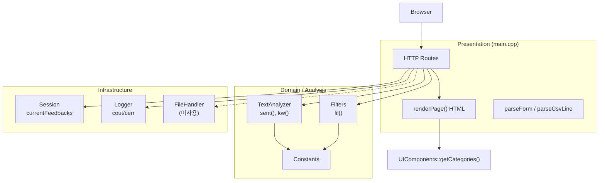
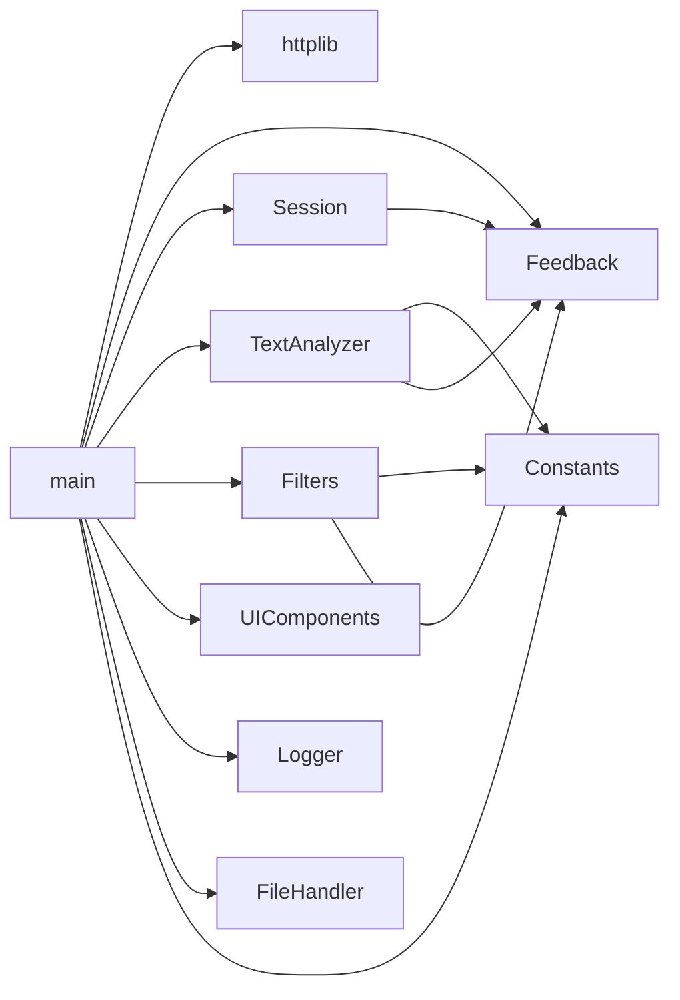
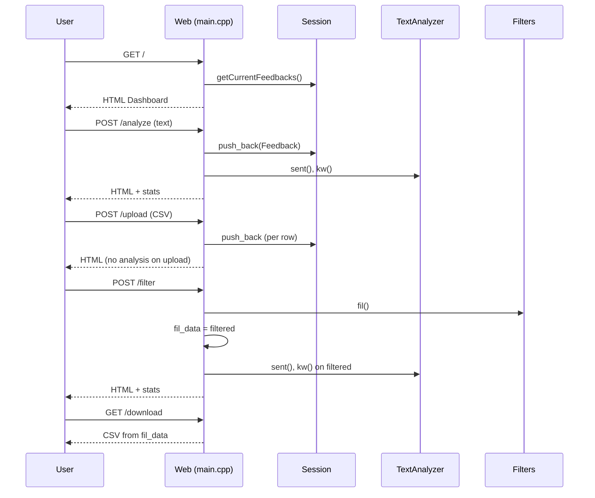
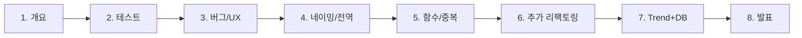

# Feedback Analyzer 11 — 분석 보고서

> 작성 기준: 저장소 `FeedbackAnalyzer_11` 소스 및 `project_purpose.md`  
> 목적: 전체 구조, 동작 흐름, 의도된 코드 스멜, 학습 미션, 알려진 이슈를 한 문서로 정리

---

## 1. 요약

| 항목 | 내용 |
|------|------|
| 프로젝트명 | 리팩토링 챌린지: 고객 피드백 분석 시스템 (Feedback Analyzer) |
| 기술 스택 | C++17, CMake, [cpp-httplib](https://github.com/yhirose/cpp-httplib) (`httplib.h`) |
| 실행 형태 | 단일 실행 파일 `feedback_analyzer`, `http://localhost:8080` |
| 성격 | **의도적으로 코드 스멜·안티패턴이 포함된** 리팩토링 학습용 코드베이스 |
| 빌드 산출물 | `build/feedback_analyzer.exe` (로컬 빌드 시) |

핵심 특징:

- 비즈니스 로직(감정·키워드 분석, 필터)과 **HTML 렌더링·HTTP 라우팅이 `main.cpp`에 집중**되어 있음
- 테스트 코드 없음, `FileHandler`는 include만 되고 실제로 사용되지 않음
- `project_purpose.md` §6에 **8단계 학습 미션**(총 약 13.5시간)이 정의되어 있음

---

## 2. 프로젝트 목적 및 학습 목표

### 2.1 목적

자연어 고객 피드백을 수집·분류·시각화하는 웹 애플리케이션의 **초기(레거시) 버전**을 제공하고, 학습자가 코드 스멜을 식별한 뒤 클린 아키텍처로 개선하는 실습을 수행한다.

### 2.2 학습 목표 (`project_purpose.md` §1.3)

- 코드 스멜 및 안티패턴 식별
- 모듈화·비즈니스 로직과 UI(HTML) 분리
- Extract Function/Class, 전략 패턴 등 리팩토링 기법 실습
- C++ 웹 앱 유지보수성·테스트 가능 구조 설계
- 상태 관리 및 의존성 설계 경험

### 2.3 대상 학습자

- 중급 이상 C++ 개발자
- TDD, Clean Code, Refactoring 실습이 필요한 개발자

---

## 3. 디렉터리 및 빌드 구조

```
FeedbackAnalyzer_11/
├── CMakeLists.txt          # 단일 타깃 feedback_analyzer
├── README.md               # 설치·빌드·사용법
├── project_purpose.md      # 목적·스멜·미션 정의 (교육 스펙)
├── docs/
│   └── analyzer.md         # 본 분석 보고서
├── src/cpp/
│   ├── main.cpp            # HTTP 서버, 라우팅, HTML, CSV 파싱
│   ├── httplib.h           # HTTP 라이브러리 (서드파티 헤더)
│   ├── Feedback.h          # 피드백 모델
│   ├── TextAnalyzer.h/cpp  # 감정·키워드 집계
│   ├── Filters.h/cpp       # 감정·키워드 필터
│   ├── Constants.h/cpp     # 키워드 사전 (하드코딩)
│   ├── Session.h/cpp       # 세션(전역) 피드백 목록
│   ├── UIComponents.h/cpp  # UI용 카테고리 목록
│   ├── Logger.h/cpp        # 콘솔 로깅
│   └── FileHandler.h       # 미사용(죽은 코드)
└── build/                  # CMake 빌드 산출 (git 미추적 권장)
```

### 3.1 CMake 타깃

`CMakeLists.txt`는 다음 소스만 링크한다.

- `main.cpp`, `Constants.cpp`, `Filters.cpp`, `Logger.cpp`, `Session.cpp`, `TextAnalyzer.cpp`, `UIComponents.cpp`
- `FileHandler`는 **빌드에 포함되지 않음** (헤더만 존재, `main.cpp`에서 include)

Windows 빌드 시 `ws2_32` 링크 및 `WINVER` 정의가 포함된다.

### 3.2 실행

```text
build\feedback_analyzer.exe
→ http://localhost:8080 (0.0.0.0:8080 listen)
```

---

## 4. 아키텍처 개요

### 4.1 레이어 관점 (현재 — 이상적 분리 없음)



현재는 **계층이 폴더/네임스페이스로 분리되지 않고**, `main.cpp`가 프레젠테이션·애플리케이션·일부 인프라 역할을 동시에 수행한다.

### 4.2 컴포넌트 의존 관계



---

## 5. 모듈별 상세 분석

### 5.1 `main.cpp` — God Object

**역할**

| 기능 | 설명 | 대략적 위치 |
|------|------|-------------|
| 전역 상태 | `fil_data`, `textAnalyzer`, `filters`, `fileHandler` | L16–19 |
| 유틸 | `urlDecode`, `parseForm`, `escapeHtml`, `getCurrentTimestamp` | L22–78 |
| UI | `renderPage()` — 전체 HTML/CSS/폼/통계 UI | L81–211 |
| CSV | `parseCsvLine()` | L214–231 |
| 서버 | `httplib::Server` 라우트 5개, `listen(8080)` | L233–372 |

**HTTP 엔드포인트**

| 메서드 | 경로 | 핸들러 동작 |
|--------|------|-------------|
| GET | `/` | `Session::initSessionStateUgly()`, 빈 통계로 대시보드 |
| POST | `/analyze` | 폼 `text` → `Session::getCurrentFeedbacks()`에 추가 → `sent`/`kw` 집계 → HTML |
| POST | `/upload` | multipart `file` → CSV 파싱(헤더 스킵) → 피드백 추가 → HTML (분석 없이 목록만) |
| POST | `/filter` | `sentiment`, `keyword` → `filters.fil()` → `fil_data` 갱신 → 집계 HTML |
| GET | `/download` | 전역 `fil_data` → UTF-8 BOM CSV attachment |

**의도된 안티패턴**: God Function — 라우팅·비즈니스 호출·HTML·CSV가 한 파일에 공존.

---

### 5.2 `Feedback.h` — 데이터 모델

```cpp
class Feedback {
    std::string text;
public:
    explicit Feedback(std::string t);
    const std::string& getText() const;
};
```

- `setter` 없음, 분석 결과(감정·카테고리) 필드 없음
- 미션/리팩토링 문서에서 “데이터 클래스 개선” 대상으로 명시됨

---

### 5.3 `Session` — 전역 세션 상태

| 멤버 | 용도 |
|------|------|
| `currentFeedbacks` | 현재 세션 피드백 벡터 (실질적 전역) |
| `internalData`, `filterOptions` | 선언만 있고 **미사용** |

API:

- `getCurrentFeedbacks()` — 라우트에서 피드백 누적·조회
- `getOldDataFromSession(key)` — `key` 무시하고 `currentFeedbacks` 반환 (부적절한 API)
- `initSessionStateUgly()` — 빈 구현

---

### 5.4 `Constants` — 키워드 사전

`Constants::init()`에서 정적 맵 초기화:

- `SENTIMENT_KEYWORDS`: `긍정`, `부정` (중립 키워드 목록 없음)
- `CATEGORY_KEYWORDS`: `배송`, `품질`, `가격`, `서비스`, `사용성` — 각 카테고리마다 `main`, `time`, `physical` 등 서브키

**스멜**: 동일 키워드 벡터가 `Constants.cpp` 내에서 **중복 기입**됨 (긍정/부정 배열 반복).

---

### 5.5 `TextAnalyzer` — 분석

| 메서드 | 동작 |
|--------|------|
| `sent(feedbacks)` | 텍스트에 긍정 키워드 → `긍정`, 부정 키워드 → `부정`, 그 외 → `중립` 카운트 |
| `kw(feedbacks)` | 각 카테고리 `main` 서브키워드 매칭 시 카운트 증가 |

**전역 부작용**: `globalSent`, `globalKw`에 결과 저장 (다른 모듈에서 읽지 않음).

**중복**: `containsAny()`가 `Filters`와 동일 로직으로 중복 구현.

---

### 5.6 `Filters` — 필터링

`Filters::initFilterKeywords()`로 **별도** 감정 키워드 `S_KEYWORDS` 초기화 (`긍정`/`부정`/`중립`).

`fil(dataList, sFilter, kFilter)`:

1. 감정 필터: `S_KEYWORDS`로 감정 판별 후 `sFilter`와 비교 (`전체`면 스킵)
2. 키워드 필터: `Constants::CATEGORY_KEYWORDS[kFilter]` 순회 시 **`main` 서브키는 건너뜀** — `time`, `physical` 등만 검사
3. `std::cout`으로 필터 결과 출력 (Logger 미사용)

---

### 5.7 `UIComponents`

- 정적 카테고리: `배송`, `품질`, `가격`, `서비스`, `사용성`
- `renderPage()`의 키워드 `<select>` 옵션 생성에만 사용
- `Constants::CATEGORY_KEYWORDS`와 **이중 유지** (Shotgun Surgery 위험)

---

### 5.8 `Logger`

- `logInfo` / `logWarning` → `stdout`, `logError` → `stderr`
- 웹 페이지와 **연동 없음** (미션 3: level별 페이지 표시 요구와 불일치)
- `debugMode` 플래그 존재하나 라우트에서 설정하지 않음

---

### 5.9 `FileHandler` — Lava Flow

- `main.cpp`에 `static FileHandler fileHandler` 선언 및 include
- **어떤 라우트에서도 호출되지 않음**
- `save` / `saveResult`는 콘솔 출력만 수행

---

## 6. 데이터 흐름

### 6.1 사용자 시나리오 (`project_purpose.md` §2.2)



### 6.2 상태 저장 위치

| 상태 | 위치 | 용도 |
|------|------|------|
| 입력 피드백 목록 | `Session::currentFeedbacks` | analyze/upload 누적 |
| 마지막 필터 결과 | `main.cpp` `fil_data` | download 전용 |
| 분석 집계 캐시 | `TextAnalyzer::globalSent`, `globalKw` | 설정만, 미참조 |
| 필터 감정 키워드 | `Filters::S_KEYWORDS` | `Constants::SENTIMENT_KEYWORDS`와 **불일치** |

---

## 7. 기능 명세 대비 구현

| 기능 | 스펙 | 구현 상태 |
|------|------|-----------|
| 텍스트 입력 | 수동 입력 | POST `/analyze`, textarea 존재 |
| CSV 업로드 | `text` 컬럼 | 첫 컬럼 `fields[0]`만 사용, 헤더 1행 스킵 |
| 감정 분석 | 긍정/중립/부정 | `TextAnalyzer::sent` |
| 키워드 분류 | 카테고리별 | `TextAnalyzer::kw` (`main` 키워드만) |
| 필터링 | 감정·키워드 | `Filters::fil` — **중립·키워드 로직 이슈** |
| 시각화 | 통계 | HTML stat 박스 (차트 라이브러리 없음) |
| CSV 다운로드 | 필터 결과 | GET `/download`, `fil_data` 기준 |

### 7.1 CSV 형식

- 입력: 첫 줄 헤더 스킵, 이후 각 행 첫 필드를 피드백 텍스트로 사용
- 출력: UTF-8 BOM + `text\n` + 각 행 (이스케이프·쉼표 처리 없음)

---

## 8. 의도된 코드 스멜 · 안티패턴 매핑

### 8.1 코드 스멜 (`project_purpose.md` §4.1)

| 스멜 | 코드 위치 | 설명 |
|------|-----------|------|
| 긴 함수 | `main.cpp` `renderPage()`, `main()` | HTML·스타일·폼·통계가 한 함수 (~130줄) |
| 중복 코드 | `TextAnalyzer.h`, `Filters.h` | `containsAny()` 동일 구현 |
| 부적절한 네이밍 | `fil`, `sent`, `kw` | 의도적 축약명 |
| 전역 변수 | `main.cpp` `fil_data`, `TextAnalyzer` static maps | 세션/분석 결과 전역화 |
| 매직/하드코딩 | `Constants.cpp`, `Filters.cpp` | UTF-8 문자열 리터럴, 중복 키워드 배열 |
| 테스트 미비 | — | `tests/` 없음, CMake에 테스트 타깃 없음 |

### 8.2 안티패턴 (`project_purpose.md` §4.2)

| 안티패턴 | 반영 |
|----------|------|
| God Function | `main.cpp` 집중 |
| Spaghetti Code | 파일 간 책임 경계 모호, `main`이 모든 것 호출 |
| Feature Envy | `Filters`가 `Constants::CATEGORY_KEYWORDS` 내부 맵 구조 직접 순회 |
| Shotgun Surgery | 카테고리 변경 시 `Constants`, `UIComponents`, `Filters` 동시 수정 가능 |
| Lava Flow | `FileHandler` |

---

## 9. 알려진 이슈 및 미션 3 연관 버그

### 9.1 「중립」필터 불일치 (미션 3 명시)

| 구분 | 감정 판별 방식 |
|------|----------------|
| `TextAnalyzer::sent` | `Constants::SENTIMENT_KEYWORDS`의 긍정/부정만 검사 → 매칭 없으면 **무조건 중립** |
| `Filters::fil` | `Filters::S_KEYWORDS` 사용, **중립 전용 키워드 목록** 존재 (`괜찮`, `보통` 등) |

**결과**: 대시보드 집계의 「중립」 건수와 필터 「중립」 선택 시 나오는 목록이 **다른 기준**으로 계산됨.

**재현 예시 (개념)**

- `"보통이에요"` → `sent`: 중립 (키워드 없음), `fil(중립)`: `S_KEYWORDS[중립]` 매칭 시 포함
- `"좋아요"` → `sent`: 긍정, `fil(중립)`: 제외

### 9.2 키워드 필터에서 `main` 서브키 스킵

`Filters.cpp`에서 키워드 필터 시:

```cpp
if (subEntry.first == "main") continue;
```

`main`에만 있는 키워드로 분류된 피드백은 **키워드 필터에서 누락**될 수 있음. 반면 `TextAnalyzer::kw`는 `main`만 사용.

→ **분석 집계와 필터 결과가 어긋날 수 있음**.

### 9.3 로그가 웹 UI에 표시되지 않음

- `Logger`는 콘솔만 사용
- `renderPage`는 `success` / `warning` / `error` 문자열만 표시
- 미션 3: warning/error 등 **level별 페이지 출력** 미구현

### 9.4 멀티라인 입력

- UI에 `<textarea>` 존재 (기본 높이 100px)
- 미션 3은 “multi line 입력” 개선 — 줄바꿈 보존·표시·UX 등 추가 요구로 해석 가능

### 9.5 기타

| 이슈 | 설명 |
|------|------|
| `/upload` 후 분석 없음 | 업로드 직후 `sent`/`kw` 미호출, analyze와 UX 불일치 |
| `fil_data` 초기화 | `/` 접속 시 `fil_data` 클리어 안 됨 — 이전 필터가 download에 남을 수 있음 |
| CSV 다운로드 | 필드 내 쉼표·줄바꿈 이스케이프 없음 |
| `FileHandler` | 죽은 코드 |
| Trend / File DB | 미션 7 요구, **저장소에 `test_feedback_trend.csv` 없음** (추가 예정) |

---

## 10. 학습 미션 (8단계)

`project_purpose.md` §6.1 기준.

| 단계 | 시간 | 미션 | 코드 연관 |
|------|------|------|-----------|
| 1 | 1h | 프로젝트 개요·전체 미션 안내 | 본 문서, README |
| 2 | 2h | 테스트 구조·케이스 추가, **coverage ≥ 90%** | 신규 `tests/`, CMake 테스트 타깃 |
| 3 | 1.5h | 오류·UX: 로그 level→페이지, 멀티라인, **중립 필터** | `Logger`, `main.cpp`, `Filters`, `TextAnalyzer` |
| 4 | 1h | 네이밍·매직넘버·전역 변수 | `Constants`, `Session`, `main` static |
| 5 | 1.5h | 긴 함수·중복 코드 | `renderPage`, `containsAny` 통합 |
| 6 | 1h | 리팩토링 1건 추가 (팀 자율) | 예: `HtmlRenderer`, `Router` |
| 7 | 3h | Trend 시각화 + 감정 필터 **File DB** | CSV, DB 레이어, UI |
| 8 | 2h | 팀 리뷰·발표 | 문서화·비교 리뷰 |

**총 예상: 약 13.5시간**

### 10.1 미션별 권장 작업 순서



미션 3(버그)은 미션 2(테스트)와 병행 가능하나, **중립 필터 수정은 회귀 테스트**를 먼저 두는 것이 안전하다.

---

## 11. 리팩토링 로드맵 (권장)

`project_purpose.md` §5와 본 분석을 통합한 우선순위.

| 우선순위 | 대상 | 기법 | 기대 효과 |
|----------|------|------|-----------|
| P0 | 감정 판별 단일화 | Extract Function + 공유 `SentimentClassifier` | 중립 버그 해소 |
| P0 | 키워드 필터 `main` 처리 | 버그 수정 + 테스트 | 필터·집계 일치 |
| P1 | `containsAny` | Extract Function (공통 유틸) | 중복 제거 |
| P1 | `renderPage` | Extract Class `HtmlRenderer` | God Function 완화 |
| P2 | 라우트 핸들러 | Extract Function/Class per route | `main` 축소 |
| P2 | `Session` + `fil_data` | 상태 객체·세션 스코프 | 전역 제거 |
| P3 | `Constants` / `Filters` 키워드 | 단일 소스 + File DB (미션 7) | Shotgun Surgery 완화 |
| P3 | `FileHandler` | 제거 또는 실제 저장 구현 | Lava Flow 해소 |
| P4 | 디렉터리 | `handlers/`, `services/`, `models/` | 모듈 경계 명확화 |

### 11.1 목표 디렉터리 구조 (참고)

```
src/cpp/
├── models/       Feedback, AnalysisResult
├── services/     TextAnalyzer, Filters, CsvParser
├── handlers/     AnalyzeHandler, UploadHandler, ...
├── web/          HtmlRenderer
├── infra/        Logger, SessionStore, FileDb
└── main.cpp      서버 부트스트랩만
```

---

## 12. 테스트 전략 (미션 2 대비)

현재 테스트 없음. 권장 최소 커버리지 대상:

| 단위 | 케이스 예 |
|------|-----------|
| `containsAny` (추출 후) | 부분 문자열 매칭, 빈 키워드 |
| 감정 분류 | 긍정/부정/중립 경계, `sent` vs `fil` 일치 |
| `kw` | 카테고리 `main` 매칭, 미매칭 |
| `fil` | `전체`, 감정 only, 키워드 only, 복합 |
| `parseCsvLine` | 따옴표·쉼표 |
| `urlDecode` | `%`, `+` |

통합 테스트: httplib in-memory client 또는 핸들러 함수 단위 호출.

---

## 13. 빌드·실행·의존성

| 항목 | 요구 |
|------|------|
| 컴파일러 | C++17 (MSVC, GCC, Clang) |
| CMake | ≥ 3.14 |
| Windows | MinGW 예시: README의 `g++`, `ws2_32` |

---

## 14. 참고 문서

| 문서 | 용도 |
|------|------|
| [README.md](../README.md) | 빌드·실행·CSV 형식 |
| [project_purpose.md](../project_purpose.md) | 교육 스펙·스멜·미션 원문 |
| 본 문서 | 구조·흐름·이슈·미션 매핑 |

---

## 15. 결론

Feedback Analyzer 11은 **기능은 동작하는 단일 바이너리 웹앱**이지만, 교육용으로 **의도적 기술 부채**가 심하게 들어가 있다. 핵심 리스크는 (1) `main.cpp` 과밀, (2) 감정·키워드 **이중 키워드 사전**, (3) 분석(`TextAnalyzer`)과 필터(`Filters`) **로직 불일치**, (4) 테스트·DB·Trend **미구현**이다.

학습 진행 시 **미션 3(중립·필터·로그)** → **미션 2(테스트)** → **미션 4–6(구조)** → **미션 7(기능 확장)** 순을 권장하며, 각 단계마다 본 보고서 §9 이슈를 acceptance criteria로 사용할 수 있다.

---

*문서 버전: 1.0 — 저장소 정적 분석 기준*
