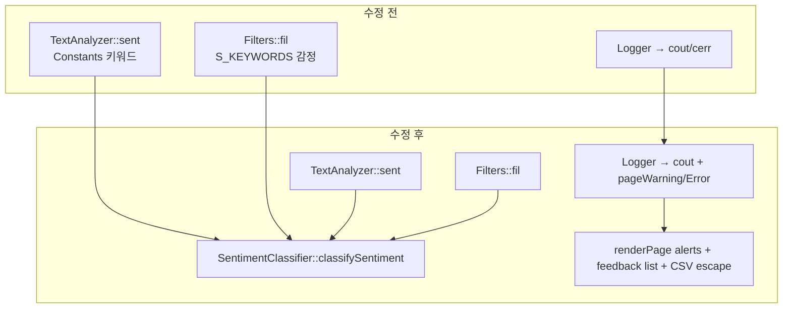

# Feedback Analyzer 11 — 미션 3 버그 수정 보고서

| 항목 | 내용 |
|------|------|
| 문서 | `docs/bug_fix.md` |
| 프로젝트 | FeedbackAnalyzer_11 (리팩토링 챌린지) |
| 미션 | **3** — 페이지 로그, 멀티라인, 중립 필터 |
| 선행 문서 | [bug_fix_plan.md](bug_fix_plan.md), [Report/02_1_RED.md](../Report/02_1_RED.md) §4.5, [Report/02_2_GREEN.md](../Report/02_2_GREEN.md) |
| 공식 보고서 | [Report/03_BugFix.md](../Report/03_BugFix.md) |
| 작업 플랜 | [bug_fix_plan.md](bug_fix_plan.md) |
| 검증 일시 | 2026-05-22 (로컬 `ctest`) |
| 문서 버전 | 1.0 |

---

## 1. Executive Summary

| 구분 | 수정 전 (M2 GREEN) | 수정 후 (M3 GREEN) |
|------|-------------------|-------------------|
| 활성 테스트 | 32 Pass | **37 Pass** |
| DISABLED (M3 RED) | 5 Not Run | **0** |
| 감정 분류 | `sent()` / `fil()` 이중 규칙 | **`SentimentClassifier` 단일** |
| 키워드 필터 | `main` 서브맵 스킵 | **`main` 포함** |
| Logger | 콘솔만 | **warning/error → 페이지 alert** |
| 멀티라인 | 미검증·CSV 깨짐 가능 | **목록 표시 + CSV 이스케이프** |
| 골든 마스터 | v1.0.0 (mission 2) | **v2.0.0 (mission 3)** |

**결론: 미션 3 버그 수정 완료** — `.cursorrules` 완료 기준 3항 + 회귀 5건 + `ctest` 37/37 충족.

```powershell
cd build
ctest --output-on-failure
# 100% tests passed, 0 tests failed out of 37
```

---

## 2. 미션 3 정의

미션 2는 **현재 레거시 동작을 테스트로 고정**했고, 의도적 버그는 `DISABLED_` 접두사로 **RED 스펙만 문서화**했다. 미션 3은 그 버그를 **최소 범위로 수정**하여 2차 GREEN(37 Pass)을 달성하는 단계다.

| | 미션 2 GREEN | 미션 3 GREEN (본 문서) |
|---|--------------|------------------------|
| 코드 변경 | 없음 (ParseUtils 추출만) | **버그·UX 수정** |
| `sent` / `fil` | 이중 규칙 유지 | **단일화** |
| `ctest` | 32 Pass, 5 Disabled | **37 Pass, 0 Disabled** |
| 전면 재작성 | 금지 | 금지 (동일) |

---

## 3. 수정 대상 버그

### 3.1 I-01 — 중립 필터 불일치 (P0)

**증상**: 대시보드 `sent()` 중립 건수와 필터 「중립」 결과 목록이 다른 기준으로 계산됨.

| 모듈 (수정 전) | 키워드 | 중립 판정 |
|----------------|--------|-----------|
| `TextAnalyzer::sent()` | `Constants::SENTIMENT_KEYWORDS` | 긍·부 없으면 **기본 중립** |
| `Filters::fil()` | `Filters::S_KEYWORDS` | 긍→부→중립 키워드; `괜찮`이 긍정·중립 **중복** |

**재현 (수정 전)**

| ID | 입력 | `sent` 중립 | `fil(중립)` | gtest |
|----|------|-------------|-------------|-------|
| REG-1 | `"괜찮해요"` | 1 | 0 | Fail |
| REG-2 | `"괜찮한데 배송은 보통이에요"` | 1 | 0 | Fail |
| REG-3 | `"오늘 날씨 좋음"` | 1 | 1 | Pass (대조) |
| REG-0 | 위 3건 + `"보통 그냥 무난"` | 3 | 2 | Fail |

**수정**: `SentimentClassifier::classifySentiment()` 도입 — `Constants::SENTIMENT_KEYWORDS`만 사용. `sent()`와 `fil()` 감정 분기가 동일 함수 호출.

**수정 후**: REG-0~3 전부 **Pass** (`sent` 중립 == `fil(중립)` size).

---

### 3.2 I-02 — 키워드 필터 `main` 스킵 (P0)

**증상**: `Filters::fil()`이 `CATEGORY_KEYWORDS`의 `main` 서브맵을 건너뛰어 `TextAnalyzer::kw()`(main만 사용)와 불일치.

```cpp
// 수정 전 (Filters.cpp)
if (subEntry.first == "main") continue;
```

**수정**: `main` 포함 모든 서브맵에서 `containsAny` 검사.

**테스트**: `DISABLED_F05_KeywordSkipsMain` → `F05_KeywordSkipsMain` 활성화, `"배송"` + `fil(전체, 배송)` → **Pass**.

---

### 3.3 I-03 — Logger 미연동

**증상**: `logWarning` / `logError`는 stdout/stderr만 출력. `renderPage`는 라우트가 별도 문자열을 하드코딩.

**수정**

- `Logger::pageWarning`, `pageError` 정적 버퍼
- `logWarning` / `logError` 호출 시 버퍼 기록
- `clearPageMessages()` — 요청 시작 시 초기화
- `/filter` 경고·catch 분기에서 `Logger::getPageWarning()` / `getPageError()` → alert

| level | CSS 클래스 |
|-------|------------|
| warning | `.alert-warning` |
| error | `.alert-danger` |

---

### 3.4 I-04 — 멀티라인·CSV

**증상**: textarea는 있으나 피드백 본문 미표시, CSV가 `text + "\n"` 단순 연결로 줄바꿈·쉼표 시 행 깨짐.

**수정**

| 구간 | 내용 |
|------|------|
| 입력 | `/analyze` trim은 앞뒤만; 내부 `\n` 유지 (`urlDecode` 경유) |
| 표시 | `renderPage` 「피드백 목록」 섹션, `escapeHtml`에서 `\n` → `<br>`, `white-space: pre-wrap` |
| 다운로드 | `escapeCsvField()` — 따옴표·쉼표·줄바꿈 RFC 4180 스타일 이스케이프 |

---

## 4. 구현 상세

### 4.1 신규 모듈 — `SentimentClassifier`

| 파일 | 역할 |
|------|------|
| `src/cpp/SentimentClassifier.h` | `containsAny`, `classifySentiment` 선언 |
| `src/cpp/SentimentClassifier.cpp` | `Constants::SENTIMENT_KEYWORDS` 기반 긍/부/중립 |

```cpp
std::string SentimentClassifier::classifySentiment(const std::string& text) {
    if (containsAny(text, Constants::SENTIMENT_KEYWORDS[u8"긍정"])) return u8"긍정";
    if (containsAny(text, Constants::SENTIMENT_KEYWORDS[u8"부정"])) return u8"부정";
    return u8"중립";
}
```

### 4.2 변경 파일 목록

| 파일 | 변경 요약 |
|------|-----------|
| `TextAnalyzer.h` / `TextAnalyzer.cpp` | `sent()`/`kw()` 구현 분리, `classifySentiment` 사용 |
| `Filters.h` / `Filters.cpp` | 감정 분기 단일화, `main` 스킵 제거 |
| `Logger.h` / `Logger.cpp` | 페이지 메시지 버퍼 |
| `main.cpp` | Logger 연동, 피드백 목록, CSV 이스케이프 |
| `CMakeLists.txt` | `SentimentClassifier.cpp` 타깃 추가 |
| `tests/regression_neutral_filter_test.cpp` | `DISABLED_` 제거 (4건) |
| `tests/filters_test.cpp` | F05 활성화 |
| `tests/fixtures/golden_master.json` | v2.0.0 |
| `README.md`, `docs/golden_master.md`, `docs/bug_fix_plan.md` | 진행·완료 반영 |

**미수정 (범위 밖)**

- `httplib.h`
- `/upload` 후 분석 생략
- `fil_data` 세션 잔존
- 미션 4 네이밍, 미션 7 Trend/File DB

---

## 5. 테스트·검증 결과

### 5.1 `ctest` (공식)

```powershell
cmake --build build --target feedback_analyzer_tests
cd build
ctest --output-on-failure
```

| 항목 | M2 | M3 |
|------|-----|-----|
| 등록 | 37 | 37 |
| Pass | 32 | **37** |
| Fail | 0 | 0 |
| Disabled | 5 | **0** |

### 5.2 M3에서 승격된 테스트 (5건)

| ID | gtest_name | 수정 전 | 수정 후 |
|----|------------|---------|---------|
| REG-1 | `Regression_NeutralFilterMismatch_Case1_Gwaenchan` | Disabled → Fail | **Pass** |
| REG-2 | `Regression_NeutralFilterMismatch_Case2_GwaenchanInSentence` | Disabled → Fail | **Pass** |
| REG-3 | `Regression_NeutralFilterMismatch_Case3_NoKeywordDefaultsNeutral` | Disabled → Pass | **Pass** |
| REG-0 | `Regression_NeutralFilterMismatch` | Disabled → Fail | **Pass** |
| F-05 | `F05_KeywordSkipsMain` | Disabled (오탐 Pass) | **Pass** |

### 5.3 활성 32건 회귀

M3 수정 후 **기존 32 테스트 전부 Pass** — S-01~S-06, K-01~K-04, F-01~F-07( F-05 제외 시 31+활성 F05), U/C, COV-* 변경 없음.

### 5.4 골든 마스터 v2

| 필드 | 값 |
|------|-----|
| 경로 | [tests/fixtures/golden_master.json](../tests/fixtures/golden_master.json) |
| version | `2.0.0` |
| mission | `3` |
| bug_m3_red | 5건 → **baseline 승격** |
| 상세 | [golden_master.md](golden_master.md) |

---

## 6. 완료 기준 (AC) 체크리스트

| AC | 내용 | 상태 |
|----|------|------|
| AC-1 | 「중립」 필터 = `sent()` 중립 집계 | ✅ REG 4건 |
| AC-2 | `logWarning` / `logError` 페이지 alert | ✅ |
| AC-3 | 멀티라인 analyze·표시·다운로드 | ✅ |
| AC-4 | `ctest` 37/37 | ✅ |
| AC-5 | 골든 마스터 v2 | ✅ |

---

## 7. 수동 검증 가이드 (선택)

앱 실행:

```powershell
cmake --build build --target feedback_analyzer
.\build\feedback_analyzer.exe
# http://localhost:8080
```

| # | 시나리오 | 기대 |
|---|----------|------|
| M1 | `"괜찮해요"` 입력 → 분석 → 필터 「중립」 | 통계 중립 1 = 필터 결과 1건 |
| M2 | 피드백 없이 「분 석」 | 노란 `.alert-warning` |
| M3 | textarea에 `줄1` + Enter + `줄2` → 입력·필터·다운로드 | 목록 2줄, CSV 한 필드에 줄바꿈 유지 |

> 서버가 이미 실행 중이면 `feedback_analyzer.exe` 빌드 시 링크 Permission denied가 날 수 있음 — 프로세스 종료 후 재빌드.

---

## 8. 아키텍처 변화 (요약)



---

## 9. 다음 단계

| 미션 | 내용 |
|------|------|
| 4 | 네이밍·전역·매직 — [refactoring.md](refactoring.md) §3 |
| 5 | 긴 함수·HtmlRenderer — [refactoring.md](refactoring.md) §4 |
| 6 | 팀 자율 리팩토링 1건 |
| 7 | Trend + File DB |

---

## 10. 참고 문서

| 경로 | 설명 |
|------|------|
| [bug_fix_plan.md](bug_fix_plan.md) | 작업 플랜·AC·순서 |
| [.cursorrules](../.cursorrules) | 미션 3 완료 기준 |
| [analyzer.md](analyzer.md) §9 | 알려진 이슈 원문 |
| [Report/02_1_RED.md](../Report/02_1_RED.md) | M3 RED 회귀 스펙 |
| [Report/02_2_GREEN.md](../Report/02_2_GREEN.md) | M2 GREEN 보고서 |
| [Report/03_BugFix.md](../Report/03_BugFix.md) | M3 공식 보고서 (본 문서의 Report판) |
| [refactoring.md](refactoring.md) | 미션 4·5 REFACTOR 통합 |
| [golden_master.md](golden_master.md) | 골든 마스터 v1→v2 |
