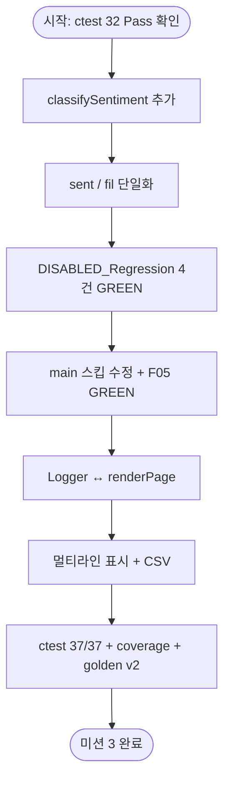

# 미션 3 버그 수정 작업 플랜

| 항목 | 내용 |
|------|------|
| 미션 | 3 — 페이지 로그, 멀티라인, 중립 필터 |
| 예상 시간 | ~1.5h (`project_purpose.md` §6.1) |
| 선행 완료 | 미션 2 (32 Pass, 도메인 coverage 100%, 골든 마스터 v1) |
| 작성일 | 2026-05-22 |
| 규칙 출처 | [.cursorrules](../.cursorrules), [docs/analyzer.md](analyzer.md) §9 |

---

## 1. 목표

미션 2에서 **현재 동작을 고정한 회귀 테스트(32 Pass)** 와 **미션 3용 RED 테스트(5 Disabled)** 를 분리해 두었다. 미션 3은 **의도적 버그 3종 + 연관 P0 1건** 을 최소 범위로 수정하고, **37/37 Pass** 및 **골든 마스터 v2** 로 기준선을 승격하는 것이 목표다.

**하지 말 것**

- `httplib.h` 수정, `build/` 커밋
- `main.cpp` 전면 재작성, React 등 프론트 교체
- 미션 4 네이밍(`fil`→`filterFeedbacks` 등), 미션 7 Trend/File DB
- 요청 없이 `/upload` 분석 생략·`fil_data`·`FileHandler` 등 M3 범위 밖 이슈 일괄 수정

---

## 2. 완료 기준 (Acceptance Criteria)

`.cursorrules` 및 [README.md](../README.md) 기준.

| # | AC | 검증 방법 |
|---|-----|-----------|
| AC-1 | 「중립」 필터 결과 건수 = `sent()` 중립 집계 건수 | `DISABLED_Regression_*` 4건 Pass, 수동: 대시보드 중립 수 vs 필터 「중립」 목록 |
| AC-2 | `logWarning` / `logError` 가 페이지 alert로 표시 | `/filter` 빈 결과·예외 시 `.alert-warning` / `.alert-danger` 확인 |
| AC-3 | textarea 멀티라인이 analyze → 표시 → CSV 다운로드까지 보존 | `"줄1\n줄2"` 입력 후 UI·`filtered_feedback.csv` 동일 내용 |
| AC-4 | `ctest` 37/37 Pass (Disabled 0) | `ctest --output-on-failure` |
| AC-5 | 골든 마스터 v2 | [tests/fixtures/golden_master.json](../tests/fixtures/golden_master.json), [docs/golden_master.md](golden_master.md) 갱신 |

---

## 3. 알려진 버그 요약

| ID | 이슈 | 위치 | M3 대상 |
|----|------|------|---------|
| I-01 | **중립 필터 불일치** — `sent()` vs `fil()` 감정 규칙 이중 정의 | `TextAnalyzer.h`, `Filters.h` | ✅ P0 |
| I-02 | **키워드 `main` 스킵** — `fil()`만 `main` 서브맵 제외 | `Filters.h` L56 | ✅ P0 |
| I-03 | **Logger 미연동** — 콘솔만, 웹 alert와 분리 | `Logger.h`, `main.cpp` | ✅ |
| I-04 | 멀티라인·CSV — 표시/다운로드 시 줄바꿈·필드 깨짐 | `main.cpp` | ✅ |
| — | `/upload` 분석 생략, `fil_data` 잔존 | `main.cpp` | ❌ (명시 요청 시만) |

### 3.1 중립 불일치 (I-01) — 근본 원인

| 모듈 | 키워드 소스 | 중립 판정 |
|------|-------------|-----------|
| `TextAnalyzer::sent()` | `Constants::SENTIMENT_KEYWORDS` (긍/부만) | 긍·부 매칭 없으면 **기본 중립** |
| `Filters::fil()` | `Filters::S_KEYWORDS` | 긍→부→**중립 키워드** 순; `괜찮`이 긍정·중립 **중복** |

**재현 예**

| 입력 | `sent()` 중립 | `fil(중립)` size | REG |
|------|---------------|------------------|-----|
| `"괜찮해요"` | 1 | 0 | REG-1 Fail |
| `"괜찮한데 배송은 보통이에요"` | 1 | 0 | REG-2 Fail |
| `"오늘 날씨 좋음"` | 1 | 1 | REG-3 Pass (대조) |
| 위 3건 + `"보통 그냥 무난"` | 3 | 2 | REG-0 Fail |

### 3.2 `main` 스킵 (I-02)

```cpp
// Filters.h — 키워드 필터 시
if (subEntry.first == "main") continue;
```

`TextAnalyzer::kw()`는 `main`만 사용 → 동일 카테고리·키워드로 **집계와 필터 결과 불일치**.

`DISABLED_F05_KeywordSkipsMain`은 현재 `"배송"` 샘플이 **status 서브키**에만 매칭되어 **오탐 Pass** — 수정 후 sub-only 샘플 + `EXPECT_EQ(0u)` 등으로 RED→GREEN.

---

## 4. 작업 항목 (Work Breakdown)

### 4.1 P0 — 감정 분류 단일화 (중립 필터)

**목표**: `sent()`와 `fil()`이 동일한 `classifySentiment(text)` 결과를 사용.

| 단계 | 작업 | 산출물 |
|------|------|--------|
| 4.1.1 | 공유 함수 설계 | `classifySentiment(const std::string& text) -> std::string` (긍정/부정/중립) |
| 4.1.2 | 키워드 소스 결정 | **권장**: `Constants::SENTIMENT_KEYWORDS` 단일 소스; `Filters::S_KEYWORDS` 감정 분기 제거 또는 위임 |
| 4.1.3 | `TextAnalyzer::sent()` 리팩터 | 루프 내 `classifySentiment` 호출 |
| 4.1.4 | `Filters::fil()` 감정 분기 리팩터 | 동일 함수 사용, `S_KEYWORDS` 긍/부/중립 이중 로직 삭제 |
| 4.1.5 | 회귀 GREEN | `tests/regression_neutral_filter_test.cpp` 4건 `DISABLED_` 제거 |

**설계 원칙** (`.cursorrules` GOOD 예시)

```cpp
// GOOD — sent()와 fil()이 공유
std::string s = classifySentiment(txt);
```

**주의**

- 활성 32 테스트 **회귀 없음** 유지 (S-01~S-06, F-01~F-07 등).
- `S-06` (`"보통 그냥 무난"`) 등은 단일화 **후**에도 `sent` 중립=1 등 기대와 맞는지 확인.

---

### 4.2 P0 — 키워드 필터 `main` 스킵 수정 (F05)

| 단계 | 작업 | 산출물 |
|------|------|--------|
| 4.2.1 | `Filters::fil` 키워드 루프 | `if (subEntry.first == "main") continue;` **삭제** 또는 `kw()`와 동일한 `matchesCategory()` 공유 |
| 4.2.2 | F05 테스트 정리 | `DISABLED_F05_KeywordSkipsMain` → `F05_KeywordSkipsMain`; **main 전용** 키워드만 있는 샘플 + `EXPECT_EQ(0u)` (수정 전 RED 의도) |
| 4.2.3 | 수정 후 | `main` 매칭 시 `size >= 1` 기대로 Pass |

**GOOD 예시**

```cpp
// GOOD — kw()와 동일하게 main 포함
for (const auto& subEntry : catMap) {
    if (containsAny(txt, subEntry.second)) { ... }
}
```

---

### 4.3 P1 — 페이지 로그 (Logger ↔ UI)

**현재**: `Logger` → stdout/stderr; `renderPage(success, warning, error)` 는 라우트가 **하드코딩 문자열** 전달.

| 단계 | 작업 | 산출물 |
|------|------|--------|
| 4.3.1 | 페이지용 메시지 버퍼 | 예: `Logger`에 `lastWarning` / `lastError` static 또는 라우트 공통 헬퍼 |
| 4.3.2 | `logWarning` / `logError` | 콘솔 출력 + 페이지 버퍼 기록 |
| 4.3.3 | 라우트 연동 | `/analyze`, `/upload`, `/filter` catch·경고 분기에서 `renderPage`의 `warning`/`error`에 **Logger와 동일 메시지** 전달 |
| 4.3.4 | 스타일 | warning → `alert-warning`, error → `alert-danger` (CSS 기존) |

**검증 시나리오**

1. 피드백 없이 「분 석」 → warning alert + 콘솔 WARNING
2. 필터 결과 0건 → warning alert
3. 의도적 예외(테스트용) 또는 파싱 오류 → error alert

**범위**: `logInfo`는 콘솔만 유지 가능 (AC는 warning/error만 명시).

---

### 4.4 P1 — 멀티라인 (textarea end-to-end)

| 단계 | 작업 | 파일 |
|------|------|------|
| 4.4.1 | 입력 보존 | `/analyze`: trim은 **앞뒤**만; 내부 `\n` 유지. `ParseUtils::urlDecode`에 `%0A` 확인 |
| 4.4.2 | 표시 | `renderPage`에 피드백 목록 섹션 추가; `escapeHtml` + `\n` → `<br>` 또는 `white-space: pre-wrap` |
| 4.4.3 | CSV | `/download`: `text` 필드 **RFC 4180** 이스케이프 (따옴표·줄바꿈·쉼표) |
| 4.4.4 | (선택) textarea 높이 | `rows` 또는 CSS `min-height` — UX만, AC 필수 아님 |

**수동 테스트**

```
입력: 첫 줄
      둘째 줄
기대: Session 저장 → 결과 영역 2줄 표시 → CSV 한 셀에 줄바꿈 유지
```

---

### 4.5 P2 — 문서·기준선 갱신

| 단계 | 작업 |
|------|------|
| 4.5.1 | `tests/fixtures/golden_master.json` → v2 (`mission: 3`, 37 baseline, `bug_m3_red` 제거) |
| 4.5.2 | [docs/golden_master.md](golden_master.md) M3 섹션 반영 |
| 4.5.3 | [README.md](../README.md) 미션 3 체크리스트 완료 표시 |
| 4.5.4 | (선택) `Report/02_3_Golden.md` 또는 M3 GREEN 보고서 |

---

## 5. 권장 작업 순서



| 순서 | 작업 | 이유 |
|------|------|------|
| 1 | `classifySentiment` + 중립 일치 | AC-1, 회귀 4건 — 핵심 버그 |
| 2 | F05 `main` 스킵 | P0, 필터·키워드 일관성 |
| 3 | Logger 페이지 연동 | AC-2, `main.cpp`만 |
| 4 | 멀티라인·CSV | AC-3, UI 변경 |
| 5 | golden v2 + README | AC-4, AC-5 |

각 P0 단계 후 **활성 32 테스트** 재실행 → 회귀 방지.

---

## 6. 수정 대상 파일

| 파일 | 변경 내용 |
|------|-----------|
| `src/cpp/TextAnalyzer.h` (또는 신규 `.cpp`) | `classifySentiment`, `sent()` 위임 |
| `src/cpp/Filters.h` / `Filters.cpp` | `fil()` 감정 분기 단일화, `main` continue 제거 |
| `src/cpp/Constants.cpp` | (필요 시) 감정 키워드 단일 소스 정리 |
| `src/cpp/Logger.h` | 페이지 메시지 버퍼 (설계에 따라) |
| `src/cpp/main.cpp` | `renderPage` alert·피드백 목록·CSV 이스케이프·라우트 |
| `tests/regression_neutral_filter_test.cpp` | `DISABLED_` 제거 |
| `tests/filters_test.cpp` | F05 이름·샘플·기대값 |
| `CMakeLists.txt` | 신규 `.cpp` 추가 시만 |
| `tests/fixtures/golden_master.json` | v2 |
| `docs/golden_master.md`, `README.md` | 진행 상태 |

**건드리지 않음**: `httplib.h`, `build/`, 미션 4~7 범위.

---

## 7. 테스트·검증 체크리스트

### 7.1 빌드

```powershell
cmake -S . -B build
cmake --build build --target feedback_analyzer_tests feedback_analyzer
```

### 7.2 단위·회귀 (필수)

```powershell
cd build
ctest --output-on-failure
# 기대: 37 tests passed, 0 failed, 0 disabled
```

```powershell
.\feedback_analyzer_tests.exe --gtest_filter="*Regression_Neutral*:*F05_KeywordSkipsMain*"
```

| 그룹 | 기대 (M3 후) |
|------|----------------|
| 활성 32 | 전부 Pass |
| REG-1, REG-2, REG-0 | Pass |
| REG-3 | Pass (대조 유지) |
| F05 | Pass (의도에 맞는 assertion) |

### 7.3 커버리지 (회귀)

```powershell
.\scripts\run_coverage.ps1
```

도메인 line **≥ 90%** 유지 (M2: 100%).

### 7.4 수동 (웹)

```powershell
.\build\feedback_analyzer.exe
# http://localhost:8080
```

| # | 시나리오 | AC |
|---|----------|-----|
| M1 | `"괜찮해요"` 입력 → 감정 중립 1 → 필터 「중립」 1건 | AC-1 |
| M2 | 데이터 없이 필터 → warning 박스 | AC-2 |
| M3 | `"A\nB"` 입력 → 목록·CSV | AC-3 |

---

## 8. 리스크·완화

| 리스크 | 완화 |
|--------|------|
| 단일화 후 S-02~S-06 기대값 변경 | M3 전 `ctest` 32 Pass; 변경 시 테스트·golden 동시 갱신 |
| `S_KEYWORDS` 제거 시 F-03 등 영향 | `fil` 중립 **감정** 분기만 `classifySentiment`로 교체; 키워드 필터용 `S_KEYWORDS`는 M3 범위에서 감정 분기만 제거 |
| 멀티라인 CSV가 Excel에서 깨짐 | UTF-8 BOM 유지 + 필드 따옴표 |
| Logger 전역 상태 | 요청 단위로 clear 또는 라우트 종료 시 reset |

---

## 9. 완료 체크리스트

- [x] AC-1: `sent()` 중립 == `fil(중립)` (REG 4건 Pass)
- [x] AC-2: warning/error 페이지 alert
- [x] AC-3: 멀티라인 analyze·표시·다운로드
- [x] AC-4: `ctest` 37/37
- [x] AC-5: golden_master.json v2
- [x] F05: `main` 스킵 수정 + 테스트 Pass
- [x] 도메인 coverage ≥ 90% (M2 기준 유지)
- [x] `httplib.h` / `build/` 미커밋
- [x] README 미션 3 항목 체크

---

## 10. 참고 문서

| 경로 | 용도 |
|------|------|
| [.cursorrules](../.cursorrules) | 미션 3 AC, BAD/GOOD 예시 |
| [docs/analyzer.md](analyzer.md) §9 | 버그 상세·아키텍처 |
| [Report/02_1_RED.md](../Report/02_1_RED.md) §4.5 | REG 회귀 스펙 |
| [Report/02_2_GREEN.md](../Report/02_2_GREEN.md) | M2 vs M3 GREEN 구분 |
| [Report/03_BugFix.md](../Report/03_BugFix.md) | M3 공식 보고서 |
| [docs/golden_master.md](golden_master.md) | v1→v2 전환 |
| [tests/regression_neutral_filter_test.cpp](../tests/regression_neutral_filter_test.cpp) | REG-0~3 |
| [Prompting/02_2_GREEN.md](../Prompting/02_2_GREEN.md) | M3 Agent 프롬프트(프롬프트 5) |

---

## 11. Agent 실행용 한 줄 프롬프트 (참고)

```
@docs/bug_fix_plan.md @.cursorrules @tests/regression_neutral_filter_test.cpp
미션 3만: classifySentiment 단일화 → DISABLED_Regression 4건 GREEN → F05 main 스킵 → Logger 페이지 → 멀티라인·CSV → ctest 37/37 → golden v2. M4 네이밍·M7 기능 금지.
```
