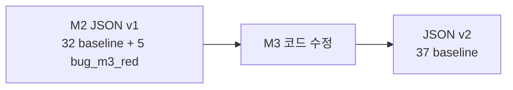

# 골든 마스터 (Golden Master) — 미션 2 / 3

| 항목 | 내용 |
|------|------|
| 기계용 스냅샷 | [tests/fixtures/golden_master.json](../tests/fixtures/golden_master.json) |
| 현재 버전 | **v2.0.0** (미션 3 GREEN) |
| 생성일 | 2026-05-22 |
| 선행 보고서 | [Report/02_2_GREEN.md](../Report/02_2_GREEN.md), [docs/bug_fix_plan.md](bug_fix_plan.md) |

---

## 1. 정의

**골든 마스터**는 미션 2 GREEN 시점의 **레거시 도메인 동작 스냅샷**이다. GoogleTest는 매 빌드 **실행·Pass/Fail** 검증을 담당하고, JSON은 동일한 Given/When/Then을 **ID·입력·기대값·M3 버그 구간**으로 한곳에 모아 리팩토링(M3~) 시 diff·문서·(선택) 데이터 드리븐 검증의 기준선으로 쓴다.

- GTest를 **대체하지 않음**
- `main.cpp`, `httplib.h`, HTTP/HTML **제외**
- 프로덕션 코드·테스트 assertion **변경 없음** (문서화만)

---

## 2. 검증 메타데이터 (2026-05-22 로컬)

### ctest

```powershell
cmake --build build --target feedback_analyzer_tests
cd build
ctest --output-on-failure
```

| 항목 | 값 |
|------|-----|
| 등록 테스트 | 37 |
| **Passed** | **37** |
| **Failed** | **0** |
| **Disabled (Not Run)** | **0** |
| 요약 | `100% tests passed, 0 tests failed out of 37` |

### 커버리지

```powershell
.\scripts\run_coverage.ps1
```

| 항목 | 값 |
|------|-----|
| 도메인 line | **134/134 (100.0%)** |
| 90% 미만 파일 | 없음 |

### 미션 3 회귀 (v2)

```powershell
cd build
ctest --output-on-failure
```

| 결과 | 건수 |
|------|------|
| Pass | **37** (REG-0~3, F-05 포함) |
| Fail | 0 |

---

## 3. 미션 2 vs 미션 3

| 구분 | M2 골든 마스터 v1 | M3 골든 마스터 v2 (현재) |
|------|-------------------|-------------------------|
| **baseline** | 32건 (활성 Pass) | **37건** (전부 Pass) |
| **bug_m3_red** | 5건 (`pre_m3` 실측) | 0건 (baseline 승격 완료) |
| **코드 변경** | 없음 | `SentimentClassifier`, F05 `main` 매칭, Logger·멀티라인 |
| **ctest** | 32 Pass, 5 Disabled | **37 Pass**, 0 Disabled |



---

## 4. 테스트 ID 전체 매핑 (37건)

### 4.1 baseline — 32건

| 그룹 | ID | gtest_name | API | 상태 |
|------|-----|------------|-----|------|
| Sentiment | S-01 ~ S-06 | `S01_*` … `S06_*` | `TextAnalyzer::sent` | baseline |
| Keyword | K-01 ~ K-04 | `K01_*` … `K04_*` | `TextAnalyzer::kw` | baseline |
| Filter | F-01, F-02, F-03, F-06, F-07 | `F01_*` … `F07_*` (F-05 제외) | `Filters::fil` | baseline |
| Parse | U-01 ~ U-03 | `U01_*` … `U03_*` | `ParseUtils::urlDecode` | baseline |
| Parse | C-01 ~ C-04 | `C01_*` … `C04_*` | `ParseUtils::parseCsvLine` | baseline |
| Coverage | COV-G01, G02 | `COV_G01_*`, `COV_G02_*` | `sent`/`kw` global | baseline |
| Coverage | COV-TA01, TA02 | `COV_TA01_*`, `COV_TA02_*` | `sent`/`kw` | baseline |
| Coverage | COV-F01 ~ F06 | `COV_F01_*` … `COV_F06_*` | `Filters::fil` | baseline |

### 4.2 bug_m3_red — 5건

| ID | gtest (DISABLED 접두사) | 입력 | pre_m3 (실측) | gtest 활성 시 |
|----|-------------------------|------|---------------|---------------|
| **REG-1** | `..._Case1_Gwaenchan` | `"괜찮해요"` | sent 중립 **1**, fil(중립) **0** | **Fail** |
| **REG-2** | `..._Case2_GwaenchanInSentence` | `"괜찮한데 배송은 보통이에요"` | sent **1**, fil **0** | **Fail** |
| **REG-3** | `..._Case3_NoKeywordDefaultsNeutral` | `"오늘 날씨 좋음"` | sent **1**, fil **1** | **Pass** (대조) |
| **REG-0** | `Regression_NeutralFilterMismatch` | 3건 배치* | sent **3**, fil **2** | **Fail** |
| **F-05** | `F05_KeywordSkipsMain` | `"배송"` | fil size **1** (status 서브키 매칭) | **Pass** (오탐) |

\* REG-0 배치: `"괜찮해요"`, `"오늘 날씨 좋음"`, `"보통 그냥 무난"`

**원인 요약**: `sent()`는 `Constants::SENTIMENT_KEYWORDS`(중립 버킷 없음 → 기본 중립), `fil()`은 `Filters::S_KEYWORDS`(`괜찮`이 긍정·중립 중복) 사용.

---

## 5. JSON 스키마 요약

| 최상위 필드 | 설명 |
|-------------|------|
| `version` | `1.0.0` (M2) |
| `mission` | `2` |
| `generated_at` | ISO 날짜 |
| `ctest_summary` | Pass/Fail/Disabled |
| `coverage_summary` | 도메인 line % |
| `disabled_run_summary` | DISABLED 수동 실행 결과 |
| `cases[]` | 37건 |

**case 공통**: `id`, `gtest_name`, `api`, `given`, `when`, `status`

| status | 필드 |
|--------|------|
| `baseline` | `expected` |
| `bug_m3_red` | `pre_m3`, `post_m3` (제안), 선택 `expected` |

### UTF-8 규칙

- 파일 본문: **UTF-8** (한글 그대로)
- ASCII-only 파서: 동일 문자열을 `\uXXXX`로 변환 가능
- C++ `u8"긍정"` ↔ JSON `"긍정"`

---

## 6. 갱신 방법

### M3 GREEN 후 v2 (5줄)

1. `version` → `2.0.0`, `mission` → `3`, `generated_at` 갱신  
2. REG-1·REG-2·REG-0 → `status: "baseline"`, `pre_m3`는 이력 보존  
3. F-05 → baseline 승격, `pre_m3`에 오탐 Pass 사유 유지  
4. `ctest_summary`: **37 Pass**, **0 Disabled**  
5. `coverage_summary` 숫자·날짜만 갱신 (≥90% 유지)

### 재생성 절차

```powershell
# 1) 테스트·커버리지
cmake --build build --target feedback_analyzer_tests
cd build; ctest --output-on-failure
cd ..
.\scripts\run_coverage.ps1

# 2) DISABLED 실측
.\build\feedback_analyzer_tests.exe --gtest_filter="*Regression_Neutral*:*F05_KeywordSkipsMain*" --gtest_also_run_disabled_tests

# 3) JSON/MD 수동 또는 Agent로 tests/fixtures/golden_master.json 갱신
```

---

## 7. 관련 문서

| 경로 | 설명 |
|------|------|
| [docs/coverage.md](coverage.md) | 커버리지 실행·COV 매핑 |
| [Report/02_2_GREEN.md](../Report/02_2_GREEN.md) | M2 GREEN 검증 보고서 |
| [Report/02_1_RED.md](../Report/02_1_RED.md) | RED 플랜·DISABLED 스펙 |
| `.cursorrules` | 미션 2·3 완료 기준 |

---

*본 문서는 미션 2 GREEN 완료 시점의 골든 마스터 스냅샷을 설명한다. 상세 입출력은 `tests/fixtures/golden_master.json`을 단일 소스로 한다.*
