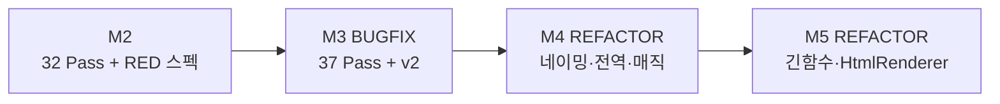
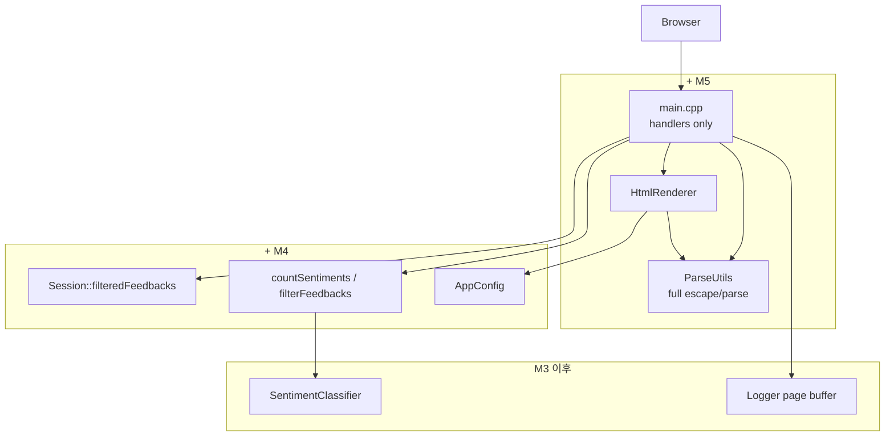

# Feedback Analyzer 11 — 미션 4·5 리팩토링 보고서

| 항목 | 내용 |
|------|------|
| 문서 | `docs/refactoring.md` |
| 프로젝트 | FeedbackAnalyzer_11 (리팩토링 챌린지) |
| 미션 | **4** — 네이밍·전역·매직 값 (~1h) · **5** — 긴 함수·중복 코드 (~1.5h) |
| 선행 문서 | [bug_fix.md](bug_fix.md) (미션 3 GREEN 37 Pass) |
| 공식 보고서 | [Report/04_Refactoring_네이밍,전역,매직.md](../Report/04_Refactoring_네이밍,전역,매직.md), [Report/05_Refactoring_긴함수,중복.md](../Report/05_Refactoring_긴함수,중복.md) |
| 검증 일시 | 2026-05-22 (`ctest` + `run_coverage.ps1`) |
| 문서 버전 | 1.0 |

---

## 1. Executive Summary

미션 3에서 확정한 **동작·37 Pass·golden v2**를 유지한 채, **구조·가독성**만 개선한 REFACTOR 단계다. 미션 4는 **이름·전역·매직/죽은 코드**, 미션 5는 **`main.cpp` God Object·긴 함수·유틸 중복**을 다룬다. 두 미션 모두 **신규 RED 없음**, **GREEN = 기존 37건 Pass 재확인**이다.

| 구분 | M3 BUGFIX (기준선) | M4 REFACTOR | M5 REFACTOR |
|------|-------------------|-------------|-------------|
| `ctest` | 37 Pass | 37 Pass | **37 Pass** |
| 공개 API | `fil`, `sent`, `kw` | `filterFeedbacks`, `countSentiments`, `countKeywords` | 동일 |
| 필터 결과 저장 | `main.cpp` `fil_data` | `Session::filteredFeedbacks` | 동일 |
| 분석 캐시 | — | `globalSent`/`globalKw` **제거** | 동일 |
| dead code | `S_KEYWORDS` (M3 이후 미사용) | **제거** | 동일 |
| 서버/UI 매직 | `8080`, `100px` 리터럴 | **`AppConfig`** | 동일 |
| `main.cpp` | ~371줄, `renderPage` + 람다 5개 | 동일 (M5 보류) | **~165줄**, 핸들러 5개 |
| HTML | `static renderPage()` in main | 동일 | **`HtmlRenderer`** |
| 파싱·이스케이프 | main static + ParseUtils 일부 | 동일 | **`ParseUtils` 통합** |
| `containsAny` | `SentimentClassifier` 단일 (M3) | 유지 | 유지 |
| 골든 마스터 | v2.0.0 | v2 유지 | v2 유지 |

**결론: 미션 4·5 REFACTOR 완료** — `ctest` 37/37, 도메인 line coverage **100%**, `classifySentiment`·필터 규칙 미변경.

```powershell
cmake --build build --target feedback_analyzer_tests
cd build
ctest --output-on-failure
# 100% tests passed, 0 tests failed out of 37

.\scripts\run_coverage.ps1
# 도메인 TOTAL 100% (175/175 lines)
```

---

## 2. REFACTOR 단계 정의 (M4·M5 공통)

| | 클래식 RED→GREEN | FeedbackAnalyzer M4·M5 |
|---|------------------|-------------------------|
| 선행 | 실패 테스트 작성 | **M3 GREEN 37 Pass** 고정 |
| 코드 변경 | 동작 추가·수정 | **이름·구조·상수만** (M4) / **분리만** (M5) |
| RED | 신규 Fail | **없음** |
| GREEN | Fail→Pass | **37 Pass 유지** = 회귀 GREEN |
| Golden v3 | — | **필수 아님** (v2·동작 동일) |



| 미션 | Report | docs |
|------|--------|------|
| 3 | [03_BugFix.md](../Report/03_BugFix.md) | [bug_fix.md](bug_fix.md) |
| 4 | [04_Refactoring_네이밍,전역,매직.md](../Report/04_Refactoring_네이밍,전역,매직.md) | **본 문서 §3** |
| 5 | [05_Refactoring_긴함수,중복.md](../Report/05_Refactoring_긴함수,중복.md) | **본 문서 §4** |

---

## 3. 미션 4 — 네이밍·전역·매직 값

### 3.1 대상 스멜

| 스멜 | 수정 전 | 수정 후 |
|------|---------|---------|
| 부적절한 네이밍 | `fil`, `sent`, `kw` | 의미 있는 API 이름 |
| 전역 변수 | `fil_data`, `globalSent`, `globalKw` | Session / 반환값만 |
| 매직/하드코딩 | `8080`, textarea `100px` | `AppConfig` |
| 죽은 코드 | `Filters::S_KEYWORDS`, `initFilterKeywords()` | 삭제 |

### 3.2 API 리네이밍

| 이전 | 이후 |
|------|------|
| `Filters::fil()` | `Filters::filterFeedbacks()` |
| `TextAnalyzer::sent()` | `TextAnalyzer::countSentiments()` |
| `TextAnalyzer::kw()` | `TextAnalyzer::countKeywords()` |
| `sFilter` / `kFilter` | `sentimentFilter` / `keywordFilter` |

`tests/filters_test.cpp`, `tests/text_analyzer_test.cpp`, `tests/regression_neutral_filter_test.cpp`, `tests/coverage_gap_test.cpp`, `main.cpp` 호출부 동기화.

> gtest **케이스 이름**(`F01_Fil_*`, `S01_Sent_*` 등)은 golden v2 ID 대응을 위해 **유지**.

### 3.3 전역 상태 → Session

**`fil_data`** (`main.cpp` static) → **`Session::filteredFeedbacks`**

```cpp
Session::setFilteredFeedbacks(filtered);   // POST /filter 성공
Session::getFilteredFeedbacks();           // GET /download
```

**`globalSent` / `globalKw`** (`TextAnalyzer` static) → **제거**. `countSentiments` / `countKeywords`는 `std::map` **반환만**.

### 3.4 `AppConfig.h` (신규)

| 상수 | 값 | 용도 |
|------|-----|------|
| `kServerPort` | 8080 | `listen`, 로그 URL |
| `kServerHost` | `"0.0.0.0"` | 바인드 |
| `kTextareaHeightPx` | 100 | textarea CSS 높이 (M5에서 `HtmlRenderer`가 참조) |

### 3.5 Dead code 제거

M3 이후 감정 필터는 `SentimentClassifier::classifySentiment()`만 사용. 아래는 **초기화만 되고 미참조** → 삭제.

- `Filters::S_KEYWORDS`
- `Filters::initFilterKeywords()`
- `tests/test_fixture.h`의 `initFilterKeywords()` 호출

키워드 필터는 `Constants::CATEGORY_KEYWORDS`만 사용 (M3 `main` 매칭 포함).

### 3.6 미션 4 수정 파일

| 파일 | 변경 |
|------|------|
| `Filters.h/cpp`, `TextAnalyzer.h/cpp` | 리네이밍, dead code·global* 제거 |
| `Session.h/cpp` | `filteredFeedbacks` |
| `main.cpp` | Session·AppConfig·새 API (M5 전 상태) |
| `AppConfig.h` | **신규** |
| `tests/*.cpp`, `test_fixture.h` | 호출부·fixture 정리 |

**미변경**: `SentimentClassifier.*`, `Constants.*`, `Logger.*`, `golden_master.json` v2.

### 3.7 미션 4 완료 기준

| AC | 내용 | 상태 |
|----|------|------|
| AC-1 | API 리네이밍 | ✅ |
| AC-2 | `fil_data`·`global*` 정리 | ✅ |
| AC-3 | 매직 값 `AppConfig` | ✅ |
| AC-4 | `S_KEYWORDS` 제거 | ✅ |
| AC-5 | `ctest` 37/37 | ✅ |
| AC-6 | coverage ≥ 90% | ✅ 100% |

---

## 4. 미션 5 — 긴 함수·중복 코드

### 4.1 대상 스멜

| 스멜 | 수정 전 | 수정 후 |
|------|---------|---------|
| 긴 함수 | `renderPage()` ~140줄 in `main.cpp` | `HtmlRenderer` + `append*` |
| God Function | `main()` + HTML + 라우트 + 처리 | 핸들러 5개 + `main()` 등록만 |
| 중복 유틸 | `parseForm`, `escapeHtml`, `escapeCsvField` in main | `ParseUtils` |
| `containsAny` 중복 | (M3에서 이미 단일화) | **규칙 변경 없이 유지** |

### 4.2 `HtmlRenderer` (Extract Function + 파일 분리)

| 함수 | 책임 |
|------|------|
| `appendPageHead` | DOCTYPE, CSS, 컨테이너 |
| `appendSuccessAlert` / `appendWarningAlert` / `appendErrorAlert` | level별 alert |
| `appendInputSection` | `POST /analyze` |
| `appendUploadSection` | `POST /upload` |
| `appendFilterSection` | `POST /filter` + 카테고리 select |
| `appendStatsSection` | 감정·키워드 통계 + download 링크 |
| `appendFeedbackList` | 피드백 목록 (`ParseUtils::escapeHtml`) |
| `HtmlRenderer::renderPage` | 위 섹션 **조합만** |

```cpp
// HtmlRenderer.h — 공개 API (M4 main의 renderPage와 동일 시그니처)
static std::string renderPage(const std::string& success,
                              const std::string& warning,
                              const std::string& error,
                              const std::map<std::string, int>& sentimentResults,
                              const std::map<std::string, int>& keywordResults,
                              const std::vector<Feedback>& feedbacks);
```

### 4.3 라우트 핸들러 (Extract Function)

| 핸들러 | HTTP | 핵심 로직 |
|--------|------|-----------|
| `handleGetRoot` | `GET /` | `initSessionState`, 시작 메시지 |
| `handlePostAnalyze` | `POST /analyze` | `parseForm`, trim, `countSentiments`/`countKeywords` |
| `handlePostUpload` | `POST /upload` | CSV `parseCsvLine` |
| `handlePostFilter` | `POST /filter` | `filterFeedbacks`, `setFilteredFeedbacks` |
| `handleGetDownload` | `GET /download` | BOM + `escapeCsvField` |

`main()`:

```cpp
svr.Get("/", handleGetRoot);
svr.Post("/analyze", handlePostAnalyze);
svr.Post("/upload", handlePostUpload);
svr.Post("/filter", handlePostFilter);
svr.Get("/download", handleGetDownload);
svr.listen(AppConfig::kServerHost, AppConfig::kServerPort);
```

`respondHtml()` — `text/html; charset=UTF-8` 공통 설정.

### 4.4 `ParseUtils` 확장

| 함수 | 용도 |
|------|------|
| `urlDecode`, `parseCsvLine` | M2부터 존재 |
| `parseForm` | M5 — `/analyze`, `/filter` |
| `escapeHtml` | M5 — HTML·alert·목록 |
| `escapeCsvField` | M5 — `/download` |

> `parseForm` / `escapeHtml` / `escapeCsvField`는 **도메인 gcov 대상 밖** ([coverage.md](coverage.md)). 회귀는 **gtest 37건**으로 검증.

### 4.5 `containsAny` (M3 유지, M5에서 재통합 안 함)

| 시점 | 위치 |
|------|------|
| M2 스멜 | `TextAnalyzer`, `Filters` 각각 중복 |
| M3 | `SentimentClassifier::containsAny` **단일** |
| M4·M5 | 호출·규칙 **미변경** |

### 4.6 미션 5 수정 파일

| 파일 | 변경 |
|------|------|
| `HtmlRenderer.h/cpp` | **신규** |
| `main.cpp` | 핸들러·슬림 `main` |
| `ParseUtils.h/cpp` | form/html/csv 유틸 |
| `CMakeLists.txt` | `HtmlRenderer.cpp` 링크 |

**미변경**: `SentimentClassifier.*`, `TextAnalyzer.*`, `Filters.*`, `Session.*`, `tests/*`, golden v2.

### 4.7 미션 5 완료 기준

| AC | 내용 | 상태 |
|----|------|------|
| AC-1 | `renderPage` 분해 | ✅ |
| AC-2 | named handler 5개 | ✅ |
| AC-3 | ParseUtils 유틸 이동 | ✅ |
| AC-4 | `containsAny` 단일 유지 | ✅ |
| AC-5 | `ctest` 37/37 | ✅ |
| AC-6 | coverage ≥ 90% | ✅ 100% |

---

## 5. 검증 (GREEN 회귀)

### 5.1 ctest

| 항목 | M3 | M4 | M5 |
|------|-----|-----|-----|
| 등록 | 37 | 37 | 37 |
| Passed | 37 | 37 | **37** |
| Failed | 0 | 0 | **0** |
| Disabled | 0 | 0 | **0** |

REG(중립), F05(`main` 키워드), S/K/F/U/C/COV 전부 Pass.

### 5.2 커버리지

도메인: `TextAnalyzer`, `Filters`, `Constants`, `ParseUtils` ([coverage.md](coverage.md)).

| 미션 | 도메인 line |
|------|-------------|
| M4 | 100% (175/175) |
| M5 | **100%** (175/175) |

### 5.3 애플리케이션 빌드

```powershell
cmake --build build --target feedback_analyzer
# feedback_analyzer.exe
```

---

## 6. 아키텍처 변화 (M3 → M5)



**현재 `src/cpp` 핵심 모듈**

| 모듈 | 역할 |
|------|------|
| `main.cpp` | HTTP 라우트 등록, 핸들러 |
| `HtmlRenderer` | 서버 사이드 HTML |
| `ParseUtils` | URL/CSV/form/HTML/CSV 이스케이프 |
| `TextAnalyzer` / `Filters` | 분석·필터 (M4 API 이름) |
| `SentimentClassifier` | 감정·`containsAny` (M3) |
| `Session` | 피드백·필터 결과 세션 |
| `AppConfig` | 포트·UI 상수 (M4) |
| `Logger` | 콘솔 + 페이지 alert (M3) |

---

## 7. BAD / GOOD 요약

### 7.1 미션 4

```cpp
// BAD
auto r = filters.fil(data, u8"중립", u8"전체");
static std::vector<Feedback> fil_data;
svr.listen("0.0.0.0", 8080);

// GOOD
auto r = filters.filterFeedbacks(data, u8"중립", u8"전체");
Session::setFilteredFeedbacks(filtered);
svr.listen(AppConfig::kServerHost, AppConfig::kServerPort);
```

### 7.2 미션 5

```cpp
// BAD — 140줄 renderPage + 인라인 람다
static std::string renderPage(...) { /* entire HTML */ }
svr.Post("/analyze", [](...) { /* 40 lines */ });

// GOOD
HtmlRenderer::renderPage(...);
svr.Post("/analyze", handlePostAnalyze);
```

---

## 8. 범위 밖 · 알려진 이슈 (M4·M5 미수정)

| 항목 | 비고 |
|------|------|
| `/upload` 후 감성 분석 생략 | M3 이후 동일 |
| `/` 접속 시 `filteredFeedbacks` 미초기화 | M4에서도 범위 밖 |
| `FileHandler` Lava Flow | 사용자 선택 전까지 유지 |
| M6 | `handlers/`·`Router` 등 팀 자율 1건 |
| M7 | Trend, File DB |
| `httplib.h` 수정, `build/` 커밋 | 금지 |

---

## 9. 다음 단계

| 미션 | 내용 |
|------|------|
| 6 | 팀 자율 리팩토링 1건 (예: `handlers/` 분리) |
| 7 | Trend 시각화 + File DB |
| 8 | 팀 리뷰·발표 |

---

## 10. 참고 문서

| 경로 | 설명 |
|------|------|
| [bug_fix.md](bug_fix.md) | 미션 3 버그 수정 (REFACTOR 선행) |
| [analyzer.md](analyzer.md) | 아키텍처·스멜 매핑 §8·§11 |
| [coverage.md](coverage.md) | 도메인 커버리지 범위 |
| [golden_master.md](golden_master.md) | v2 (M4·M5에서 유지) |
| [.cursorrules](../.cursorrules) | 미션 4·5 규칙 |
| [Report/04_Refactoring_네이밍,전역,매직.md](../Report/04_Refactoring_네이밍,전역,매직.md) | M4 공식 Report |
| [Report/05_Refactoring_긴함수,중복.md](../Report/05_Refactoring_긴함수,중복.md) | M5 공식 Report |

---

*본 문서는 미션 4·5 REFACTOR를 `docs/` 관점에서 통합 정리한 보고서이며, 상세 AC·검증 로그는 Report 04·05를 참고한다.*
